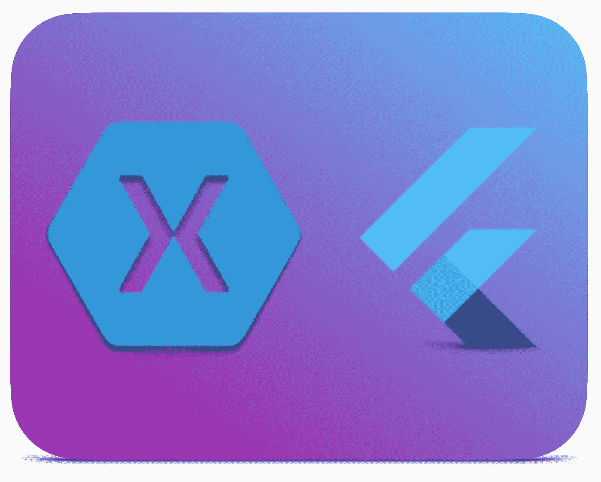

# 为什么我要从 Xamarin 形式转向 Flutter？

> 原文：<https://betterprogramming.pub/why-did-i-move-from-xamarin-forms-to-flutter-c5f4f8856b75>

## 这是我编程生涯中最大的改变

作者照片。

你好，朋友！实际上，我已经开始了从 Xamarin Forms 到 Flutter 的新系列，让现有的 XF 开发人员更容易进入 Flutter。看看这里:【guides.page.link/6SuK】T2。

我记得当我收到 Flutter 终于发布了稳定版本的邮件时，我在哪里。我的一个和我一起开发 [Xamarin Forms](https://dotnet.microsoft.com/apps/xamarin/xamarin-forms) 应用的朋友在 [Flutter 的网站](https://flutter.dev/)上给我发了一篇文章，展示了发布公告。作为一名初露头角的 Xamarin Forms 开发人员和. NET 爱好者，我的反应相当温和。

“太好了，”我想。“另一个移动框架。”

这种不屑一顾的态度是有道理的。当 Flutter 发布时，我们已经有了 Xamarin 表单、Ionic、Cordova、React Native、Native script——更不用说运行在这些技术上的抽象(如 React 的 Redux、Xamarin 表单的 Prism 等。).当然，每个平台都有自己制作应用的本地实现。

以前，我在 Ionic 上发布过应用程序，也尝试过 React Native，但都不像是我寻找跨平台开发框架的真正目的。Ionic 没有带来很好的用户体验(因为它使用了 Cordova ),我也不喜欢你用 React Native 声明用户界面的方式(通过 TSX 或 JSX 文件)。这不是我在说这些平台的坏话。这只是我在解释我的选择。

当我发现 Flutter 的时候，我不禁想知道，“为什么？”为什么世界需要*另一个*跨平台移动框架？更糟糕的是，你不仅要学习一种全新的设计和描述应用的方法，还要学习一种迄今为止完全未知的语言，叫做 Dart。作为一名 C#开发人员，Dart 代码对我来说已经很熟悉了，但仍然是一些小事情会让你犯错(比如细微的语法差异)。所以你必须投入更多的时间去学习新的东西。

当你在学习如何使用新事物时，你在花时间做一些没有效率的事情。你不能出售或运输你坐在电脑前学习如何使用一个新框架所花的时间。事情不是这样的。只有在你学会了如何使用你正在学习的框架之后，你才能做到这一点，在你达到那个点之前，还有很多东西要学*。在我的开发生涯中，我当然已经开始做*很多*的事情，但还没完成就已经筋疲力尽了。*

*因此，总有一种风险是，您会发现您正在学习的框架存在一些 bugbear 或问题，这会对您的开发造成障碍，并随后导致您放弃尝试学习该技术(NativeScript 对我来说就是这样)。你花在学习一项你不打算使用的技术上的每一秒都是浪费的一秒。*

*我决定跳跃并学习颤振，但我最终去了哪里？*

**

*时间是学习新事物的关键因素。照片由 [Elena Koycheva](https://unsplash.com/@lenneek?utm_source=medium&utm_medium=referral) 在 [Unsplash](https://unsplash.com?utm_source=medium&utm_medium=referral) 上拍摄。*

*嗯，大约一年半后，我是一个真正的颤振转换。我的一些同事对是什么让我对 Flutter 如此感兴趣，而其他人真的很困惑。目前，我有几个让我相当自豪的应用程序。人们阅读我关于 Flutter 的文章(他们中的一些人不理解我的热情或者对 Flutter 有负面的体验，让我了解他们，这没关系——我感谢所有的参与)，他们观看我制作的关于一项我真正感到兴奋的技术的视频。*

*但今天，我将特别反思我的旅程的开始，为什么我从 Xamarin 形式转变为 Flutter，其中的一些决定，以及我今天对那个选择有多高兴。*

**

*图片来自 [Xamarin 博客](https://devblogs.microsoft.com/xamarin/top-xamarin-blog-posts-2019/)。*

# *留下猴子*

*我已经使用 Xamarin 表单好几年了，并取得了一定的成功。它使用了 C#，对我的需求来说已经足够好了。在 XAML 编写 UI 非常合适，我能够重用我的 C#知识来创建应用程序。我在 XAML 使用 WPF 有一些经验，所以我认为它会是一个很好的选择。我也可以瞄准通用的 Windows 平台(UWP)，这样我的应用可以在任何地方运行得很好，我可以只使用 C#(和 XAML)。*

*我想说，我发现框架是达到目的的一种手段——在手机上安装应用程序的一种方式。*

*然而，随着时间的推移，我开始体验到这个框架更多的怪异之处。应用程序在启动后不久就会崩溃，而且这只会发生在应用程序以发布模式构建时——而不是调试模式。试图让相关插件与 Xamarin 表单一起工作并不简单，需要浏览许多 GitHub 问题列表，试图找到一种方法来解决我的问题。本来应该很简单的事情，比如加载字体(甚至字体牛逼)，需要对当时没有很好文档记录的各种 NuGet 包进行一定的配置。*

*我记得在我的应用程序中实现了一个全新的功能，真的对它进行了改进和完善，做了一个发布版本，然后看到它在发布时崩溃了。*

**

*很难得到支持。亚历山大·安德鲁斯在 [Unsplash](https://unsplash.com?utm_source=medium&utm_medium=referral) 上拍摄的照片。*

*我在 Stack Overflow 上发布了问题，但是手头的问题没有明显的答案。没有社区 Gitter 或 Slack 来问我的问题，所以不知道为什么我的应用程序在发布版本中崩溃，我只是放弃了我的整个新功能，回到我最后一个已知的好版本。我希望我可以说这是一个孤立的经历，但不幸的是，它不是。*

## *用 Xamarin 表单编程令人沮丧*

*作为一名开发人员，我感兴趣的是投入最少的努力来为我的客户开发高质量的手机应用程序。我不觉得这是一个特别令人震惊的声明。如果有人能在一天内开发出一个应用程序，而另一个人能在五天内开发出相同的应用程序，那么如果外观和功能相同，我会倾向于选择前者。*

*我喜欢在应用的基础上花更少的时间，而在我的应用中真正好看的部分花更多的时间。从逻辑上讲，一个应用程序的基本功能不应该花很长时间，而更复杂和微妙的功能会花更长时间。*

*我也对中等水平的*设计*感兴趣。不要误解我，我是一名开发人员——不是设计师——我当然知道我的位置。但是，如果没有设计师在书上，这取决于我让应用程序流行，看起来很棒的渐变，动画和其他方面的视觉波兰。一方天生依赖另一方。该应用程序必须稳定和功能，然后我才能开始担心它有多漂亮。*

*不幸的是，以一种可靠的方式实现我的应用程序的核心功能花费了如此长的时间，而且如此不可预测，以至于我从来没有时间去润色。即使是试图完成简单的事情，比如让人们可以在应用程序中导航，也不是一件容易的事情。导航对于用 Xamarin 表单制作的应用程序来说是一个痛处——据说用 [Shell](https://docs.microsoft.com/en-us/xamarin/xamarin-forms/app-fundamentals/shell/) 会做得更好——但是我在 Shell 出现之前就开发了我的应用程序。在我的应用基础上花费这么长时间意味着我没有时间来改善我的应用的外观和感觉，所以整体外观受到了影响。*

**

*我所有的应用程序看起来都很乏味。Benjamin Bousquet 在 [Unsplash](https://unsplash.com?utm_source=medium&utm_medium=referral) 上拍摄的照片。*

*这种挫折感在框架的其他地方也存在，我可能花了更多的时间感到沮丧，而不是感到高兴。与此相关，我可能会强调很多方面，但对我来说真正突出的是 Xamarin 形式的`CarouselPage`和`CarouselView`实现。*

## *传送带页面*

*进入`CarouselPage`。这只是一个嵌套了页面的页面，你可以在页面之间滑动。我经常在应用程序中使用这些启动向导，因为我可以向用户显示一个页面，他们可以在上面输入细节，当他们点击下一步时，他们会看到下一页。*

*幸运的是，Xamarin 表单中的`CarouselPage`由 Xamarin 表单团队实现和支持。太好了！抓住它，然后在你的表单应用程序中使用它。直到你真的*那样做*并且发现它缺少关键特性(例如，它没有给你一个活动索引——它只是暴露了一个神秘的`CurrentPage`)。你如何从中获得一个活动的索引，或者从你的代码中触发一个`ViewModel`后面的页面变化？不容易。*

*另外，当你搜索这个问题时，会有帖子告诉你`CarouselPage`不支持 UI 虚拟化，所以如果你在`CarouselPage`中有很多页面，这会占用很多内存。尽管如此，其他帖子指出`CarouselPage`内存泄漏，应该避免。在旅程的某个地方，我最终找到了`[CarouselView](https://github.com/alexrainman/CarouselView)` [包](https://github.com/alexrainman/CarouselView)。*

## *CarouselView:类似于 CarouselPage，但更好*

*`CarouselView`是我所有旋转木马问题的解决方案。这就像在我的项目中安装 NuGet 包一样简单，然后我就离开了。然后 Xamarin Forms 3.0 发布了，*它就停止工作了*。请注意，不是优雅地。导航到一个带有`CarouselView`的页面只是抛出了一个异常。*

*当时，有一个可用的修复程序。但是 Xamarin 表单的后续版本一次又一次地打破了`CarouselView`*。`CarouselView`是一个由社区维护的社区包，所以当有人免费维护它时，要求更新或修复是不合适的。更好的问题应该是“Xamarin Forms 已经存在这么多年了，我们怎么没有一个本地的、正常工作的、得到适当支持的`CarouselPage`来实现它所说的功能呢？”**

**如今，显然有一个`CollectionView`可以解决这些问题，但是多年来，我们的选择是社区维护的`CarouselView`或者通过`CarouselPage`的一个坏的 Xamarin Forms 实现。在我写应用程序的时候，`CollectionView`还不可用。**

**也许像这样重复控件的质量是不礼貌的。毕竟，不是每个人都使用旋转木马，所以也许它不是一个优先事项。但是在框架中真正落地的是 CSS 支持之类的东西。将 CSS 引入 Xamarin Forms 总是很奇怪，因为你只能表达视觉样式的一个子集，你可以通过 XAML 风格来表达。因此，如果你想获得对你的应用程序的外观和感觉的适当控制，你最终会学习和使用 XAML 风格。**

**很高兴我可以把我的 CSS 知识带到 XAML，但我仍然必须学习 XAML 在 Xamarin 表单中的任何用途，我仍然可以通过现有的 XAML 样式完全表达我的应用程序的外观。包含对 CSS 的支持意味着微软维护 Xamarin 表单的优秀人员必须实现该功能，然后他们必须编写测试，然后必须为将来的版本维护它。我们得到了 CSS 支持之类的东西，而框架的其他更基本的部分基本上没有被触及，或者有着多年来一直存在的同样的质量问题。**

**当框架被诸如 CSS 支持之类的东西拓宽，而现有的问题没有得到他们需要的关注时，它确实描绘了一幅令人担忧的框架未来的图画。**

****

**罗斯·芬登在 [Unsplash](https://unsplash.com?utm_source=medium&utm_medium=referral) 上的照片。**

# **决定改变**

**渐渐的，我开始越来越不喜欢 Xamarin 的形式。实现简单的功能感觉非常困难。Xamarin 表单包的更新会破坏我的应用程序。支持渠道没有明确定义，我没有简单的方法来获得支持或解决我遇到的问题。**

**另外，我做的一切看起来真的，真的很糟糕。从视觉上来看，这是非常无趣的，我能让事情看起来更好的唯一方法是为每个平台编写定制的渲染器。这是一个巨大的时间下沉，并产生不同的结果。**

**一天晚上，我的安卓应用程序出现了一些随机的 JNI 错误，我简直无法释怀。就在实现一个新特性的最后，无论我做什么，我都不知道为什么会发生崩溃或者如何解决它。这是在 Xamarin Forms 在尝试实现新功能时遇到很多挫折之后出现的。**

**大约在这个时候，我已经开始涉足 Flutter，但是我很大程度上被学习一门新语言(Dart)的需求和框架的功能性(而不是命令性)所阻碍。但我关闭了我的应用程序，并决定不维护任何现有的 Xamarin Forms 应用程序。我会重写我在 Flutter 中不得不写的。从那时起，我也不会创建任何新的 Xamarin Forms 应用程序。**

**现在，你可能会认为我有足够的勇气在这里抱怨一个免费的开源框架的质量。让我明确一点:我是在侮辱一个框架或者说一个一定比另一个好。我只是分享我的想法，为什么我决定改变，以及那次经历对我来说是怎样的。许多勤奋敬业的工程师花费了大量时间将 Xamarin 表单发展到今天的水平。我只是觉得这不太适合我想做的事情。**

**那么，接下来发生了什么？**

# **移动到颤动**

**坐下来致力于学习*另一种*语言和框架并不容易(尤其是当你已经知道一种可以制作移动应用的时候)。你犯了愚蠢的错误，你不知道构造函数是如何工作的，有一些奇怪的关键字让你想起了 Java，等等等等。此外，因为你现在对你的应用程序的状态负责，你必须研究你的应用程序的状态管理解决方案，并选择“正确的一个”,尽管你可能不知道这么做。**

**在早期，我认为我的应用程序看起来真的很糟糕。然而，令我惊讶的是，我的应用程序看起来比我用 Xamarin 表单制作的任何东西都要好。材料样式是可用的，我的应用程序只是默认使用这些样式。虽然我没有考虑过我的应用程序会是什么样子(因为它们本质上只是“hello world”应用程序)，但谷歌的材料设计团队已经这样做了，并且最终的外观和感觉一点也不差。**

****

**HalGatewood.com 在 [Unsplash](https://unsplash.com?utm_source=medium&utm_medium=referral) 上[拍照。](https://unsplash.com/@halacious?utm_source=medium&utm_medium=referral)**

**当时我所知道的关于 Flutter 的一个特性是“有状态热重装”这让我有点兴趣。我已经花了将近 200 美元购买了令人难以置信的 LiveXAML。在我保存的时候看到我的 UI 更新节省了我大量的时间。所以我*种*已经有了这样的东西。再加上我其实已经*为它支付过*了，我显然不能用在 Flutter 上(所以如果换成 Flutter 那无异于浪费钱)。**

**我把“有状态热重装”看作是 LiveXAML 给我的，在某种程度上，我是正确的。如果我对我的 XAML 进行了更改并保存了它，那么视图将会根据`ViewModel`中的内容进行更新。从这个意义上说，国家得以维持。**

**然而，我想错了这个*。*在 Flutter 中，你可以编辑任何东西(我不太清楚这个的技术实现，但我肯定没有碰到任何限制)。你的 UI，你的服务，你的业务逻辑。任何事。然后保存它，更改将同步到您的设备，您可以立即使用它们。即使你写了全新的代码并设置了一个断点，当你保存它的时候，那个断点会像它一直在那里一样被点击。**

**以前，要更新我的应用程序中的服务，我必须停止应用程序，更改实现，构建应用程序，然后再次运行它。这是一个大约 1-2 分钟的过程*每次*。当我转移到 Flutter 时，这种停止-修复-运行的循环被消除了，在第一周节省了我几个小时。**

**这有明显的应用，像玩视觉层的填充或改变颜色，但也有其他用途。例如，我需要摆弄设备的加速度计，并从设备中获得俯仰/偏航/滚动。我在测试数学方程来得出这些值，我有一个无限循环中的`print`函数来打印设备从 0-360 度的角度。起初，我的数学完全错了，但当我的应用程序在测试手机上运行时，我可以轻松地更新数学，点击保存，并看到新值打印到控制台。无需停止和启动应用程序，快速原型化这些变化改变了我制作应用程序的方式。**

**Flutter 的热重载实现是解决这个特殊问题的最佳方式——是我迄今为止在业界看到的最好的方式。**

## **更好的用户界面类型检查**

**当深入研究一个像 Flutter 这样的新框架时，你只需要花很长时间就能写出一些直接不起作用的东西。当我进入 Xamarin 表单时，我经历了类似的事情。使用 Xamarin Forms，如果你写了假的 C#，那么它将被进行类型检查和语法验证，它会告诉你你是如何出错的。**

**但是如果你在 XAML 搞砸了一个 Xamarin Forms 应用程序呢？以我的经验来看，这不太一样。很容易将错误的类型放入绑定中，或者将其绑定到与您试图做的事情不相符的参数。如果你把这个*做得恰到好处，*你会遇到应用崩溃，因为框架不知道如何将你的特定参数绑定到接收控件。因为这个崩溃似乎是从框架内部发生的，所以排除故障并不容易。**

**如果发生这种情况，你可以花*天*的时间试图找出问题所在。根据我的经验，这可能是你的 XAML 中的一个额外的结尾`>`，只是错误地绑定了一些东西，或者将一些东西绑定到了错误的类型。有时当我遇到这样的问题时，我会重置到我最后一次知道的好代码库，然后重新实现相同的功能，希望得到不同的结果。**

**在 XAML，缺乏有效的打字检查使得那段时间特别困难。**

**那么，Flutter 有什么改进吗？你用 Dart 写所有的东西。如果你不知道 Dart 是什么，我会把它描述成一种具有 C#的健壮性和 JavaScript 的简单性的语言。重要的是，像 C#一样，它使用静态类型检查来确保一切都是正确的类型，这意味着你必须非常非常努力地尝试解决与类型有关的运行时问题——除非你将一切都声明为`dynamic`(与 C#的`object`相同)，但如果你这样做，你可能会遇到更大的问题。**

**所有的东西，UI(甚至你的风格)都是用 Dart 写的。这些类型错误是在开发时捕获的，而不是在运行时捕获的，因此您可以在将应用程序部署到世界上之前捕获问题。与 Xamarin 表单相比，XAML 的类型检查——尤其是样式检查——充其量只是粗略的。**

## **功能性、反应式编程**

**在 Xamarin 表单中，如果我有一个表单，让用户输入一些细节，然后点击提交，然后将一些文件下载到设备上，这可能意味着相当多的移动部件。我们将有一个`Label`来显示正在发生的一些文本，显示进展，等等。**

**使用`ViewModels`，我会将类似`showLoadingIndicator`的东西作为布尔值，然后将类似`progressText`的东西作为字符串。按钮通常会使用类似于`ICommand`的东西，我想在页面上显示的所有数据都会实现`INotifyPropertyChanged`，以便 Xamarin 表单知道属性何时发生了变化，从而更新 UI。**

**因此，这些控件将总是在可视层中，但是它们将基于`ViewModel`中的值被隐藏或显示。例如，如果用户已经开始了下载过程，我们将把`isDownloading`切换到`true`(这将使进度指示器出现，并在请求进行中禁用提交按钮)。每次这个动作完成时，不管是成功地还是错误地，我都必须来回切换布尔值，根据用户在那个时间点可以做什么来显示或隐藏表单的某些部分。**

**听起来很棒，直到你忘记关闭加载指示器或者发生了什么故障，让你的用户界面处于一种意外的状态。这是这里的关键词:国家。**

**在 Xamarin 表单中(用 Prism 作为我的 MVVM 库)，我的状态将在`ViewModel`中定义，我通过将属性设置为新值来改变该状态。改变状态很难，因为您有一组移动的部件，并且您正在手动切换或动态更改值，以尝试为您的用户创建新的 UI 状态。根据我的经验，这对于最终用户来说是一种普通的体验。**

**使用 Flutter(使用 BLoC 模式)，UI 会根据应用程序的状态而变化。因此，如果您的应用程序处于加载状态，就会显示带有加载指示器的小部件树。如果用户需要登录，就会显示带有登录表单的小部件树。根据您的特定小部件集的状态，您最终会向用户显示 UI。这意味着任何 Flutter 小部件都没有`visible`属性。如果你不想要它，你就不要调用它来渲染。**

**本质上，你所有的应用程序都变成了状态的集合，然后你定义用户如何在你的应用程序中移动，以及什么事件从一个状态移动到下一个状态。用户将事件放入你的状态机，然后弹出一个新的状态。他们这样做是为了在整个应用程序中移动。一个事件进去，一个新的状态出来。如果遇到错误，则会出现错误状态。您只需定义如何处理这些状态，以及遇到这些状态时您希望向用户显示什么。**

**从修改一个`ViewModel`上的几十个属性到简单地在不同状态之间切换，使得应用程序开发的行为变得更加简单*。事件和状态比在`ViewModel`上改变属性更适合我。***

****

**安德烈·木桐在 [Unsplash](https://unsplash.com?utm_source=medium&utm_medium=referral) 上拍摄的照片。**

## **不再反思**

**在这种情况下谈论这件事会让人觉得很奇怪，但是请原谅我。基本上，反射是应用程序在运行时获取自身类型信息的一种方式。还可以通过类型动态创建对象，或者通过反射调用应用程序的各个部分。**

**当 Xamarin Forms 使用一个“[链接器](https://docs.microsoft.com/en-us/xamarin/android/deploy-test/linker)来删除应用程序中未使用的部分时，这就有点危险了。这个过程通过使用静态分析来确定应用程序的哪些部分被使用了，哪些部分没有被使用。所以，如果你在你的应用中使用反射或者使用一个使用反射的插件(大量的 Xamarin 形式的插件*使用反射*)然后链接器移除了你的应用的这一部分，运行时会发生什么呢？应用程序崩溃是因为链接器已经删除了应用程序的这一部分。**

**你可以尝试禁用链接器，但是*整个 Xamarin 表单库都包含在你的应用*中，所以你的应用现在很庞大。所以这种选择是不可能的。你唯一的选择是尝试配置链接器，让你的应用程序的各个部分保持独立，而不是“把它们链接出去”如果你做错了或者没有彻底测试你的应用，你会在运行时崩溃——或者你的用户会。**

**这和 Flutter 有什么关系？嗯，Flutter 不支持反射。这意味着当你构建你的应用程序时，编译器可以可靠地知道你的应用程序的哪些部分被使用了，哪些部分没有被使用，并且可以使用静态分析来知道哪些部分要保留，哪些部分要剔除。当这个过程完成时，你就不会因为删除了编译器认为没用的代码而冒部分应用被部分剥离的风险。您不需要配置链接器，因为这个问题被完全避免了。不必考虑这些，甚至本身就是一种巨大的解脱和时间节省。**

# **这是值得的**

**总而言之，我很高兴我搬到了 Flutter。不要误解我的意思，这并不是一个完全没有摩擦的体验，但这是一个我喜欢使用并想了解更多的框架。此外，我的应用程序看起来更好，性能更好，而且比以前更小。我开始进入一点点的设计和一些我觉得用 Xamarin 表单无法完成的事情。**

**我觉得用 Flutter 创建应用程序是学习如何创建漂亮的跨平台体验的开始。不要和一个框架争斗，试图让它做一些事情，这不是一种好的感觉。**

**过去，当我告诉人们我是如何从 Xamarin 形式转换到 Flutter 的，他们问我为什么不改为 Xamarin Native。可以说，跨平台库的很多要点是代码重用，我希望重用我的 UI 代码。我也不喜欢 Xamarin Native 中绑定库的工作方式，试图从 C#中调用原生 Android 函数很笨拙。**

**当然，你的经历可能不一样。你可能使用 Xamarin 表单并喜欢它，或者你可能使用过 Flutter，但绝对讨厌它。您可能已经发誓放弃所有形式的跨平台解决方案，并且将只为您的平台编写本机代码。如果是这样的话，那也没什么。你想用什么来创造什么，完全取决于你自己。重要的是，你正在创造这些应用，这些体验在你发明它们之前从未存在过。我觉得这很酷。**

**所以继续创造和使用最适合你的。不过，对我来说，那绝对是颤动。**

***本文原载于*[*Codemagic*](https://blog.codemagic.io/why-did-i-move-from-xamarin-forms-to-flutter/)*。***