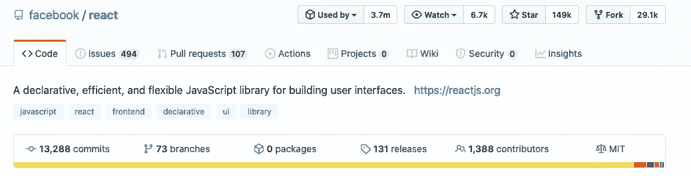
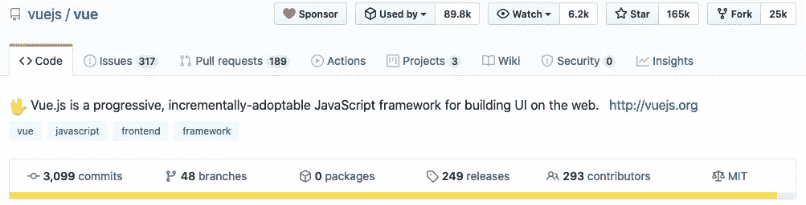
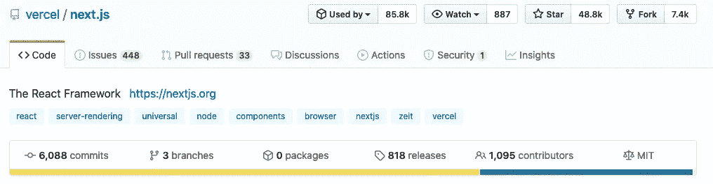
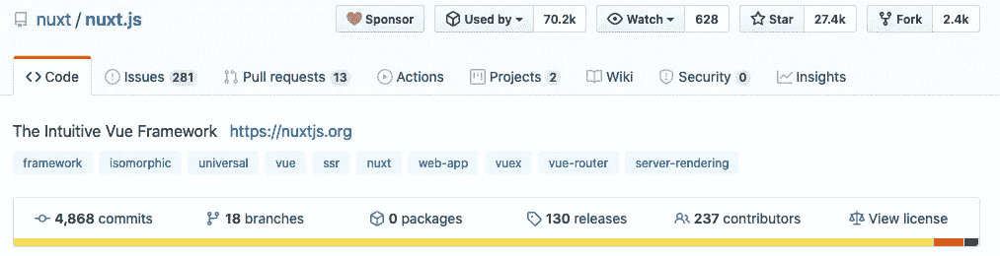

# 为什么我会因为 React 退出 Vue？

> 原文：<https://betterprogramming.pub/why-did-i-quit-vue-for-react-65315285fd90>

## 为您的 web 应用做出正确的选择

照片由[罗曼五世](https://unsplash.com/@lebrvn?utm_source=unsplash&utm_medium=referral&utm_content=creditCopyText)在 [Unsplash](https://unsplash.com/s/photos/quit?utm_source=unsplash&utm_medium=referral&utm_content=creditCopyText) 拍摄

我开始现代前端开发的那天，我做了一个每个开发人员都会做的决定:**选择正确的框架**。

是时候停止用 jQuery 编写难看的、非结构化的、简单的、陈旧的 JavaScript 了。

让我们进入*新潮-闪亮-流行-模块化-JavaScript* 框架的新时代。

所以我选择 VueJS。

以下是我喜欢(现在仍然喜欢)VueJs 的原因。

# 1.它把我宝贵的 HTML/CSS/JS 结构保存在一个地方

到目前为止，这是销售 VueJS 的头号论据。

Vue 文件对初学者来说很有吸引力。这很容易理解，也很容易把你的整个 HTML 模板分解成 Vue 文件。

我一眼就能发现结构(模板)、行为(脚本)和观感(风格)。

# 2.Vuex

当我发现一个状态管理系统如何工作时，我从 Redux 开始。这很难学，而且似乎过于复杂。

有了 Vuex，感觉真他妈的好。

与属于 [Redux](https://redux.js.org/) 的动作、归约器和存储相比，只涉及动作、突变和存储。由于我发现时缺乏常识，或者我使用了一些不好的学习资源，我没有抓住与突变相比的还原逻辑。

对我来说，Vuex 对新手来说更容易上手。

# 3.NuxtJS

老实说，[NuxtJS](https://nuxtjs.org/)——受 React [NextJS](https://nextjs.org/) 的启发——是我进行 Vue 项目的首选框架。

我喜欢 Nuxt 项目的约定胜于配置的架构。

页面在`page`目录下。

`component`目录下的组件。

存储在`store`目录中。

`middleware`目录下的中间件，等等。

所有的注射都是透明的。`nuxt.config.js`集中所有配置。 ***令人惊叹！*** 它可以让你轻松地创建支持 SSR 的网站和 SPA。

# 但是，我(再次)尝试了一下

我没有告诉你在学 Vue 之前我试过 React，但是第一眼看上去太野蛮了。我对状态管理如何工作的了解以及对 ES6 语言规范的更多了解已经发生了变化。

我看到很多文章，甚至我周围的人都在谈论 React，所以我试了一下。而且成功了。足以在我的项目中采用这个框架。

以下是我对 React 最大好处的看法。

## 1.ES6 和类型脚本友好

开发人员掌握类、接口和枚举。这就是我能够理解 React 组件如何工作并集成到应用程序中的原因。

你可以在 Vue 中使用 ES6 语法，但是 React 比 Vue 设计得更好。看看如何在 React 中注册组件:

对于 VueJS，您将一个对象传递给 Vue 组件函数:

因此，modern React(2020 年)不再涉及`class`，取而代之的是功能组件(和钩子)。

VueJs 现在提供了类型脚本支持。这种支持不像 React 在一个命令中使用 CRA(创建 React App)和 TS 支持**那样完善。**

对于 Vue，我们仍然需要一些带有自定义装饰器和特性的第三方包来创建一个真正的、完整的 TypeScript 应用程序，官方文档并没有包括你入门所需的所有信息。

## 2.JSX

JSX 并不邪恶。

有两派:亲 JSX 派和反 JSX 派。我不喜欢参与那场冲突。JSX 可以是好的也可以是坏的；这取决于您希望如何使用您的模板。

在我看来，开发人员将 JSX 写成这样更符合逻辑:

比起更 HTML 化的 Vue 方式:

这是个人喜好的问题。我发现 JSX 更强大、更灵活。

## 3.被钩子钩住

我开始学习和开发 React 组件。问题是，要创建一个组件作为 React 组件类，需要花费很多精力。

功能组件允许你用钩子使用本地状态。它删除了许多样板文件和无用的构造函数。

React 钩子简化了状态和其他 React 部分的使用，比如用`useEffect`代替`c*omponentDidMount*`和`*componentDidUpdate*`T6。

一些开发人员喜欢 OOP 方法，喜欢使用类，其他人喜欢函数式方法。**您可以在一个项目中同时使用两者！**🤙

## 4.社区

**伟大的项目背后是伟大的人类。**

根据经验，React 的文档、第三方工具和模块比 Vue 多得多。

我有时会努力寻找 Nuxt 问题，并找到许多 Next (React)主题。

看看 Github repos，数字就能说明一切。

或者使用它们各自的框架:

社区通过更快地解决 bug 修复来提高代码的可靠性。找到和你有同样问题的人会让你快速下定决心。

# Vue 3 来了…

Vue 目前是第 2 版；版本 3 仍处于测试阶段，但有很多大的变化。

其中一个就是 **Composition API，**不用 Vuex 也能管理状态，路上更爽的东西！

*那么，我喜欢 VueJS 吗？*是的。

*我喜欢反应吗？*是的。

*React 比 Vue 好吗？*这是利益问题。

# 资源

https://vuejs.org/

https://reactjs.org/

https://nuxtjs.org/

https://nextjs.org/