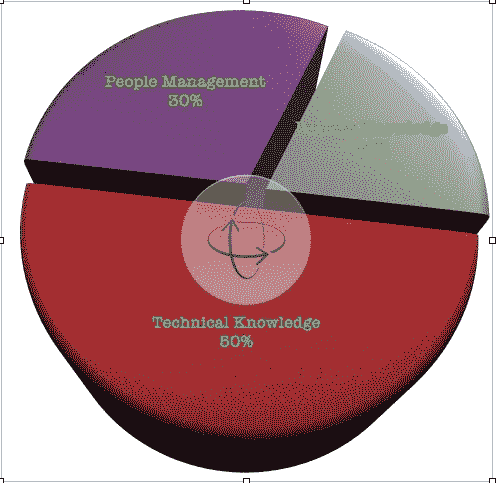

# 为什么资深开发者面临的面试拒绝率更高？

> 原文：<https://betterprogramming.pub/why-do-senior-developers-face-a-higher-interview-rejection-rate-ae78a0d62369>

## 提示:这与你的技术能力关系不大

[活动发起人](https://unsplash.com/@campaign_creators?utm_source=medium&utm_medium=referral)在 [Unsplash](https://unsplash.com?utm_source=medium&utm_medium=referral) 上的照片

资深开发者面试是个谜；《少年开发访谈》是一部惊悚片。

初级开发人员的面试耗尽了你所有的算法能量。你需要高剂量的糖和咖啡因来参加模拟会议。但是让我们接受这个事实:他们太容易预测了。

原因是有上百万个算法实践网站、面试准备 YouTube 频道和告诉你如何被谷歌聘用的博客帖子。当然，这需要时间准备，但这是可行的。

应对高级开发人员面试的关键是要明白同样的策略不适用于高级开发人员面试。

(**注**:上面这句话并不适用于 famg+高级面试，这种面试不可避免地要比其他公司的面试涉及更多的算法测试，尽管我没有第一手经验。)

**为了强调本文的目的:**在一般的软件公司中，高级开发人员的面试被拒率非常高。

事实上，并不是所有的高级开发人员都会同时接受采访(针对一个单一的任务)，这并不是一个需求与供给的问题。

# 高级开发人员面试是如何设计的

十年前，许多高级开发人员的面试材料包括两件事:

*   了解各自的 API
*   软件交付和开发过程的知识

老实说，他们过去比他们的初级开发人员面试对手容易得多。通常，不需要算法测试！

高级开发人员面试有一个结构，不管面试官和候选人是否意识到这一点。

今天，一个高级开发人员应该只知道一件事，正如我在“[中描述的，这是你需要准备的唯一一个编程面试问题。但是期望太高了:你没有伸腿的空间。不要拐弯抹角。不是简单的知识积累就能过这一关的。还有更多。](/the-only-programming-interview-question-you-need-to-prepare-for-e604c4c4d5eb)

但它有一个结构，不管面试官和应聘者是否意识到这一点。

要解决高级开发人员面试的问题，我们必须理清这个结构。

## 每个高级开发人员面试中无处不在的因素

在我们开始之前，让我们举一个与时间相关的例子。

如果你喉咙不舒服，你会觉得不舒服。但是你不知道你是患了流感还是冠状病毒。喉咙不好是一种症状，不是疾病。这种疾病还没有定论。然而，你确定你的身体有问题，你需要进行实验室检查。

实验室测试寻找症状之外的特定参数。这些参数的确切数量的存在与否决定了你是否被感染，以及感染了什么疾病。

采访者正在寻找他们正在寻找的特定种类的疾病(也就是根本原因)。就像实验室一样，他们忽略了症状。如果你给他们一堆技术术语和 API 术语，你就不太可能通过。任何人都可以在上下班途中通过谷歌搜索来伪造这种专业知识。

照片由 [Unsplash](https://unsplash.com?utm_source=medium&utm_medium=referral) 上的 [Vivek Doshi](https://unsplash.com/@vivekdoshi?utm_source=medium&utm_medium=referral) 拍摄

但是如果你表现得有条不紊，你就会引起他们的注意。就像生物实验室的技术人员一样，他们依赖于那些强烈表明候选人合适/不合适的方法。

这些方法被称为*信号*。这是一个非常古老的心理学概念，适用于任何一种人际交往。在交配季节，动物和鸟类会展示并寻找最合适伴侣的信号。

在咖啡馆里，约会的情侣不断寻找共鸣。面试官也不例外。只是很少有给面试官的指南。然而，面试准备材料并不缺乏。

然而，疯狂面试是有方法的。面试官不是在寻找正确/不正确的答案。通过你的回答，他们在寻找信号。

信号，而不是内容。

用编程术语来说，这个概念是在 Gayle Laakmann McDowell 的《破解编码面试》中接触到的，Gayle Laakmann McDowell 是一位著名的面试教练，曾在谷歌、微软和苹果工作过。由于面试信号如此重要，她强烈建议候选人在白板面试中交流他们头脑中的问题状态。

## **总而言之**

决定你选择的不是你答案的内容，而是你通过这些答案发出的信号。

有可能你和你的朋友参加了同一个面试，犯了同样的错误，但是你的推理可能会说服面试官，而你的朋友却不能。

积极的信号越强，你成功的几率就越高。

# 他们真正在寻找哪些信号？

由于技术在本质上是完全不同的，很难为每个高级开发人员角色确定具体的事情。然而，面试问题的广泛分类总是可能的。

对于高级开发人员面试，面试问题大致分为三类:

作者图片

如果您关注每一个类别，有两件事是清楚的:

*   **技术知识**是特定领域的。这些年来你已经得到了它。在面试机会到来的时候，除了磨利锯子，你能做的事情很少。我已经在我最近的文章中描述了你真正需要关注的东西，如上所述。
*   **流程知识+人员管理**问题通常是一般性的。你必须反思你的经历，并表明你要么以自己个性化的方式成功地解决了这些问题，要么像任何理性的人一样，从失败中吸取了教训。它们是公分母，但它们的比例可能会有所不同。例如，如果面试官不认为你在技术上有能力，面试官可能会缩短这些问题或者完全跳过它们。但是，如果你是一个有前途的匹配，他们可能会深入研究，将你列入候选名单。

简而言之，面试中被问到的每一个问题都大致属于以上三类中的一类。在技术领域(巨大的 50%的份额)，这可能会进一步扩展到更小的子类别。

当我阅读《破解编码访谈》时，我注意到它很好地解释了如何将一个技术问题分成子组，比如贪婪算法、二进制搜索等等。这在 famg+面试中相当常见，计算机科学知识至关重要。

## 要记住的最重要的事情是

请注意，这些问题的答案揭示了你的知识。另一方面，你回答问题的理由，你的语气，以及其他所有构成你观点的东西在面试官的脑海中形成了一个复合图像。

这个图像就是我们所说的信号。

## 令人震惊和欺骗性的揭露

大多数候选人未能把问题归为三大类中的一类。

在高级开发人员面试中，面试问题的分类也是大多数中小型公司的一个问题。如上所述，唯一的区别是类别很广。

这意味着大多数候选人无法将问题归类到三个更广泛的类别中的一个！

后一个结论相当令人震惊，但基本上是真的。在我的面试经历中，这个错误我至少犯了 50 次。我确信这是一个导致最大拒绝的错误。

不服气？这一理论背后的基本原理如下:

*   查看 LinkedIn 软件招聘信息上的申请人数。
*   即使对于一家中小型公司，对于一个程序员职位，也有将近 60-100 名候选人竞争。同样，这也取决于该职位的人口统计数据(尽管由于疫情期间远程工作的增加，目前并不如此)。
*   广告会持续三到六个月，这意味着这个职位会长期空缺。

没错，很多时候 LinkedIn 并没有真实地反映空缺职位的状况，但是我通过查看各个公司的招聘网站证实了我的假设。你也可以这样做。

这显然意味着面试正在进行，但没有找到合适的匹配。为什么？因为投资组合是匹配的——这一事实被正在进行的面试过程所证实(招聘人员经常在他们的 feeds 上发布职位)。

这么多有经验的候选人技术不够好是极不可能的。然而，没有找到合适的匹配。

这是因为在高级开发人员面试中:

*   信号没有在正确的时间发出。(“我不知道”式的面试答案——感觉像是诚实，但没有分数，抱歉！)
*   积极的氛围不会在预期的时候到来。(期望采取主动策略时保持沉默)
*   即使他们来了，数量也不够。(图中显示了一些倡议，但非常模糊，没有具体的表述:“为了实现知识共享，我将建立一个 Google doc”一类的一行程序。)
*   也许，只是也许，有人在期待错误的信号。或者是正确的那种，以错误的方式(面试官的错，无可奉告😐)

# 我最近面试失败

经过近 55 分钟的紧张面试，面试官已经对我露出了热情的微笑。

作为最后一个问题，这是抛给我的:

*如果一位客户问你如何开发一个带有移动客户端的全栈系统，你会怎么回答？*

由于大多数技术问题已经被问过了，我认为这是一个关于过程和/或主动能力的问题。

所以我的回答是:

*我想问一下要求。*

很明显，我跟进了我将如何做这件事，问了一些关于他们使用什么项目管理系统的具体问题，等等。

然而我被拒绝了。但拒绝的理由更令人震惊:

*我们期待有人能提出技术选择及其利弊，这样客户就能做出明智的决定。不幸的是，即使你有，我们也看不到。祝下次好运！*

我错误地将一个技术问题归类为与流程相关的问题！

我安慰自己:我缺乏背景知识。但这只是一个借口，因为我并没有试图对这个问题进行分类。我输掉了一场已经赢了的比赛。

# 捕鼠器是设计好的

资深开发者面试是个谜。它们被设计成捕鼠器是有原因的。

在一个产品公司中，一个高级开发人员必须与利益相关者进行大量的互动。在咨询行业，当利益相关者属于利益冲突方(竞争对手和客户)时，这甚至更具挑战性。

模糊的面试问题是专门为测试候选人的街头能力而设计的。在一个由贪婪的敏捷产品所有者驱动的世界里，一个不幸的开发人员用太少的东西给太多，很快就会被生吞活剥。

这一切都归结为一件事:对问题进行分类，并对给定的问题给出最具体的积极回应。没有冗长，没有混合信号。

把你的面试当成收费站，而不是照相馆。

再说一次，你是否成功并不重要。如果他们认为你不合适，那么通常情况下，他们并不适合你。

# 结论

随着敏捷和精益创业潮流的兴起，雇主不再把新来的人才视为资源。他们视他们为长期合作伙伴和利益相关者。

高级开发人员面试在目标上变得更加人性化，尽管不一定是在实践方式上。

不管怎样，你必须把解决它们当成一次约会，而不是一次测试。

最终，我们的目标不是被选中，而是对自己做得正确感到满意。

## 更多编程信息:

 [## 最被低估的高级开发人员面试技巧

### 少即是多

better 编程. pub](/the-most-underrated-technique-to-nail-senior-developer-interviews-f917025453b7)  [## 为什么软件公司经常拒绝优秀的程序员

### 有一个不匹配

better 编程. pub](/why-software-companies-often-reject-awesome-programmers-38bea2ca3cc7)  [## 你唯一需要准备的编程面试问题

### 尽管参加了 500 次面试，但归根结底只有一件事

better 编程. pub](/the-only-programming-interview-question-you-need-to-prepare-for-e604c4c4d5eb)  [## 谷歌开发人员:每个公司都需要的程序员

### 没有人知道他是一匹黑马，包括他自己

medium.com](https://medium.com/codex/google-developer-the-programmer-every-company-needs-f6aec335512b)  [## 高级开发人员——对编码任务说不

### 舒适是美人计。

medium.com](https://medium.com/swlh/senior-devs-say-no-to-coding-assignments-b66577299b2e)