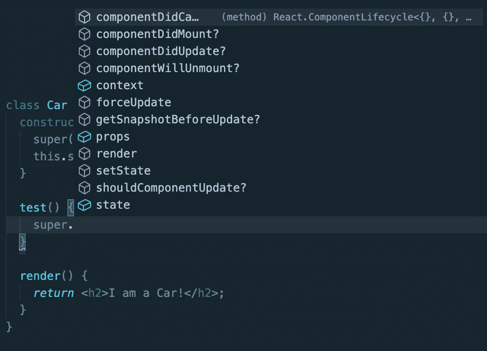

# 为什么有些类构造函数会调用 Super()方法？

> 原文：<https://betterprogramming.pub/why-do-some-class-constructors-call-the-super-method-a7d1a9c2d170>

## 使用 React 示例

如果您是编程和阅读代码的新手，您可能已经看到了类的例子。类是面向对象编程语言中的一个重要概念。有些人喜欢它们，有些人不喜欢，不管怎样，它们是一个需要理解的重要概念。

当我开始做开发人员时，我阅读 JavaScript 和 React。当时，React 由类组件主导。示例如下:

除了构造函数中的超级函数调用之外，一切都有意义。我不知道它在做什么，我读过的大多数初学者文章都没有提到它。

我写这篇文章是为了解释什么是超级方法以及它的作用。我这篇文章的示例代码将使用 React，但是 super 方法也出现在其他 OOP 语言中。

Python:

Java:

红宝石:

## 回到这个例子

当一个类调用 super 方法时，意味着它是一个超类的子类。

*从* `*Car*` *后的* `*extends*` *关键词也可以看出这一点。各种语言处理继承的方式各不相同，所以我不会深入探讨。*

在我上面提供的例子中，Car 类是 React 的子类。组件超类。当子类扩展超类时，它继承超类中的方法和值。它还继承了任何实例化的需求。

看看有什么反应。React 定义的组件类。

看看第 6 行的构造函数。对于类，构造函数方法是一个类的特殊方法，用于创建和初始化该类的对象实例。

当子类调用`super()`函数时，它们正在超类中运行构造函数方法。回到我们的第一个例子，我在第 3 行的`super()`正在调用父类的第 6 行的构造函数。

如果你的超类没有构造函数，你不需要在你的子类的构造函数中运行`super()`方法。

您还可以使用 super 方法来访问超类中的其他方法或信息。

使用我最初的 React Car 类，您可以从我的 IDE 中看到我可以访问我的组件超类的所有方法和属性。

我希望这已经让我们对超级方法的用途有了一些了解。即使您从未在自己的代码中使用过类，知道如何阅读它们也是很好的。