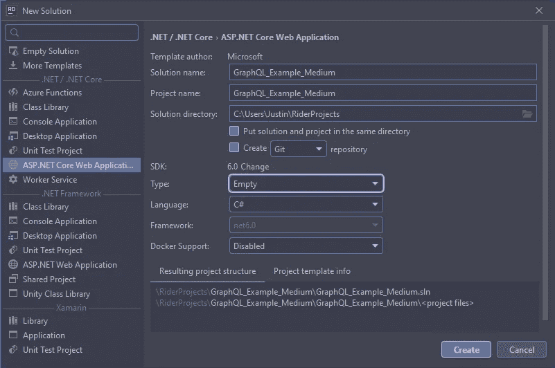
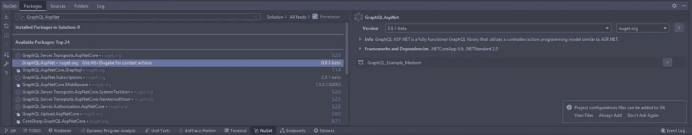
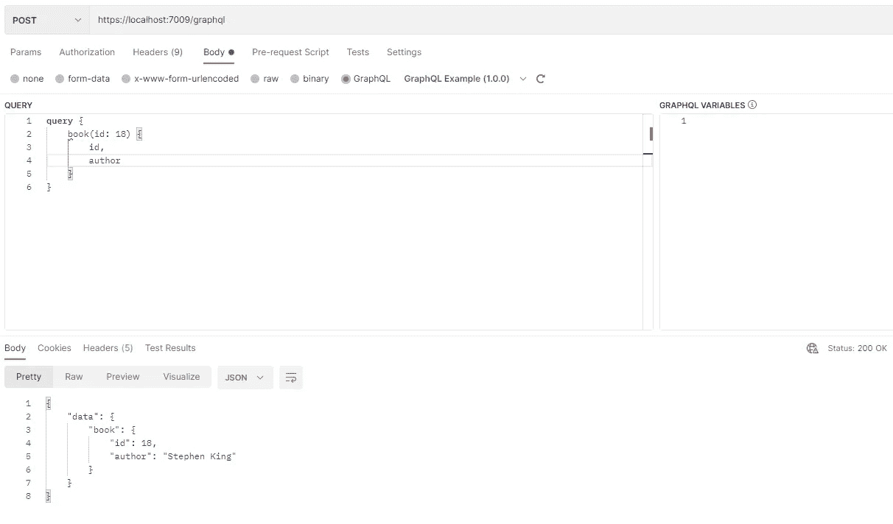

# 我们为什么需要 GraphQL？

> 原文：<https://betterprogramming.pub/why-do-we-need-graphql-43ea26d0efc4>

## 它如何加速我们的应用程序

艾萨克·史密斯在 [Unsplash](https://unsplash.com?utm_source=medium&utm_medium=referral) 上拍摄的照片

由静态网页组成的互联网时代已经一去不复返了。互联网面临着大量的终端设备，所有这些设备都同样希望尽可能快地加载数据。

为了实现这一目标，我们需要高性能的应用程序和良好且不断改进的基础设施。

此外，快速应用程序让用户感到高兴，并为提供商带来更多的钱。

互联网的历史和未来一直是并将永远是关于从服务器向客户机快速传送数据。GraphQL 可能与此有关。

# GraphQL 是什么？

> “GraphQL 是一种 API 的查询语言，也是一种用现有数据完成这些查询的运行时”(【https://graphql.org/】T4)。

GraphQL 是独立于传输的，但通常通过 HTTP 提供。GraphQL 的好处在于，可以请求唯一需要的数据。

传统上，数据是通过 [REST](https://www.ibm.com/cloud/learn/rest-apis) (代表性状态转移)API 来消费的。在 REST 流程中提供和交付完整的实体是很常见的。这正是 GraphQL 试图解决的问题。

通常，我们只需要实体的一小部分，我们仍然可以完整地交付它们。这导致了所谓的“过度蚀刻”其他时候我们需要几个实体，所以所谓的“下钻”在每个请求中都会发生。

GraphQL API 为开发人员提供了一个单一入口点，查询可以在其中请求合适的数据。开发人员可以用语法描述所需的数据。

在这里，查询是嵌套的，可以传递多个相关的对象。对 GraphQL 端点的每个查询都用类型系统进行验证。各个服务定义了 GraphQL 模式中的类型。类型系统可以被认为是 API 数据的蓝图。

此外，GraphQL 支持许多不同的语言，包括 C#、Clojure、Elixir、Erlang 和许多其他语言。([https://graphql.org/code/)](https://graphql.org/code/))

# GraphQL 的起源

脸书在 2012 年发明了 GraphQL。当时，脸书在 App store 中发布了它的应用程序，通过这样做，他们意识到该应用程序对他们的 API 产生了很多请求。在这个时候，脸书的应用程序被评为非常差，这与它速度慢、耗电太多有关。

在 REST APIs 的世界里，脸书必须向不同的端点发出大量请求。它们具有来自调用端点的级联效应。脸书的工程师们意识到他们需要改进服务器向客户端发送数据的方式。

JS 中 GraphQL 的初始 GraphQL 规范和参考实现于 2015 年 7 月发布。到 2016 年，GraphQL 离开了预览阶段，这意味着它正式投入生产。今天，许多不同的公司都在他们的生产中使用 GraphQL。

# 数据传输的历史

为了理解 GraphQL 背后的新思想，我们必须首先看看数据传输在历史背景下是如何工作的——思考数据传输并理解数据如何在系统之间交换。

## **远程程序调用**

詹姆斯·e·怀特在 1976 年开发了 RPC 的基本概念[。RPC 代表远程过程调用。客户端向远程系统发送执行某项操作的请求。客户端和服务器不同，但是请求/响应模型基本上是相同的。](https://datatracker.ietf.org/doc/html/rfc707)

## **香皂**

之后，SOAP(简单对象访问协议)于 20 世纪 90 年代末在微软出现。SOAP 使用 HTTP 进行传输，使用 XML 对消息进行编码。它也使用了类型系统，但是 SOAP 使实现变得复杂了。

## **休息**

所以，在 2000 年，罗伊·菲尔丁定义了休息。他的想法是一个面向资源的架构，在这个架构中，通过执行诸如 GET、PUT、POST 和 DELETE 之类的操作来使用 web 资源。

它不是一个协议或标准。你可以把它想象成一组架构约束。开发人员可以用多种方式在他们的 API 中实现 REST。

一开始，开发者使用 REST 和 [XML](https://www.w3schools.com/XML/xml_whatis.asp) ，但不久之后， [JavaScript 对象符号](https://www.w3schools.com/js/js_json_intro.asp)被[道格拉斯·克洛克福特](https://codedocs.org/what-is/douglas-crockford)推广开来。这是一种更加优雅的数据格式，可以被许多不同的语言解析和使用。

在 REST 架构风格中，客户机和服务器之间也有明确的分离。到目前为止，REST 是最方便的技术。

但是任何事物都有缺点，在下文中，我们想看看这些。

# 休息缺点

即使我写的是 REST 的缺点，REST 并没有死，而且很可能不会很快死去。它擅长履行它的服务。

## **过度蚀刻**

如上所述，REST 存在过度蚀刻的问题。过度蚀刻描述了您请求数据的情况，例如，为一本书的作者。

然后你可能会得到一个 Id，一个名字，也许还有他们的地址和生日。但是可能会为作者存储更多的数据，服务器将返回每个字段，即使客户端不需要它。

## **蚀刻不足**

蚀刻不足与蚀刻过度正好相反。返回的信息太少，因此必须查询多个端点来收集适当的数据。

例如，你想从作者的书中获得更多的细节。因此，您可能需要首先调用 author API，该 API 返回所有作者数据和一组端点，以获取关于这本书的更多信息。

## **管理端点**

今天，现代 web 应用程序是高度数据驱动的，需要获取和组合许多不同的数据和数据源。开发人员必须调用许多其他端点来收集必要的数据。所有这些端点都必须得到管理。

因此，REST 缺乏灵活性。开发人员需要维护端点，添加新的端点，删除旧的端点。因为 GraphQL 只提供一个端点，所以不需要管理端点。

## **网络请求**

另一点是调用许多端点来收集数据所产生的网络负载，即使您并不需要所有的端点。

**静止不动**

数据以一种特定的方式存储，开发人员将以这种方式获取数据。调整某事与更重大的努力相关联。例如，如果开发人员添加了以前没有包含在 POST 端点中的额外字段，他必须修改 API 版本。

**版本控制**

上面这一点已经向我们展示了 REST 的静态实现的问题。开发人员需要版本控制来处理它，可能没有正确的方法。

> “最简单的大概就是弃用了。”
> 
> (问题 5，[https://leapgraph.com/what-graphql-solves/](https://leapgraph.com/what-graphql-solves/))

# C#实现的示例

*更多信息，请看这里的***！**

***第一步。但是让我们首先创建一个新的 ASP.NET 核心 web 应用程序项目。***

**

***第二步。创建项目后，下一步是安装 Nuget 包“GraphQL”。AspNet ":***

**

***步骤三。让我们创建一个名为`book.cs`的模型类:***

***步骤四。**创建一个`Controller`，叫做`BookController.cs`:*

***第五步。**让我们修改`Programm.cs`，通过添加`builder.Services.AddGraphQL();`和`app.UseGraphQL();`来添加服务:*

*然后启动应用程序。你应该能指引到`http://localhost:[YOUR_PORT]/graphql`。*

*如果您看到下面的消息:“GraphQL 查询应该作为 POST 请求执行”，那么它正在运行。*

*现在我们需要一个程序来交流。为此我将使用 [Postman](https://www.postman.com/graphql/) ，但是你可以随意使用你喜欢的任何工具。如果一切正常，您应该能够查询一本书，如下所示:*

**

*现在，您可以将想要接收的不同字段添加到查询中。*

* [## GitHub-muench-develops/graph QL _ example _ medium

### 此时您不能执行该操作。您已使用另一个标签页或窗口登录。您已在另一个选项卡中注销，或者…

github.com](https://github.com/muench-develops/graphql_example_medium) 

# TL；DR；

*   REST 存在“过度蚀刻”和“蚀刻不足”的问题
*   GraphQL 试图通过创建特定的查询来解决这个问题。
*   脸书发明了 GraphQL，因为它与 REST 架构风格有性能问题。

# 来源

 [## 学习 GraphQL:现代 Web 应用程序的声明性数据提取

### 学习 graph QL:Amazon.com 上现代 Web 应用程序[波尔切洛、伊夫、班克斯、亚历克斯]的声明性数据获取。*免费*…

www.amazon.com](https://www.amazon.com/-/de/dp/1492030716/ref=sr_1_1?__mk_de_DE=%C3%85M%C3%85%C5%BD%C3%95%C3%91&crid=4D5ZQDLBPLAW&keywords=Learning+graphql&qid=1644574423&sprefix=learning+graphql%2Caps%2C138&sr=8-1) 

[www.graphql.org](http://www.graphql.org)

 [## 什么是 REST API？

### REST API(也称为 RESTful API)是一个应用程序编程接口(API 或 web API ),它符合

www.redhat.com](https://www.redhat.com/en/topics/api/what-is-a-rest-api)  [## 道格拉斯·克洛克福特

### 道格拉斯·克洛克福特是美国计算机程序员和企业家，他参与了…

codedocs.org](https://codedocs.org/what-is/douglas-crockford)  [## XML 简介

### XML 是一种独立于软件和硬件的存储和传输数据的工具。XML 代表可扩展标记…

www.w3schools.com](https://www.w3schools.com/XML/xml_whatis.asp)  [## 图形数据和 GraphQL API 开发-Leap Graph

### 尽管 REST 的接口使用了统一的协议(通常是 HTTP ),但事实上它是协议不可知的…

leapgraph.com](https://leapgraph.com/what-graphql-solves/#under-over-fetching)  [## 快速入门指南。网

### 本指南将帮助您启动并运行 GraphQL 项目，以便您可以开始试验。我们会报道…

graphql-aspnet.github.io](https://graphql-aspnet.github.io/docs/quick/quick-start)*