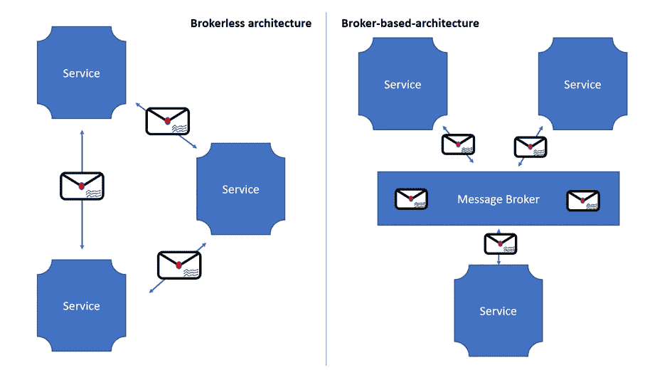

# 为什么我们需要消息代理？

> 原文：<https://betterprogramming.pub/why-do-we-need-message-broker-7382ce0e46c6>

## 探索 message broker 的不同用例

克里斯蒂娜·特里普科维奇在 [Unsplash](https://unsplash.com?utm_source=medium&utm_medium=referral) 上的照片

在生产中使用微服务架构有时会很有挑战性，尤其是在成功传递每一条消息时。这就是为什么我今天想写关于消息代理的文章。

# 什么是消息代理，我们为什么需要它们？

为了让两个应用程序相互交流，我们首先需要一些接口。没有它，他们就不可能交流。这就是为什么我们需要定义接口。因此，定义包括传输方式和传输协议选择，如 HTTP、MQTT 或 SMTP。

此外，有必要就消息结构达成一致。只要两个系统都同意标准的消息结构，它们就可以独立于系统中各自的实现来交换数据。只要接口保持相同的结构，系统的实现就可以随着时间而改变。

消息代理是所有消息发送的中介。因此，我们实现了发射机和接收机之间的额外去耦。发送者向消息代理发送消息，消息代理将消息传递给接收者。这里的一个关键优势是消息代理不需要知道消费者在网络中的位置。

此外，消息代理充当一个缓冲区——它将保存消息，直到消费者准备好工作。

# 建筑差异

# 两种架构的优缺点

## **无代理架构**

优势:

*   由于在服务之间直接交换消息，减少了网络流量和延迟。
*   它消除了 Message Broker 成为性能瓶颈和单点故障的可能性。
*   复杂性降低，因为不需要配置和维护消息代理。

缺点:

*   每个服务必须知道其他服务的位置。
*   如果发送方或接收方在交换过程中失败，可能会丢失消息。
*   实现保证消息传递的机制更具挑战性。

## **基于代理的架构**

优势:

*   松散耦合——客户端发出请求，不需要知道其他服务——因此它不需要使用发现机制来查找其他服务实例的位置。
*   消息缓冲—代理是消息的缓冲区，直到消息被处理。只要对话发生，HTTP(请求/响应协议)上的同步消息交换双方都必须可用。消息传递不是这种情况；消息被排队，直到消费者准备好才被处理。示例:即使订购服务很慢或停止，在线商店也可以接受订单，因为订单在消息代理中排队，可以在服务再次可用时处理。
*   更灵活的沟通

缺点:

*   潜在的性能瓶颈—消息代理可能是一个性能瓶颈。然而，现代消息代理是为可伸缩性而设计的。
*   潜在的单点故障——消息代理必须可以连续访问。但是现代的消息代理是为 HA 设计的。
*   额外的操作复杂性——消息代理是系统中必须安装、配置和维护的另一个组件。

# 消息代理的示例

*   ActiveMQ
*   兔子 q
*   阿帕奇卡夫卡
*   或者像 AWS Kinesis 或 AWS SQS 这样的基于云的信息系统。

# 选择消息代理时需要考虑什么？

*   支持的编程语言——理想情况下，您应该选择一个支持许多不同语言的代理。
*   支持的消息传递标准——消息代理支持各种标准，如 AMQP 和 STOMP，还是它是专有的？
*   消息排序—代理是否保持传入消息的顺序？
*   交付保证—代理是否保证消息被交付？
*   持久性——消息是否保存在磁盘上，并因此在代理失败后仍然存在？
*   持久性——当消费者重新连接到消息代理时，他们会收到中断期间发生的所有消息吗？
*   可伸缩性—代理的可伸缩性如何？
*   延迟—什么是端到端延迟？
*   竞争消费者——消息代理支持竞争消费者吗？

# 权衡取舍

每个经纪人都有不同的权衡。因此，非常低的延迟可能与无序的消息、没有传递保证以及仅存储在 RAM 中有关。将消息保存在磁盘上会永久存储它们，但可能会增加延迟。选择合适的代理取决于需求。

# 泛称

## **点对点**

让我们用一个小例子来解释一下。

*假设珊卓去邮局给亚力克斯寄了一封信。当她投递的时候她得到一张收据，并且当信到达的时候亚历克斯不必在家。但是桑德拉相信这封信将来会寄到的。*

在这里，邮政服务充当分发机制，并保证消息的传递。使用邮局时，发送和接收邮件是分开的。

队列充当一个先进先出(FIFO)缓冲区，多个接收者可以订阅该缓冲区。队列将尝试在消费者中公平地分发消息。但是，只有一个消费者会收到该消息。

因此，队列被称为持久的。持久性被理解为保证消息保持很长时间，直到消费者从队列中取走它。这确保了消息只被处理一次。

## **发布-订阅**

*麦克斯正在参加一个电话会议。只要他参加会议，他什么都能听到。当他断开连接时，他什么也听不到。*

会议充当广播机制。说话的人并不关心有多少人拨进来听。该系统确保每个拨入的参与者都能听到正在说的话。

在经典的消息传递系统中，所谓的“主题”代表发布-订阅变体。“主题”提供了与上述会议示例相同类型的广播可能性。当消息被发送到一个主题时，它被分发给所有订阅的消费者。

然而，主题不是永久的。如在电话会议示例中，如果消费者离线，则消息不会被转发。只有那些有联系的消费者才能听到。

当消息是非正式的并且损失不显著时，使用这种变体。

## **混合动力车型**

实际上，混合模式时有发生。例如，当多个系统需要一个消息的副本，同时又需要永久保存消息以防丢失时。

对于这些情况，消息必须像主题一样分发。每条消息都被发送到对其感兴趣的特定系统。这些收件人可以定义将接收消息的其他消费者。

混合模型的一个例子是 ActiveMQ 和 Kafka。

# 要考虑

如果您不想丢失消息，必须将它们写入磁盘，但是应该注意，写入磁盘比写入 RAM 慢 100 到 1000 倍。