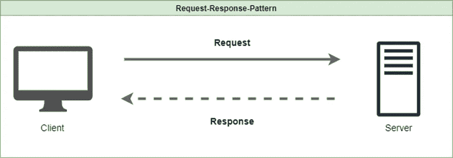
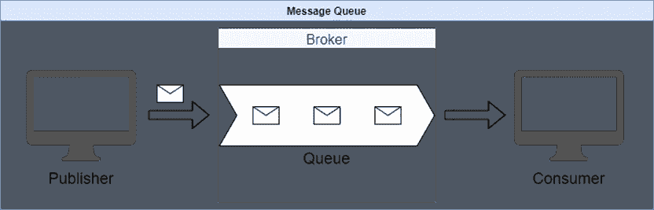
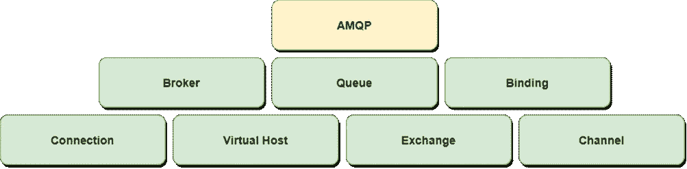
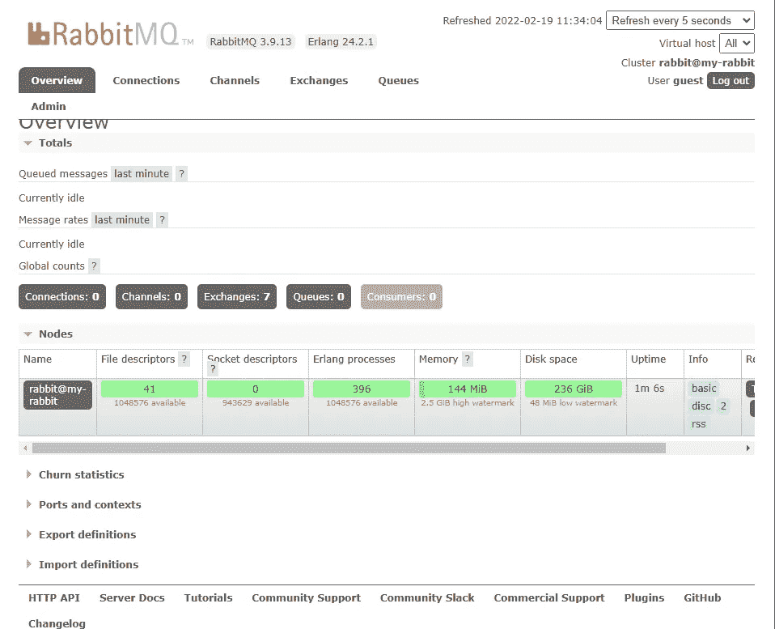
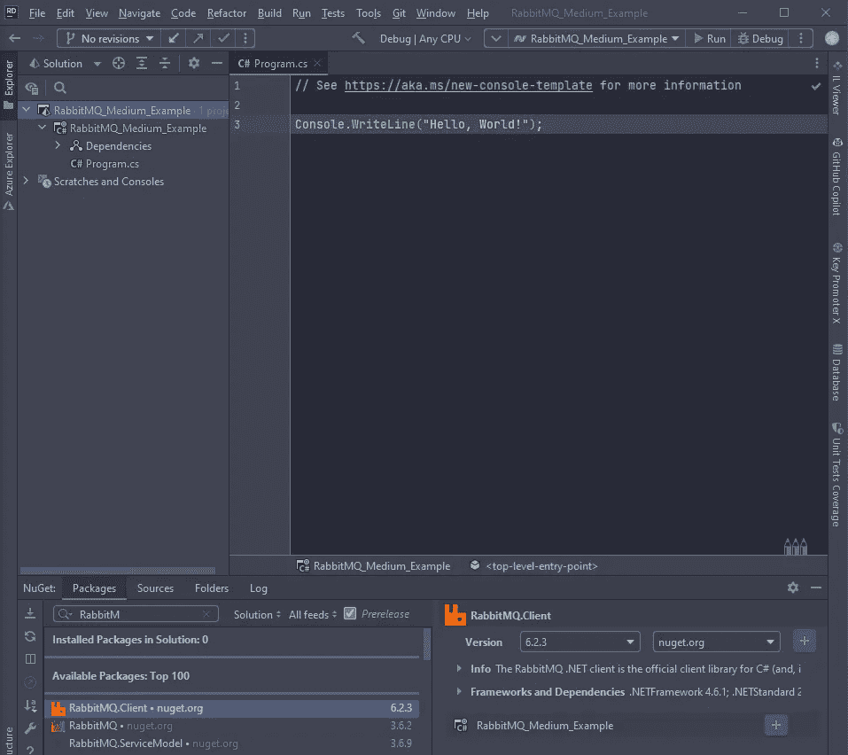
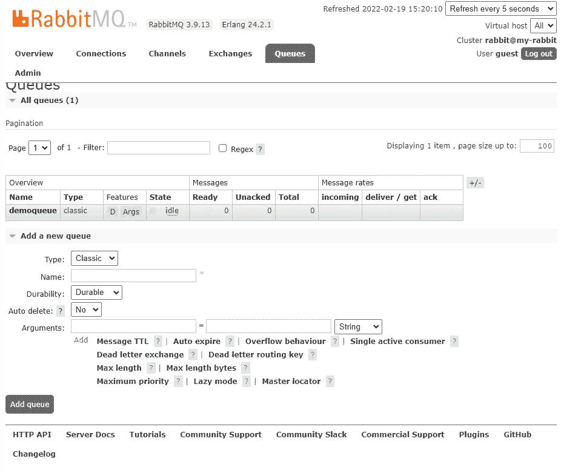
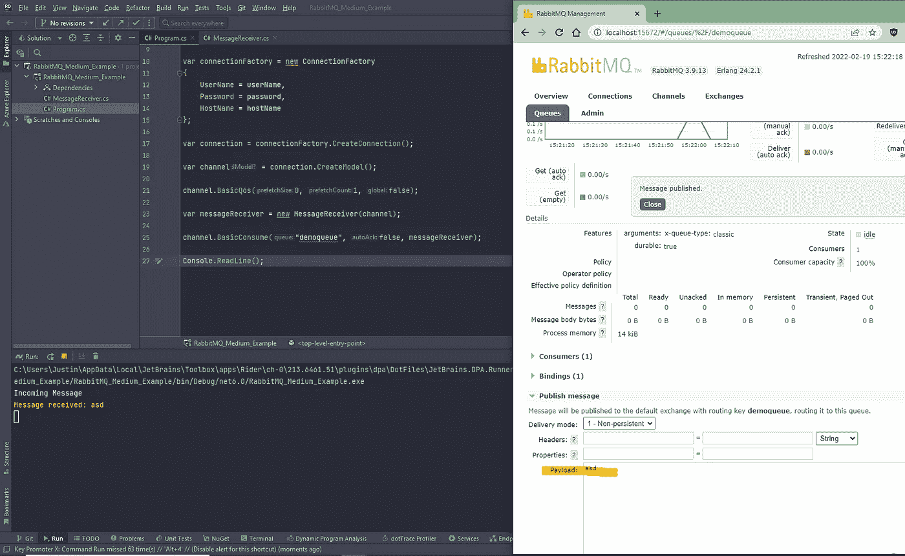

# 我们为什么需要 RabbitMQ？

> 原文：<https://betterprogramming.pub/why-do-we-need-rabbitmq-f9f1d99c074c>

## 了解 RabbitMQ 的主要特性以及如何使用它


由 [Unsplash](https://unsplash.com?utm_source=medium&utm_medium=referral) 上的 [Satyabrata sm](https://unsplash.com/@smpicturez?utm_source=medium&utm_medium=referral) 拍摄的照片

在人类历史上，有许多不同的信息传递者，可能是烟雾信号，信鸽，甚至是信使。人们需要交流。软件系统也需要通信。然而，尽管技术进步，通信总是运行相同的 hab。有发送者、接收者和消息。

此外，可以对通信提出各种要求，例如，保证消息的传递，或者有时对人群的简单广播就足够了。由于这些不同的需求，已经开发了不同的系统。

# 什么是消息队列？

> “消息代理是所有消息发送的中介。因此，我们实现了发射机和接收机之间的额外去耦。发送者向消息代理发送消息，消息代理将消息传递给接收者。这里的一个关键优势是消息代理不需要知道消费者在网络中的位置[【1】](/why-do-we-need-message-broker-7382ce0e46c6)。”

在下文中，我们将从查看请求-响应消息交换模式开始，然后，我们将更深入地研究 RabbitMQ。

# 请求-响应消息交换模式



除了请求-响应的交流方式，还有很多，但它是最常见的一种。在这种模式中，一个系统充当客户机，远程系统充当服务器。如上图所示，客户端向服务器请求数据。

当客户需要直接回应或任务需要立即完成时，这种类型的沟通非常有用。您必须记住，由于实现的原因，这种类型的通信是同步的。

对于开发人员来说，这种模式很容易实现，但是它也确保了系统的严格耦合。通常，系统之间的刚性耦合是不可取的。

# 消息队列交换模式

在消息队列交换模式中，两个系统异步操作。整个事情通过所谓的信息进行。一个系统在消息队列中发布消息，接收者从队列中接收该消息。通过这种交流，消息的发布者不会等待直接的回答。



与请求-响应模式不同，在这个系统中，两个系统都充当发布者和消费者。

从这个图中可以看出，我们由此实现了一个松散耦合的架构。这是使用消息队列的最大好处之一。因此，系统不再需要知道彼此的位置。系统的这种分离允许它们被独立开发，因为消息传输被移交给标记器。要了解更多信息，请看我关于消息代理的另一篇文章。

# RabbitMQ 的主要特点

使用 Rabbit MQ 可以获得许多不同的好处；在下文中，我们将深入探讨最重要的几个问题:

**开源:**

*   RabbitMQ 是一个用 Erlang 编写的开源项目。Pivotal 软件公司拥有它。该公司现在是 VMware 的一部分。

**支持不同的协议**

*   有了 RabbitMQ，您的系统可以使用不同消息协议的组合，如 AMQP、MQTT 等。

**轻量级**

*   在使用中，RabbitMQ 需要最少的 ram。

**大多数现代语言的客户端库**

*   RabbitMQ 不限制他们使用特定的供应商或语言。针对 Java、Ruby、Python、C#等最常见语言的不同库。

**人性化**

*   有很多使用 RabbitMQ 的文档和最佳实践，这使得它非常用户友好。

**多家公司使用**

*   许多公司发誓将 RabbitMQ 作为其微服务架构的一部分。

**可扩展且灵活**

*   既然开发者只需要维护消费者和发布者。RabbitMQ 承担通讯部分。此外，还有很多第三方插件可以根据你的需求调整 RabbitMQ。

# 兔子和 AMQP

RabbitMQ 是最早实现 AMQP 的消息代理之一。该协议是一个开放的标准协议，定义了系统如何交换消息。它代表了系统之间相互通信的一组规则。除了描述消费者/生产者和代理之间的交互之外，它还定义了消息和命令。

该协议被分配给应用层，主要用于 IP 网络中的进程间通信。AMQP 被认为是一种二进制协议，因为所有数据都是以二进制格式发送的。


# AMQP 元素



**经纪人**

代理是接收和传递消息的软件。

**队列**

队列存在于代理中，包含一系列消息。

**装订**

> “队列和交易所之间的联系”[【2】](https://jstobigdata.com/rabbitmq/elements-of-amqp/)

**连接**

客户端应用程序和 RabbitMQ 之间使用 TCP 连接。如果客户端断开连接或发生系统故障，连接将被关闭。

**虚拟主机**

虚拟主机允许我们在代理中分离不同的工作环境。例如，划分开发和试运行环境。

**交换**

可以将交换想象成一个路由器，它根据绑定将消息从生产者路由到正确的队列。

**频道**

通道是连接内部的虚拟连接。消息的发布和消费是通过通道完成的。它重用已经打开的连接，而不需要打开新的 TCP 流。

# RabbitMQ 经纪人

如上所述，RabbitMQ 是一个在 Erlang 中实现的 AMQP 代理。Erlang 被认为是非常可靠的语言，非常适合分布式应用程序。此外，Erlang 可以在任何操作系统上运行。

RabbitMQ 基于 Mnesia，一个用 Erlang 编写的数据库系统。这用于数据持久性。例如，Mnesia 存储用户信息、队列等等。

RabbitMQ 的优点是它可以作为单个实例运行，也可以在集群中运行。对于集群使用，主要使用 Erlang 中的集群功能。

几个 RabbitMQ 代理可以使用不同的技术连接起来。

# C# —示例实现

在本例中，我假设您已经有了一个正在运行的 RabbitMQ 实例。如果不是这样，那么在这个框架中研究一下 Docker 环境将是一个好主意。您可以使用这些快速设置一个 RabbitMQ 实例。

如需了解更多信息，您可以点击查看[。](https://codeburst.io/get-started-with-rabbitmq-on-docker-4428d7f6e46b)

如果您的实例正在运行，那么在使用 guest 登录后，您应该能够指向 [http://localhost:15672](http://localhost:15672) 并看到下面的仪表板。



在本例中，我们将创建一个简单的控制台应用程序来使用消息。

首先创建控制台应用程序，并根据自己的意愿命名。

1.添加 Nuget 包:`RabbitMQ.Client`。



2.创建一个名为`MessageReceiver.cs`的类，它实现了`DefaultBasicConsumer`。

3.通过依赖注入，我们传递了`IModel`接口。

4.然后我们覆盖`HandleBasicDeliver`方法，使用`Console.WriteLine`来显示传入的消息。

5.下一步是将我们的客户端连接到消息队列。因此我们必须打开`program.cs`并编辑它。

*(详见*[*https://www . tutlane . com/tutorial/rabbit MQ/cs harp-read-messages-from-rabbit MQ-queue*](https://www.tutlane.com/tutorial/rabbitmq/csharp-read-messages-from-rabbitmq-queue)*)*

但是在我们开始使用消息之前，我们需要事先通过 RabbitMQ 仪表板创建一个队列。



6.因此，通过仪表板添加一个名为 demoqueue 的队列。

7.启动控制台应用程序，并通过仪表板发布消息。



您应该能够在正在运行的控制台应用程序中看到该消息。

# TL；DR；

*   RabbitMQ 是一个用 Erlang 编写的 AMQP 消息代理。
*   它是开源的，易于在许多不同的语言中使用。
*   消息队列是传统的请求-响应模式的替代方案。
*   一个系统(客户机)以请求-响应模式从另一个系统(服务器)请求数据。服务器返回一个响应。
*   在消息队列交换模式中，通信是通过消息队列异步进行的。

```
**Want to Connect?**You can contact me via my social media channels ([Twitter](https://twitter.com/muench_justin),L[inkedIn](https://www.linkedin.com/in/justin-m%C3%BCnch-0b1087133/)).All drawings were created with Draw.IO.
```

# 来源

[](https://www.amazon.com/-/de/dp/B089ZWKT3W/ref=sr_1_1?__mk_de_DE=%C3%85M%C3%85%C5%BD%C3%95%C3%91&crid=1ETX26HO1GIHM&keywords=RabbitMQ+Essentials&qid=1644824620&sprefix=rabbitmq+essentials%2Caps%2C117&sr=8-1) [## RabbitMQ Essentials:使用消息队列构建分布式和可伸缩的应用程序

### RabbitMQ 基础知识:使用 RabbitMQ 构建带有消息队列的分布式和可伸缩的应用程序，第 2 版…

www.amazon.com](https://www.amazon.com/-/de/dp/B089ZWKT3W/ref=sr_1_1?__mk_de_DE=%C3%85M%C3%85%C5%BD%C3%95%C3%91&crid=1ETX26HO1GIHM&keywords=RabbitMQ+Essentials&qid=1644824620&sprefix=rabbitmq+essentials%2Caps%2C117&sr=8-1) [](https://www.amazon.com/-/de/dp/1617291005/ref=sr_1_2?__mk_de_DE=%C3%85M%C3%85%C5%BD%C3%95%C3%91&keywords=gavin+roy&qid=1645166699&sr=8-2) [## RabbitMQ 深度

### 亚马逊网站:RabbitMQ in Depth: 9781617291005:罗伊、加文 m:书籍

www.amazon.com](https://www.amazon.com/-/de/dp/1617291005/ref=sr_1_2?__mk_de_DE=%C3%85M%C3%85%C5%BD%C3%95%C3%91&keywords=gavin+roy&qid=1645166699&sr=8-2) [](https://www.cloudamqp.com/blog/why-use-rabbitmq-in-a-microservice-architecture.html) [## 微服务——为什么要用 RabbitMQ？- CloudAMQP

### 当今的单片系统正被微服务架构快速取代。要理解这是为什么…

www.cloudamqp.com](https://www.cloudamqp.com/blog/why-use-rabbitmq-in-a-microservice-architecture.html) [](https://www.cloudamqp.com/blog/what-is-amqp-and-why-is-it-used-in-rabbitmq.html) [## 什么是 AMQP，为什么在 RabbitMQ 中使用它？- CloudAMQP

### AMQP 包括一套标准，控制 AMQP 消息代理(如 RabbitMQ)中的整个消息传递过程。它…

www.cloudamqp.com](https://www.cloudamqp.com/blog/what-is-amqp-and-why-is-it-used-in-rabbitmq.html)  [## RabbitMQ 能为你做什么？

### 消息传递使软件应用程序能够连接和扩展。应用程序可以相互连接，作为…

www.rabbitmq.com](https://www.rabbitmq.com/features.html) [](https://jstobigdata.com/rabbitmq/elements-of-amqp/) [## AMQP 元素-高级消息队列协议

### 在本教程中，我们将学习 AMQP 的不同元素来使用 RabbitMQ。我已经谈过了…

jstobigdata.com](https://jstobigdata.com/rabbitmq/elements-of-amqp/) [](https://www.tutlane.com/tutorial/rabbitmq/csharp-read-messages-from-rabbitmq-queue) [## C#从 RabbitMQ 队列中读取(消费)消息- Tutlane

### 在 c#中，我们可以通过使用 rabbitmq 来读取或消费来自 RabbitMQ 的消息。客户端 nuget 包。在这里，我们将学习如何…

www.tutlane.com](https://www.tutlane.com/tutorial/rabbitmq/csharp-read-messages-from-rabbitmq-queue)