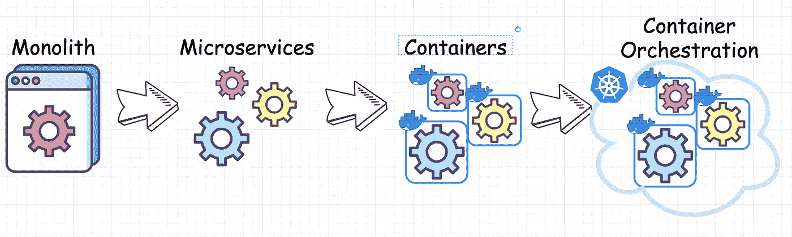
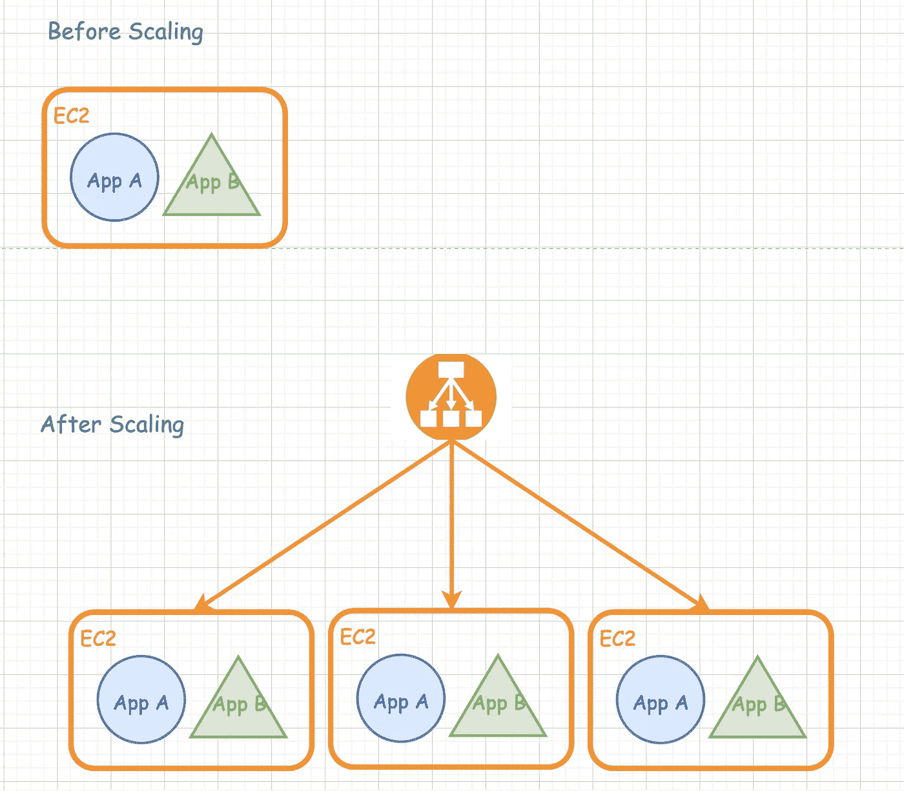
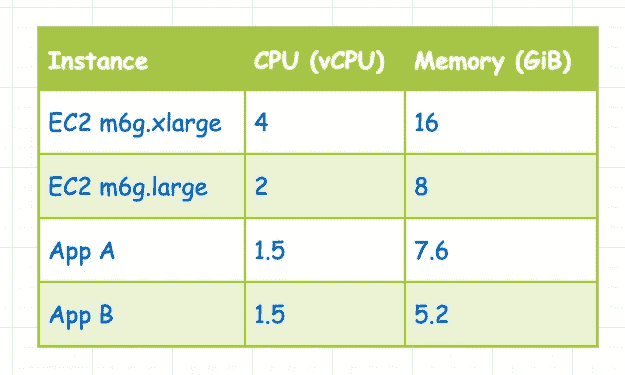
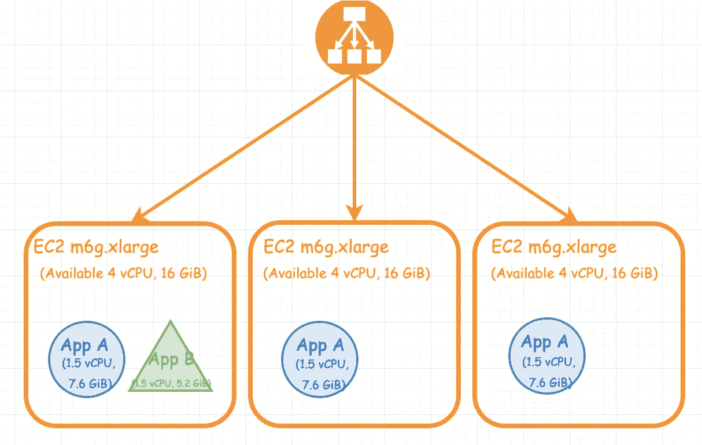
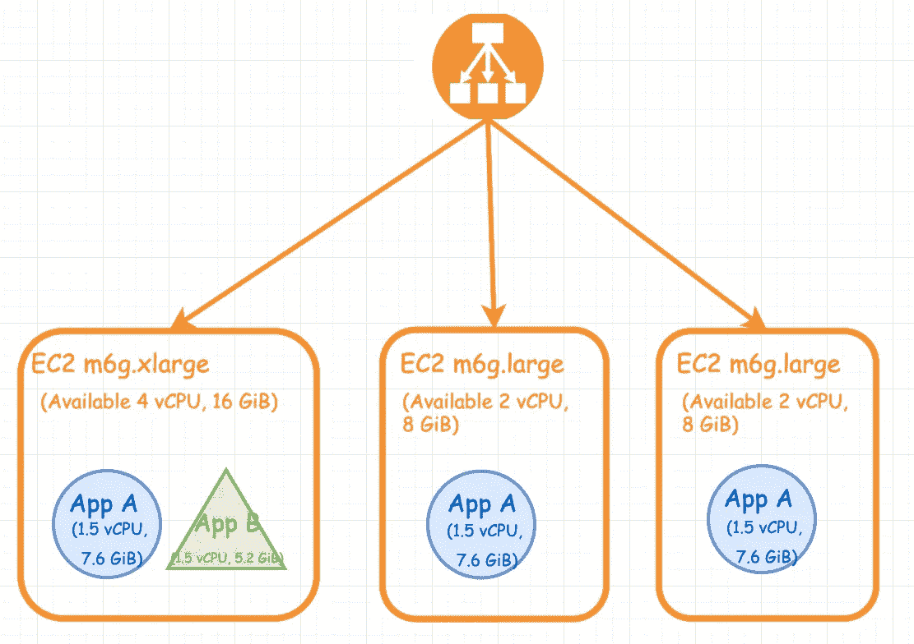
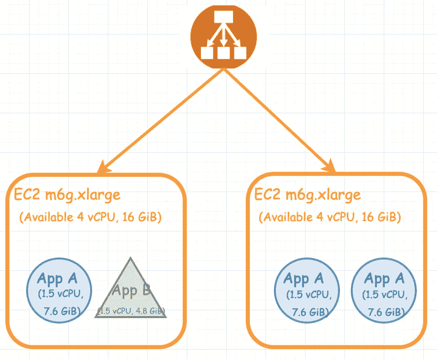
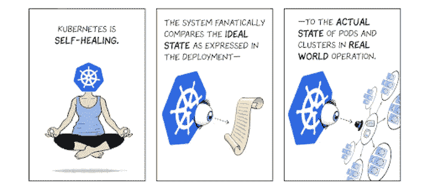

# 我们为什么要用 Kubernetes 呢？

> 原文：<https://betterprogramming.pub/why-do-we-use-kubernetes-anyway-644544082f43>

## 面向软件工程师的容器编排解释指南


作为一名不到两年的软件工程师，我发现我和我的朋友最终会去两种类型的公司:

1.  大公司的所有工程师都认为 Kubernetes(或其他容器编排工具)是理所当然的
2.  主要使用 monolith 的小型公司可能会在将来讨论(或不讨论)使用 Kubernetes(或其他容器编排工具)。

从我自己的经验来说，我在这两种类型的公司都工作过，但我仍然不明白为什么人们会使用 Kubernetes。更具体地说，像 Kubernetes 这样的容器编排工具在解决什么问题？为了给我自己——以及其他初级软件工程师或初级 Kubernetes 用户——回答这个问题，我写了这篇博客，试图更深入地挖掘这些问题。

首先，让我们从定义开始。

# 什么是 Kubernetes？

> [*简称*](https://www.redhat.com/en/topics/containers/what-is-container-orchestration) *: Kubernetes 是一个* ***容器编排工具*** *。*
> 
> [*更长的定义*](https://kubernetes.io/)*:*[*Kubernetes*](https://kubernetes.io/docs/concepts/overview/what-is-kubernetes/)*，也称为 K8s，是一个用于自动化部署、扩展和管理容器化应用的开源系统。*

是的，我到处都听到容器编排这个词。但是让我们面对它，这个定义对于像我这样的初学者来说是一个巨大的模糊。我 100%确定我在大学期间的任何计算机科学课上从未听说过“容器”或“编排”这个词。最多是听说分布式系统。我知道，技术发展如此之快。

如果你还记得我上面提到的大公司和小公司，我觉得没有清晰的路径来理解在这两种情况下公司是如何走上容器编排之路的。我觉得我在一个新的宇宙中，我看到了大爆炸(monolith 的启动)和先进的当前世界(giant corporation modern infra structure)，但我无法将这些点连接起来。

部署在一台服务器上的 monolith 是如何发展成为在 Kubernetes 上部署了数百(可能数千)个微服务的现代基础设施的？他们在什么时候觉得有必要迁移到 Kubernetes？Kubernetes 在解决哪些问题集？对于初级软件工程师来说，这是一个极难回答的问题。这是因为如果你在一家大公司工作，就像案例 1 一样，Kubernetes 正在解决的问题已经不存在了(或者看不见了)。

如果你在创业公司工作，就像第二种情况一样，那么你可能不会接触到 Kubernetes 要解决的问题。举一个更具体的例子，如果你的初创公司还没有使用容器，那么你如何面对需要编排容器的问题？

相信我，尽管我一直是一名基础设施工程师，并连续三年去 Kubecon，但我也不容易搞清楚这些事情。

# 库伯内特斯之旅

请允许我用一个虚构的故事来展示我的 Kubernetes 之旅，这个故事讲述了一家公司是如何从一开始就建立起来的。以我目前的经验水平，你可能已经知道，我不可能从一开始就见证一个公司的历程。所以下面的演示是一个故事，建立在我从实习和全职工作中的一些个人观察的基础上，并结合了我在互联网上的研究。

我真的很喜欢用这种思维练习来理解我现在工作的公司目前所处的位置，以及他们是如何达到这个特定阶段的。我希望你喜欢读这篇文章，就像我喜欢写它一样。请不要完全相信我的话。如果你同意我的观点，如果你从这个博客中获得了有用的信息，我会很高兴。如果你有任何不同意的地方或有任何问题，请在文章下面评论，因为我很想了解更多，因为我仍处于职业生涯的初期。

Kubernetes 是最近最流行的容器编排工具，也是我最熟悉的工具。因此，我将使用 Kubernetes 作为一个例子，但也试图概括这个讨论，我想把它称为我的容器编排之旅。

在这里，我将公司的发展阶段分为三个阶段:

1.  从整体服务到微服务
2.  从微服务到容器
3.  从容器到容器编排



Docker 是容器的一个例子；Kubernetes 是容器编排的一个例子

我想说的是，我绝不是建议每个公司都必须遵循这三个步骤，或者必须按顺序遵循它们。这些阶段肯定可以并行发生——在两个或三个阶段中重叠。实际上，你不可能让所有的团队在这些过程中同步。一些团队将率先尝试更新的基础设施(如迁移到 Kubernetes)，而其他一些维护更重要的流量更大的应用程序的团队可能会更保守，使用更稳定和更旧的基础设施。

总的来说，我觉得这三个阶段对我来说是了解公司开发周期和我们为什么使用 Kubernetes 的重要性的一个很好的方式。

# 阶段 1:整体→微服务

创业公司通常从一整块开始。想想类似于由一组学生构建的大学网络项目。一个巨大的代码库来处理所有的事情(是的，你可以有各种各样的控制器，但最终还是一个巨大的庞然大物)。每个工程师都在这块巨石上工作，打开 PRs 来实现特性。

一旦团队发展到大约 50 名工程师或更多(或达到一定规模)，工程师们在同一块石头上工作时会遇到不同的问题。一些问题会不断地需要做复杂的 rebase，因为主分支每天都有很多变化，其他人可能会处理同一个文件，导致合并冲突。由于功能的责任和所有权划分不清，所以会有相互影响的风险。

访问共享暂存环境以测试您的功能的长队列导致测试时间长。具有高流量的大型复杂应用程序导致构建/部署时间长和潜在的数据库性能下降。开发速度开始变慢，团队面临各种挑战。

然后，团队逐渐开始构建更小的服务(微服务)来处理一些特定的孤立功能。举一个更具体的例子，假设您正在构建 YouTube，并且想要添加一个评论部分。然后，您可以构建一个新的注释服务来处理与之相关的一切，并为 monolith 或其他服务建立 API 端点来检索相关数据。

这个新服务可以有自己独立的数据库、代码报告，甚至部署和测试管道。这些由一小组紧密相关的功能组成的较新的较小的服务可以由一个团队轻松地开发、维护、测试和部署。这可以允许团队之间的松散耦合，从而导致更快的发布周期，更快地推出新功能。

久而久之，你的公司开始有更多的微服务，要么实现各种业务能力(按照[按照业务能力模式](https://microservices.io/patterns/decomposition/decompose-by-business-capability.html)分解)，要么实现不同的子域(按照[按照子域上下文模式](https://microservices.io/patterns/decomposition/decompose-by-subdomain.html)分解)。它开始不仅仅是一块巨石。也许是一个带有几个额外微服务的整体。

对于后端，你可以分配一些机器(比如 EC2)来运行额外的微服务，分配一些副本来运行主应用(monolith)。您可能有一个小型运营团队(可能只有 1-5 人)，如果一个新团队向您请求一台机器来运行他们的新服务，您需要编写一些脚本来配置服务器，然后部署它。

您开始发现，每当不同的服务团队有新的请求时，就没有足够的运营人员来部署修补程序和其他东西。同时，您可能会发现一些使用 Ruby 并部署在 EC2 上的团队有很多相似之处。然后，您开始编写一些小工具，如 gem 工具，以帮助人们生成标准模板来管理他们的基础架构，同时它还附带一些标准化脚本来进行构建和部署。你会发现这种模式会持续一段时间。

稍后，如果出现这种情况，您可能会开始考虑将 monolith 完全分解成多个微服务，以便更好地在团队之间划分责任，并实现更好的开发速度。这本身是一个更复杂的话题，你是否应该或不应该打破这个庞然大物，以及这应该如何发生(查看[扼杀者无花果图案](https://docs.microsoft.com/en-us/azure/architecture/patterns/strangler-fig)了解更多信息)。我不会在这里详细介绍，但随着公司规模的扩大，自然的趋势是从一个巨大的整体逐渐转向更多的微服务。

# 阶段 2:微服务→容器

如果你的创业非常成功，你的客户会继续增长，你的工程团队也会随着时间的推移而扩大。不言而喻，支持这些微服务和主要应用的基础设施的复杂性也在增长。工程师面临的一个大问题是从开发人员的桌面到运行产品应用程序的服务器的环境不一致。在不同的部署环境中，您的生产服务器可能会出现完全出乎意料的本地测试甚至临时环境行为，如图所示:


当然，没有人想破坏生产代码。现代基础设施如何应对这一挑战？这就是集装箱来救援的地方！

根据[红帽文档](https://www.redhat.com/en/topics/containers):

> “容器是一种允许您将应用程序与其整个运行时环境(运行所需的所有文件)打包和隔离的技术。这使得在环境(开发、测试、生产等)之间移动包含的应用程序变得容易。)同时保留全部功能。”

最终目标是构建一个在不同环境中具有一致行为的容器。例如，Docker 是支持公司进行集装箱化的流行工具。

众所周知，集装箱化有许多好处:

*   可移植性:能够部署在不同的环境和潜在的许多不同的云提供商的服务中(对于 AWS 服务，有 fargate、EC2、ECKS 和 EKS 使用容器)
*   隔离:能够运行同一服务的多个容器，有效地共享资源，但隔离带来了安全好处，一个服务崩溃不会影响其他服务。
*   一致的操作:可预测的运行时环境。
*   加速开发、测试和运输周期。
*   更重要的是，由于其高可伸缩性，容器化开启了容器编排的潜在未来。

由于容器化之后有太多的东西值得期待，您的旧服务将开始逐渐迁移到新的容器。与此同时，您的公司可能会推广直接容器化构建的新微服务，以节省未来的迁移工作。

# 阶段 3:容器→容器编排

既然大多数服务都在容器上，并且在所有环境中运行相对稳定，那么所有的基础设施问题都解决了吗？太年轻，太天真。随着公司的发展，新的挑战总是会出现。请允许我演示一下。想象一下，你在一家公司工作，那里的流量在几个小时或几天内达到高峰。然后想象一下，托管一个购物网站，在黑色星期五的销售中，客户急剧增加。与平时相比，交通流量很容易达到 3 倍。

为了正确处理所有流量，您需要扩大规模。假设您定期运行 1 EC2，现在您需要启动 3EC2 实例来处理额外的负载。当然，您将需要一个负载平衡器来将流量路由到不同的机器。它可能看起来像这样:



但这并不是一件容易处理的事情。很多事情都可能出错。需要手动处理的与容器相关的任务，包括但不限于:

*   集装箱的部署
*   容器的冗余和可用性
*   容器的放大或缩小
*   负载平衡
*   容器和主机的健康监控
*   服务发现

想象一下，编写这些脚本并确保它们正确运行需要付出多大的努力。即使在最好的情况下，您可以正确地处理这些与容器相关的任务，处理基础设施的复杂程度，事情仍然可以继续。

是的，您可以预配置 3 个 EC2 实例来处理预期的流量增长，但是如果实际流量低于或高于预期呢？您是否在脚本中添加了额外的逻辑来处理这些情况？

高效扩展是一个需要讨论的复杂主题，它不仅仅是找到正确的 EC2 数量。一个简单的例子是，您需要对应用程序 A 进行三次扩展，但不需要对应用程序 b 进行扩展。这可能是一个真实的情况，其中每个应用程序上的负载峰值不同，您需要单独处理扩展。你会如何有效地做这件事？请允许我用一些图画来演示。

这里，我以 m6g.xlarge EC2 实例为例，基于[文档](https://aws.amazon.com/ec2/instance-types/m6g/)它有 4 个 vCPU 和 16 个 GiB。这里我们使用一个简单的假设，假设为了保持良好的性能，我们希望 EC2 实例的 CPU 使用率低于 75%，内存使用率低于 80%。因此，在这种情况下，我们希望让一个 EC2 实例中的应用消耗少于 3 个 vCPU 和 12.8 GiB。

为了简化问题，让我们把它看作图表中的可用资源大小。我还在图表中显示了一些关于应用程序 A 和应用程序 B 需要消耗多少 CPU 和内存资源的数字，以帮助更好地说明扩展问题。



现在让我们回过头来，我们如何能够将应用程序 A 扩展三倍，却不能扩展应用程序 b。这个问题肯定有不止一个解决方案。这里我想讨论三个可能的解决方案。

# **方案一**

最直接的解决方案是增加两个额外的相同 EC2 实例，并在每个 EC2 实例上运行一个应用程序 A。



这肯定会起作用，但问题是非常明显的。而在第一个 EC2 实例中，它们与 App A 和 App B 一起总共消耗三个 vCPU 和 12.8 GiB，这相当于 m6g . x 大尺寸 EC2 必须提供的 75% CPU 和 80%内存。他们正在充分利用现有资源。但是在后面的 2 个 EC2 实例中，我们可以如下计算 CPU 和内存使用量:

```
1.5 vCPU / 4 vCPU = 37.5% CPU usage7.6 GiB / 16 GiB = 47.5% Memory usage
```

显然，后面 2 个 EC2 实例上超过一半的资源被浪费了。所以肯定不划算。

# 解决方案 2

让我们看看另一种解决方案。如果我们将后面的两个 EC2 实例缩减到 m6g.large 以避免浪费太多资源，会怎么样？



类似地，我们可以计算后面两个 EC2 实例的 CPU 和内存使用情况:

```
1.5 vCPU / 2 vCPU = 75% CPU usage7.6 GiB / 8 GiB = 95% Memory usage
```

这些数字看起来肯定要好得多。然而，这也有一些隐患。95%的内存使用率非常高。随着任何意想不到的高峰，您的应用程序很容易遇到内存不足的危险，导致用户方面不希望的行为。

# 解决方案 3

我们可以继续使用 m6g.xlarge，而不是使用较小的 EC2 实例，但是尝试将两个应用程序 A 放在第二个 EC2 实例中。在这个解决方案中，我们可能需要重新配置负载平衡器，将更多的流量从应用程序 A 路由到第二个 EC2 实例。让我们不要进入细节，并假设负载平衡器正在做适当的工作。



类似地，我们可以计算第二个 EC2 实例的 CPU 和内存使用情况:

```
1.5 vCPU * 2 / 4 vCPU = 75% CPU usage7.6 GiB * 2 / 16 GiB = 95% Memory usage
```

在本例的解决方案 2 中，该数字是相同的。95%的内存使用率绝对是进入了内存不足的风险危险区。应用程序有时会因为内存不足而被终止。因此，在现实生活中，如果我们希望我们的应用程序稳定运行，这肯定不是一个理想的情况，甚至可能不是一个可接受的解决方案。

从上面的三个扩展解决方案中，您可以很容易地看到单独扩展和拥有非标准化基础架构的挑战。这些行为可能导致无法经济高效地运行服务。这些正是容器编排试图解决的问题。如果您不选择使用现有的容器编排工具，如 Kubernetes，您可能最终需要重新发明轮子并构建您的容器编排工具。因为这些问题，不管有没有使用容器编排工具，都将是你一旦达到一定规模需要解决的问题。

让我们仔细看看容器编排的定义及其用例。这是 [vmware](https://www.vmware.com/topics/glossary/content/container-orchestration.html) 给出的定义:

> “容器编排是运行容器化工作负载和服务所需的大部分操作工作的自动化。这包括软件团队管理容器生命周期所需的广泛内容，包括供应、部署、缩放(向上和向下)、联网、负载平衡等。”

# 容器编排是用来做什么的？

容器编排用于自动化和管理任务，例如:

*   供应和部署
*   配置和调度
*   资源分配
*   集装箱可用性
*   基于平衡整个基础架构中的工作负载来扩展或移除容器
*   负载平衡和流量路由
*   监控容器健康状况
*   基于运行应用程序的容器配置应用程序
*   保持容器间交互的安全性

Kubernetes 是一个非常流行的开源容器编排工具。我个人喜欢将容器编排工具想象成服务器(如 EC2)之上的额外抽象层，以便在处理复杂的基础设施时更有效地分配资源。Kubernetes 帮助您构建一个节点(服务器)池，然后根据应用程序的 CPU 和内存请求以及每个节点上的可用空间，在不同的节点上分配不同的应用程序。

调度、扩展和负载平衡都是自动完成的。Kubernetes 是一个很好的工具，可以帮助开发人员专注于应用程序，而不用担心基本的金属服务器，也不会受到服务器附带的资源的限制。



来源:[谷歌云](https://cloud.google.com/kubernetes-engine/kubernetes-comic/)

将所有这些工具结合在一起，可以带来终极的开发体验，从而提高开发速度。只需点击一个按钮，默认模板中的一个默认微服务就会出现在构建和部署管道中，并为您的服务和部署提供 Kubernetes 命名空间。您可以在应用程序代码库中编写特性代码，所有代码都将被发送到测试环境中，以便您使用刚刚构建的 docker 映像在集群内部进行验证和测试。一旦一切准备就绪，发布就像在部署窗格中更改 docker 映像一样简单。瞧啊。客户成功地使用了您的代码。

# 结论

很明显，容器编排是大规模运行稳定应用程序不可避免的未来。Kubernetes 是目前最流行的容器编排器，最初由 Google 创建。Kubernetes 被许多知名公司使用，如 Google、Spotify、Intuit 等等，而且数量还在增长！我希望我的博客——这是一个关于为什么 Kubernetes 给你一个公司如何在不同阶段成长以及他们最终如何需要容器编排的清晰愿景的问题的真正长版本——能帮助你。

感谢您的阅读。