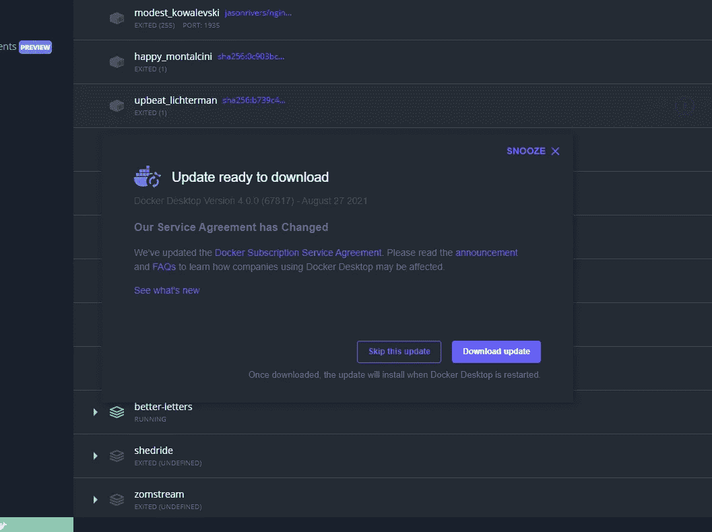

# 为什么 Docker 不再对所有人免费了

> 原文：<https://betterprogramming.pub/why-docker-isnt-free-for-everyone-anymore-856f849b5c2c>

## 以及它对你的影响

时代变迁的标志

当我今天早上启动我的电脑时，我收到了 Docker 桌面的上述更新通知。基本要点是，如果你喜欢在所有项目中免费使用 Docker，无论是在家里还是在工作中，那么这种情况就要结束了。从 8 月 31 日起(也就是本月底，在撰写本文时)，你需要订阅才能在工作场所使用 Docker Desktop(如果员工超过 250 人，收入低于 1000 万美元)。有一个更长的宽限期，但你越早变得顺从越好。

现在，我明白公司必须为了赚钱而存在，而不是慈善机构，但 Docker 内部核心功能的货币化确实表明了一种令人担忧的趋势。不幸的是，我认为 Docker 已经在这条道路上走了一段时间了，[免费用户只能使用图片拉取功能](https://www.docker.com/blog/checking-your-current-docker-pull-rate-limits-and-status/)，现在 Docker 的核心桌面客户端也被限制免费用户使用。但是，为什么这是一个问题呢？

# 这就像分手后试图保持朋友关系

一些技术开始是免费的，后来在更宽松的许可下变得可用。例如，你总是需要一个许可证来使用 Unity，直到新的许可看到你可以免费使用 Unity[*，除非*你一年的利润超过 10 万美元](https://unity3d.com/unity/activation/personal)。虚幻引擎也是一样，但有了[百万美元的上限](https://www.unrealengine.com/en-US/faq)。Visual Studio 也是如此，Visual Studio 社区允许用户在某些情况下访问以前付费的应用程序版本。在这些情况下，从付费产品转向免费产品对每个人都有好处——人们可以使用他们以前负担不起的技术，而盈利的公司为使用软件的许可证付费。

> 对我来说，将 Docker 从我所有的项目中移除实际上比我自己去寻找这些(财务)问题的答案要容易得多。

在这种情况下，情况正好相反。Docker 正在从一个合理的定价结构(即基本产品是免费的，企业客户为增加的功能支付更多费用)转变为一个中型或大型企业中的几乎每个人都必须付费才能使用它。在组织中使用 docker 的人和知道他们公司年收入的人是同一批人吗？因为，让我现在告诉你，我不知道我工作的公司一年赚多少钱，我甚至不知道该问谁。对我来说，将 Docker 从我所有的项目中移除实际上比我开辟道路找到这些问题的答案要容易得多。

向某些用户免费提供一个付费工具是一个伟大的举措，人们喜欢它。可以预见的是，反过来做同样的事情，没有那么多。除非有充分的理由，否则 T2 人不会喜欢它。

由[张秀坤·吕克曼](https://unsplash.com/@exdigy?utm_source=medium&utm_medium=referral)在 [Unsplash](https://unsplash.com?utm_source=medium&utm_medium=referral) 上拍摄

# 开发人员使用的工具的碎片化

如果我在家里使用一个工具进行开发，我可能也会在我的工作场所使用它，因为我的大脑中只有这么大的空间来容纳所有的东西。我在家里广泛使用 Docker，但直到最近我才开始在工作中为一个新项目使用它。知道我无法说服我的老板花每月 21 美元订阅 Docker，我现在开始从这些项目中删除它，并试图找到一个替代的解决方案来使用。

你可能会指出，这些变化只影响 Docker 桌面，而不是 Docker CLI 或 docker-compose，所以我不需要这样做。这是真的，但不久前，我们还可以从 Docker 获得无限制的 pulls，现在这是一个付费功能。随着这一变化，docker (Docker 桌面)的一个核心功能被锁定在付费墙之后。因此，根据这一轨迹，你认为我们会看到更多仅限于订阅的 Dockers 产品吗？感觉我们肯定会的。

# 这将创造出许多可供选择的管理解决方案

目前，Docker 唯一受到这一变化影响的组件是 Docker Desktop。其他工具，如 docker-compose 和 Docker CLI，不受影响，也不需要订阅。由于这是一个影响开发人员的变化，这群聪明的人将简单地创建 Docker 桌面的替代品，为人们提供与他们过去所拥有的相同的功能。这些产品中的一些已经存在，像 [Portainer CE](https://github.com/portainer/portainer/blob/develop/README.md) ，它是在 Zlib 许可下授权的。您可以使用 Portainer，而不用打电话给公司的财务团队来计算公司赚了多少钱，或者询问有多少人在那里工作。很简单。作为开发者，我们*喜欢*这种简单性。

# 订阅没有价值

如果你订阅的话，你会额外得到什么？嗯，你遵守 Docker 订阅服务协议…就是这样。这是真的，你会得到私有的存储库，并发的构建，等等。但是谁会诚实地使用这些东西呢？我认为(我可能错了)大多数人使用他们自己的 CI/CD 解决方案来构建 docker 映像，并将这些映像推送到他们的映像存储库。如果我要订阅 Docker，我希望订阅内容更有价值。我希望能够在 Docker 桌面或 Docker CLI 中投票决定哪些问题对我来说是最重要的。订阅使用 Docker 只是为了让我能感受到我给他们钱的温暖，这还不足以成为一个商业案例。

话又说回来，如果 Docker 有办法通过找到一种增加价值的方法来有意义地货币化他们的产品——而不是强迫已经在使用该产品的人订阅——我想他们会这样做的。

> *如果我要订阅 Docker，我希望订阅内容更有价值。*

# 会有预期的效果吗？

我是一名开发商，而不是市场研究员，所以你可以接受我在这里大错特错，不知道我在说什么，我真的应该呆在我的车道上。你也可以指出，拥有超过 250 名用户和 1000 万美元年收入的公司肯定付得起每月 21 美元的费用。然而，尽管如此，还是有公司不为他们的开发人员支付这些工具的费用。通常，当遇到这样的问题时，开发人员倾向于“找到一种方法”,并在不花钱购买工具的情况下找到做事情的另一种方法。不是这些公司没有钱，而是他们的开发人员无法传达产品中的价值，或者管理层没有看到投资这样的工具的价值。

因此，这将不可避免地导致创建免费的，可能是开源的 Docker 桌面的替代品。如果这些替代品变得比 Docker 桌面核心产品更受欢迎，我不会感到惊讶。安装指南将归结为安装 Docker CLI，然后安装这个工具*而不是 Docker Desktop 的*。

那时它将会回到原点。Docker 将以 CLI(和其他像 Compose 这样的工具)免费结束，每个人都将能够利用其他免费工具来管理他们的本地 Docker 设置。拥有自己的 CI 设置和 Docker 存储库的人将不受影响，无论他们的公司赚了多少钱，或者雇佣了多少人。

随着 Docker 桌面的有效替代，这些人没有多少理由订阅 Docker 计划，那么接下来会发生什么呢？如果每个人都找到了一种有效的方式在没有 Docker 桌面的情况下使用 T2，并且订阅量很低，那么我认为这将导致 T4 整个 Docker 套件需要许可，包括 CLI 和 Compose。就我个人而言，我不希望这种情况发生，因为这会全面降低 Docker 的使用，因为人们会转向其他解决方案来使他们的东西仍然工作。

并不是说 Docker 不是一个很好的解决方案，也不是说它不值这个钱。事实很简单，我知道说服我的老板再订购一个*有多难，而且我知道如何通过使用另一个工具来管理我的本地 Docker 设置来更容易地解决这个需求。我不能是唯一一个遇到这种情况的人。如果每个人都这样做，而没有多少人订阅 Docker，那么我看不出这不会导致越来越多的 Docker 套件需要订阅。*

当然，你的情况可能会有所不同，你的老板可能会非常乐意注册 Docker，我可能完全错了，Docker 可能永远不会要求订阅使用比现在更多的内容(或在 8 月底，就此而言)。以上只是我的*观点*。但是看看几年后的结果将会非常有趣。