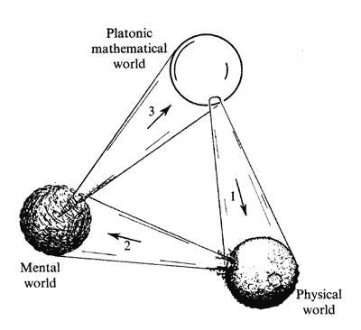
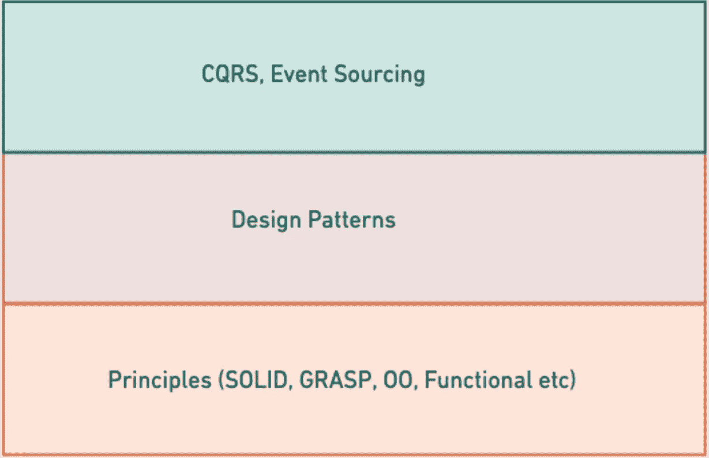
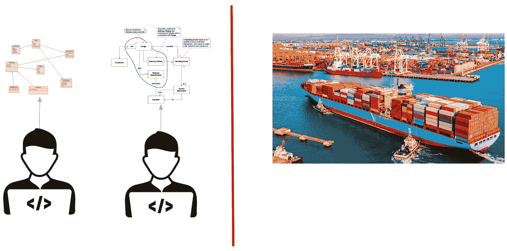
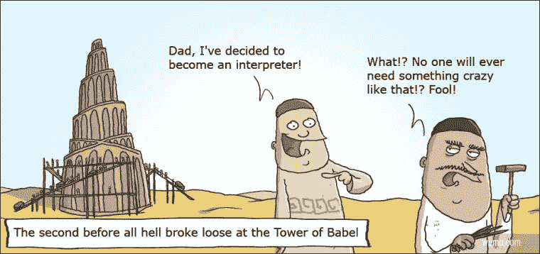
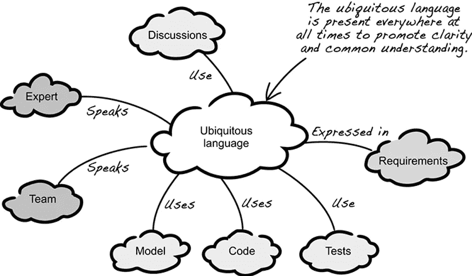
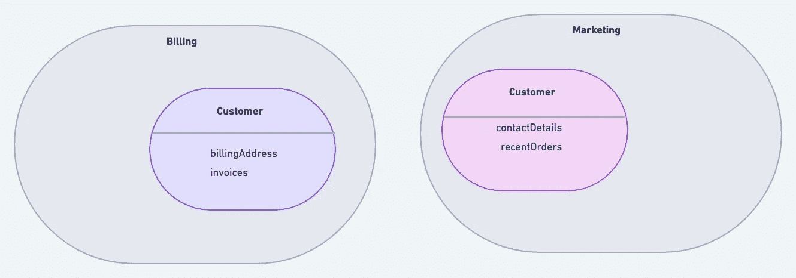
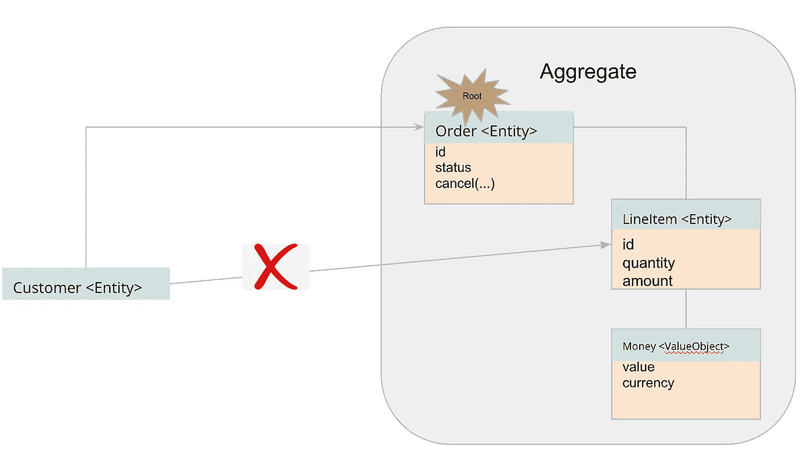

# 为什么是领域驱动的设计？

> 原文：<https://betterprogramming.pub/why-domain-driven-design-203099adf32a>

## DDD 面临的问题及解决方案

虽然这个想法已经存在了 10 多年，但 DDD 最近变得非常受欢迎。我认为这主要是因为人们开始注意到 DDD 提出的想法和某类复杂性之间的相关性，这类复杂性反复出现在由涉及多个团队的大规模组织构建的软件中。

尽管所有的现代架构原则和实践都为常见问题提供了解决方案，但这种出现在软件开发核心的特殊类型的复杂性通常是无法解决的，DDD 承诺提供一个解决方案。

这个博客的目标是强调 DDD 解决的问题类型，并给出解决方案的高层次介绍。

# 柏拉图主义

让我们从探索一些哲学观点开始，我相信这些观点会帮助你获得一些关于 DDD 的新观点。

柏拉图认为存在非物质(存在于时空之外)和非精神的抽象对象领域，抽象对象可以通过推理来感知。

例子:当我们谈论正圆时，我们感知到正圆的概念(它只是作为一个抽象的物体存在),尽管任何试图在物理世界中产生正圆的尝试在某种程度上都是不完美的。

精神或认知世界是我们看到/感觉到物质世界中的物体，并发现柏拉图世界中抽象形式的存在的地方，也就是说，正圆的概念是发现的，而不是发明的！

同样，当我们看一个软件模型或架构时，我们仅仅是看到一个真实系统的投影，你可以把真实系统称为域(类似于抽象对象)

# 领域与软件模型

你可能已经猜到了，在软件中构建的代表特定问题或领域的模型被称为“领域模型”

立即想到的问题是，“领域模型应该有多精确？”

这和“一个圆应该有多完美”是同一个问题这两个问题的答案都是简单的“在某种程度上对解决一个特定的问题是有用的”。

是的，没有人能精确地对一个领域进行一对一的建模，但是你总能以一种对解决手头问题有用的方式建模。

让我们以模拟我们自己的地球为例。

模型与真实

右边是一张地球的真实图片，虽然真实但并不十分有用。

但左边是地球的投影(或模型)，称为[墨卡托地图](https://en.wikipedia.org/wiki/Mercator_projection)，这对于确定任意两个位置的方向非常有用，尽管大小有所扭曲(看看绿地和非洲的大小)。

关键是，墨卡托地图是为一个特定的目的而设计的——有一个有用的投影来帮助水手确定方向！

本质上，准确性不是很重要，有用才是！

# 有效建模的工具

既然我们都同意对一个领域/问题建模的重要性，那么我们有什么工具来进行有效的建模呢？

建模工具可以大致分为原则、模式和哲学。

## 设计原则

有大量的设计原则指导你从结构上和行为上对软件建模。

[例如，掌握](https://en.wikipedia.org/wiki/GRASP_(object-oriented_design)#:~:text=The%20different%20patterns%20and%20principles,to%20many%20software%20development%20projects.)原则让你思考和考虑你如何着手将责任分配给各个阶层，以便你在**低耦合**上实现**高内聚**。

另一方面，SOLID 原则与 GRASP 没有太大的不同，它试图为您提供一个指南来实现——再次强调，高内聚和低耦合——事实上，我认为 SOLID 只是翻新的 GRASP :-)

除了 grasp 和 solid，还有其他通用的面向对象和函数式编程原则。

本质上，所有的原则都帮助你以一种高度内聚和松散耦合的方式为你的软件建模——它们是设计良好的软件的组成部分。

## 设计模式

到处都有模式，模式是重复的东西…

“房子”是一种模式，“村庄”、“城镇”、“大学”等也是一种模式。

城镇之间有一些共同的特征。例如，每个城镇通常都有一个城镇中心、一个公园、一个购物中心、咖啡店、图书馆、火车站等。

当城镇的所有便利设施都放置在正确/最佳的位置时，城镇就会变得生动而和谐。没有人想要一个离城镇 5 公里的公园，也没有人想要一个正好在公园里的公共汽车站！

你看到了吗？我们周围都有重复的固有模式。每个模式都存在于一个上下文中，并为上下文增加一些价值。

如果你用一种正式的语言抓住了模式的本质，并给它起了一个名字，那么在交流过程中分享它和复制它就会变得非常有用。

这正是 Christopher Alexander 在他的书中所描述的——[永恒的构建方式](https://www.amazon.com/Timeless-Way-Building-Christopher-Alexander/dp/0195024028)和[模式语言](https://www.amazon.com/Pattern-Language-Buildings-Construction-Environmental/dp/0195019199)。他在他的书中列出了大约 250 种模式，你可以开始使用它们进行交流和复制。

Christopher Alexander 对四人组的作者有直接影响，他们出了一本非常受欢迎的书，叫做[设计模式](https://en.wikipedia.org/wiki/Design_Patterns)——就像模式语言一样，它是软件中大约 23 种常见模式的目录。

现在，你可能会问这个问题:“原则和模式之间有什么区别？”答案是模式产生于原则。

原则是软件模型的基本构件，而模式是原则之上的一层，有助于捕获、记录和共享常见问题的解决方案。

正如你所看到的，在设计模式之上还有更高层次的架构模式，比如 CQRS &事件采购。

## 设计哲学

好了，现在我们知道我们有原则和模式来帮助我们建模我们的软件，也有其他基本的设计哲学，但是这些哲学的大部分思想可以总结为“抽象思维”

当你开始在抽象中思考，并在你的代码中创建抽象时，无论是自顶向下还是自底向上，你将最终产生一个好的软件设计。

这里有一些谈论软件开发哲学的书，这些书对我如何建模/构建软件有很大的影响。

*   [思考解决问题的语言和哲学](https://www.amazon.com/Thinking-Forth-Leo-Brodie/dp/0976458705)
*   [计算机程序的结构和解释](https://www.amazon.com/Structure-Interpretation-Computer-Programs-Engineering/dp/0262510871)

# 现有工具的局限性

好了，现在我们终于谈到 DDD 了:-)

快速回顾一下！我们现在同意，我们有很多原则、模式和哲学，使我们能够创建良好的软件模型。

但是不幸的是，如果您在一个处理复杂领域的大型组织中工作，仍然有一些问题没有被上面列出的原则、模式和哲学解决。

再来看一些还需要注意的问题。

## 分离模型

如果两个工程师或团队被分配了使用所有已知的原则和模式对一个领域建模的任务，他们将会提出两个完全不同的模型！—不仅模型在结构上会不同，在语言上也会不同！

这表明了一个大问题，团队之间没有共同点来在某种程度上统一模型。

## 断裂的语言

造成上述“模型断开”问题的原因之一是建模所用的语言。组织中的每个人都可以在其模型中自由使用任何名称和术语。

这不仅导致模型难以理解，还会产生歧义和沟通错误。

例如，如果您正在构建一个支付系统，您会将客户向其帐户添加新的借记卡/信用卡的过程称为什么？有人称之为“卡链接”，有人称之为“卡授权”，还有人称之为“添加新卡”。

当一个组织建立越来越多的系统而没有一个共同的词汇时，你会看到人们用不同的词来描述相同的或者有时完全相反的概念，导致很多混乱和误解。

## 分裂的人们

分裂的语言不仅仅是技术团队中的问题，它也导致了整个组织中更多的分裂。

领域专家可能有自己的语言来表达某些领域概念，领域专家使用的词汇可能与技术专家使用的词汇完全不同。

这种分歧在大型组织中非常普遍，在来自两个不同团队(技术和领域)的人试图定义一个问题或探索该问题的可能解决方案的任何讨论中，你都可以注意到这一点。

如果一个人不能清晰地表达每个人都同意的问题的定义，表达解决方案就更难了！

# DDD(关键概念)

> 领域驱动设计(DDD)是一种通过将实现与核心业务概念的演进模型深度连接来开发复杂需求软件的方法。

DDD 提供了许多解决复杂问题的原则和实践，我将只尝试向您简要介绍其中的关键概念。

## 普遍存在的语言

从 DDD 出现的最重要的概念之一是无处不在的语言的想法，它试图解决上面列出的主要问题，即断裂的语言，断开的模型和断开的人。

无处不在的语言是在开发人员和组织的其余部分之间建立一种公共共享语言的实践。领域专家和开发人员在任何讨论中使用的相同语言和术语应该是软件模型中使用的相同术语。

这使得一个人可以清晰地表达问题和解决方案，而不会含糊不清，这是一个伟大的力量！

语言本身的发展是一种协作努力，这需要有意识的训练来保持语言的更新和管理。

这整个想法可能听起来很简单，但这正是大多数组织中缺少的元素。一旦你使一种无处不在的语言成为该领域的官方语言，你将开始看到它在代码、讨论、测试、文档、需求等方面的一致使用。

## 有界上下文

无处不在的语言的想法应该立即让你质疑在一个大组织中使用一种全球语言是否现实。

答案是否定的！我们甚至不应该试图有这样一个统一的全球语言，事实上它将对我们不利，并造成更多的混乱！

假设你有两个团队，一个负责支付系统，另一个负责订单管理系统。这两个系统虽然可以相互作用，但却专注于解决非常不同的问题。

试图在两个团队之间共享一种共同的语言将意味着每个团队都试图将语言弯曲到非常具体的问题空间，从而污染整个语言。

每个单词/语句在特定的上下文中都有意义。同样，每个领域概念在(有界)上下文中都有意义。

有界上下文仅仅是一个领域内的边界，其中应用了一种特定的无处不在的语言或领域模型。

例如，如下所示，在一个组织中有两个有界的上下文(或子域)，`Billing`和 Marketing。

两个子域处理完全不同类型的问题，然而，在两个模型中都需要引用一个`Customer`。

虽然客户的身份在`Billing`和营销系统之间是相同的，但是`Customer`的定义在两者之间是不同的。

`Billing`系统感兴趣的是账单地址和未结发票，而营销系统感兴趣的是客户的联系方式和他最近的订单。

当我在一个计费相关的上下文中提到“客户”时，很明显我指的是包含计费相关信息的客户的表示。另一方面，如果我在一个营销受限的上下文中引用`Customer`，很明显我指的是包含联系方式和最近订单的客户表示。因此，组织中的模糊性减少了。

这意味着每个子域(有界上下文)都有自己无处不在的语言和软件模型。

# DDD 原则

到目前为止，我们接触的所有 DDD 的概念都是帮助解决大部分组织问题的高级实践和约定。

还有一些原则可以帮助你在代码中有效地对你的领域建模。我不会触及所有的原则，但下面的几个关键原则。

## **实体、值对象和聚集**

让我们看一个订单管理系统的例子。

`Money`是一个值对象。DDD 社区对价值对象的形式定义是:“*描述某种特征或属性但没有身份概念的对象*”

很简单，`Money`不需要有唯一的标识符。20 美元的金额可以由任何一个值和货币设置为 20 &美元的`Money`类实例来表示。

另一方面，在您的模型中有需要唯一标识符的类。这些类被称为实体。

一个实体的正式定义是:*“一个基本上不是由它的属性定义的对象，而是由一条连续性和同一性的线定义的。”*

所有实体都将有一个非常明确的生命周期，即它在特定的时间点出现并经历各种转变，最终可能以终止状态结束。

在上面的例子中，当客户下订单时，一个`Order`就出现了，它必须有一个惟一的标识符，以便于客户跟踪和修改。它会经历各种状态，如`pending`、`shipped`等。最终可能会在`complete`或`cancelled`结束

然而，订单的`LineItem`虽然也是一个实体，但是因为我们需要标识准确的行项目，所以不需要在“订单”的上下文之外是唯一可标识的。

这意味着所有需要访问`LineItem`的用例应该首先访问`Order`，然后访问`Order`中的行项目——这意味着`LineItem`只需要在`Order`中有一个惟一的标识符

正如您在示例中已经看到的，`Order`实体(有一个全局唯一标识符)、`LineItem`实体(有一个本地唯一标识符)和`Money`值对象一起形成了一个名为`Aggregate`的对象集群

另外，请注意`Order`有一个特殊的性质，它是唯一可识别的实体，这使得它成为外部世界与订单相关的任何事物进行交互的第一个接触点。因此，`Order`虽然是一个实体，但也被称为聚合根！

正式定义:*“一组相关联的对象，它们被视为一个单元，用于数据更改。外部引用仅限于聚合的一个成员，指定为根。一组一致性规则适用于聚合的边界。”*

## **仓库**

存储库是使系统能够存储、检索和搜索对象集合(通常是聚合根)的抽象。

我曾经见过人们将存储库几乎像数据访问层一样使用的情况，但是它远不止于此，存储库应该总是被看作“聚集根的存储库”

例如:“订单库”、“客户库”等。

这允许您像在您的域代码中的任何其他域概念一样使用存储库接口，存储聚合根只是存储库的一个额外的责任，它是一个实现细节。

但是这里的关键是，存储库应该被视为您的领域模型中的一等公民，而不是存储抽象！

# 摘要

*   DDD 是一种文化转变，是一种思维方式。
*   这不是一种技术，这是一种实践。
*   它需要整个组织的协作努力，以充分获得收益
*   您的代码中的软件模型以及您的测试成为了您的领域的真实来源
*   独特的语言是关键！

# 参考

Eric Evans 的领域驱动设计

[克里斯托弗·亚历山大的永恒建筑之道](https://www.amazon.com/Timeless-Way-Building-Christopher-Alexander/dp/0195024028)