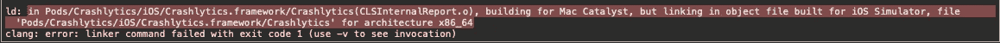
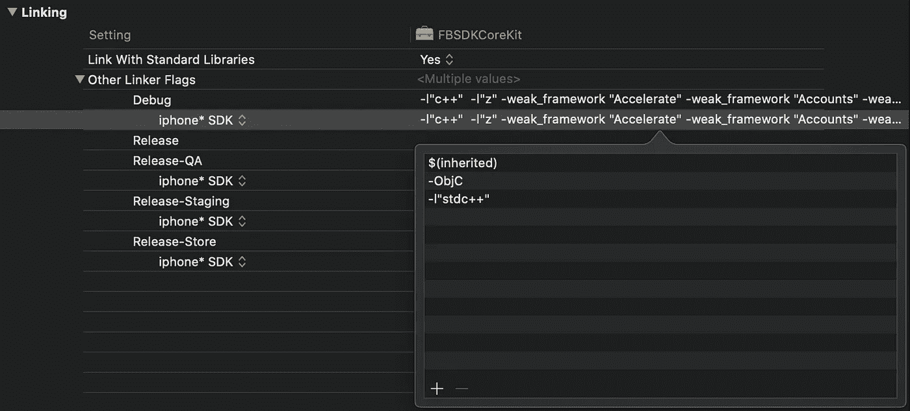
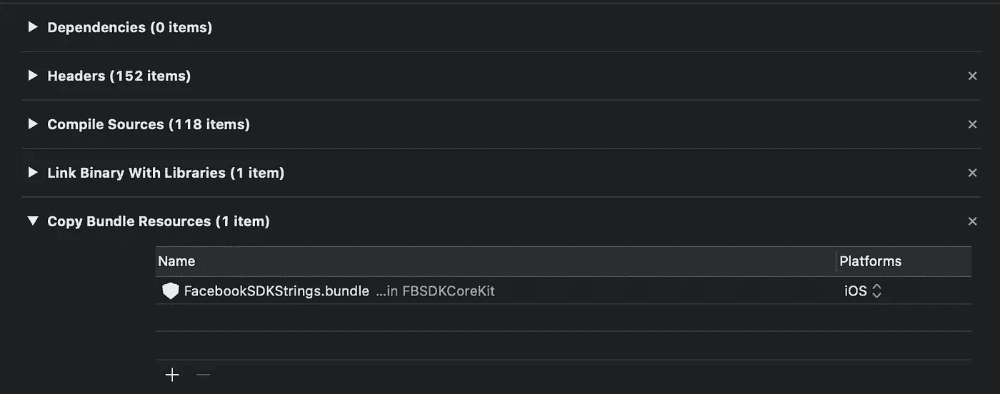
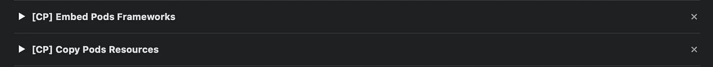

# 为什么我的 Pods 不能用 Mac Catalyst 编译，如何解决？

> 原文：<https://betterprogramming.pub/why-dont-my-pods-compile-with-mac-catalyst-and-how-can-i-solve-it-ffc3fbec824e>

## 如何在 iOS 应用中使用 Mac Catalyst 解决“for architecture x86 _ 64c lang:error:linker command failed with exit”


[马太·亨利](https://unsplash.com/@matthewhenry?utm_source=unsplash&utm_medium=referral&utm_content=creditCopyText)在 [Unsplash](https://unsplash.com/s/photos/sad?utm_source=unsplash&utm_medium=referral&utm_content=creditCopyText) 上拍照

# 概观

前段时间，我发表了一篇关于这个话题的[文章](https://medium.com/better-programming/macos-catalyst-debugging-problems-using-catalyst-and-cocoapods-579679150fa9)。我试图解释为什么你的项目在点击新 Mac 复选框后无法在你的笔记本电脑上编译:


从那以后，我得到了你们许多人的反馈，我注意到了一些值得一提的额外问题，这些问题是我当时没有考虑到的。在这篇文章中，我将完成第一篇文章，并深入探讨问题的根源。我将把本教程分为三个部分:

*   建筑问题
*   App Store 提交问题
*   自动化解决方案

你可以在这里找到原文:“[在你的 iOS 应用中支持 macOS Catalyst:使用不是为 macOS 编译的 Pods】。”](https://medium.com/better-programming/macos-catalyst-debugging-problems-using-catalyst-and-cocoapods-579679150fa9)

如果您对最终的解决方案感兴趣，请跳过前两个部分，找到可以一劳永逸地解决您的问题的脚本的链接。

注意:该脚本只是配置您的 Pods 项目，但是您必须确保您没有导入和使用不支持的库用于 [Mac Catalyst](https://developer.apple.com/design/human-interface-guidelines/ios/overview/mac-catalyst/) 。也就是说，如果框架不支持 Mac 架构，您就不能将其用于 Mac Catalyst。尽管如此，你肯定可以在 iOS 和 iPadOS 上删除这些功能，所以如果你愿意在 Mac 上删除这些功能，那就继续读吧。

你只需要做:

```
#if !targetEnvironment(macCatalyst) 
import UnsupportedLibrary
#endiffunc dummy() {
    #if !targetEnvironment(macCatalyst) 
    // some call to UnsupportedLibrary
    #endif
}
```

# 建筑问题

如果你已经点击了 Mac 复选框，将你的 iOS 应用程序移植到 macOS 上，并尝试在 Mac 上运行该应用程序，你会注意到移植并不像想象的那么简单。


你会发现两种不同的错误:链接错误和编译错误。



链接错误

```
ld: in Pods/Crashlytics/iOS/Crashlytics.framework/Crashlytics(CLSInternalReport.o), building for Mac Catalyst, but linking in object file built for iOS Simulator, file 'Pods/Crashlytics/iOS/Crashlytics.framework/Crashlytics' for architecture x86_64clang: error: linker command failed with exit code 1 (use -v to see invocation)
```


编译错误

```
Undefined symbols for architecture x86_64:
    "_OBJC_CLASS_$_UIWebView", referenced from:
    objc-class-ref in BNCDeviceInfo.o
    objc-class-ref in BranchViewHandler.o
ld: symbol(s) not found for architecture x86_64
clang: error: linker command failed with exit code 1 (use -v to see invocation)
```

## 为什么会这样？

您正在使用的一些 Pods，或它们的任何依赖项，不是或不能针对 Mac 架构(即 x86_64)进行编译。所以静态库不会链接，动态框架不会编译。

## 我该如何解决这个问题？

您可以确定哪些 Pod 目标不应包含在 Mac Catalyst 版本中，并手动删除它们。假设您已经将`FBSDKCoreKit`包含在您的`Podfile`中。你需要进入你的 Pods 项目，找到`FBSDKCoreKit`目标，进入构建设置*、*并查找 OTHER_LDFLAGS。在这里，您需要过滤所有那些您标识为仅 iOS 的依赖项，以便它们不会链接到 macOS 架构:



然后，转到“构建阶段”选项卡，将 iOS 作为平台过滤器添加到:

*   属国
*   头球
*   编译源代码
*   双星
*   捆绑资源



就这些吗？我们还没开始呢！对于任何其他已安装的 pod 以及自动生成的目标 Pod-myapp target 1、Pod-myapp target 2 等不需要的 Pod 可能具有的任何依赖项(在本例中，它没有任何依赖项)，您必须重复相同的过程。根据库的 Podspec 是如何定义的，链接可能在 Pod 的目标或自动生成的“Pods-”目标中。

这就是上一篇文章所涉及的内容:运行和归档。但是提交到 App Store 呢？

## App Store 提交问题

存档过程不同于运行过程。到目前为止，我们还没有编译 pod 目标构建阶段中定义的源代码、资源、框架和头文件。我们还取消了不支持的库的链接。这很好，但是还有一个额外的问题。如果您试图在此时将您的应用程序提交到 App Store，您会遇到类似如下的错误:

```
ERROR ITMS-90276: "Missing Bundle Identifier. The application bundle contains a tool or framework ${PRODUCT_NAME} [com.myapp.myapp.pkg/Payload/MyApp.app/Contents/Resources/GoogleSignIn.bundle] that is missing the bundle identifier in its Info.plist file."
```

## 为什么会这样？

如果你进入你的项目文件夹并导航到`Pod/Target Support Files/Pods-MyAppTarget` ，你会看到一个名为`Pods-MyAppTarget-frameworks.sh`的 bash 脚本。如果有任何资源要安装在归档文件中，您可能会看到另一个名为`Pods-MyAppTarget-resources.sh`的脚本。这两个脚本是在应用程序的目标构建阶段调用的，步骤如下:

*   [CP]嵌入式 Pods 框架
*   [CP]复制 Pods 资源



第一步将把框架包含到归档中，第二步将包含捆绑包资源。框架可能带有预编译的依赖项，其中包含捆绑包资源，因此两个脚本都可能在 Mac 应用程序归档中包含不必要的未签名捆绑包资源。

## 我该如何解决这个问题？

您可以打开这两个脚本，查找不应该包含的资源或框架，并修改脚本，使它们不为 Mac 架构安装:

```
if [[ "$CONFIGURATION" == "Release" ]]; then
    if [ "$ARCHS" != "x86_64" ]; then
        install_framework "${BUILT_PRODUCTS_DIR}/FBSDKCoreKit/FBSDKCoreKit.framework"
    fi
fi
```

对于框架和:

```
if [[ "$CONFIGURATION" == "Release" ]]; then
    if [ "$ARCHS" != "x86_64" ]; then
        install_resource "${PODS_ROOT}/GoogleSignIn/Resources/GoogleSignIn.bundle"
    fi
fi
```

为了资源。如果再次存档，请转到生成的文件，右键单击以显示其内容。您可以通过导航到 Product/Applications/MyApp/Contents/Frameworks 和 Product/Applications/MyApp/Contents/Resources 并验证这两个文件夹不包含框架或资源来检查这一点。

# 自动化解决方案

所有这些过程看起来都是严酷且不可持续的。这就是为什么我一直在用 Ruby 编写一个脚本来一次性解决所有这些问题。您只需要将脚本包含在项目文件夹中，并从您的`Podfile`中调用它:

```
##### Inside your Podfile #####load 'remove_unsupported_libraries.rb'target 'MyAppTarget' do   
    use_frameworks!   

    # Install your pods   
    ...
enddef unsupported_pods   
    ['Firebase/Crashlytics', 'Firebase/Analytics', ...]
enddef supported_pods   
    ['SwiftLint', 'Firebase/Auth', 'KeychainSwift', ...]
endpost_install do |installer|   
    $verbose = true # remove or set to false to avoid printing
    installer.configure_support_catalyst(supported_pods, unsupported_pods)
end
```

你可以在 GitHub 上找到剧本[:](https://gist.github.com/fermoya/f9be855ad040d5545ae3cb254ed201e4)

**注意**:如果你已经在你的应用目标中包含了任何不支持的 Pod 的脚本阶段，例如`Firebase/Crashlytics`，你需要跳过这个 Mac 架构的脚本:

```
if [[$ARCHS != "x86_64"]]; then
  "${PODS_ROOT}/FirebaseCrashlytics/run"
fi
```

## 更新

有关更新和文档，请参见此存储库:

[](https://github.com/fermoya/CatalystPodSupport) [## 氧化亚铁/催化剂载体

### 如果你正在使用 CocoaPods 并且你的应用支持 macCatalyst，你可能会遇到这个错误:ld: in…

github.com](https://github.com/fermoya/CatalystPodSupport) 

## 找到新的问题了吗？

如果您遇到任何反馈或问题，请不要犹豫。多亏了你的评论，我才得以升级并继续维护它。