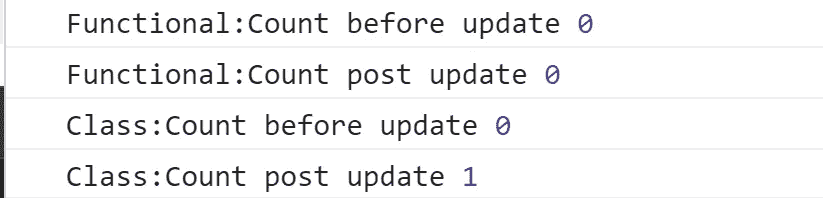
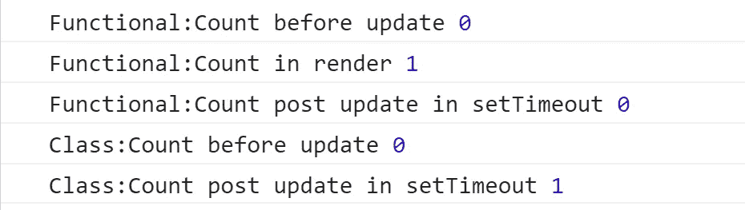

# React 状态更新为什么不立即反映？

> 原文：<https://betterprogramming.pub/why-dont-react-state-updates-reflect-immediately-9041c4377385>

## 如果您认为状态更新是异步的，那么您只对了一部分

照片由[拍摄于](https://unsplash.com/@sixteenmilesout?utm_source=medium&utm_medium=referral) [Unsplash](https://unsplash.com?utm_source=medium&utm_medium=referral) 上16 英里外

当使用 React 时，许多人希望状态的变化能够立即反映在带有 React 钩子的类和功能组件中。

*然而，事实并非如此。*

使用`this.setState`或`useState`的状态更新不会立即改变状态，而是创建一个挂起的状态转换。在调用 updater 方法后立即访问状态可能会返回旧值。

*不能保证状态更新调用的同步操作，并且出于性能原因，可以批量处理多个状态更新。*

# 为什么状态更新是异步的？

状态更新会改变虚拟 DOM 并导致重新呈现，这可能是一个开销很大的操作。使状态更新同步可能会使浏览器因大量更新而无响应。

为了避免这些问题，我们谨慎地选择了异步状态更新，以及批量更新。

# **我可以使用 async-await 等待 setState 完成吗？**

现在我们已经确定了`setState`是异步的，下一个想到的问题是，如果我们希望在调用`setState`后立即访问更新后的状态，那么使用`async-await`和`setState`是否可行。

在我们得出任何结论之前，让我们先在一个片段中尝试一下:

函数和类组件中计数递增时的控制台输出

正如我们在运行上述代码片段的控制台中看到的，在类组件中调用 setState 之后，可以立即访问更新的状态，但是对于功能组件，即使在使用 async-await 之后，我们仍然会收到旧的状态。

**那么，为什么我们在上述场景中会有截然不同的行为呢？**

对于类和功能组件有不同的答案。让我们先试着理解类组件的行为。

对于`setState`的当前实现，更新器回调在`await`的解析之前排队，这基本上是用返回值做一个`Promise.resolve` 。所以，即使`setState`不回一个承诺，它也能工作只是巧合。此外，即使它能工作，也不能保证将来 React 对`setState`的实现的改变会保持同样的行为。

在解释为什么 async-await 不能与功能组件一起工作之前，让我们先探索另一个解决方案。

# 将 setTimeout 视为一种可能的解决方案

我们知道状态更新是异步的，所以它们一定会在未来的某个时间完成。现在，我们可能认为添加一个具有足够延迟的`setTimeout`可以帮助我们获得更新后的值。

同样，在得出任何结论之前，让我们先尝试一下:

使用 setTimeout 在函数和类组件中增加计数时的控制台输出

我们可以看到，对于一个类组件来说，`setTimeout`回调中的状态有了更新的值，但是功能组件仍然没有反映更新的值。

然而，在功能组件中发生了一件有趣的事情。直接放在组件内部的`console.log(count)`显示一个更新的值，即使`setTimeout`回调在 render 中的`console.log()`之后运行，它仍然显示旧值。

这让我们得出一个有趣的结论。虽然我们认为状态更新是异步的，*我们只是部分正确*。

# 了解问题

*这都是关于闭包的。*

对于功能组件，状态值在来自其当前闭包的函数内使用，并且尽管状态可能已经在后台更新，但是当前闭包不能引用更新的值。更新后的值将反映在下一个渲染周期中，并为这些值创建新的闭包，而当前的闭包则不受影响。

因此，即使您在`setTimeout`中等待很长时间，更新的值也不会在它的回调中可用，同样的原因也适用于为什么`async-await`对功能组件中的状态更新器不起作用。

# 如果我们想在调用 Setstate 后访问更新后的值，我们该怎么做？

对于`Class`和`Functional`组件，解决方案各不相同。

## 对于类组件

即使`async-await`和`setTimeout`都工作，在调用`setState`之后访问更新状态的正确方法是下面的一种。

*   **如果您只想记录或检查更新的值，请直接在 render** 中访问状态。
*   **使用** `**setState**` **回调。** `setState`将回调作为状态更新完成时调用的第二个参数。使用它来记录或调用具有更新状态的函数。`setState(() => {}, callback)`
*   **使用** `**componentDidUpdate**` **。**在比较当前状态和先前状态后，也可以在`componentDidUpdate`中执行副作用(动作)。

使用类组件的更新状态的方法

## 对于功能组件

功能组件严重依赖闭包，为了访问更新的值，我们必须突破那些闭包。访问更新状态的一些推荐方法是:

*   **直接访问功能组件内部的状态。**当调用下一个渲染周期时，更新的值将被记录。如果您只想记录或检查更新后的状态，这很有用
*   **利用** `**useEffec**` **t 钩。**您可以将您的状态作为依赖项添加到`useEffect`中，并访问更新后的状态，以记录或使用更新后的状态值执行副作用。
*   **用变异参。这个解决方案包括在 ref 中保存一个状态值的克隆，并定期更新它。因为引用是变异的，所以它们不受闭包的影响，可以保存更新的值。虽然这与更新状态后访问状态没有直接关系，但当您想要访问事件侦听器或订阅回调(仅在初始呈现时创建)中的更新状态时，这非常有用**

*查看代码片段，了解关于所提供解决方案的更多信息:*

在功能组件中接收更新状态的方法

每当我们遇到更新状态在更新后不立即可用的情况时，这就是我们需要知道的全部内容。

# 关键要点

*   React 中的状态更新是异步的，因为渲染是一项开销很大的操作，同步状态更新可能会导致浏览器无响应。
*   `this.setState`提供了一个回调函数，当状态被更新时调用该函数，并且可以用来访问更新后的状态值。
*   功能组件中的状态更新会受到闭包的影响，您只能在下一个渲染周期中收到更新后的值。
*   对于带有 react 钩子的功能组件，您可以利用`useEffect`或`mutationRefs`来访问更新的值。
*   如果可能，尝试将用于更新状态的值作为参数直接传递给在更新状态后立即调用的函数。