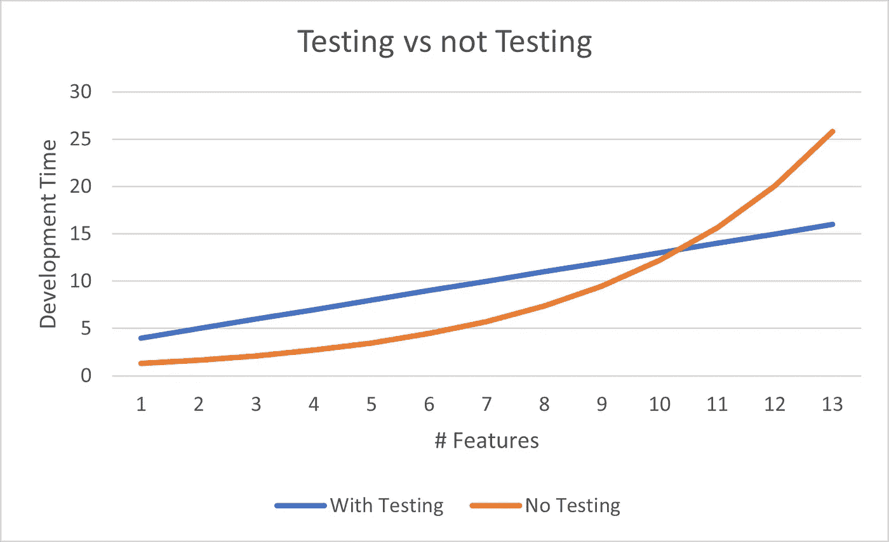

# 不写单元测试的 6 个借口

> 原文：<https://betterprogramming.pub/why-dont-we-do-unit-testing-e0bb55a38aa2>

## 为什么我们不做单元测试呢？

乔纳斯·斯托尔在 [Unsplash](https://unsplash.com?utm_source=medium&utm_medium=referral) 上拍摄的照片

我开始打算写一篇关于单元测试及其背后的哲学和过程的文章。

我想谈一谈完成一个项目的一系列变更所带来的满足感，并且能够放心地部署它们，因为几百个单元测试都通过了，并且在生产中出现不好的事情的可能性极小。

然后我意识到我曾经参与的大多数项目(在计算机行业的漫长职业生涯中)都没有使用任何类型的单元测试。因此，我认为检查不使用单元测试的各种原因以及对这些项目的影响可能是有用的。

# 没有测试工具！

当我在 80 年代开始以编程为生时，这是一个很好的借口。用 pascal 编写航空电子代码，我们确实编写了测试，但几乎必须推出我们自己的测试框架。没有假货，嘲讽，或迪在这里。

但是如果你现在用。没有理由不测试任何重要的代码。

VS 代码内置了一个测试运行器，其他测试运行器也是可用的。假的和嘲讽的框架被广泛使用。我的领域——Dynamics CRM——在 [FakeXrmEasy](https://www.nuget.org/packages/FakeXrmEasy/) 中有一个极好的嘲讽框架。Azure DevOps 中还有出色的 CD/CI 支持，因此单元测试可以(也应该)作为自动化构建过程的一部分运行。

当使用 JavaScript 时，特别是在 Microsoft Dynamics CRM 中，我发现过去很难实现任何类型的单元测试策略。

然而，Scott Durrow 最近的一个系列[展示了前进的道路——使用内置在 webpack 中的 TypeScript，其中包含大量早期绑定、模拟和单元测试，最终向我们展示了生产精简的、经过测试的、高质量的“JavaScript”web 资源的方法。](https://learn.develop1.net/courses/building-javascript-web-resources-using-typescript/dashboard)

我所遇到的大多数 JavaScript 定制可能都是从向表单添加一些定制开始的。

几年后，这种快速解决方案将变成一个庞然大物。大多数 Dynamics CRM JavaScript 代码没有正式的测试或构建过程。

在最坏的情况下，代码的唯一副本在生产 CRM 服务器中。没有源代码库，没有“一个真实的来源”，没有变更跟踪，开发人员可以在浏览器的一个基本文本窗口中编辑代码(在生产服务器上！).

测试意味着确保编辑的 JavaScript 文件在表单加载时不会抛出任何明显的错误。只需做一个快速测试，以确保您正在实现的特性或多或少能正常工作。会好的，不是吗？(**不是！**)。回归测试？那是什么？

Microsoft Power 平台是单元测试仍处于“进展中”的另一个领域。许多组织似乎只是创建了大量的流和强大的应用程序，而没有考虑测试或 ALM。流量断了！谁最后改的！自上周以来有什么变化？这意味着什么？有什么测试吗？。

幸运的是，微软似乎至少已经认识到最近推出的 [Power Apps 测试工作室](https://docs.microsoft.com/en-us/powerapps/maker/canvas-apps/test-studio)可能存在问题。

# 我们没时间做测试了！

客户希望我们现在发货。写点代码就行了。把它拿出来。没有时间讨论这个象牙塔软件工程关于单元测试的废话！

你多久听到一次？

这种方法通常在最初几周似乎有效。然后，当你陷入莫名其妙的错误和副作用的泥沼时，生产力就会下降。更加努力地工作，开夜车。让更多的人进行人工测试！

不一定要这样。我会说你没有时间**而不是**去做测试。

作者图片

看上面的图表。橙色线表示“不测试”项目。最初，不做任何测试可以节省时间。

随着越来越多的特性被实现,(手动)回归测试的负担呈指数增长。每增加一个新特性都会带来额外的回归测试负担。

很快，您的项目将不得不在质量、成本和实现每个新功能所需的时间之间做出妥协。

所以，是的，最初编写一个好的单元测试可能要比手工测试你的特性多花两到三倍的时间。但是经过两三个周期的回归测试，你将会领先——而且只会越来越好。

# 我们发现写测试太难了！

写测试很难，这是千真万确的。编写好的测试更难。不写测试更难(或者你真的喜欢手工测试你的前任 5 年前写的代码吗？？？)

如果你的开发人员不知道如何编写好的测试，他们可能不是好的开发人员。但是他们可以学习。

像几乎所有事情一样，写好的测试是随着实践而改进的。你做得越多，就越快越容易。

让你最好的开发人员编写“模型”测试。经验不足的开发人员可以将这些作为模板来创建他们自己的测试。

创建测试基类。我经常这样做来封装频繁重用的功能，并简化单个测试用例。

# 单元测试是白费力气！

当我花时间写单元测试时，我从不认为这是浪费时间。

如果我写代码，手动测试，我就把*这个* 当成是白费力气。
在一系列手动测试结束时，我有什么？当我进行测试时，代码工作正常，但是如果我改变代码，我就必须重复那些测试(或者更可能不麻烦…)

如果我创建了自动化测试，那么我就有了一套测试，我可以在任何时候重新运行这些测试来验证代码是否仍然按照我在编写时想要的方式工作。

更重要的是，如果我离开了，一个同事接管了这段代码，他们可以用一套测试来验证他们的更改没有破坏它，代码仍然以我期望的方式工作。

**手动测试是白费力气** —手动测试没有剩余价值(并且通常没有文档记录，因此不可重复)。自动化测试可以在未来的几年里被用来证明你的软件仍然像预期的那样工作。

# 但是我们浪费了太多的时间来修正失败的测试！

我提到过写测试很难吗？

单元测试的目的是测试程序的核心功能。如果你不确定你的程序是做什么的(这比你想象的更常见)，那么你将无法编写健壮的测试。

如果一个测试失败了，这意味着你的软件不再做你最初期望它做的事情。这可能是好的——如果您已经更改了需求(但是您不应该首先更改测试来反映新的预期行为吗？).

这也可能意味着你破坏了你的代码。至少你现在意识到有一个问题需要解决。

编写健壮测试的第一步是准确理解***你的软件应该做什么。这不会是件坏事吧？***

***测试驱动设计(TDD)意味着你的代码在设计时至少需要考虑如何测试。我建议你考虑一下可靠的原则和 DRY，以及它们如何应用到你正在编写的代码中。这将总是使你的代码更好，更容易有效地测试。***

***我的经验是，这在各方面都会产生更好的代码。***

# ***但是我们的代码从来不是为单元测试而设计的！***

***最困难的事情之一是试图为现有代码编写测试。它不是为测试而设计的，你经常会因为试图测试没有规格说明的代码而分心——这些代码试图做许多不同的和不相关的动作(还记得 SOLID 中的“S”吗？).
也许代码一开始就没有写好？***

***理想情况下，当你写代码的时候，你写单元测试。试图回过头来为现有的代码编写测试通常会凸显出这样一个事实，即现有的代码设计得很差，并且缺乏对其需求的清晰性。***

***这通常会导致需要修复和更新现有代码。这取决于你在哪里工作，可能被视为好事，也可能不被视为好事！***

# ***结束语***

## ***多少单元测试就够了？***

***作为一个粗略的经验法则，我会说你应该写至少和你测试的代码一样多的单元测试代码。通常更多。***

***编写单元测试仍然比不编写测试，然后在过程的后期花费时间试图调试成品中的错误要快。***

## ***这一切的好处是什么？***

***单元测试的最终结果是一组可以在构建管道中运行的测试，这些测试将阻止任何重大更改被合并到代码中，或者被部署到任何测试或生产系统中。***

***从长远来看，单元测试将会节省您的时间，并允许您以更少的资源更快地交付更高质量的产品。***