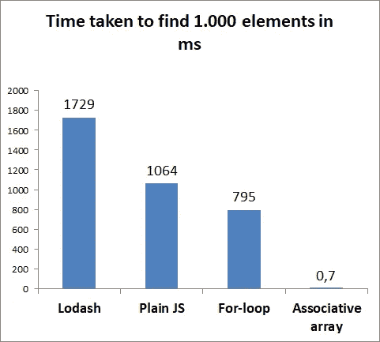
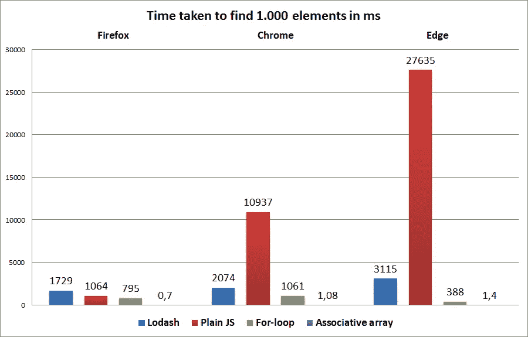
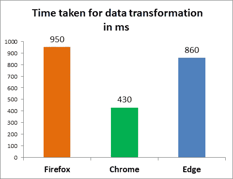
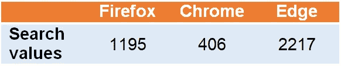

# 为什么高效编程仍然重要

> 原文：<https://betterprogramming.pub/why-efficient-programming-still-matters-c23df76797c2>

## 随着计算机一年比一年快，编写高效代码的重要性似乎降低了。但这是错误的。原因如下

安德里亚·莱特富特在 [Unsplash](https://unsplash.com?utm_source=medium&utm_medium=referral) 上拍摄的照片

一个软件不仅要产生正确的结果，还要在有限的硬件资源下工作。在今天的硬件上，即使是低效的代码也能在几分之一秒内返回结果。这是否意味着程序员不应该为效率而烦恼？在我看来，编写高效的代码仍然和以前一样重要。本文试图通过指出开发高效算法的必要性，并在后面给出一个实际的例子，将注意力重新放在开发高效算法上。

# 如果看起来没有什么不同，为什么它如此重要？

让我们从一个真实的例子开始。想象一下，你正坐在花园里，你的邻居过来给你拿了一条新鲜的面包。它闻起来很美味，你真的想尝一尝。然而，你身上唯一带着的刀是你的瑞士军刀。当然，这可以达到目的，去厨房拿一把专用的切面包刀会花更长的时间来切一片面包。

但是，如果不只是你一个人坐在你的花园里，而是你的整个家庭——每个人都想分一杯羹呢？根据你家庭的大小，先去厨房更有意义。

同样的事情也可以转移到实现解决编程任务的一段代码。实现你想到的第一个解决方案并测试一次通常比思考一个有效的算法要快。然而，你的代码执行得越频繁，如果你的实现能快速完成工作，它就越有价值。这是真的，尤其是如果许多软件被放在一起成为一个大的应用程序，因为这个应用程序的所有低效部分的开销将会增加。

如果你仍然不相信，让我给你两个最新的例子，高效的编码可以立即得到回报。否则，请随意跳到下一段。

1.  虽然目前的智能手机提供了上世纪 90 年代超级计算机的计算能力，但它们仍然必须应对一个关键的限制:电池寿命。如果你的移动应用或网页耗尽了手机电池，你的用户不会喜欢，会避开。
2.  有了现代云基础设施，客户再也不用为闲置的服务器付费了。有了无服务器云服务，这甚至达到了一个新的水平:只有应用程序在某个服务器上执行时消耗的资源才收费。因此，从第一次执行开始，更高效的应用程序实现将立即节省真正的资金。

# 让我们做些测试

在谈了很多为什么考虑算法的效率是有意义的之后，让我们最后来看看一些代码示例、数字、图表和其他看起来科学的东西。对于我的测试，我选择了一个简单的任务:在 JavaScript 数组中找到一个元素。

更简单的是，数组的每个元素都是一个数字。如果你认为这个任务太简单了，不能更有效地改进或实现，那么看看下面用 TypeScript 编写的四个不同的函数，它们或多或少都做同样的事情。

## **1。使用 Lodash _。寻找()**

第一个函数利用了一个流行的 JavaScript 库 Lodash。这个库提供了各种帮助函数来处理不同的数据结构，比如对象、数组、字符串等等。解决我们的任务， *_。find()* 做的正是我们需要的——它在给定的数据结构中找到一个元素。有了这个助手函数，实现非常简单，只需要一行代码。

虽然看起来真的很简单， *_。find()* 对数组和对象都有效。这听起来更好，但是考虑到效率，对我们的任务来说也可能更糟。因为对象和数组都被接受为 *_ 的输入参数。find()* ，这意味着在 Lodash 内部，需要对每个函数调用进行一些区分，以检查传递的数据结构的类型。

这自动给计算增加了一些开销。因此，我希望这个方法比其他方法运行得慢。

## **2。使用普通 JS 数组函数。find()**

第二个函数看起来与第一个非常相似，但是使用了普通的 JavaScript 数组函数，而不是 Lodash。此外，编码和 Lodash 一样简单。然而自从*之后。find()* 只对数组有效，Lodash 的灵活性带来的开销在这里不存在。此外，浏览器供应商可能已经在本地实现了这些 JavaScript 数组函数，或者至少进行了高度优化。我假设这个实现比使用 Lodash 的实现运行得快得多。

## **3。使用传统 for 循环**

即使第三个函数看起来比前两个更复杂，它也一样简单。它只是使用一个常规的 for 循环来遍历传递的数组的所有元素，直到找到我们正在寻找的元素。

一般来说，这个实现只是作为其他实现的某种参考。由于没有使用特殊的算法，我希望它比 Lodash 实现运行得稍微快一点，这也是因为我假设 Lodash 在内部做了或多或少相同的事情，但是必须做额外的计算才能使它也适用于对象。与 JS-array 函数相比，我认为它会慢很多，因为它还没有经过优化或实现。

## **4。使用为任务定制的特定数据结构**

高效的实现并不总是完美的算法。在许多情况下，选择合适的数据结构可以进一步提高整体性能。让我们为我们的任务找到一个适合它的数据结构。我们可以使用映射或关联数组来代替数组。或者，在 JavaScript 中叫做:一个对象。

这正是第四个函数的作用。它接受一个对象，其中的键是数组编号的字符串表示。这些值就是简单的数字。因此，这个实现只需要将应该找到的数字转换成一个字符串，然后检查对象是否包含这个字符串。显然，将数组转换为对象会产生一些开销。但是这一次，只要转换完成一次，我们的实现就可以根据需要随时调用，而不会产生任何额外的开销。在同一个数据集上调用它的次数越多，回报就越多。

当忽略初始数据转换所需的时间时(目前)，我假设这种实现优于其他实现。

## 生成测试数据

为了获得可比较的结果，所有四个函数都将针对相同的数据集进行测试。因此，{0，…，1，000，000，000}中的前 1，000，000 个随机数被生成并存储在一个数组中。该数组将用于搜索。之后，生成相同范围之外的另外 1000 个随机数，并用作第一个数组中要搜索的值。对于我们的第四个实现，大数组的元素也被立即添加到关联数组中。在运行测试时，只花费和比较查找具有其中一个功能的元素所需的时间。创建测试数据所花费的时间被忽略了(目前)。

# 给我一些图表

这四个函数中的每一个都被调用一千次，每次调用一个随机生成的搜索值。起初，测试是在 Firefox 上进行的。让我们来看看结果:

这些结果大部分符合我的假设。Lodash 最慢，关联数组最快。但是传统的 for 循环比 JS-array 函数快得多的事实有点令人惊讶。Firefox 工程师在实现 JS-array 函数时可能做得不好吗？为了研究这一点，还对铬和 Edge(非铬)进行了测试。请记住，尽管每个被测试的功能都使用了相同的测试数据，但不能保证三个被测试的浏览器都使用相同的数据。因此，该测试在每个浏览器中运行多次，中间结果如下图所示。

这些结果现在又是一个惊喜。与 Chrome 和 Edge 相比，Firefox 工程师在实现所用的 JS-array 函数时确实做得不错。此外，这些结果证明我关于 Lodash 最慢的假设是错误的。在 Chrome 和 Edge 上，Lodash 实现的运行速度比 JavaScript 数组函数快得多，Edge 中 for-loop 的性能甚至比在 Firefox 上更令人印象深刻。它完成速度比 Loadash 快 8 倍，比 JavaScript 数组函数快 71 倍，令人惊讶**。**

另一个有趣的结果是，在这个特定的任务中，Firefox 似乎轻松胜过 Chrome。但这只是故事的一半，因为 Chrome 的自动优化似乎不会在第一次测试中发挥作用——尽管所有四个实现都被调用了 1000 次。更详细的评估即将出炉。

当 Edge 对抗 Firefox 时，只有 for-loop 在 Edge 上运行得更快(快两倍)。其他三个实现在 Firefox 上完成任务所需的时间比 Edge 少得多。

总的来说，目前看来，定制的数据结构在所有浏览器中都占了上风。但是我们仍然没有考虑将数组转换成必要的数据结构所需的额外时间。下图显示了每个浏览器执行此数据转换的平均时间。

如果我们现在将这些值与在这个数据结构中找到 1，000 个搜索值所花费的时间相加，我们最终可以将它与其他函数进行比较。这样做时，只有在 Chrome 上，特殊的数据结构比其他实现完成得更快。然而，如前所述，使用这种包括必要转换的数据结构将受益于对同一组数据的每个额外的函数调用。

在所示的测试中，每个函数在同一组数据上被调用了 1000 次。剩下要计算的是，为了使最初的数据转换(第四个实现不可避免地要工作)有所回报，需要多长时间调用一次这个函数。假设对于所有三个实现，每个函数调用花费相同的时间，下表显示了在第四个实现比其他实现完成得更快之前它所花费的搜索值的数量。

数据结构有回报之前的搜索值的数量

这是否是这里测试过的最好的实现，取决于在一组不变的数据上您期望的函数调用或搜索值的数量。大多数时候，这是很难预测的。也许使用传统的 for 循环是解决这个问题的最佳选择。

然而，仍然没有一个普遍的结果。到目前为止，所有的计算和测试都直接依赖于初始数组的大小、数组中存储的值的类型等等。

# 结论

有了所有这些依赖性和不同的结果，整个评估似乎没有明确的赢家——无论是关于不同的实现还是使用的浏览器。然而，由于这不是本文的初衷，因此确实有一个赢家。它是高效编程意识的(再)创造。

所有这些结果都表明，即使是小而简单的更改也会对实现的性能产生巨大的影响。结果之间的差异和对特定环境的依赖表明，即使对于一个看起来简单的任务，通常也没有通用的最佳实现。正因为这个原因——没有一种解决方案可以最好地解决所有任务——对于每一段新创建的代码，思考哪种实现适合您当前的任务是绝对必要的。