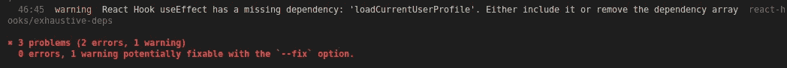

# 如何在 React 中删除 useEffect ESLint 警告

> 原文：<https://betterprogramming.pub/why-eslint-hates-your-useeffect-dependencies-react-js-560fcac0b1f>

## 不使用`eslint-disable-line`

照片由 [Isaac Wendland](https://unsplash.com/@isaacwendland?utm_source=medium&utm_medium=referral) 在 [Unsplash](https://unsplash.com?utm_source=medium&utm_medium=referral) 上拍摄。

你是 React 开发者吗？是否使用挂钩和功能组件？你使用 ESLint 来确保你的代码不做任何怪异的事情吗？如果是，那么我敢肯定你在使用`useEffect`时遇到过`exhaustive-deps` ESLint 警告。

你以前见过这个错误吗？

在这篇文章中，我们将看看这个警告是什么时候触发的，以及正确的解决方法。

# ESLint 什么时候触发这个警告？

为了理解什么时候触发`exhaustive-deps`警告，让我们看一些代码:

每当要显示其概要文件的用户的 ID 发生变化时，上面代码中的`useEffect`就会加载用户的概要文件数据。现在，让我们站在 ESLint 的立场上分析一下`useEffect`呼叫。

## **`**useEffect**`**从 ESLint 的角度看****

*   **每当`userId`改变时，加载配置文件。**
*   **但是等等！如果我们必须加载概要文件的方法的实现发生了变化，该怎么办？**
*   **我必须警告用户！**

**从 ESLint 的角度来看，确实有道理！我们知道在这种情况下`loadCurrentUserProfile`的实现不会改变，但是 ESLint 不会。然而，这里 ESLint 是正确的。在某种程度上，如果`userId`改变了，那么`loadCurrentUserProfile`的实现(或者说`loadCurrentUserProfile`加载数据的方式)也会改变。这是因为`loadCurrentUserProfile`被绑定到了`userId`。**

**我们避开了这个小细节，通过在依赖数组中直接添加`userId`来使`useEffect`工作。这个概念过一会儿会变得更清晰，所以请多包涵。**

# ****解除警告****

**现在，让我们看看如何删除这个警告。不，我们不会通过在依赖数组行上添加一个`//eslint-disable-line`来删除警告。我们这里不喜欢这种类型的黑客。不管怎样，我们已经知道 ESLint 抱怨是因为`loadCurrentUserProfile`不在`useEffect`依赖数组中。所以，让我们给 ESLint 它想要的！**

**我们所做的就是在依赖数组中添加`loadCurrentUserProfile`，然后嘭！这个警告现在已经消失了。我们现在可以睡个安稳觉了。但也不尽然！仅仅取消警告是不够的。这种解决方案导致了新的问题。**

# ****新问题****

**在讨论这个问题之前，让我们通过陈述一些事实来确保我们意见一致。重新呈现`Profile`组件可以被认为是简单地调用函数。此外，每当您调用一个函数时，它内部声明的所有其他函数(在本例中是`loadCurrentUserProfile`函数)都会被重新创建。因此，每当 React 重新呈现`Profile`组件时，`loadCurrentUserProfile`将指向一个新的函数。**

**我们的新问题是`loadCurrentUserProfile`现在会改变或者在*上被重新创建，无论*是否被改变。让我们一步步来看这个问题:**

*   **组件已安装，并且`useEffect`正在运行。**
*   **`useEffect`回调调用`loadCurrentUserProfile`，后者又调用`setProfileData`。**
*   **在没有任何条件的情况下，每次重新渲染时发生变化的函数和变量将导致`useEffect`循环。我们知道任何状态变化都会导致组件的重新呈现。如前所述，这种重新渲染改变/重新创建了`loadCurrentUserProfile`。**
*   **`loadCurrentUserProfile`中的这一变化重新运行了`useEffect`，因为它在依赖数组中。这会导致对 API 的额外的、不必要的调用。**
*   **这种循环将永远重复下去，注定要遭遇与西西弗斯相似的命运。**

# **正确移除警告**

**最后，让我们来看看如何正确地解决这个问题:**

**以下是我们所做的更改:**

*   **我们将`loadCurrentUserProfile`包装在一个`useCallback`钩子中，并将`userId`作为依赖项。**
*   **我们改变了`useEffect`的依赖数组，只包含了`loadCurrentUserProfile`。**

**首先，如果您不知道`useCallback`做什么，它确保传递给它的函数不会在重新呈现之间被重新创建，除非依赖数组中的任何内容发生了变化。这意味着只有当`userId`改变时`loadCurrentUserProfile`才会改变。这与我上面提到的每当`userId`改变时`loadCurrentUserProfile`改变的实现有关。我们用`useCallback`来讲述同样的事情来反应。**

**这里需要注意的一点是`useCallback`也包含一个依赖数组。这里讨论的东西也可以应用到`useCallback`和`useMemo`钩子中的依赖数组。**

**第二，`useEffect`现在仅在`loadCurrentUserProfile`改变时触发。这里我们不在依赖数组中指定`userId`，因为`loadCurrentUserProfile`已经依赖于`userId`。相反，我们告诉 React 每当加载当前用户配置文件的实现发生变化时，就重新加载当前用户的配置文件。从用户和棉绒的角度来看，这都是有意义的。**

**理解组件中不同数据之间的依赖关系和关系，以及它们是如何联系在一起的，有时会有点复杂。然而，随着你不断遇到这些问题并解决它们，你会对它们有更好的理解——就像处理其他问题一样。**

# **结论**

*   **始终指定依赖数组中使用的每个变量。**
*   **在没有任何条件的情况下，每次重新渲染时发生变化的函数和变量将导致`useEffect`循环。**
*   **如果您需要使用在组件内部创建的函数作为依赖项，将它包装在一个`useCallback`中。对于非函数的值,`useMemo`相当于`useCallback`。**

## **一些提示**

*   **将`useCallback`用于函数，将`useMemo`用于传递给子组件的非原始值也是一个好主意。这确保子对象不会在不必要时重新渲染或运行自己的钩子。**
*   **您可以在自己的定制钩子中抽象出一些钩子逻辑。这将使代码模块化，可重用，并且更容易管理。然而，那是另一个时间的话题。**