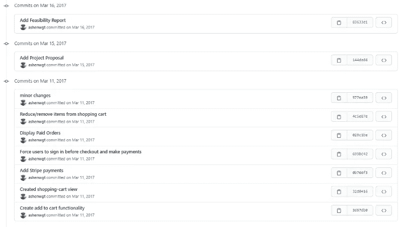
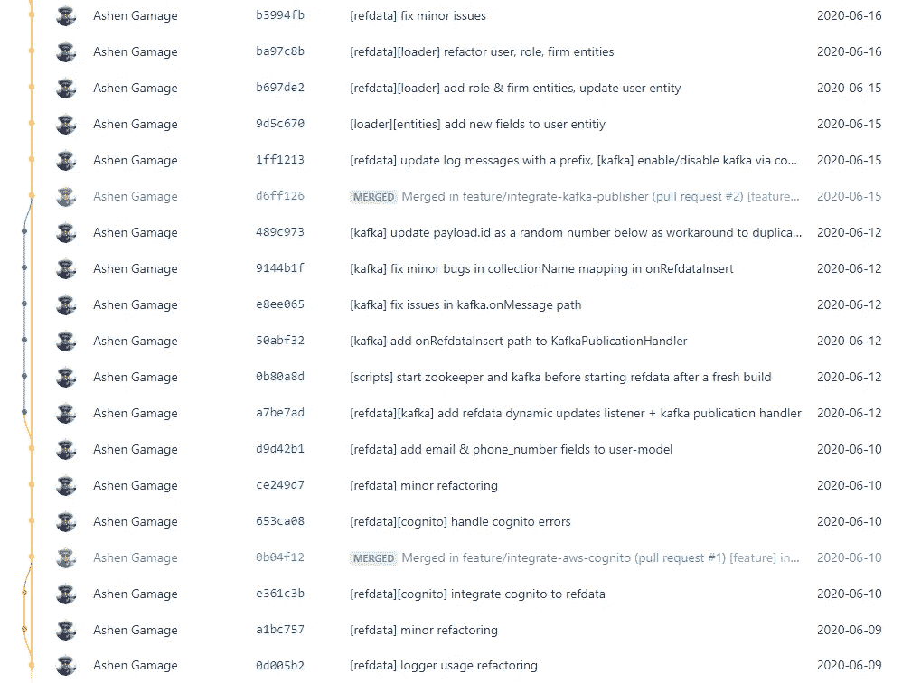
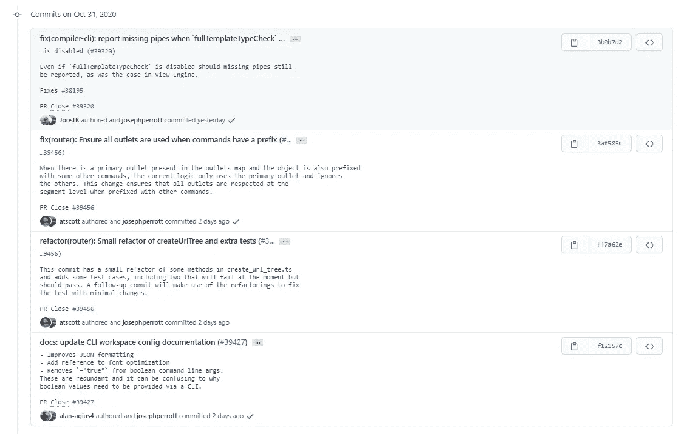

# 为什么每个 Git 提交消息都必须包含它的提交上下文

> 原文：<https://betterprogramming.pub/why-every-git-commit-message-must-include-its-commit-context-1171c0b2f710>

## 提高 Git 提交日志的清晰度和可搜索性的技巧



这是我在 2017 年建立的一个购物车应用程序。当时，我没有看到提交消息的重要性，因为它们只是由我完全管理的一次性项目。

# 问题

Git 没有为提交消息定义官方标准/开发者指南，所以提交消息格式通常取决于开发者的判断。有时，这种安排会让您的 Git 提交日志变得一团糟(尤其是当来自多个背景和团队的开发人员贡献相同的源代码，并且没有遵循共同的约定时)。

```
$ git log --oneline -10xxxxxxx unit tests updated - good to go
xxxxxxx New customers added
xxxxxxx renew certificates - fullchain.pem & privkey.pem
xxxxxxx Merge branch 'xxxx' of bitbucket.org:xxxxx/xxx-xx into xxxx
xxxxxxx sample response added to swagger spec
xxxxxxx Syntax error corrected
xxxxxxx division by 100 change added to loans
xxxxxxx Updated Units
xxxxxxx Updated Users
xxxxxxx collateral details no account handling changed temporarily
```

为了解决这个问题，大多数团队都维护了一套 Git 指南。本文为您的下一个项目提出了这样一个约定。

# 最佳实践

*   提交总结:始终使用命令式现在时。不要大写提交消息的第一个字母。不要在你的文章结尾使用句号。
*   提交上下文:使用 1-3 个前缀来描述提交的上下文。选择关键词时要小心。建议在开始时定义一组允许的关键字。一个好的关键字必须是通用的和可重用的。
*   TicketID(可选):如果您使用项目管理工具(如 [JIRA](https://www.atlassian.com/software/jira) )跟踪变更日志和问题，您可以将它与 Git repo 集成，并开始将 tickets 自动链接到提交消息中。这样，您就可以将所有重要信息转移到票据中，并减少冗长的提交描述。这在企业软件团队中是非常常见的做法。
*   提交描述(可选):在开源和其他关键项目中，团队更喜欢使用 Git 作为真实的单一来源，并维护详细的提交日志。对于它们，可以添加额外的解释作为提交消息描述(例如，参见[角度提交指南](https://github.com/angular/angular/blob/master/CONTRIBUTING.md#commit))。如果您以前没有使用过提交描述，请注意有两种方法可以添加它们——通过 CLI ( `git commit -m "commit summary" -m "description..."`)或通过 [GUI 客户端](https://git-scm.com/downloads/guis)(这是最简单、最干净的方法)。



这就是我今天写提交消息的方式。在这个例子中，我将提交上下文与提交摘要一起使用。这种方法为 Git 提交日志提供了清晰性和可搜索性，任何人都可以很容易地理解每次提交的影响——甚至在将来。我的队友也采用了这种方法。



这是来自[角度存储库](https://github.com/angular/angular/commits/master)的最新提交历史。看看他们如何很好地使用提交描述、提交范围、提交摘要和自动链接的票据 id。

# 通用模板

## 案例#1 —提交但没有描述

```
[module|type][function|scope] commit summary #[ticketID](#)e.g.
[api][users] add GET & POST endpoints
[test][users] update unit & REST-based tests
[scripts] add env flag to specify deployment environment 
[libs] migrate to node@12.14.1 
[ci] release v2.1.34 for QA #[GT-208](#)
```

*   如果您的团队/组织要求您将每个提交与一个票证 ID 绑定，您可以考虑在提交消息的开头提到它。

```
#[ticketID](#) [module|type][function|scope] commit summarye.g.
#[GT-202](#) [api][users] add GET & POST endpoints
#[GT-202](#) [test][users] update unit & REST-based tests 
#[GT-201](#) [scripts] add env flag to specify deployment environment 
#[GT-205](#) [libs] migrate to node@12.14.1 
#[GT-208](#) [ci] release v2.1.34 for QA
```

## 案例#2 —提交描述

```
[module|type][function|scope] Commit Message Subject #[ticketID](#)Commit Message BodyCommit Message Footer
```

# 示例场景

## **微服务/单报告**

```
[service][module|type][function|scope] commit summarye.g.
[auth][ldap] log incoming requests with source IP
[apigw][connectors] add reconnect logic
[gui][certs] renew self-signed certificates
```

## **Monolith/MVC 回购**

```
[module|type][function|scope] commit summarye.g.
[models][users] add user entity
[handlers] log all incoming requests 
[routes] setup http routes with custom configs
```

## **DevOps 回购**

```
[tool|type][script|scope] commit summary (#ticketID)e.g.
[k8s][specs] add podAntiAffinity for all StatefulSets
[tf][aws] parameterize the AWS env alias for resources
```

# 利益

## 1.基于上下文的可搜索性

```
e.g. (a) Search for latest changes affecting to Users entity$ git log --oneline -5 --grep="\[users\]"xxxxxxx [test][users] add new unit tests for managers & customers
xxxxxxx [seed_data][users] add customers data
xxxxxxx [rest_api][users] add getAllUsers endpoint to api spec
xxxxxxx [seed_data][users] add managers data
xxxxxxx [seed_data][users] add internal staff data-------------------------------------------------------------e.g. (b) Track dependency/library version updates $ git log --oneline -5 --grep="\[libs\]"xxxxxxx [libs] migrate to node@12.14.1 #[GT-305](#)
xxxxxxx [libs] link solution paths with auth-core@0.3.19 #[GT-272](#)
xxxxxxx [libs] add typescript@3.1.2 as devDependency #[GT-246](#)
```

## 2.便于理解每个提交的影响

```
[ci] release v2.4.30 #[GT-218](#)
[apigw][config] enable https and wss
[apigw][test] complete tests for incoming request validations
[apigw][auth] integrate auth header check
[apigw][handlers] add reconnect and throttling logic #[GT-182](#)
[auth][ldap] implement ldap support
```

# 结论

Git commit 消息不是火箭科学，但是看到人们不理解这个奇妙特性的目的是很悲哀的。如果你坚持写有意义的提交消息，它将为每个人节省时间。

请继续关注下一个编程技巧。在那之前，编码快乐！

## 关于软件开发的其他有趣的媒体文章……✍

[](https://medium.com/platform-engineer/microservices-design-guide-eca0b799a7e8) [## 微服务设计指南

### 大家都听说过微服务。但是你知道怎么设计一个吗？

medium.com](https://medium.com/platform-engineer/microservices-design-guide-eca0b799a7e8) [](https://medium.com/platform-engineer/understanding-jvm-architecture-22c0ddf09722) [## 理解 JVM 架构

### 理解 JVM 架构和 Java 在幕后是如何工作的，对每个 Java 来说都是一项重要的学习…

medium.com](https://medium.com/platform-engineer/understanding-jvm-architecture-22c0ddf09722) [](https://medium.com/platform-engineer/web-api-design-35df8167460) [## HTTP 和 Websockets:了解当今 web 通信技术的能力

### 决定为你的下一个 web API 设计选择什么

medium.com](https://medium.com/platform-engineer/web-api-design-35df8167460)