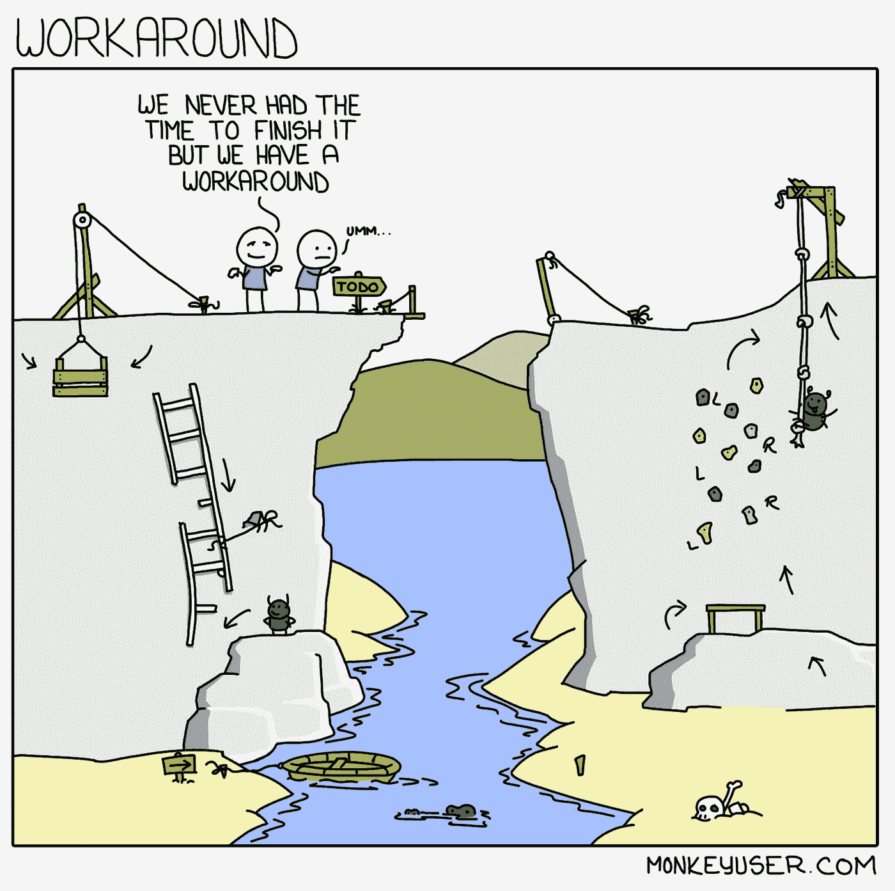
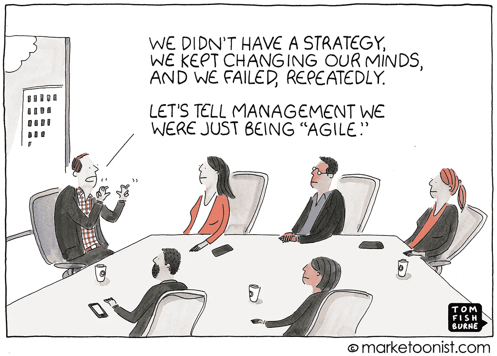

# 为什么每个初级开发人员都需要高级开发人员

> 原文：<https://betterprogramming.pub/why-every-junior-developer-needs-a-senior-developer-2cd989058e06>

## 避免不可维护的代码、糟糕的项目和糟糕的期望

在 [Unsplash](https://unsplash.com/search/photos/leader?utm_source=unsplash&utm_medium=referral&utm_content=creditCopyText) 上由[米米·蒂安](https://unsplash.com/@mimithian?utm_source=unsplash&utm_medium=referral&utm_content=creditCopyText)拍摄的照片

高级开发人员指导初级开发人员的概念通常被认为对初级开发人员有利。然而，将高级开发人员与初级开发人员配对不仅有利于初级开发人员。对于有意将两个工程师配对的公司来说，这实际上是非常有益的。

从事多个项目的高级开发人员对如何开发可维护的系统和代码有着更深刻的理解。他们对哪些项目值得做有很好的认识，并且可以帮助管理涉众的期望。所有这一切都归结于他们能够看到周围的角落，并阻止初级工程师构建过于复杂的软件，并做可能对公司影响很小甚至没有影响的工作。

这一切都影响着公司的底线。然而，似乎并不是每个公司都这样做。我记得我的第一份工作，当时我是团队中唯一的技术人员，必须支持五名分析师。老实说，我怀疑我构建的任何东西今天是否还在维护，因为我经常只是为了满足一些功能需求而构建，那里没有人可以为设计、可维护性等提供输入。(幸运的是，我的下一份工作改变了这一点。)

也就是说，我想列出初级开发人员和高级开发人员配对非常重要的三个原因。同样，这不仅仅是为了让初级开发人员成长；这是为了确保正在构建的软件是可持续的，并且具有对公司有益的正确特性。

# 了解什么是可维护的

【https://www.monkeyuser.com/2018/workaround/ 

你曾经在你的电脑上建立过自动化的过程、网站或框架吗？现在，你有没有把同样的新系统应用到一个更大的系统中，在这个系统中可能有成千上万的用户。那……你是不是已经要维护好多年了？

如果你有，你就知道开发一个可持续的系统要困难几个数量级。你必须不断做出有利有弊的设计决策。有时，由于时间或技术限制，您可能需要规避某些限制。这可能导致技术捷径和一些技术债务。所有那些你可能走的小捷径和你没有考虑清楚的糟糕的设计决策会很快回来咬你一口(就像在[切尔诺贝利](https://medium.com/better-programming/chernobyl-the-true-cost-of-technical-debt-8307e6f4d53c)发生的那样)。

即使是做一些小事情，比如将整数列改为浮点型，也可能需要一周的时间来寻找所有引用的字段，更新它们，然后运行测试。

创建可维护和可持续的代码都是从好的设计开始的。然而，许多初级开发人员要么开始编码，要么忘记考虑设计的重要方面。在这里，高级开发人员可以介入并帮助指导初级开发人员进行设计评审和结对编程。

有一个高级开发人员可以洞察初级开发人员的设计中可能存在的陷阱。他们不会看到每一个问题，但他们可以帮助思考低年级学生错过的边缘案例。反过来，这也教会了初级开发人员他们将来需要考虑的事情。

# **帮助管理预期**

我们许多在大学里开发第一个程序的人通常会在几周内完成网站、应用程序和[兼职项目](http://www.acheronanalytics.com/acheron-blog/using-python-to-scrape-the-meet-up-api)。然而，一旦我们开始在这个行业工作，感觉就像过去需要几天或几周的事情突然开始需要几个月。突然，项目管理的概念变得非常重要。

简单的变更或更新请求需要的不仅仅是更新代码。通常需要做一个完整的分析来看一个变化会如何影响下游的模块。突然之间，原本快速简单的代码更改会花费更长的时间，因为它可能有多个下游依赖项。

能够管理这些期望有助于确保开发团队不会过度承诺时间表。我记得原本需要几个月时间的项目，其有希望的时间表需要几周时间。

问题是你会遇到这样的问题，比如人们去度假，运营任务碍手碍脚，会议，以及其他正常的日常工作，这些工作可能看起来很快，但随着时间的推移会大大延长。

高级开发人员更习惯于这些干扰，可以提出更现实的期望。不要误解我们，管理层可能仍然会将时间表缩短一半。但至少你努力了！

# 知道什么是糟糕的项目

[https://marketoonist.com/2018/05/being-agile.html](https://marketoonist.com/2018/05/being-agile.html)

知道什么可能是糟糕的项目是一项很难掌握的技能。这就是为什么初级开发人员不知道什么时候他们被要求做一些对公司影响很小甚至没有影响的事情，或者被证明太大而无法自己承担的事情。

糟糕的项目通常并不明显。他们可以从新董事认为会改善公司的一次性计划开始，即使它与当前的目标不一致。这可能是一个炒作项目，一些销售人员参加了一个会议，听说了一些新的人工智能特性，现在要求工程团队将它添加到他们的产品中。

无论来源于何处，这些项目都会导致不必要的压力，并且通常不会为最终用户提供价值。有一个高级开发人员能够发现糟糕项目的一些特征，并向他们展示为什么项目没有有效利用时间，这将有助于提高公司的底线。

# 结论

总的来说，有很多其他很好的理由将初级和高级开发人员结合在一起。但是，作为一个初级开发人员，没有高级开发人员作为指导，这不仅不利于我的成长，也不利于我对公司的影响。很难判断你什么时候做了一个错误的决定，因为你从来没有经历过。有太多的假设和决定需要工程师来完成，如果没有经验来指导你，你会很快发现自己处于一个糟糕的境地。同样，这不只是初级开发人员的成本；这让公司付出了代价。