# 为什么每个人都应该加入智能合约或区块链黑客马拉松

> 原文：<https://betterprogramming.pub/why-everyone-should-join-a-smart-contract-or-blockchain-hackathon-af3072d7aaa2>

## 区块链生态系统的实验时机已经成熟。上车

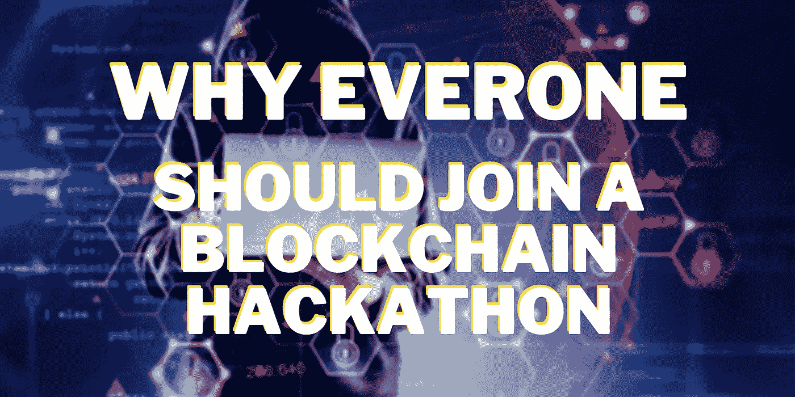

伊斯玛基洛夫途经[Canva.com](http://canva.com/)

是的，你没看错。*每个人*都应该加入这些黑客马拉松。参加黑客马拉松有很多[理由](https://www.hackworks.com/en/benefits#:~:text=Hackathons%20are%20proving%20grounds%20for,problem%2Dsolving%20juices%20of%20developers.&text=The%20time%20limit%20in%20a,concepts%20down%20to%20actionable%20solutions.)，这些理由不应该被低估。但是区块链/智能合同黑客马拉松有一些特别之处。

外面的非技术人员可能已经掩饰了这一点，但我希望我对每个人的强调让你留在了这里。黑客马拉松项目不仅仅是编码。虽然一个纯粹的软件工程师可能是编码方面的怪物，但他们可能没有成功项目所需的所有工具。创意产生、研究、营销和特定行业的知识都可以让一个项目大放异彩或一落千丈。更不用说，也许你总是很好奇，想知道更多关于这个疯狂的智能合同的想法。

如果你仍然需要知道为什么智能合约和区块链是改变生活的技术，看看这个视频，它简单地解释了[区块链](https://www.youtube.com/watch?v=ufVyX7JDCgg&amp;t=3s)和智能合约，以及它如何变得更强大，对我们今天更重要。

# 1.了解智能合同技术的前沿进展—从源头开始

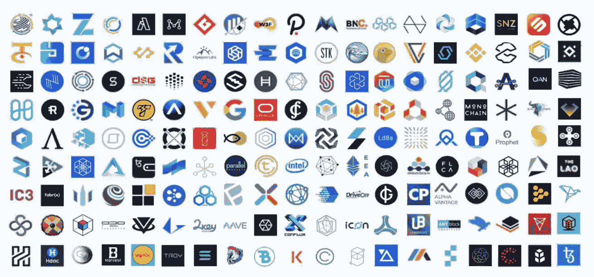

图片来自[https://chainlinkecosystem.com/factsheet/](https://chainlinkecosystem.com/factsheet/)

通常，学习的最好方法是投入进去。对于大多数黑客马拉松来说，吸引人的是这是一个专门的时间，从你的正常生活中留出，跳入一个令人兴奋的新世界。你可能不知道你在做什么——你可能只是对技术感兴趣——但是在一个周末、一个星期、一个月之后，或者无论黑客马拉松持续多长时间，你都可以获得一些惊人的技术技能。

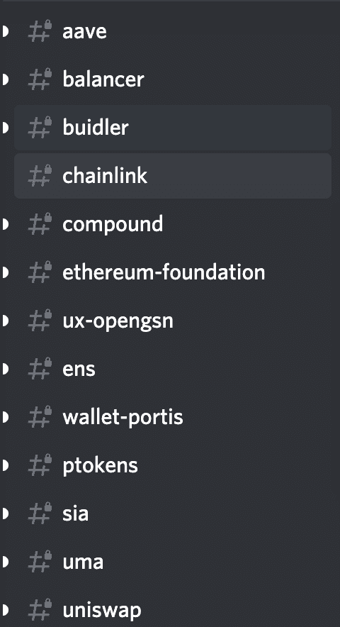

作者形象

区块链特别有让你入门的工具。从简单的[文档](https://docs.chain.link/docs/request-and-receive-data)、[教程](https://blog.chain.link/how-to-use-chainlink-with-truffle-2/)，到仅仅询问技术来源。如果 node.js 专家能出现在每个黑客马拉松上，那该有多棒？你将不再需要花费数年时间在网络上搜索你的 npm 错误，而你所需要做的可能只是再次运行`npm install`或其他什么！

每一个准备回答你的任何问题并帮助你走向成功的赞助商或技术常常会有分歧。还记得在大学里，教授们有办公时间，但是你从来没有去过，因为那是在校园的另一边。好吧，想象一下，那些办公时间就在你的指尖，希望以任何可能的方式帮助解决你的项目。

另外，如果你带着 [Chainlink](https://chain.link/) 项目参加黑客马拉松，你可以和我说话！

一旦你对智能合约/区块链有了一点了解，你就会立即加入被称为区块链工程师的精英工程师群体。[2018 年，全球约有 105，000 人](https://paybis.com/blog/how-many-blockchain-developers-are-there/)。

这大约是地球上 1820 万软件工程师的 0.6%。本质上，你立即加入了软件工程师的行列！

你甚至不需要完成整个项目。你可以只是出现，加入社区，学习，建立一些有趣的东西，然后离开。

# 2.在智能合同世界中，项目从有趣的想法到真正的公司很快

在其他黑客马拉松中，这通常是这个想法消失的地方。外面的竞争如此激烈，你的想法很有可能已经实现了。在你有一个像样的项目之前，推进它可能是一件苦差事。

不是区块链黑客马拉松。

社区的支持意味着，如果你想迈出创业的第一步去创造一些了不起的东西，工具就在那里等着你。区块链世界渴望创造性的想法从杂草中冒出来，推动世界进入第四次工业革命。这里列出了 44 个项目创意，供任何人尝试——这些只是皮毛。

由于这种需求，项目通常很容易从想法变成现实。让我们来看几个例子。

## 一起游泳

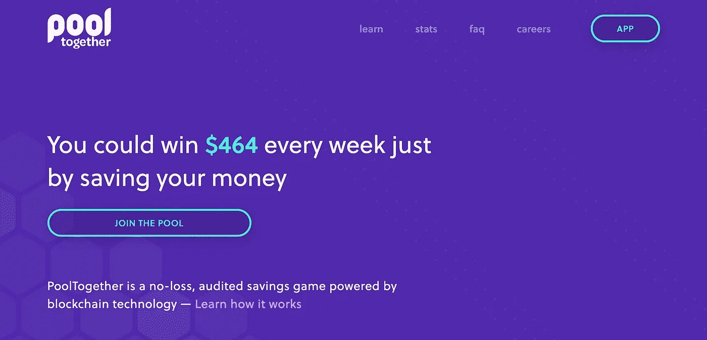

图片来自[https://www.pooltogether.com/](https://www.pooltogether.com/)

这支队伍参加了 2019 年的 ETH 丹佛黑客马拉松，你可以在这里看到他们的[原创投稿](https://kauri.io/pooltogetherus/26f56112325149ef83755a603f2beef0/a)。从卑微的出身开始只是一个想法，他们[最近获得了 100 万美元的投资](https://www.coindesk.com/pooltogether-defi-app-announces-1m-investment-after-no-loss-lottery-payout-tops-1k)，此前戴为他们的项目锁定了 100 多万美元。

一年之内，他们的投资从零增长到了 100 万美元！

## Instadapp

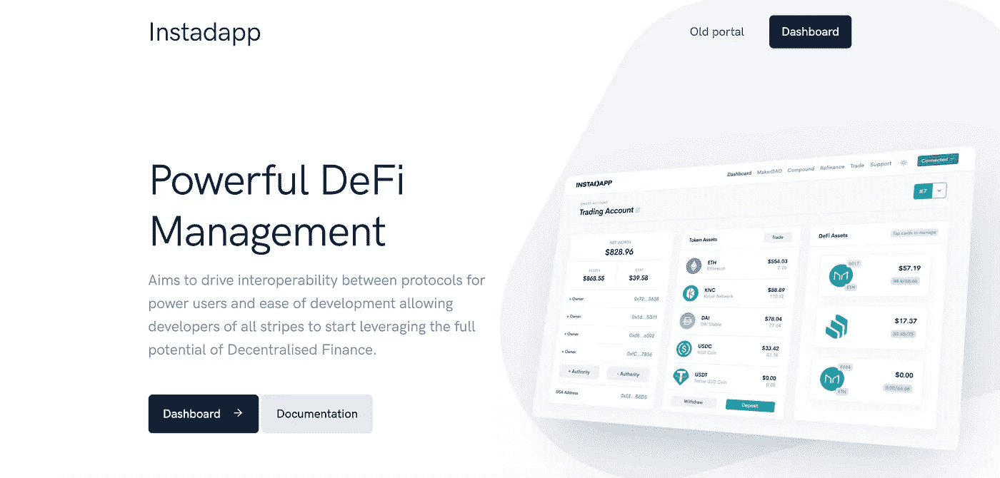

图片来自[https://instadapp.io/](https://instadapp.io/)

另一个 ETH 品牌的黑客马拉松项目，他们在两年前的 2018 年刚刚提交。点击查看他们提交的[。虽然起点很低，但现在你可以在这个星球上的 50 个 DeFi 项目中找到他们，并为他们的项目锁定了 650 万美元。](https://devfolio.co/submissions/instadapp-using-makerdao-kyber-network-and-embark-framework)

## xDai

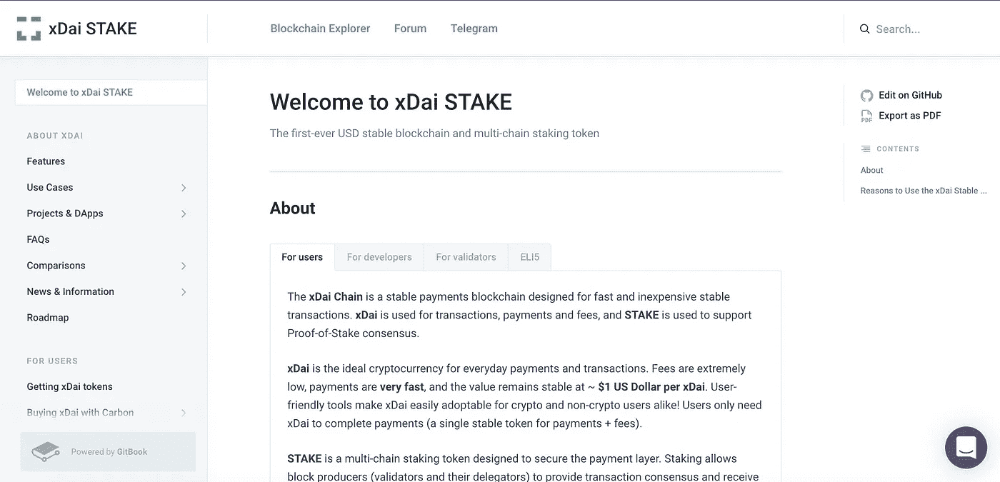

图片来自[https://www.xdaichain.com/](https://www.xdaichain.com/)

建于 2018 年，这是另一个成立不到两年的项目，在 DeFi 的 50 个项目中名列前茅。

我需要继续吗？

# 3.与其他才华横溢、雄心勃勃的人联系，更快地将想法变为现实

Alex Kotliarskyi 在 Unsplash 上拍摄的照片

区块链社区是我们参与过的最有吸引力的社区之一。一切都是新的，每个人都很好奇，并试图建立令人敬畏的项目，使世界变得更好。

当你出现在这些黑客马拉松上时，通常是人们寻找团队的时候。当你和你可能从未见过的人在一起时，强迫自己走出去认识新的人通常会更好。

这些可以转变成改变生活的经历，形成一生的朋友和同事。正如我提到的，其中一些人甚至可能不是技术人员，只是他们领域的专家。

大多数做得好的项目，一般都有一些人对区块链一无所知，或者知之甚少。也许他们是产品经理、前端开发人员、研究员、领域专家或者我上面说过的任何人，在黑客马拉松上总有你的位置。

# 4.赞助商只是在给钱

区块链是一个如此新的空间，他们总是在寻找有趣的人加入进来，尝试新事物。通常，赞助商会出现并说“如果有人用我的技术做了一些很酷的事情，我会给他们 5000 美元”。这些被称为奖金。

是的，就是这么简单。

有些人甚至以此为生——看看这个家伙[是如何从区块链黑客马拉松中赚到超过 10 万美元的。](https://medium.com/swlh/how-i-made-100-000-from-blockchain-hackathons-in-a-year-2c63542b033d)

一些最近的黑客马拉松奖项:

[Hackmoney](https://hackathon.money/) :

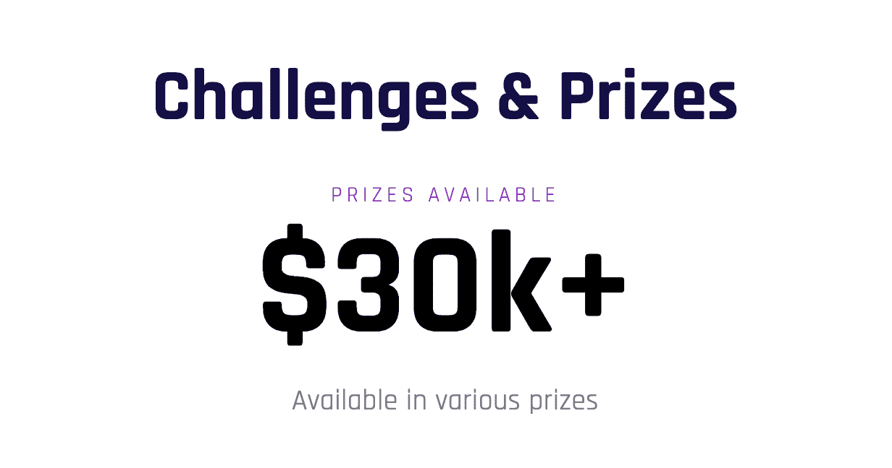

图片来自 Hackmoney 网站

[飘渺虚拟黑客马拉松](https://gitcoin.co/hackathon/ethereal-virtual-hackathon/?tab=hackathon:16):

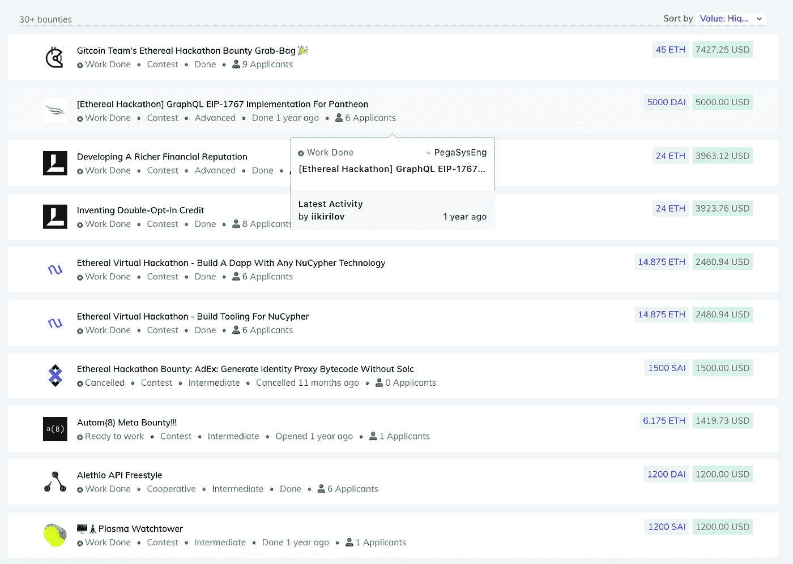

图片来自 Ethereal 虚拟黑客马拉松网站

Chainlink 虚拟黑客马拉松:

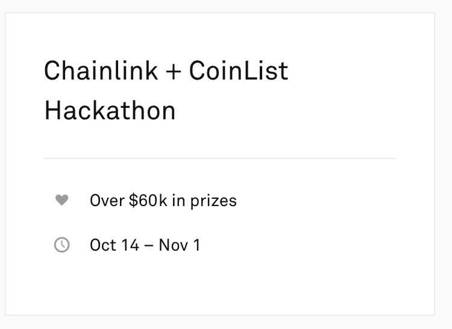

图片来自 Coinlist Chainlink hackathon

这个清单还在继续。

# 你现在就可以加入黑客马拉松

我希望你现在对加入黑客马拉松感到兴奋，并明白为什么这样做是值得的。如果智能合同成为第四次工业革命的火花还不够的话，我希望至少以上是足够的。

让我们带你参加一些黑客马拉松。在这里你可以找到一些最好的。

现在*有几个黑客马拉松正在进行*你可以加入！

[链式黑客马拉松](https://hack.chain.link/):

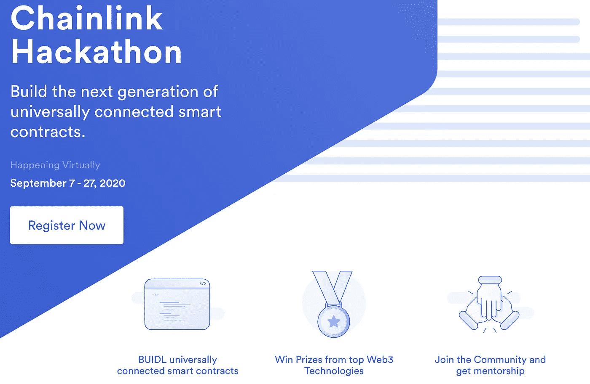

Chainlink 黑客马拉松

构建下一代普遍连接的智能合约。就现在！这是 Chainlink 本年度最大的黑客马拉松，奖金超过$40k，你一定不想错过。

[Gitcoin 的单元化](https://gitcoin.co/hackathon/unitize?org=smartcontractkit&tab=hackathon:16):

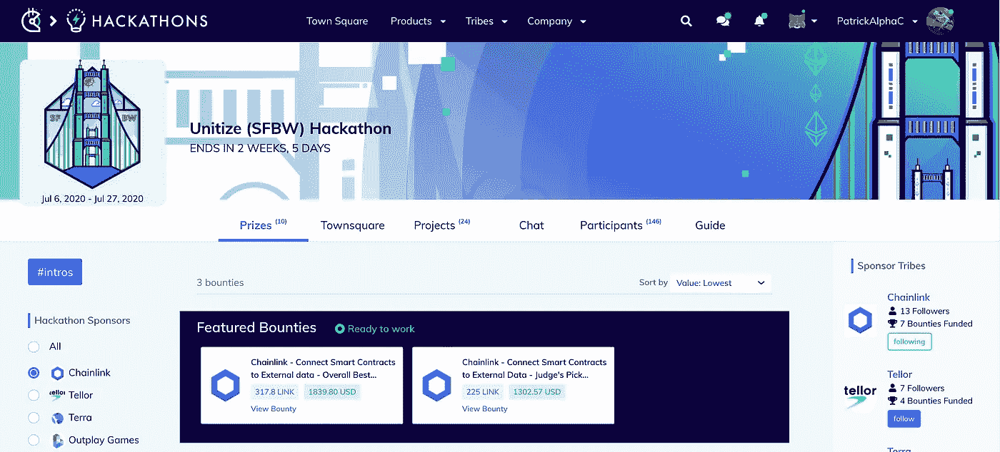

来自 gitcoin.co/hackathons/unitize

这一个特别具有一些令人敬畏的奖金，包括 [Chainlink 的参考合同奖金](https://gitcoin.co/issue/smartcontractkit/chainlink/3139/100023142)，和 [Terra 的钱包奖金](https://gitcoin.co/issue/terra-project/gitcoin-onboarding/1/100023171)。你所要做的就是[为 Chainlink](https://docs.chain.link/docs/using-chainlink-reference-contracts) 部署一份参考合同，并安装 Terra 的应用程序以获得这些入门级奖品。

DevPost 的 Hackusama :

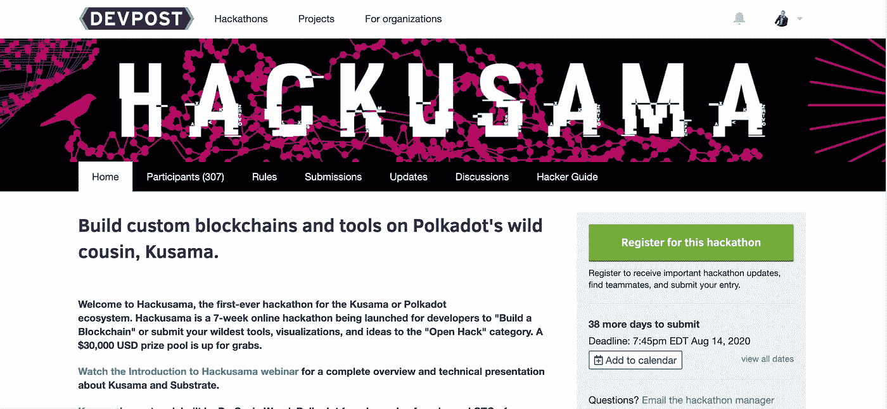

图片来自[https://hackusama.devpost.com/](https://hackusama.devpost.com/)

使用波尔卡多特，你可以建造与区块链相连的区块链。将这一点与[chain link](https://chain.link/)Oracle 的功能结合起来，您可以开发出一些*非常*强大的应用程序。

其他几个经常举办令人惊叹的黑客马拉松的网站。

[ETH Global](https://www.ethonline.org/)

他们以前被提到过，过去也举办过一些令人惊叹的黑客马拉松。

[Gitcoin](https://gitcoin.co/hackathon-list)

靠近区块链社区，Gitcoin 已经举办了数以吨计的黑客马拉松，并期待举办更多。

发展邮报

Devpost 已经开始获得越来越多的区块链项目，我们很高兴看到每个人都在这里提交！

请务必在 twitter 上联系 [Chainlink，这样您就可以继续关注 Chainlinked hackathons，在那里您可以学习和成长，还可能赢得一些奖品！](https://twitter.com/chainlink)

你还在等什么？