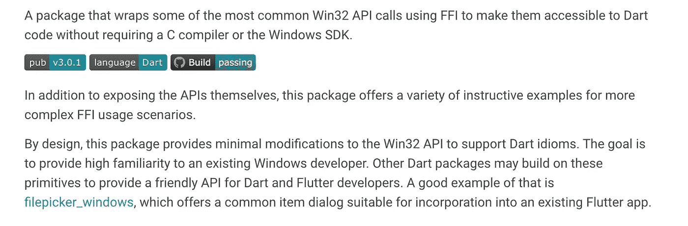

# 为什么在桌面上飘动不生锈就无法生存

> 原文：<https://betterprogramming.pub/why-flutter-on-the-desktop-cant-survive-without-rust-26ccd6ae30e0>

## 扑在桌面上需要生锈。它只是还不知道而已。


它将使你的应用程序起飞(原始照片 [SpaceX](https://www.pexels.com/photo/space-shuttle-taking-off-on-mission-at-night-586082/)

*作家注:在这篇文章中，我谈论的是 Tim Sneath 和许多其他辛勤贡献者的努力成果*[*【Win32 包*](https://pub.dev/packages/win32) *。Win32 包是高质量的，Tim 对 Flutter 生态系统做出了巨大贡献。我说的任何话都不应该以任何方式贬低这个一揽子计划。我只是在讨论适合我的替代方案。*

桌面上的飘动目前处于一种中间状态。它在所有主要的桌面平台(如 Windows、macOS 和 Linux)上都很稳定，并且正在被一些人采用。对于移动开发来说，这无疑是一个非常流行的框架，但是这种流行似乎并没有延续到桌面应用程序上(至少现在还没有)。

诚然，桌面平台上的稳定性比移动平台上的要新得多，但与移动平台上的稳定性相比，桌面平台上的抖动还有另一个重要的方面。这与可扩展性有关，更确切地说，是在底层操作系统上调用本机代码的难度。在 Android 或 iOS 上，组装一些 Kotlin 或 Swift 来实现您想要它做的事情并不困难。在桌面上，情况就完全不同了。

“桌面上的颤动”是一个相当宽泛的术语，包括 Windows、Linux 和 macOS。出于本文的目的，我们将只关注 Windows。我认为这是公平的——考虑到 Windows 在桌面领域占主导地位。

在我的例子中，我正在开发一个叫做 StagePlay 的桌面应用程序。[这是一个连接到智能自行车的应用程序，告诉用户他们当前处于什么档位](https://stageplay.me)。为了让它工作，它需要使用蓝牙低能量(BLE)来与智能自行车通信。

桌面上对 BLE 的支持并不是完全没有，但在我的情况下，现有的插件对我不起作用(它们导致我的应用程序崩溃到桌面)。因此，我需要为此编写自己的实现。

# 为什么我首先要在 Flutter 中编写一个桌面应用程序

如果桌面支持在 Flutter 中很一般，那我为什么要用 Flutter 写我的应用呢？这是一种明显的自我拥有。嗯，我使用 Flutter 做移动应用已经有一段时间了，简单来说，我认为 Flutter 使用的布局系统是我见过的最好的。在使用 Flutter 之前，我会尝试使用 XAML 来展示我的 Windows WPF 应用程序或 Xamarin Forms 应用程序。Flutters 的布局系统将 XAML 打得落花流水。差远了。

事实证明，我是一个狂热的粉丝，甚至回 XAML 用 WPF/Xamarin Forms/毛伊岛写一个应用程序的想法都令人沮丧。因此，如果我选择的框架是 Flutter，我将不得不走一条更艰难的道路来满足我的蓝牙需求。

> 在我使用 Flutter 之前，我会尝试使用 XAML 来展示我的 Windows WPF 应用程序或 Xamarin Forms 应用程序。Flutters 的布局系统将 XAML 打得落花流水。差远了。

这意味着我必须找到一种方法来利用本机平台功能连接到我选择的 BLE 设备。有三种选择，win32 包 T1，一个本地 C++插件，或者使用 Rust(和 T2 的 flutter _ Rust _ bridge T3)。当我开始这段旅程时，我不知道第三种选择(更不用说 Rust 语言本身了)。

# 使用 Win32 包

您的普通跨平台开发人员的困境是，他们擅长在他们的跨平台框架中使用的语言，但可能不擅长特定于平台的语言。以我的情况来说，我擅长 Dart，C#，可能还有 TypeScript，但不擅长 C++这样的低级语言。当然，这意味着如果可能的话，我会坚持使用 Dart。对于这一点，使用 Win32 包看起来非常合适。



win32 包的简要描述(来自 https://pub.dev/packages/win32)

这似乎是一个很好的开始，甚至有如何在你的项目中使用蓝牙的例子，如[这里](https://github.com/timsneath/win32/blob/main/example/bluetoothle.dart)所示。然而，使用 win32 软件包存在两个主要问题。

1.  我无法订阅来自我的 BLE 设备的通知，这实际上是我最初唯一想通过蓝牙做的事情
2.  我不得不写一些非常难的 Dart 代码来利用 win32 API

我说的“相当难懂的 Dart 代码”是什么意思？嗯，即使 Win32 包让你使用 Dart，你还是要调用`calloc`(或者 C Allocate)这样的函数，为函数的返回值分配内存。您还负责自己的内存管理，并通过手动删除不再使用的对象来进行清理。

> 您的普通跨平台开发人员的困境是，他们擅长在他们的跨平台框架中使用的语言，但可能不擅长特定于平台的语言。

除此之外，Win32 包擅长映射 Win32 API 表面，但不太擅长映射 WinRT API 表面。WinRT API 表面是所有较新技术(如 BLE 功能)倾向于驻留的地方，所以这是一个非首发。

所以，Win32 软件包已经过时了。我唯一能想到的另一件事就是写一个原生 C++插件。

# 用 C++编写我自己的原生插件

在我尝试用 C++编写自己的插件之前，我觉得自己是一个相当不错的开发者。我对软件开发有足够的了解，可以从头到尾设计和制作一个应用程序 API、数据库、应用程序等等。

坐下来试着用 C++写出任何有价值的东西，这足以彻底粉碎我对自己过高的评价。从表面上看，我是软件开发世界中身材魁梧、头发花白的男人中的一个孩子。我当时还是个婴儿，不知道指针是什么，也不知道那些符号是干什么的。

为了加剧这种情况，我甚至找到了一个很好的跨平台 BLE 插件，用 C++写的。我所要做的就是将水从我的 Flutter 应用程序带到这个库中，并将这个插件的命令和响应映射回我的应用程序。我在的表现非常糟糕。

> 坐下来试着用 C++写出任何有价值的东西，这足以彻底粉碎我对自己过高的评价。

如果你懂 C++并且非常擅长，当你读到这篇文章的时候会想“哇，这家伙听起来很不擅长软件开发”，那没关系。但是，我向评审团提出，我必须掌握大量关于 Web 开发、数据库开发以及最终应用程序开发的知识。太多了。而且，我认为学习如何在我的应用程序中安全地使用 C++是一项艰巨的任务。

在尝试使用[鸽子](https://pub.dev/packages/pigeon)为我生成绑定代码和编写自己的平台绑定代码之间，我开始放弃了。对于我想要完成的事情来说，似乎有太多的东西需要学习。此外，我知道即使我拼凑了一些看起来在 C++中可以工作的东西，我继续部署一些我不完全确定会不会*而不是*在客户机器上引起内存损坏或其他问题的东西也是不负责任的。

# 决定搁置我的项目

如果没有一个可靠的方法从我的项目中利用 ble，我的项目就无法继续。当 BLE 的连接不可靠时，我无法安装连接到 BLE 设备的应用程序，应用程序偶尔会因此崩溃到桌面。我锲而不舍地想看看是否还有别的办法。在这样做的过程中，我发现了颤振锈桥项目。


螃蟹看起来开心是有原因的(图片来自[https://github.com/fzyzcjy/flutter_rust_bridge](https://github.com/fzyzcjy/flutter_rust_bridge)

# 使用颤振锈桥

在这个阶段，这是我目前对铁锈的认识:

1.  这是一种编程语言。
2.  他们的吉祥物是一只螃蟹。

显然，用一种你以前没有使用过的全新语言做任何不平凡的事情是非常可怕的，而且也不能保证你会成功。我原以为几天后会累垮的。

**然而，仅仅几天后，我就完成了我的蓝牙实现，一切都运行良好。**

因为我的体验非常好，我现在相信 Rust 是让 Flutter 在桌面上成功的关键缺失部分。原因如下:

## 比 C++更容易，是比 win32 软件包更好的选择

与使用 Flutter Rust Bridge 相比，Windows 上其他本地功能的替代方案都有所欠缺。原因如下:

*   如果你是一个跨平台的开发者，你可能不知道 C++。试图使用像 C++这样的硬语言来实现本机功能几乎肯定会以失败告终。
*   同样在 C++中，未被捕获的异常只会让你的应用崩溃。因为你是 C++的新手(见第 1 点),所以会有很多未被捕获的异常。
*   通过 Win32 包实现您的东西仍然需要您阅读大多数函数调用的 API 文档。这本身并不坏，但阅读 C++中的示例并尝试用 Dart 重写它们，同时仍然记得调用底层构造，如`calloc`和`destroy`，不会带来很多好的结果。

使用 Rust 和`flutter_rust_bridge`可以避免这些问题(第 1 点和第 2 点)，或者使它们更易于管理(第 3 点)。例如，在 Rust 中重写可能在 Microsoft API 文档中找到的 C++代码示例比通过 win32 包在 Dart 中重写更容易。

## Rust 社区庞大而善良

编程领域存在精英主义的问题。有些开发人员会把你当成白痴，或者对你居高临下，仅仅因为他们是比你更好的开发人员，或者比你懂得更多。我已经了解到，对于这个问题没有太多具体的解决办法，更容易的是找出一个社区的总体感觉，然后决定你是将大部分时间花在不和谐的问题上，还是仅仅试图将文档拼凑起来，并从与你有着模糊相似问题的陌生人那里消化 GitHub 问题的碎屑(至少，人们不会对你大喊大叫)。

以我的经验来看，加入 [Rust Community Discord](https://discord.gg/HvGdPdz3) 并在#初学者频道向他们提出我的愚蠢问题是一种乐趣。陌生人每一次都不遗余力地帮助解决公认非常简单的问题。只要我表现出一点点的理解，并对我被告知的事情运用一些逻辑推理，我就能得到我需要的所有信息。

不仅如此，我还收到了一些有用的建议，告诉我如何停止编写一个带有全局状态和死锁的怪物，并开始编写一个更干净、更优雅的解决方案。我现在拥有的绝对是更高质量的，因为这些不和谐频道的志愿者们不知疲倦的帮助。

> 陌生人每一次都不遗余力地帮助解决公认非常简单的问题。

## 颤振锈桥是一个梦想使用

如果你正在为 Windows 上的 Flutter 编写一个原生 C++插件，你必须编写自己的绑定，或者依赖于 Pigeon 包中的实验平台支持。即使这样，Pigeon 也不会为你生成`Stream`，所以你必须自己实现这些。这是您必须自己编写的大量样板文件，并且很容易出错(由于完全缺乏文档而加剧)。

相比之下，使用`flutter_rust_bridge`非常简单。这些特性是多种多样的，但只是为了突出我最喜欢的一些元素:

1.  Rust 中的函数会自动映射到 Flutter 中的可调用函数。只需在 Rust 中定义一个新的`pub async fn`，运行`flutter_rust_bridge`的 codegen 工具，并立即开始调用您的本机代码。
2.  `StreamSink<T>`是支持开箱即用的，所以你可以随着时间的推移发出值。写入这些流中的值会以 Dart 对象的形式直接发送到您的应用程序中，因此您可以随意操作它们。
3.  导致 Rust“死机”不会导致你的应用崩溃到桌面。相反，`flutter_rust_bridge`中的内部错误处理会捕捉到紧急事件，并描述发生了什么。
4.  支持 Rust 中的“花式枚举”。例如:

这个锈码…

```
pub enum TransportType{
    *Car*{
        capacity: u8,
    },
    *Bike*{
        wheelCount: u8,
    }
}
```

…在 Dart 中不起作用。这并不是枚举在 Dart 中的工作方式，而且在不久的将来也不会改变。尽管如此，对于 streams 来说，能够将某些细节隐藏到枯燥的`enum`中真的很酷。

`flutter_rust_bridge`将这些值映射成一种非常有用的格式，这种格式直观且有意义，意味着您可以像这样处理它们:

```
api.transportTypeStream().listen((event) {
  event.when(car: (capacity) {
    print('the car has {capacity} capacity');
  }, bike: (wheelCount) {
    print('the bike has {wheelCount} wheels');
  });
});
```

*而所有的互联代码都是由* `*flutter_rust_bridge*` *为你生成的。*

# 外卖

从我到你，如果你是一名开发人员，你正在为 Windows 编写一个 Flutter 应用程序，认真考虑学习一点 Rust，并使用`flutter_rust_bridge`来实现你想要做的事情。实际上，这只会让你受益，让你能够更快地交付应用。

但是，从更大的角度来看，很难想象我的应用程序在桌面上成功，或者在没有 Rust 和`flutter_rust_bridge`的情况下实际工作。我认为，决定在桌面上尝试 Flutter 应用程序的人会发现，使用 win32 包可能会受到限制，难以理解，而且这些人也缺乏足够的 C++经验，无法为他们追求的功能创建自己的自定义本机实现。在这一点上，他们可能会使用不同的框架来实现他们的目标。

这就是为什么(除了这个领域正在发生的其他大规模事件，比如能够加载和执行编译的。Flutter 内部的. NET 代码)，Flutter 在桌面上的成功似乎与 Rust 和`flutter_rust_bridge`紧密相关。我个人很期待看到这个项目的长远发展。如果你没听说过，一定要去看看。它可能会拯救你的项目，就像我拯救我一样。