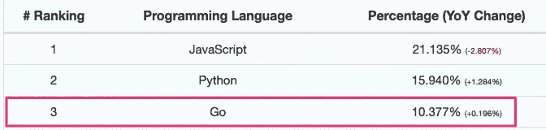
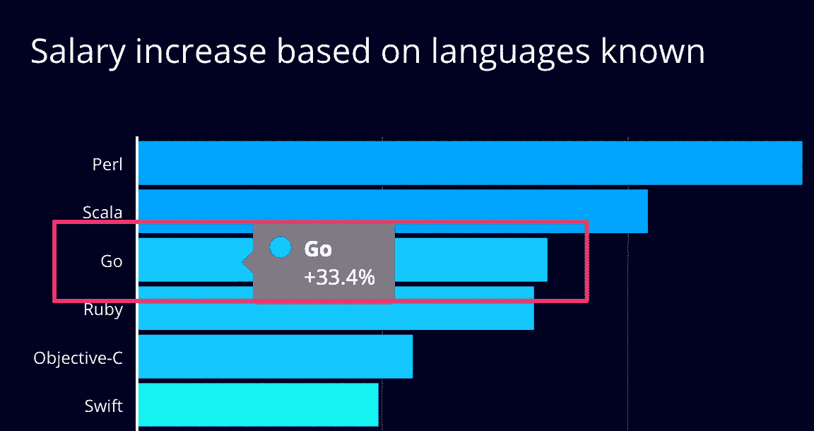
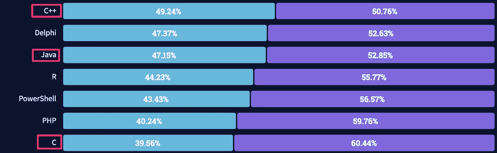
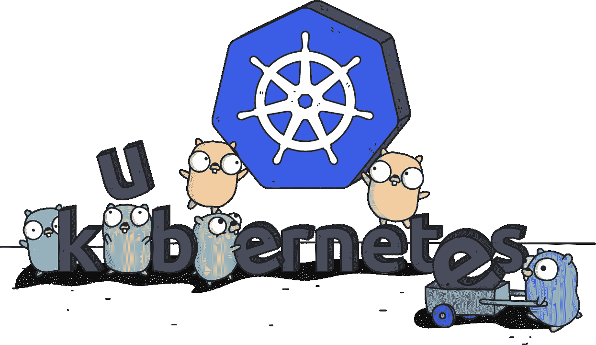
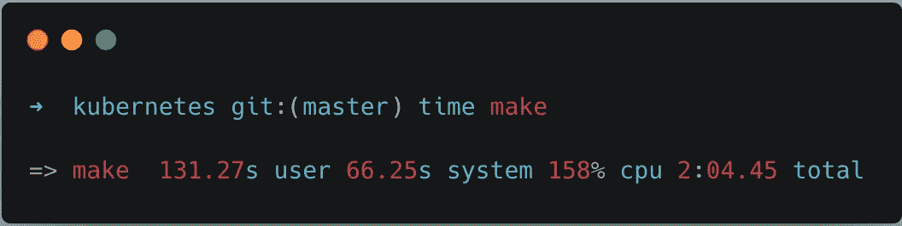

# 为什么 Golang 要接管软件行业

> 原文：<https://betterprogramming.pub/why-golang-is-about-to-take-over-the-software-industry-fb48174a4cf>

## 思考为什么 Go 成为开发人员的热门选择


图片来源:[埃贡·厄尔布尔](https://github.com/egonelbre/gophers)

今年早些时候，Stack Overflow 发布了 2021 年开发者调查。如果你留意了当时的[科技头条，你会看到 JavaScript 和 Python 连续一年占据主导地位。然而，那些不是我关注的语言。](https://developer-tech.com/news/2021/aug/03/2021-stack-overflow-survey-react-js-takes-the-web-framework-crown-python-is-in-demand-and-devs-still-love-rust/)

列表中还有一种语言引起了我的注意:Golang。

*“戈朗？* *却只有* [*排名第 12？*](https://insights.stackoverflow.com/survey/2021?_ga=2.236209345.190202062.1628102352-126161871.1625855113#section-most-popular-technologies-programming-scripting-and-markup-languages)*你可能在想。*

*这是真的。它不是世界上最流行的编程语言。使用它的开发人员相对较少，这是有原因的。*

*围棋相对较新，还不成熟。这是一种基本的语言，缺乏其他语言所具有的语法优势。它没有任何流行的框架来自动化乏味的样板文件。直到三年前，它还没有一个标准化的包管理器。*

*越来越多的开发人员还没有使用它，这并不奇怪… *。**

*你看，虽然 Go 在受欢迎程度上只排在第 12 位，但在[开发者*希望*学习的语言](https://insights.stackoverflow.com/survey/2021?_ga=2.236209345.190202062.1628102352-126161871.1625855113#most-loved-dreaded-and-wanted-language-want)上却排在第三位(我把 TypeScript 算在 JavaScript 类别里)。*

*HackerRank 也支持这一点。根据他们从 2020 年开始的研究，戈兰语已经连续三年成为最想学的语言。*

**

*来自 HackerRank 的 2020 年调查——作者截图*

*不仅如此，Go 还位列[最受欢迎语言](https://insights.stackoverflow.com/survey/2021?_ga=2.236209345.190202062.1628102352-126161871.1625855113#most-loved-dreaded-and-wanted-language-love-dread)的前十名，在 GitHub 上排名第三的最受欢迎语言是。*

**

*[来自 GitHut 2.0](https://madnight.github.io/githut/#/stars/2021/2) —作者截图*

*围棋越来越受欢迎。但是为什么呢？*

*正如我前面提到的，围棋仍然有很多问题。在当前的编程语言环境中，有更多通用和健壮的选项可供选择。那么为什么 Go 正在慢慢接管软件行业呢？*

# *简约中的美*

**

*[图像来源](https://www.kindpng.com/imgv/hbJTxxx_cartoon-hd-png-download/)*

*尽管围棋有缺陷，但它还是有很多让人喜欢的地方。从它的并发模型、丰富的第三方支持、命令行工具的健壮性等等。但如果不是因为 Go 的最佳功能:易用性，所有这些都将化为乌有。*

*正如我之前提到的，Go 是一种非常简单的语言。但这是设计的方式——简单就是它的优势。它只有 25 个关键字，但每个都是通用的。*

*以`for`为例。这是为循环和迭代保留的关键字。*

*它可以用作普通的 for 循环。*

```
*for i := 0; i < 10; i++ {
  fmt.Println(i)
}*
```

*它可以用作 while 循环。*

```
*i := 0
for i < 10 {
  fmt.Println(i)
  i++
}*
```

*它可以用来迭代数组或映射。*

```
*for key, value := range myMap {
  fmt.Println(key, value)
}*
```

*不要让简单欺骗了你——它充满了力量。*

## *带有动态变化的静态语言*

*Go 是一种静态语言，传统上学习起来更令人生畏。尤其是对于那些学习使用 Python 或 JavaScript 等动态语言编程的人来说。*

*但是围棋已经从它充满活力的兄弟那里学到了东西。它支持(有限的)动态分配，并且是一种带有[垃圾收集器](https://en.wikipedia.org/wiki/Memory_management#Garbage_collection)的内存管理语言。将这一点与简单的语法结合起来，这就形成了一种易于学习和构建的语言。*

*它较浅的学习曲线是它被迅速采用的最大驱动力之一。*

# *跟着钱走*

*如果你想知道开发商蜂拥而至的另一个原因，你需要做的就是跟着钱走。*

**

*来源: [HackerRank](https://research.hackerrank.com/developer-skills/2020) —作者截图*

*根据 HackerRank 的研究，与平均水平相比，围棋与 33%的工资增长相关。不仅如此，十分之一的招聘经理希望应聘者有围棋经验。开发者有学习它的经济动机。*

*需要指出的一点是，相关性并不意味着因果关系。你懂围棋不一定就能赚更多钱。但是让我们检查一下为什么这种相关性存在。*

## *大型科技公司喜欢它*

*Golang 最初由谷歌开发，并于 2009 年发布，它缓慢但稳定地赢得了软件行业的信任。随着[微服务架构](https://docs.microsoft.com/en-us/dotnet/architecture/microservices/architect-microservice-container-applications/microservices-architecture)的兴起，越来越多的大型科技公司采用了它。*

*像优步、Twitch 和 Slack 这样的公司都在他们的堆栈中使用 Go。甚至以采用和宣传单片架构而闻名的公司也采用了它，比如 GitHub 和 Shopify。*

*所有这些公司都支付最高的市场价格，吸引了成千上万有抱负的软件工程师。过去，想在这些技术巨头公司工作的开发人员需要学习 Java、C 或 C++等语言。但是说实话，这些不是大多数开发人员喜欢日常使用的语言。你只需要看看开发者调查就能自己明白了。*

**

*大多数开发人员害怕使用 C、C++和 Java——来源: [StackOverflow 调查](https://insights.stackoverflow.com/survey/2021?_ga=2.236209345.190202062.1628102352-126161871.1625855113#most-loved-dreaded-and-wanted-language-love-dread)*

*Go 为那些想为大型科技公司工作，又不想让自己受制于 Java 的工程师提供了一个选择。*

*但是这仍然留下了一个没有答案的问题:*为什么越来越多的公司开始走向海外？**

*答案很简单。*

# *Go 是云的语言*

**

*[图像来源](https://medium.com/@yusufkaratoprak/a-simple-golang-application-via-kubernetes-8a200235a45a)*

*说云计算改变了科技行业是一种保守的说法。公司不再需要建立服务器场和雇佣团队来维护它们。云提供商已经把服务器变成了商品。工程团队现在只需点击一个按钮就可以启动虚拟机。*

*云计算的兴起导致了对能够帮助团队管理和扩展云架构的技术的需求。于是**云原生**诞生了。*

*Terraform、Docker 和 Kubernetes 等技术使得使用微服务在云上部署、扩展和管理应用变得前所未有的简单。它们是 Git 之后最流行的开发工具。而且都是用 Go 打造的。*

*不仅仅是 Docker 和 Kubernetes。绝大多数[云原生计算基金会赞助的项目](https://contribute.cncf.io/contributors/projects/)都是用 Go 编写的。*

*Go 是为云和微服务打造的。它是为多核服务器设计的。它很容易交叉编译到各种架构和操作系统。它还非常轻便。它编译的二进制文件比 Java 中的类似文件小 10 倍。它们不仅更小，而且编译速度也更快。*

*Kubernetes 有超过 500 万行的应用程序代码。如果它是用其他语言编写的，编译可能需要几十分钟到几个小时。有了 Go，只需要一两分钟。*

**

*我不是唯一这么说的人。根据 [*谷歌云原生架构的 5 大原则*](https://cloud.google.com/blog/products/application-development/5-principles-for-cloud-native-architecture-what-it-is-and-how-to-master-it) :*

> *“几乎所有的云架构都基于微服务架构。]"*

*随着 10 个组织中有 6 个已经将工作负载迁移到云以及更多的迁移，越来越多的公司开始依赖 Go——无论他们是否直接使用它。*

# *离别的思绪*

*还不清楚 Go 是否会比 JavaScript、Python 或 Java 更受欢迎和使用。但不一定要这样。编程语言不是赢家通吃的市场。*

*Go 解决了一个关键需求。一种语言，它提供了静态语言的速度、安全性、可伸缩性以及动态语言的易用性。它还开辟了一个重要的利基市场。*

*每种语言都有其独特之处。JavaScript 有 web 开发。Python 有数据科学。Ruby 有创业公司。Java 有企业。Go 拥有云。*

*尽管只有十年的历史，Golang 已经崭露头角。随着云计算优势的扩散，围棋的未来看起来比以往任何时候都更加光明。*

*[*订阅我的个人资料*](https://medium.com/subscribe/@SunnyB) *如果你想在我上传新故事时得到通知。**