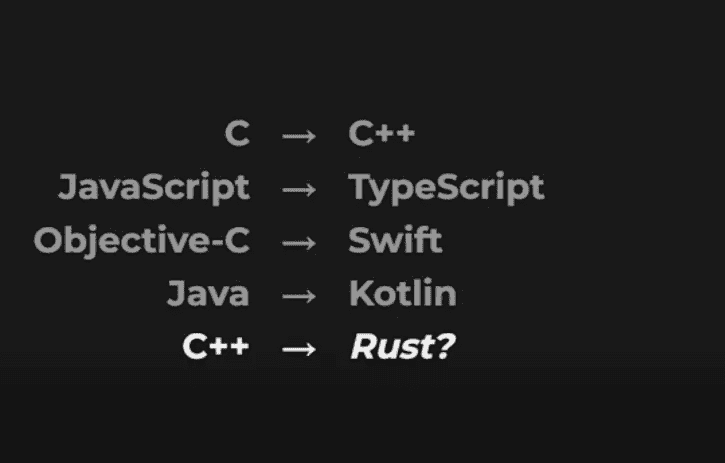
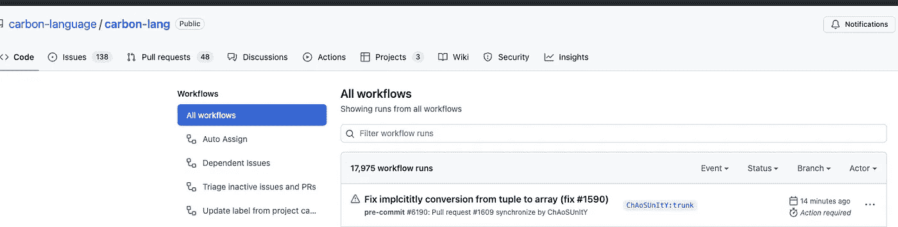

# 为什么谷歌发布碳排放

> 原文：<https://betterprogramming.pub/why-google-released-carbon-d3530d715acb>

## 如何围绕谷歌碳开始思考


特里·维里斯迪斯在 [Unsplash](https://unsplash.com?utm_source=medium&utm_medium=referral) 上的照片

在 7 月份最近的 [CppNorth 大会](https://www.youtube.com/watch?v=omrY53kbVoA)上，谷歌发布了它的 C++派生编程语言 Carbon。

谷歌现在刚刚发布了 0.1。Carbon 1.0 将于 2024–2025 年左右上市。目的是让来自不同来源的开发人员社区在早期有足够的代表性。

在发布会上，谷歌称碳元素是语言进化模式的自然延续:

*   微软对 JavaScript 进行了改进，创建了 TypeScript(尽管这在编程社区中经常引起争论)
*   Jetbrain 改进了 Java，创建了 Kotlin
*   苹果改进了目标 C，推出了 Swift

如果您注意到，在所有上述情况中，改进工作都集中在引入更多的静态类型检查，以防止类型错误处理，从而防止运行时灾难，包括崩溃和内存泄漏。



[谷歌的 CppNorth 演示文稿](https://www.youtube.com/watch?v=omrY53kbVoA)

Google 打算用 Carbon 对 C++做同样的事情。

这是变革的一步。同时，它给编程语言领域的前沿带来了如此多的思想、观点和问题。

# C/C++如何影响语言进化(以一种无法想象的方式)

程序员一直以来都乐于冒险创造一个可行的 C++替代品。

在 90 年代，Sun 公司推出了 Java。它的主要卖点是在一个虚拟机中跨平台运行，以智能处理数百万台设备。它通过保留类似 C++的 OOP，但消除了丑陋的指针管理来实现。

Java 也享受了一个完美的时机。web 迎来了它的大爆炸时刻，Java 成为了应用服务器事实上的语言。Java 小程序占据了浏览器空间一段时间。十年之内，Java 的语法兄弟 Javascript 接管了网络。Javascript 的旅程并没有在它的服务器端对手 Node.js 之后达到高潮，它仍在增长。

取代 C++一直是语言进化的核心。有了垃圾收集器支持的运行时，Java 消除了内存管理问题，但由于其架构的原因，没有达到 C/C++的本机性能。

C/C++仍然是并行开发的商业和非商业系统的核心:

*   谷歌、脸书、亚马逊、Twitter 和 Bing——它们的核心应用逻辑都是用 C/C++编写的。
*   Android 操作系统运行在 Linux 内核上，内核是用 c 编写的，Linux 是用 c 编写的，Mac OS 和 iOS 是基于 BSD 的 Unix 的分支，Unix 大量使用 c 编写。
*   Git 和 Subversion 版本控制系统都是用 c 写的。
*   所有的数据库(Oracle、Postgres、MySQL、IBM Db2、SQL Server——不胜枚举)都是用 C/C++编写的。

C/C++无与伦比的性能是它仍然在最受欢迎的编程语言的[列表中排名第二的原因。(去年，它是第一名，但今年被 Python 取代了。)](https://www.tiobe.com/tiobe-index/)

然而，正是 C/C++的问题导致了编程社区对下一代万能编程语言的探索。

# C/C++的问题是

C/C++的主要问题是它苛刻的语法。这是一个陡峭的学习曲线。这导致在庞大的代码库中建立了巨大的技术债务。即使有经验的程序员也害怕重构这样的代码。

> C/C++丑陋的语法导致了陡峭的学习曲线，产生了巨大的技术债务，从而形成了恶性循环

当解析一种语言不直观时，开发支持它的工具就很困难。IDE 支持，新手开发者对抗编程语言的主要武器，由于它的语法，对于 C/C++来说是最小的。微软 Visual Studio 统治了这个领域很长一段时间，但它是专有的。竞争对手在成本效益或功能方面也没有提供太多东西。

由于 C/C++的性能垄断，维护 C/c++已经成为一项日益具有挑战性的任务。加上其复杂性，它产生了由以下三个因素构成的恶性循环:

1.  陡峭的学习曲线
2.  更少开发者的爱
3.  技术债务

简而言之:

*   由于陡峭的学习曲线，学习 C/C++的开发人员较少，掌握它的就更少了。
*   维护庞大、陈旧和复杂的代码落在低于平均水平的开发人员肩上，他们执行快速修复，增加了技术债务。
*   充满 Bug 的代码给下一代程序员带来了更大的学习挑战。循环往复。

程序员不想让自己在性能和简单性之间做出选择。为什么他们不能两者兼得？

有两种方法可以实现:

*   改进 C/C++
*   创建一种新的语言，它消除了内存管理，但仍具有与 C/C++一样的性能(因此，由于其庞大的现有代码库，可与 C/C++互操作)

## 然后，生锈了。

纯洁往往不是企业想要替换丑陋事物的原因。尽管有陷阱，但只要它赚钱，它就会留下来。

像往常一样，微软是第一个将 C/C++的丑陋与其利润缩水联系起来的公司。

> 截至 2004 年，与内存相关的错误给行业造成了约 25 万美元的损失

当程序员在内存管理方面做得不好时，程序就会崩溃(并不总是由于他们自己的无能)。当语言是表演性的时，它们在被修复之前经常爆炸。每一次失败都会给客户带来巨大的损失，最终都落在软件提供商的肩上。只有最大的企业云提供商才能理解这个东西。

在 C/C++中，尽管历史悠久，但这是不可避免的。

根据微软最保守的估计，早在 2004 年，与内存相关的错误给行业造成了约 25 万美元的损失。因此，微软已经开始将大部分关键任务代码从 C/C++转移到 Rust。

由 Mozilla 于 2010 年创立的 Rust 在所有领先的科技公司中都有其[最大的支持者](https://en.wikipedia.org/wiki/Rust_(programming_language)):微软、亚马逊、谷歌、脸书和苹果。

AWS 还使用 Rust 运行其 lambda 函数部署代码。[脸书也使用铁锈](https://www.youtube.com/watch?v=kylqq8pEgRs)。

谷歌[计划在驱动 Android 的 Linux 内核](https://security.googleblog.com/2021/04/rust-in-linux-kernel.html)中使用 Rust。

谷歌的 Carbon 在句法上和 Rust 有很强的相似性。

文档中最吸引我注意力的部分是这一部分:

```
Any path to safety must preserve performance of C++ today. This rules out garbage collection, and many other options. The only well understood mechanism of achieving safety without giving up performance is compile-time safety. The leading example of how to achieve this is Rust.
```

在宣布碳排放的同时，谷歌并没有批评 Rust。事实上，在 CppNorth 的一个点上，Carruth(首席碳开发者)建议那些使用 Rust 的人继续使用它。

> Carbon 是给那些在 C++中已经有很大的代码库，很难转换成 Rust 的开发者用的。

从这个意义上来说，碳可以被认为与锈处于相似的水平(语法与锈有许多相似之处)。然而，在某个时候，它可能会超越它。

# 谷歌在语言发展排行榜上的表现如何

谷歌的 Golang 获得了成功。它经常被认为是最快的后端开发语言。它是静态类型的，也是最容易学习的类型之一。自成立以来，它在[成为人气指数](https://www.tiobe.com/tiobe-index/)持续上升。

> Flutter 在 iOS 上不如在 Android 上好，因此它的跨平台存在经常失效

作为其跨平台计划 Flutter 的一部分，谷歌推出了 Dart。在巨大的社区支持下，它得到了更快的采用。然而，在最初的兴奋之后，Flutter 的一些性能声明没有兑现。Dart 的最初版本在很长一段时间里缺乏基本的特性，比如散列(hashing)。

由于其糟糕的社区管理加上对社区驱动的包的严重依赖，Dart 的 iOS 产品与原生平台相比缺乏许多功能，因此消除了其作为真正跨平台开发框架存在的理由。

尽管大公司采用了 Dart，但 Dart 从未成为谷歌宣传的重量级叉车，而 Flutter 仍然是与 React Native 一致的社区努力，React Native 是谷歌广告平台兄弟的大脑产物，旨在通过获得社区开发的控件来更快地为自己创建跨平台应用程序。

# 谷歌碳为何而生？

由于建立在开放环境中，一些人可能会认为 Carbon 的发展可能会遵循与 Dart 相似的轨迹，因为它过度依赖于社区。

然而，没有理由对碳持悲观态度。

在这里，谷歌的目标植根于不断发展的 c++——由于世界上最古老的应用程序级语言的极端官僚化的发展，这项任务成为一条棘手的道路。

为了实现这一目标，谷歌在开发的早期就开放了 Carbon(1.0 版本将在 2024-25 年推出)。谷歌还制定了一条规则，任何单一组织都不能为根除垄断性劫持贡献超过 50%的资金。

以下是 Carbon 的 GitHub 自述文件的摘录:

> C++仍然是性能关键型软件的主流编程语言，拥有庞大且不断增长的代码库和投资。然而，如上所述，它正在努力改进和满足开发者的需求，这在很大程度上是由于积累了几十年的技术债务。
> 
> 增量改进 C++是极其困难的，这是由于技术债务本身和它的发展过程中的挑战。解决这些问题的最好方法是避免直接继承 C 或 C++的遗产，而是从坚实的语言基础开始，如[现代泛型系统](https://github.com/carbon-language/carbon-lang#generics)，模块化代码组织，以及一致、简单的语法。

简而言之:

*   谷歌承认 C/C++无与伦比的性能和庞大的代码库
*   它承认，它已经制造了一笔巨大的技术债务，这对整个行业来说是不可持续的
*   由于 C++标准变化的官僚性质(可能会引发冲突),很难对 C++进行改进。虽然谷歌没有具体说明这是什么意思，但如果你有任何例子，请随意补充。

因此，一种新的语言。

# Google Carbon Power 可以基于 C++跨平台移动开发吗？

使用 C++进行跨平台开发是一件事。

Dropbox 在 2014 年[CppCon 大会](https://www.youtube.com/watch?v=ZcBtF-JWJhM)上发布其 [Djinni](https://github.com/dropbox/djinni) 时首次亮相。

Djinni 是一个代码生成器，它将 IDL(接口定义语言)作为输入，并生成兼容的 C++类框架，以便从 Objective C 和 Java 中使用。

IDL 不过是相当于 C++的头文件或者相当于 Java 的类接口。

生成的代码(。cpp 和。hpp 文件)被称为 C++平台绑定。可以作为原生层(Objective C+Swift 或者 Java+Kotlin)下面的通用业务逻辑。

尽管它涉及到 C++，但在移动领域，开发者渴望跨平台，这种方法是唾手可得的。跨平台的 C++可以支持涉及地图、现实游戏或视频渲染的繁重 GPU 或 ML 操作的移动应用程序。

假设 Google Carbon 的目标是在这一领域取代 C++并没有错。

# 谷歌碳的特点

回到文件上。从高层目标来看，Carbon 支持:

*   泛型和模板
*   元组
*   与现有 C++代码的互操作性和从现有 C++代码的迁移(习惯性 c++代码的源到源翻译)
*   与 C++相同的内存模型(Carbon 中的对象内存足迹与 C++中的相同)

Carbon 的目标不是:

*   向后兼容
*   做一个有稳定 ABI 的语言
*   支持不能随语言一起更新编译器和链接器的平台。
*   Carbon 的 GitHub 目前已经成熟，有相当低级的编程概念讨论和文档——这表明它确实是一项公开的努力。它的[设计原则文件之一](https://github.com/carbon-language/carbon-lang/blob/trunk/docs/project/goals.md#project-goals)也引用了:

> 文化早餐吃策略。

很明显，除了公布设计目标之外，谷歌在发布主干之前几乎没有保护什么。回购挺活的。当我在 EEST 周六晚上写这篇文章的时候，有人(如果不是某个发布机器人)在 14 分钟前推动了改变:



# 如何开始使用谷歌碳

```
# Install bazelisk using Homebrew.
$ brew install bazelisk

# Install Clang/LLVM using Homebrew.
# Many Clang/LLVM releases aren't built with options we rely on.
$ brew install llvm
$ export PATH="$(brew --prefix llvm)/bin:${PATH}"

# Download Carbon's code.
$ git clone https://github.com/carbon-language/carbon-lang
$ cd carbon-lang

# Build and run the explorer.
$ bazel run //explorer -- ./explorer/testdata/print/format_only.carbon
```

## 谷歌碳探索者

`Google Carbon explorer`是一个验证器，可以跟踪设计变更到 Carbon 语言规范中。它是作为语言解释器而不是编译器来实现的。

据 GitHub 报道:

> 它是 Carbon 的一个实现，其主要目的是充当语言的清晰规范。作为这一目标的延伸，它还可以作为一个平台，用于原型化和验证对语言的更改。

## 不安装 Google carbon 怎么玩？

编译器资源管理器是一个在线 IDE，支持许多其他语言，包括 Google Carbon。你可以编译、构建和运行微小的程序，并对照 Google Carbon 比较各种语言的执行时间。

# 结论

在命名其最新语言时，谷歌开发者可能会想:

> 碳为地球提供动力。它必须为此受到赞扬。也是我们让它休息的时候。

按照这种思路，Google Carbon 的目标不仅仅是保持内存安全的 C++替代品，也是一种性能卓越的替代品，可以最小化软件的碳足迹。

只有出色的性能才能证明克服替换经过测试的高性能 C++代码库的惰性是正确的，这些代码库大部分是由贯穿整个编程历史的程序员编写的。

考虑到 Google Carbon 还处于开发周期的早期阶段，编程社区以可控的热情和务实的时间+金钱投入来接受它是可取的。

无论如何，这是朝着正确方向的努力。目睹这种粗糙的、古老的编程语言演变成现代的、由一个高度可见的团队公开构建的东西，编程社区只能从中获益。