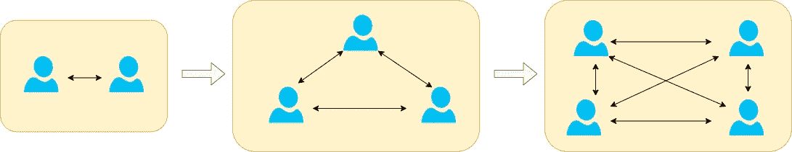
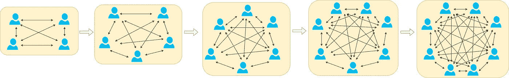
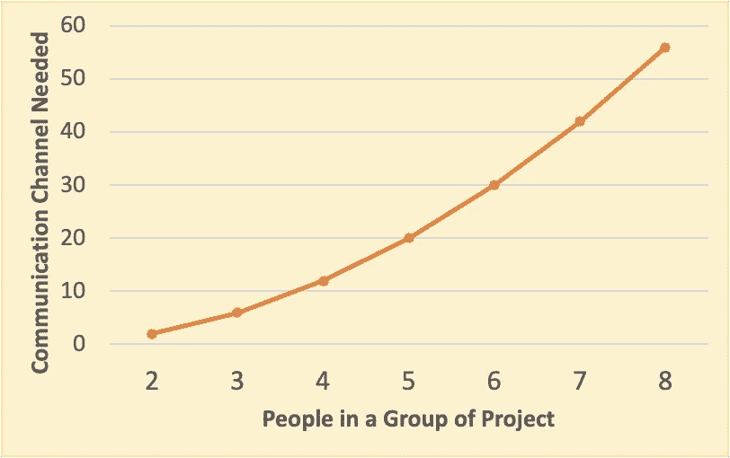
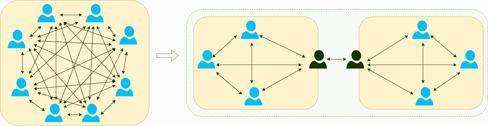

# 为什么雇佣更多的开发人员会阻碍团队的生产力

> 原文：<https://betterprogramming.pub/why-hiring-more-developers-can-impede-team-productivity-831362ba243>

## 从数字数据的角度说明这个问题


在 [Unsplash](https://unsplash.com?utm_source=medium&utm_medium=referral) 上由[米米·蒂安](https://unsplash.com/@mimithian?utm_source=medium&utm_medium=referral)拍摄的照片

当我们想要加速软件开发时，我们脑海中自然会想到“让我们雇佣更多的人吧。”比方说，如果我们有一个开发人员在开发一个软件，我们现在可以有两个开发人员。


这幅画是作者画的

很好，假设新开发人员经过培训后能力相当，我们可以获得几乎 100%的生产率。也许有一些轻微的讨论开销，等等。，但是在编码输出方面，肯定是显著增加的。

假设我们关注的是质量，我们也可以进行结对编程，关注质量的提高。编码输出不是更多，但是当我们有两个开发人员而不是一个时，拥有更好的软件的总体收益会更高。

# 让我们添加更多的开发者吧

自然地，当需要进一步发展时，我们会自然而然地想到“让我们增加更多的开发人员吧。”

好了，再加一两个开发者吧。



这幅画是作者画的

当我们将第三个和第四个开发人员添加到组中时，我们继续看到生产力的加速，但是百分比增加没有第二个开发人员多。为什么？

如果你注意到上图，我用双箭头线把每个人和其他人连接起来。这说明团队内部需要沟通。每一个代码变更，每一个决策，都需要被讨论，并且在整个过程中需要咨询同事，以确保每个人都掌握变更的情况。

一个四人团队总体来说还是健康的，因为我们有更多的交叉知识共享，等等。这是一个比两人团队更快乐的团队，只要每个人在文化上都适合这个团队。

# 哦，我们需要更多的增长

随着需求的增长，我们很容易再次陷入为工作增加更多开发人员的陷阱。让我们增加一到四个人，组成一个五到八人的团队。



这幅画是作者画的

正如你所看到的，我们加入团队的人越多，团队成员之间的交流就越复杂。每个人都要和每个人互动。

如果我们从数学角度来看，通信连接数增加如下:



这幅画是作者画的

```
2 persons = 1 x 2 = 2 connections
3 persons = 3 x 2 = 6 connections
4 persons = 6 x 2 = 12 connections
5 persons = 10 x 2 = 20 connections
6 persons = 15 x 2 = 30 connections
7 persons = 21 x 2 = 42 connections
8 persons = 28 x 2 = 56 connections
```

所需的通信开销阻碍了发展。

*   随着会议、讨论和计划时间的增加，花在编码上的时间会减少。同步变得越来越昂贵。
*   由于每个人都在同一个项目上，不小心踩到对方的脚趾会更频繁地发生。

在这种情况下，每增加一个开发人员，不但不会提高生产率，反而会阻碍生产率。

# 扩展开发不仅仅是增加开发人员

我们上面的问题不是因为我们不断增加开发人员，而是因为我们没有建立正确的结构来支持开发人员的增加。

除了增加开发人员，首先要考虑的是我们是否需要首先模块化我们的代码结构。一个模块的每个部分都应该有一套清晰的职责。

让我们试着把我们的大的、单一的模块化项目分成两个模块，然后平均分配开发人员。除了代表之外，每个开发人员都不需要了解和处理其他模块。

看看下面的图表，它对此有更清晰的阐述。



这幅画是作者画的

从数学上讲，我们已经将 56 个连接减少到一个更低的连接，即 26 个连接。

```
(Group1) + (Group2) + (Across Group Connection)
=> 12 connections + 12 connections + 2 connections = 26 connections
```

这比所需的通信连接减少了 50%还多！

这有很多好处:

*   需要较少的同步，因为不是每个人都需要知道所有的事情。反而可以把更多的时间花在开发上。
*   每个开发者需要学习的范围也缩小了，更容易管理。
*   由于模块的明确所有权，开发人员在开发过程中相互干涉的可能性更小。

# TD；速度三角形定位法(dead reckoning)

扩展软件开发不仅仅是增加开发人员。需要提前做更多的准备，例如为增长准备适当的结构。

因此，在准备更具可伸缩性的工作时，将代码模块化是至关重要的，这将在下面的文章中描述。

[](https://medium.com/mobile-app-development-publication/scaling-mobile-development-365cab84781e) [## 扩展移动开发

### 我们如何实际地扩展移动开发？

medium.com](https://medium.com/mobile-app-development-publication/scaling-mobile-development-365cab84781e) 

嗯，这并不是一个全新的想法——甚至生物细胞的基本分裂和生长都在应用它。