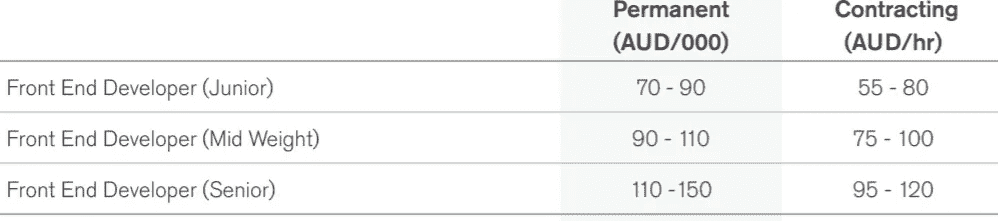

# 为什么我选择成为一名合同制程序员

> 原文：<https://betterprogramming.pub/why-i-choose-to-be-a-contract-programmer-7d36bad23b6d>

## 基于我个人经历的合同工和固定工的比较

帕特里克·福尔在 [Unsplash](https://unsplash.com/s/photos/adventure?utm_source=unsplash&utm_medium=referral&utm_content=creditCopyText) 上拍摄的照片。

我曾经是永久雇员。当时，成为一名承包商似乎令人望而生畏。当我考虑承包商的选择时，对工作保障的担忧阻止了我进一步追求这个想法。然而，在作为首席开发人员完成了一个成功的项目后，我觉得我不再有成长的空间了。领导着一个承包商团队，我知道他们的工资是我的两倍。我决定做出改变。很快，我获得了一份大型政府 IT 项目的合同。

作为一名 IT 承包商工作了十多年后，以下是我的一些观察:

*   作为一名承包商，我实际上在同一家公司呆的时间比我的固定工作还要长。我最长的合同是五年半，而我最长的固定工作是四年。我也是自愿离职寻找新的挑战。
*   尽管合同工的性质不稳定，但我很幸运，到目前为止，合同之间没有任何间隙。
*   我的上一份固定工作比我的合同工工作时间长。

让我们更详细地比较一下合同工和固定工。

# 金钱

还是说说钱吧。请注意，这只适用于澳大利亚的软件开发商。在其他行业和国家，情况可能有所不同。

作为一名 IT 承包商，与类似的固定职位相比，我挣得更多，而且我可以申请税收优惠。

在墨尔本，一个中级开发人员的固定工作的工资大约是 9 万美元或 75 美元/小时，一个承包商的工资大约是 11 万美元或 100 美元/小时。但是合同费率不能只看表面，因为它没有病假/年假之类的福利。即使把所有这些因素都考虑在内，合同工资仍然高得多。

来源:2019 年澳大利亚哈德逊薪酬指南

作为承包商，我有加班费。我在最后一份固定工作中没有加班费，因为“合理的加班已经计入了你的工资。”我的情况可能与你不同，因为我知道大多数固定工作都有加班费。

我付了更多的税——多得多。这促使我想办法投资我的储蓄，这样我就可以少交税了。在过去的五年里，这些投资给我带来了舒适的现金流和良好的资本收益。现在我没有抵押贷款，有了孩子教育的存款和应急基金。

# 我不再担心工作保障

一份固定工作意味着稳定和安全，但现在的就业市场非常不同。作为一名软件开发人员，真的有永久工作这种东西吗？

如今，对雇员和雇主来说，忠诚都已不复存在。很简单的供求关系。如果你的公司不再需要你，你就会被解雇。

永久性的角色会给你一种虚假的安全感。如果没有挑战和不断学习的动力，你的技能就会过时。一个永久的角色也可能将你的范围缩小到一个特定的领域。因此，你的技能是有限的。

在当前的动态环境中，真正的工作保障取决于你相关的和受欢迎的技能。

作为一名承包商，我一直在关注就业市场的需求，并努力通过更新技能来满足这些需求。每一次合同转换都是学习新技能的机会，每一次工作面试都是探索就业市场的机会。快速掌握新技能并立即投入工作已经成为我的第二天性。

我现在不担心工作保障，因为我对自己的技能很有信心。

# 没有(或更少)办公室政治

当我还是正式员工的时候，我最讨厌的就是办公室政治。

作为承包商，事情就简单多了。与正式员工不同，合同工是临时性的。承包商不是永久公司层级的一部分，所以你不会被视为“威胁”

这种更简单的关系(有人称之为事务性关系)使得在大型层级组织中工作更容易。我专注于如何完成我的工作，成为团队的一员，并与内部政治保持距离。但有时在长期合同中，你仍然会陷入办公室政治。

当事情变得困难时，我仍然比正式员工处于更好的位置，因为对我来说换一份新工作要容易得多。

# 自由和灵活性

作为承包商，我有选择。

我感到幸运，因为熟练的开发人员需求量很大。我只申请适合我职业道路和/或使用我感兴趣的技术的工作。很多时候，需要承包商的工作是需要新技术或技能的新项目，这很适合我。

另一个好处是，当我的合同到期时，我可以灵活地休息很长时间。只要有一点计划，我就可以在我梦想的目的地度过一个长假，或者选择不休假工作，尽可能多地赚钱。

# 克服压力，满足期望

另一方面，作为承包商也有压力的时候。

当我开始我的第一份合同时，这种担心是真实的。害怕失去工作和不确定去哪里找下一份合同让我很紧张。不安全感的一个症状是，在我签约的头两年，我没有休息过一天。那显然不健康。我学会了通过关注我能控制的事情来逐渐应对压力。我不断地学习和提高我的技能，同时建立我的声誉和网络。与此同时，我存钱并明智地投资，以获得安全的财务状况。

承包是有回报的，但同时，对承包商的期望也很高。我们的职责是解决问题，按时按预算交付。你需要证明自己是有价值的，值得拿薪水。但是当你交付时，你建立了你的声誉，它可以带你前进。

对于一个承包商来说，更多的可支配收入也意味着你需要自律去储蓄和投资。如果没有纪律，你很容易花掉所有的额外现金，并且没有资金用于紧急情况。

# 最后的想法

如果我能回到过去，我也会做出同样的选择。但是在最初的几年里，我会不那么担心，会更加享受这一旅程。

承包并不适合每个人，但是薪水更高，办公室政治更少，自由更多，这绝对是值得的。

说到底，重要的是拥有一份你真正喜欢的工作——不管是合同工还是固定工。给你更多满足感的工作会让你快乐。

如果你喜欢这篇文章，你可能也会喜欢这篇。

 [## 关于代码评审，我最不喜欢的 5 件事

### 固执己见的评论，双重标准，等等

better 编程. pub](/what-i-hate-about-code-review-66a86e2e3d3f) 

*如果您还不是 Medium、* [***的付费会员，您可以通过访问此链接***](https://sunnysun-5694.medium.com/membership) *进行注册。你可以无限制地阅读媒体上的所有报道。我会收你一部分会员费作为介绍费。*