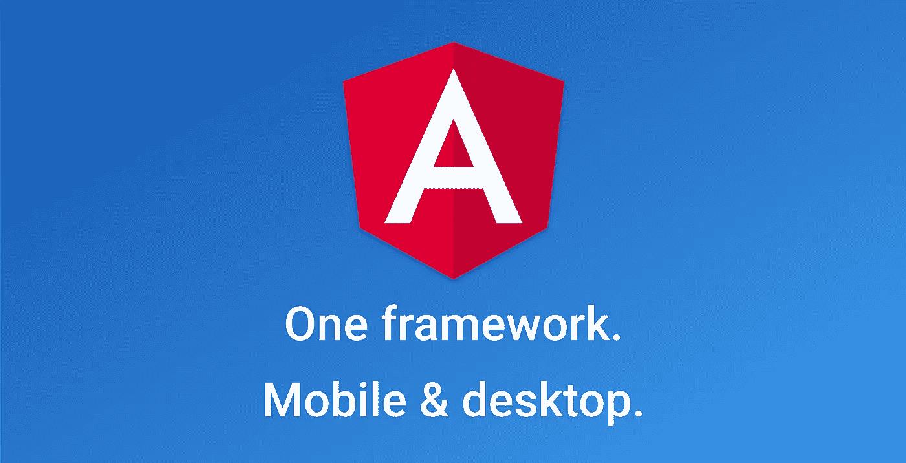

# 为什么我选择 Angular 进入 2021 年

> 原文：<https://betterprogramming.pub/why-i-chose-angular-going-into-2020-7fa08c67099c>

## 三个好理由

来源:angular.io

在前端开发世界中，大多数人会大肆宣传。他们会说如何将它用于 web、桌面和移动开发，并且很多大公司都在使用它。这使得为您的项目选择不同的库有点困难，尽管每个库都有其优点和缺点。我不会深入比较 JavaScript 框架和库——互联网上有大量这类东西。在这篇文章中，我会告诉你为什么在尝试了 Vue 和 React 之后，我决定选择 Angular。

# **棱角分明却固执己见**

早在 2015 年，我通过学习 Ruby on Rails 进入了 web 开发领域。我喜欢它。我喜欢 Ruby on Rails 的许多不同之处——其中之一就是它是一个固执己见的框架。对于那些不知道的人来说，自以为是的框架是一个有着某种做事方式的框架，开发者被推动着去遵循它，至少在某种程度上。

你们中的一些人可能不喜欢这些限制，更喜欢以自己的方式灵活自由地设置项目。如果是你，那么在 React 中构建你的 web 应用程序时，你会有更多的控制权。

我喜欢这一点，因为一旦你使用 Angular CLI 设置了你的项目，你就会得到一个模板引擎、一个路由器、表单验证、反应式编程 RXJS、一个关于如何构建你的代码以及数据应该如何在应用中流动的指南。这也使得其他开发人员更容易获得其他人的代码。

# **打字稿**

我打赌你以前听说过这个:是的，你可以使用带有 React 和 Vue 的 TypeScript。TypeScript 是 JavaScript 的强类型超集，Angular 就是建立在它之上的。它是开箱即用的，所以有家的感觉。我喜欢 TypeScript，因为它是一种严格类型化的语言——如果类型使用得当，它们会使您的代码更容易理解、管理和重构。

例如，通过使用类型，您可以判断函数接受什么类型的参数，以及它直接从 IDE 返回什么值。这省去了你做`console.log()`去弄清楚什么去哪里的麻烦。

编译器还会发现任何类型不匹配的情况，这些情况通常不会被发现，只会在运行时被发现。几乎每个 JavaScript 开发人员都经历过调试过程，他们必须处理类型错误。还有其他方法可以解决这个问题——例如，在 React 中可以使用 prop 类型，但它仍然不如 TypeScript 和 Angular 中的类型那样自然。

还有一个巨大的好处是，TypeScript 提供了依赖注入，它在 Angular 中被大量使用，因为它允许您将服务和其他类注入到一个组件中，使该组件能够访问这些类。

# **RXJS**

这不仅仅是一个有棱角的东西，你可以将它添加到任何项目中，并以或多或少相同的方式使用它。但它是 Angular 附带的，并且用于他们的内置服务，如 HTTPClient，这是从 Angular 应用程序发出 HTTP 请求的实际方式。RXJS 以最少的代码为您提供了强大的功能。

假设您发出一个 get 请求，发现响应的格式不是您想要的。添加一个像`switchMap`这样的操作符可以让你改变数据并以你想要的方式返回。如果您决定对返回值进行一些其他的修改，您可以很容易地添加另一个操作符。当你找不到一个能做你想让它做的事情的操作者时，你可以建立你自己的定制操作者。

因此，对现有代码进行重构或添加额外功能相对容易。RxJS 对于状态管理也非常有用，因为您可以创建一个可观察对象，并从多个地方订阅它——当主可观察对象发生变化时，它会发送给所有订阅者。

# **总结**

Angular 可能比 Vue 和 React 更难学，但是一旦你熟悉了它，你就有了一个可以用于混合移动/PWA 开发(使用 Ionic 4)的一体化框架，它受 Google 支持，有非常好的文档，并附带了处理下一个项目的功能。

 [## 费萨尔·舒拉💙

### 费萨尔·舒拉的最新推文💙(@fchoura)。瑞士信贷|day☀️的 Javascript 开发者#Flutter 开发者…

twitter.com](https://twitter.com/fchoura)