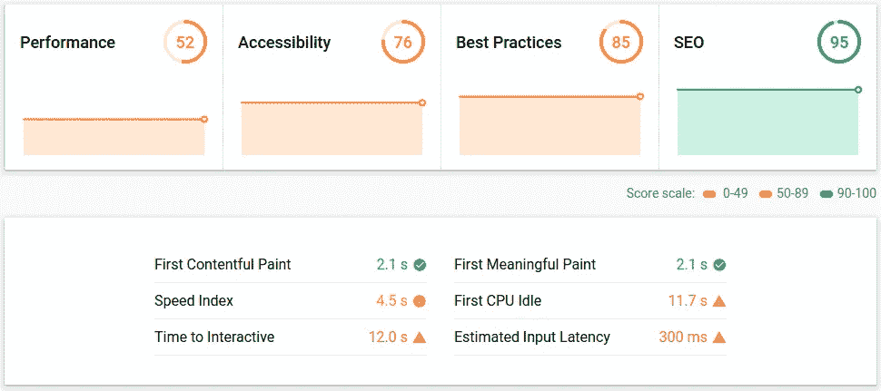
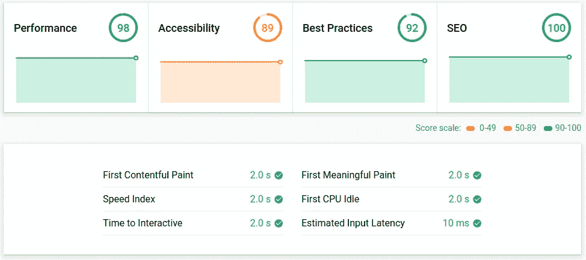

# 为什么我选择盖茨比而不是 Next.js

> 原文：<https://betterprogramming.pub/why-i-chose-gatsby-over-next-js-115eb186ef65>

## 服务器端呈现与静态站点生成器

[安舒 A](https://unsplash.com/@anshu18?utm_source=medium&utm_medium=referral) 在 [Unsplash](https://unsplash.com?utm_source=medium&utm_medium=referral) 上的照片

# **有时候，开发人员会弄错**

很少见，但确实有。

我们喜欢使用最新的技术，探索最新的框架。绿地项目是一个尝试全新事物的绝佳机会，即使你并不完全了解它实际上是否是正确的技术，也经常使用老的“为项目使用正确的技术”的借口。因此，当有人联系我为一个客户创建一个新网站时，我将此作为探索 Next.js 的绝佳机会。

我想探索 Next.js，因为服务器端呈现(SSR)非常适合 SEO 目的，但它真正的亮点是用 React 创建“混合”网站的能力。这允许您使用 SSR 从 API 中获取一些可用于 SEO 目的的数据，然后在页面呈现后可以加载 SEO 不需要的任何内容。Next.js 方便地公开了`getInitialProps`(现在是`getServerSideProps`)，所以启动并运行 Next.js 相当简单。

很快，我就用 Next.js 部署了一个完整的网站。这需要一台服务器，在最终转移到亚马逊 EKS 之前，我最初将它部署到亚马逊弹性豆茎。然而，没过多久我就发现了 [Gatsby](https://www.gatsbyjs.org/) 并很快意识到 Next.js 对我的用例来说有一些不必要的开销。

# 盖茨比出现了

无可否认，网站上的所有内容都是硬编码的，因为很少需要更新，所以这个用例的服务器端渲染肯定是不必要的开销(性能和成本)，即使使用 Next.js 提供的静态优化也是如此。

另一方面，Gatsby 是一个静态站点生成器，本质上是在构建时生成所有必要的内容和页面，例如，允许您在亚马逊 S3 上托管它，而不是依赖于对服务器的需求。盖茨比也有一个真正深思熟虑的插件生态系统。只需几行代码，您就可以添加诸如站点地图生成器、TypeScript 和 Sass 支持、Google Tag Manager 和一大堆其他有用的插件。

当我在工作中有一点休息时间时，我给自己一个两小时的时间盒来获得一个基本的概念证明，并与盖茨比一起运行。事实上，做一个简单的概念验证需要大约 15 分钟，在几秒钟内从一个 API 生成了 600 多页。我决定利用剩下的时间来创建一个更完整的设计概念，它利用了我们工程团队创建的设计系统。在几个小时内，我已经创建了一个支持 600 多页的完全交互式的设计概念。它非常接近成品。

下面是现有页面(使用自定义 SSR 实现)和新的 Gatsby 生成版本之间的性能比较:

登录页面(自定义 React SSR 实施)

概念验证登录页面(Gatsby)

如您所见，转向静态生成的页面极大地提高了性能。

我之前提到过我在自己的一个项目中使用了 Next.js，但是很快意识到它对我的用例来说是不必要的。如上所述对 Gatsby 进行试验后，我想看看我能多快地将一个站点从 Next.js 迁移到 Gatsby。

结果证明这是一个相当琐碎的过程。在不到一个小时的时间里，我已经用我需要的所有东西(包括所有插件)手动更新了`package.json`文件，放入了一个`gatsby-config.js`文件来配置我需要的所有插件，用 Gatsby 的等价物替换了所有对 Next.js 的引用(例如，`Link`用于路由)，并创建了一些新的组件，这些组件利用了一些新的插件，如`gatsby-source-instagram`。

我必须指出，我对 Next.js 的使用是相当轻量级的，所以移植是相当琐碎的，但是我可以想象如果你已经广泛使用了`useStaticProps`，那么移植会困难得多。不过性能又一次大幅提升。

# 如果需要动态路由呢？

事实证明，Gatsby 确实支持动态路由。这在 Gatsby 中被称为[客户端专用路由](https://www.gatsbyjs.org/docs/client-only-routes-and-user-authentication/)，它允许您根据 URL 参数加载不同的内容。这对于任何不需要 SEO 优化的页面都很有用，比如身份验证之后的内容。然而，它确实需要在文件服务器/ CDN 上进行一些配置来路由这些页面。

# 数据源

我现在正在尝试使用像 [Contentful](https://www.contentful.com/) 这样的无头 CMS 来管理和更新网站上的内容。如前所述，Gatsby 有一个奇妙的插件生态系统，使得它非常容易与许多不同的数据源集成。所有这些数据源都汇集到一个 GraphQL 层中，您可以使用[graph QL UI](https://www.gatsbyjs.org/docs/running-queries-with-graphiql/)轻松查询该层以进行调试。

有了 Gatsby，您可以轻松地组合插件来创建一个电子商务网站，使用 headless Shopify 作为管理产品和订单的数据源，然后使用 Contentful 作为登录页面，甚至使用 headless Wordpress 来集成一个博客。(Contentful 做得很好，所以考虑用它代替 WordPress。)

需要注意的一点是，数据是在构建时提取的，因此每当有新内容时，您将需要某种机制来重建网站。许多数据源都支持的一种方法是使用 webhooks。一旦进行了更改，您就可以使用 webhooks 来触发您的 CI(比如 CircleCI ),从而在零停机时间的情况下构建和部署新版本的站点。另一种方法是设置一个 cron 任务，定期进行重建。

# 结论

Gatsby 非常强大，我目前正在用它建立一些网站。我之前考虑过把一个相当大的 CRA 网站迁移到 Next.js，但是我现在打算用 Gatsby 来代替。

远离服务器端渲染也降低了开销成本。我可以简单地将所有静态资产存储在亚马逊 S3 上，由 CloudFront 作为 CDN 提供服务，而不需要托管服务器，比如 AWS 中的 EC2 实例。

当然，在许多用例中，Next.js 更有意义，但是 Gatsby 在满足我当前所有项目的需求方面做得很好。

正如一些人在评论中正确指出的那样，Next.js 9.3 增加了对[静态站点生成](https://nextjs.org/blog/next-9-3#next-gen-static-site-generation-ssg-support)的支持，但此时我已经转移到了 Gatsby。我肯定更喜欢 Gatsby 的插件架构，以及通过 GraphQL 查询所有可用数据的能力。

你考虑过移居盖茨比吗？我很想知道是什么阻碍了你。或者如果你已经在用盖茨比了，可能会后悔，我很想知道为什么。欢迎在下面评论。