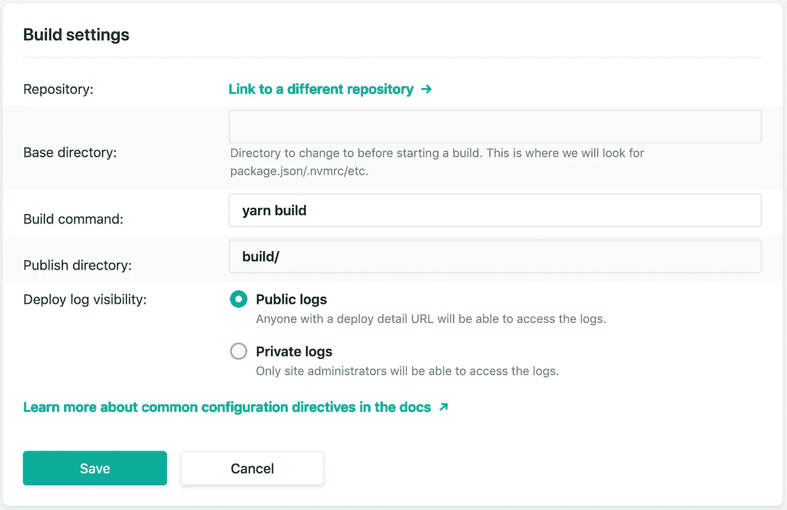

# 我为什么抛弃 AWS(某种程度上)

> 原文：<https://betterprogramming.pub/why-i-ditched-aws-sort-of-35db7fa01b7b>

## 我的 Netlify 之旅和我为什么要转行

多年来，我一直在为各种应用程序使用 AWS。到处都有一些 EC2 实例。可能有一两个数据库。最常见的是，我用它来托管网站和 DNS 注册/路由。我典型的工作流程是拿一个 S3 桶，放一个网站进去，注册 DNS 指向桶，然后*就完成了*。它对我需要做的事情非常有效，但是在过去的几个月里，我思考 AWS 是否真的是适合我的解决方案🤔。我只是一直认为 AWS 给了*太多的*，但这怎么会是个问题呢？

作为一名 web 开发人员，AWS 只是觉得有些矫枉过正。就像我在用大锤钉钉子一样。我在多家公司工作过，都使用 AWS，所以这是我所知道的全部。我在管理控制台中感觉很舒服。我总是求助于 AWS。

# 为什么要换？

一天，我试图为一个具有特殊配置的站点配置一个 S3 存储桶。像往常一样，我求助于谷歌寻找答案。一篇接一篇的文章让这种配置听起来过于复杂。我需要添加这个，然后改变这个，等等。等等。如果您曾经使用过 AWS，您会非常清楚它们的文档状态。这是一个永无止境的兔子洞。应该是简单的设定，从来没有那么简单。如果您是一家需要高级设置或配置的大公司，所有这些都很棒，但是对于您的典型开发人员来说，这是一场噩梦。所以我开始在其他地方寻找托管解决方案。

# 去哪里找？

我使用谷歌的 Firebase 已经很多年了。主要用于通过 Firestore 进行应用认证和数据存储。这是一个伟大的服务，我喜欢它！然后我发现 Firebase 也提供了[托管](https://firebase.google.com/docs/hosting/quickstart)😮。我设置了 CLI，注册了我的应用程序，运行了一个简单的命令，然后💥，我的应用程序现在在网上直播。太神奇了。最低配置。没有永无止境的文件。不到五分钟，我就开始工作了。包括 SSL😉。

# 但是有一个更好的选择

最近，我看到很多关于网络寿命的炒作。该平台承诺简化部署工作流，直接连接到您的代码库。没错，它将获取代码更改，构建您的站点，然后根据您的设置进行部署。请记住，还有其他平台会做类似的事情。周末的时候，我决定尝试一下。建立一个账户很容易。它通过了我的 Github 账户的认证。一次，我允许它连接我想要部署的存储库。Netlify 自动检测我的构建系统。该应用程序是通过 [Create React App](https://github.com/facebook/create-react-app) 启动的。这预先填充了构建命令和输出目录。我确认这是正确的，构建和部署管道已经排好了队。

几分钟后，我看到构建已经完成，我点击了该网站被分配的链接。我的网站就在那里，功能齐全，我没有在本地做任何事情。没有本地版本，没有 CLI 或 GUI 来上传应用程序。为了进行测试，我向 master 提交了一个 commit。另一个构建开始了，那些改变在几分钟内就被激活了。我的脑子被*炸了*。将我的 DNS 指向这个新部署的站点后，我单击了一个按钮，我的新 SSL 证书开始供应。几分钟后，我的网站就安全了。如果你愿意，你也可以带上自己的证书。Netlify 也有其他可用的选项和配置，但开箱即用的设置对我来说是完美的。总的来说，我印象非常深刻。除去我花费在部署和维护网站上的开发人员工作时间。

# 没有更多的 AWS…(某种程度上)

在把我所有的网站都转移到 Netlify 并删除了他们旧的 S3 桶之后，我仍然有我的域名在 AWS 中。我看到这个时候 Netlify 已经有 DNS 了(目前在测试中)。一旦这个功能退出测试，并假设有一个简单的 DNS 传输流程，我计划完全摆脱 AWS。他们目前没有伤害任何坐在 AWS 上的东西。我只是喜欢拥有一个整合解决方案的感觉😄。

# 结论

AWS 很棒。我没有看过这些数字，但我肯定他们是世界上收入最高的云提供商。许多公司和用户依赖于它们。如果他们倒下了，我敢肯定整个互联网都会崩溃，我知道 Netlify 甚至在引擎盖下使用它们。我的结论是 AWS 对我来说太难了。太多，永无止境的文件。太多的设置和杠杆拉。太多的服务，其中 90%我不知道如何使用！我只是一个卑微的 web 开发人员。让我建一个网站，然后把它放到野外。我想专注于构建令人惊叹的应用程序，而不是担心如何部署它们🚀。我的结论是，转向网络生活对我来说是非常积极的。我会把它推荐给任何寻找适合自己的托管解决方案的人。