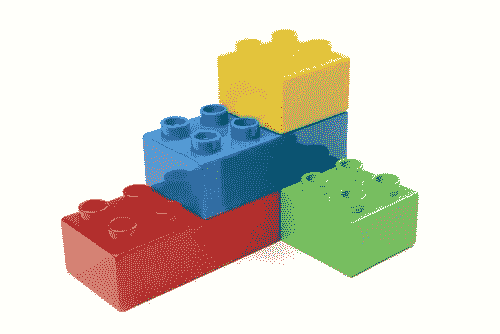
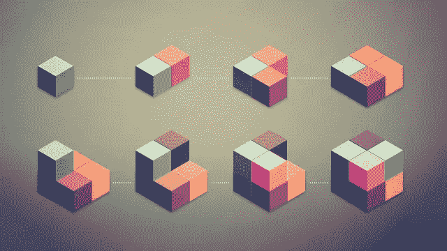
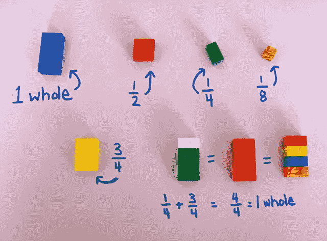

# 为什么我爱上了 Ramda 和 JavaScript 中的函数式编程

> 原文：<https://betterprogramming.pub/why-i-fell-in-love-with-ramda-and-functional-programming-in-javascript-797c070133b0>


Ramda.js

这一切都始于斯德哥尔摩 2018 年 12 月黑暗的一天。我搬到斯德哥尔摩，在一家新公司开始一份新工作，当我到达那里时，每个人都在为一月份的假期做准备。我的入职人员把我放在一个遗留项目上，这个项目是他们从黑客周项目中获得的，并告诉我对这个项目进行更改，并在 4 月份之前准备好投入生产。我想，*好吧，我开始了一份新工作，所以我应该在每个人度假回来的时候交付所有东西*。

我打开 git repo，发现这个项目完全是用 JavaScript 以反应式和函数式编程风格编写的。我没有任何 JavaScript 的反应式和函数式编程的背景。

之前的开发者确实使用了 [cujojs/Most](https://github.com/cujojs/most) 作为 [RxJs](https://github.com/ReactiveX/rxjs) 的替代，后者取了反应式编程部分，而 [Ramda](https://ramdajs.com/) 取了函数式编程部分。

当时，我只是盯着屏幕，试图理解这个 [Most 库](https://github.com/cujojs/most)是什么，它到底是做什么的。我花了大约两周的时间来理解核心概念。这个库的愚蠢的名字使得它无法在谷歌上搜索一些教程文章。唯一有知识的学习来源是 Github Wiki 页面。

试着在谷歌中搜索下面的关键词(在第一页甚至其他有谷歌搜索结果的页面上，你都找不到任何有用的链接)。

**使用大多数 JavaScript 开始反应式编程。**

我的头脑花了很长时间才明白之前的开发者做了什么。但是随着我对 [cujojs/Most](https://github.com/cujojs/most) 、 [Ramda](https://ramdajs.com/) 的了解越来越多，并把它们结合在一起，我发现了我作为一个开发者的生活中的一个新窗口。

我想分享一下我用 [Ramda](https://ramdajs.com/) 和函数式编程的经验。我喜欢 [cujojs/Most](https://github.com/cujojs/most) 在反应式编程中的思考方式。还有很多其他选择，所以我觉得不能推荐 [cujojs/Most](https://github.com/cujojs/most) 。本文将只告诉你使用 [Ramda](https://ramdajs.com/) 的好处以及函数式编程概念。

# 函数式编程

在开始函数式编程之前，我需要解释一下 [Ramda](https://ramdajs.com/) 的一些概念和好处。然后，我们将研究一些真实世界的案例，在这些案例中，通过函数式编程，它变得更加容易和优雅。

## **纯功能**

有一个函数的概念叫做纯函数**。纯函数**是一个接受输入并返回一个值的函数，而不依赖于其范围之外的任何数据(副作用)。输出或返回值必须依赖于输入/参数，并且必须返回值。

```
let b = 10;function sum(a)
{
    return a + b;
}let c = sum(5);
```

上面的代码是一个不纯的函数。根据定义，它应该接受参数，只返回基于输入参数的值，而不依赖或更改范围外的变量。

```
function sum( a , b )
{
    return a + b;
}let s = sum(10 , 5)
```

上面的函数是一个**纯函数。**

那么，我们为什么需要纯函数呢？在函数式编程中，把你的代码想象成一些块，它们集成在一起就能完成一项有意义的工作。这些模块是可重复使用的，并且可以针对不同的任务以不同的方式集成。



这正是孩子们用乐高积木搭建东西的方式。每块积木都有一个概念和意义，以不同的方式组合在一起可以解决不同的问题。

## **函数式编程的优势**

*   编写测试更容易
*   纯函数可读性更强
*   更好的调试，因为纯函数和只检查输入和输出。
*   少写代码
*   作为一等公民的职能
*   综合代码
*   更多可重用代码
*   等等。

# 现实世界的例子

我经常使用函数式编程进行对象操作。这里我们将研究一个复杂的对象操作。

假设我们有一个来自 REST API 调用的对象，如下所示:

```
var data = {
  "result": {
    "authors": [
      {"id":101,"authorName":"Alice","phoneNumber":"555-1234"}, 
      {"id":124,"authorName":"John","phoneNumber":"893-4564" }
    ],
    "books": [
      { "id": 434, "title": "Divergent", "author": 124 },
      { "id": 435, "title": "The Giver", "author": 124 },
      { "id": 434, "title": "The Maze Runner", "author": 101 }
    ]
  }
}
```

## 案例 1——我们想要获得一个作者姓名的数组。

```
const {pipe , map, path} = require("ramda"); // import functionsconst pickAuthorNames = pipe(
  path(["result" , "authors"] ),
  map(item => item.authorName)
 );pickAuthorName(data); // this will return ["Alice" , "John"]
```

为了熟悉 [Ramda](https://ramdajs.com/) 的威力，我推荐看一下它的 [*文档*](https://ramdajs.com/docs) 和函数列表。

默认情况下，所有的 [Ramda](https://ramdajs.com/) 函数都支持 currying，简而言之，就是当你有一个接受两个参数的函数时。如果只提供其中一个参数，它将返回另一个接受第二个参数的函数。

例如，路径的最后一个参数总是您应该为函数提供的数据。第二个函数调用是 currying。

```
1- path(["result","authors"] , data)2- path(["result","authors"])(data) 
```

管道函数将函数集成在一起。当您为管道提供输入时，它会将值传递给第一个函数，然后用第一个函数调用的结果调用第二个函数。

## 案例 2——为了尝试更复杂的东西，让我们在作者和书籍之间做一个内部连接

```
const {pipe , map, path, filter, head, mergeDeepLeft} = require("ramda");const getAuthor = (id) => pipe( // create function to get an author
  path(["result" , "authors"]), // gets authors arrays
  filter(item => item.id === id), // find an array of items with id
  head // picks the first one
)const getJoin = (data) => 
pipe(
  path(["result" , "books"]), // get list of books
  map(item => // join items
    mergeDeepLeft(item ,getAuthor(item.author)(data)) 
  )
)(data)getJoin(data)
```

创建了两个功能，并轻松地将它们集成在一起。如果你不熟悉函数式编程，一开始，你可能会看一下这段代码，然后想*哈哈*！🧐

但是请相信我，这些代码是可读的，并且编写测试要容易得多。



在函数式编程中思考就像在块中思考一样。

# 结论: [Ramda](https://ramdajs.com/) vs Loadash vs 下划线

*   **curry:**默认情况下，所有 [Ramda](https://ramdajs.com/) 函数都支持 curry。
*   **不可变结构:** [Ramda](https://ramdajs.com/) 强烈支持输入参数不可变。
*   家里最小的
*   良好的功能界面

你需要考虑的最重要的事情是改变你的思维模式来解决函数式编程中的问题。把每个功能想象成一个模块，把它们组合在一起就能解决问题。



我选择了拉姆达，并喜欢和它一起工作。它提供了一整套优化的功能，可在不同的情况下使用，并以一种简单的方式集成在一起。