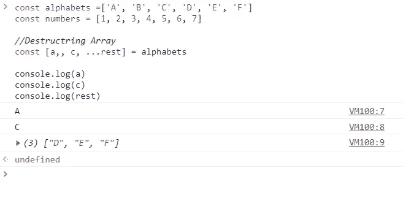
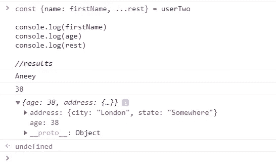
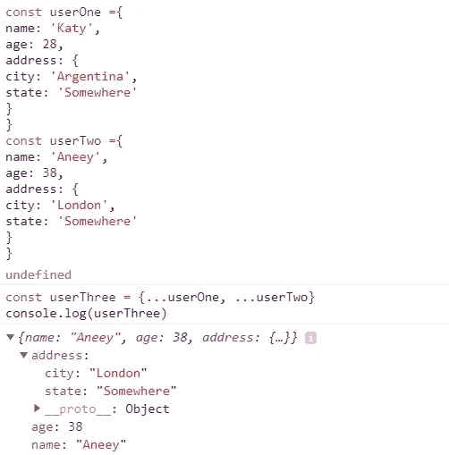

# 为什么我觉得 JavaScript 的析构如此有用

> 原文：<https://betterprogramming.pub/why-i-find-javascripts-destructuring-so-useful-7be41d9ba609>

## 数组和对象析构


照片由 [Pop &斑马](https://unsplash.com/@popnzebra?utm_source=medium&utm_medium=referral)在 [Unsplash](https://unsplash.com?utm_source=medium&utm_medium=referral) 上拍摄。

让我们看看 ES6 的一些最好的特性:对象析构、数组析构和 spread 操作符。如果你想使用 React 这样的前端框架进行开发——即使你不想这样做——它们对于使你的代码更加整洁和易于管理是非常有用的。

# 数组析构

析构是指将一个对象或数组转换成更小的对象、元素或变量。让我们来看一个简单的例子:

我们想得到数组中的前两个元素。通常，如果你想得到第一个元素，你应该这样做。但是这有点笨拙，使用析构有一种更简单的方法。

示例:

你把你想析构的元素放在`=`符号的右边。本质上，你是在说，“破坏这个字母数组。”

因为我们有一个数组，我们把括号放在这里，我们的数组把我们想要提供的元素括起来，所以我们有我们想要从这个数组中得到的变量名`a`和`b`。然后这些元素的位置就是它们将要被拉出的地方。因此，`A`是这个数组中的第一个元素，所以它要获取第一个元素。`B`是二次元，也就是要在这里得到二次元，以此类推。

但是如果我们想跳过`B`，例如？如果我们只想要`A`和`C`呢？那么，这将错过第二个元素:

```
//Destructring Array and skiping element
const [a, ,c] = alphabetsconsole.log(a)
console.log(c)▶ A
▶ C
```

假设我们想得到字母表中的其余元素。这就是 spread 操作符的用武之地。

示例:



析构和扩展操作符的另一个强大之处是你可以用它们来组合两个数组。例如:

```
const newArray = [...alphabets, ...numbers]console.log(newArray)//result
▶ ["A", "B", "C", "D", "E", "F", 1, 2, 3, 4, 5, 6, 7]
```

# 函数中的析构

该语法对于组合两个不同的对象将变得非常有用。另一个有用的地方是当你处理函数并从函数中返回多个参数时。所以，让我们在这里创建一个函数:

在析构中，我们也可以设置默认值:

如果我们在一个除法中传递值，它将被设置到那个除法中。

析构的力量在加注时并不明显。正如您在这里看到的，析构和构建数组仍然是有利的。它有许多用例——特别是在函数中——但是析构的真正威力来自于对象，所以让我们跳到对象析构。

# 对象析构

这与数组析构非常相似，但是位置会改变:

这将从 person 获取`name`属性，并将其映射到我们正在创建的`firstName` 变量。我们甚至可以在这里使用默认值:

就像数组析构一样，我们也可以使用扩展操作符:



你会看到我们在那个`object`里面得到了所有的东西，除了我们已经去掉的名字。`name`没有出现在那个`rest`对象中。同样，析构对象的好处是你可以析构你的嵌套对象。例如:

我们只是将这个析构对象嵌套在另一个析构对象中。我们可以做的另一件事是组合两个不同的对象。所以让我们把我们的两个对象放在这里，把`userOne`和`userTwo`组合起来。`userTwo`将覆盖`userOne`中的所有内容。一个简单的方法是:



像这样组合两个对象的能力在 React 这样的框架中非常普遍，甚至只是普通的 JavaScript。

# 在析构中解析函数的输入

我认为对象析构的最重要和最有用的部分是在参数的函数中使用它的能力。让我们创建一个函数:

因为我们只在这些参数中使用了`name`和`age`，所以我们可以使用析构:

你看，我们得到相同的输出。这是对象析构最有用的部分，我用得最多——尤其是在使用 React 这样的语言时，因为 React 在其函数调用中大量使用对象析构。

现在你已经知道了所有你需要知道的关于对象和数组析构的事情。JavaScript 析构是将您的 JavaScript 技能提升到一个全新水平的特性之一，所以要坚持练习。

# 结论

我希望你喜欢这篇文章，并发现它也很有用。

编码快乐！