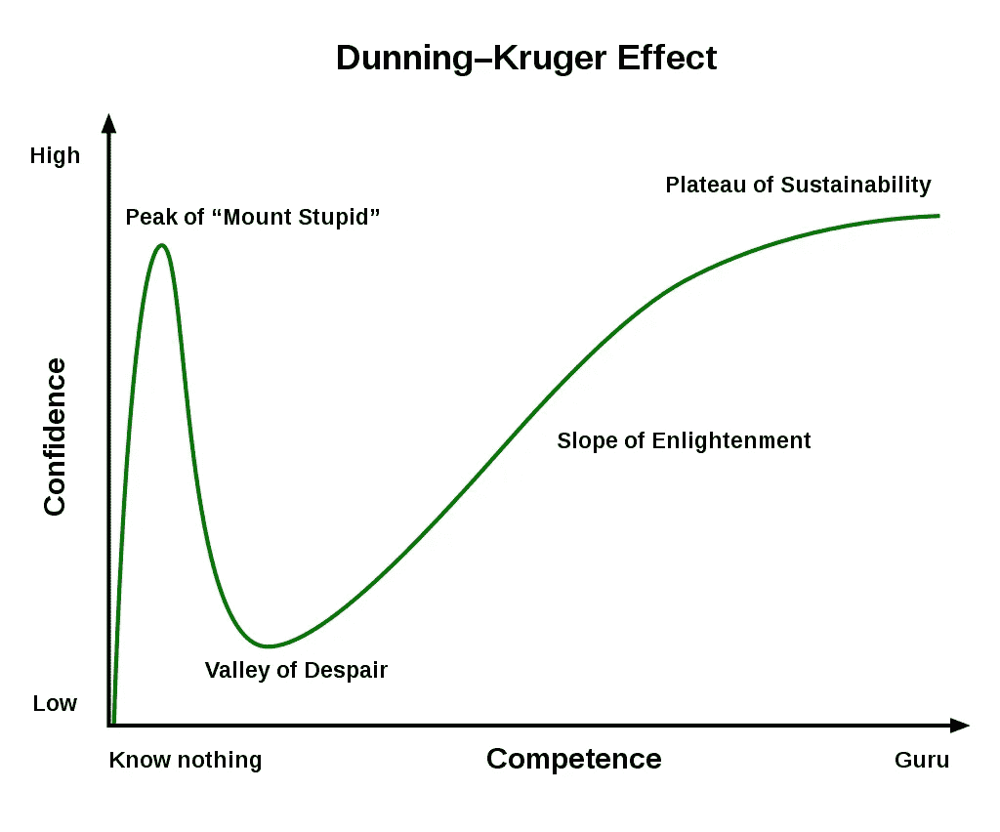

# 作为招聘经理，我为什么喜欢新兵训练营

> 原文：<https://betterprogramming.pub/why-i-love-boot-camps-as-a-hiring-manager-63ade2a442f7>

## 面试和雇佣新兵训练营候选人后的观察

布鲁斯·马斯在 [Unsplash](https://unsplash.com?utm_source=medium&utm_medium=referral) 上拍摄的照片。

作为一名高级软件工程师和一家高增长初创公司前端开发团队的经理，我会定期面试实习生和全职员工。在像软件工程这样竞争异常激烈的市场中，内部招聘人员常常很难找到让我考虑的候选人，更不用说雇佣了。

然而，在我面试的几乎每一个职位中，我最终都会遇到来自新兵训练营的候选人——他们已经开始让我惊讶于他们中许多人共有的一些特征。

我决定分享我对新兵训练营的看法，我有两个主要目标:

*   首先，我想让新兵训练营的学生放心，这个行业有他们的一席之地，也有喜欢新兵训练营提供的产品的招聘经理。
*   其次，我希望其他招聘经理在考虑是否面试新兵训练营的候选人时，有机会了解导致积极结果的因素。

# **需求**

训练营的存在是为了提供短期的强化训练，并使人力资源能够迅速提供给那些需要的人。根据[BLS 劳动统计局](https://www.bls.gov/ooh/computer-and-information-technology/software-developers.htm)的数据，软件工程(及相关职位)的工作预计在未来十年将增长 22%，与其他行业的工作相比，这被认为是“比平均水平快得多”。这些职位的平均年薪约为 11 万美元，是美国整体平均年薪的两倍多。如此高的薪水证明了对高质量人才的疯狂需求。

根据我的经验，对于开发人员来说，在当前的劳动力市场上，雇佣中高级工程师是一项极具竞争力的工作——即使是在旧金山这样的传统工程市场之外。这意味着作为一名招聘经理，我必须准备好稳定的初级工程师队伍——尤其是如果我希望我的组织在未来发展壮大的话(我就是这样)。

BLS 预计，该行业在未来十年将增加 30 多万个新工作岗位。为了满足这一需求，2020 年编码训练营培养了 25，000 名开发人员，根据课程报告显示，这一数字在过去十年中增长了约 10 倍。据 Code.org 的[称，这大约是同期传统计算机科学毕业生数量的三分之一。然而，那些拥有计算机科学学位的人肯定会更快地被大公司抢走，因为我面试的每一个拥有计算机科学学位的候选人，我都会面试两个以上有非传统背景的候选人(比如新兵训练营)。](https://code.org/promote)

这就是我真正喜欢新兵训练营的一点:与我们单独面试大学毕业生相比，他们提供了一个更大、更多样化的申请者群体。我采访过的人来自不同的行业，提供了各种各样的想法。我从增加的多样性中遇到的一些值得注意的属性包括:

*   来自以前工作的各种领域的专业知识(来自那些决定转行的人)
*   从团队工作和与导师一起工作中获得了大量的组织行为经验
*   来自服务不足的社会经济背景的代表，否则将没有机会在科技公司面试

虽然并非所有的新兵训练营毕业生都是全垒打，但我确实看到了我们最终雇佣的那些人身上的一些共同主题。

# 问题是

根据我的经验，与典型的大学毕业生相比，新兵训练营的毕业生在开始职业生涯时对现代 web 框架非常熟悉。这是一个巨大的好处，代表了新兵训练营提供的核心价值。相反，传统的大学计算机科学毕业生往往有更强的数据结构和算法基础，但仍然必须接受 React 等现代框架的培训。

如果我迫切需要添加一个可以快速构建基本 React 组件而不需要了解太多架构或数据结构的资源，那么雇佣一个已经接受过 React 培训的新兵训练营毕业生可以节省大量时间。

照片由[托马斯·帕克](https://unsplash.com/@thomascpark?utm_source=medium&utm_medium=referral)在 [Unsplash](https://unsplash.com?utm_source=medium&utm_medium=referral) 拍摄

然而，即使对现代 JavaScript 框架有了很好的介绍，我还是注意到了许多新手中反复出现的一些模式，这些模式证明了他们在 React 教育中的缺点。许多新兵训练营只持续 12 周，或者完全在网上进行，难怪他们工作的头几个月需要一些具体的指导。幸运的是，我喜欢指导这些人，并有幸与几位态度异常接受的人一起工作。

但是我不会天真地认为每个新开发人员都会有一个投入的导师。因此，我记录了一些[这些重复出现的模式](/5-code-smells-react-beginners-should-avoid-480c97799162)来帮助我自己的组织克服这个特殊的障碍:

 [## 初学者应避免的 5 种代码气味反应

### 在提交之前，请确保仔细检查您对这些内容的提取请求

better 编程. pub](/5-code-smells-react-beginners-should-avoid-480c97799162) 

# 优势

除了上述新兵训练营及其产生的候选人的好处之外，在我们聘用的非传统教育背景的人中，有一个主题似乎是不变的——这是科技行业每个人都应该努力实现的主题。

*哈佛商业评论*提出，终身学习是[经济的当务之急](https://www.economist.com/special-report/2017/01/12/lifelong-learning-is-becoming-an-economic-imperative)和[“唯一可持续的竞争优势”](https://hbr.org/1988/03/planning-as-learning)由于技术的快速发展，这一点在日新月异的软件行业中尤为明显。每次我面试新兵训练营的候选人时，我都会想起这一点。我问他们对学习什么感兴趣，他们几乎都有一个没完没了的清单。因为新兵训练营的毕业生经历了短暂的身临其境的学习经历，我注意到我们雇佣的那些人总是倾向于寻求更多。这就好像新兵训练营仅仅足以吊起他们的胃口，却不能完全满足他们的胃口。

 [## 识别并雇佣终生学习者

### 对于现在或未来的员工，最恰当的问题可能就是:你是如何学习的？终身…

hbr.org](https://hbr.org/2021/05/identify-and-hire-lifelong-learners) 

随着这种对学习的渴望而来的是一种渴望任何反馈的开放心态。接受建设性反馈而不产生抵触情绪的能力是工程师快速成长能力的重要标志。当有新问题需要解决时，这些人往往会第一个举手。他们渴望得到他们能得到的任何东西。虽然他们有时会不知所措，但他们的强化训练让他们做好了快速学习的准备。

由于这些特点，指导他们非常有趣。作为一名经理，看到最近的新兵训练营招聘成功是一种非常有益的体验。

# 邓宁-克鲁格效应

虽然以上几点表明了新兵训练营和他们的候选人倾向于拥有的一些东西，但许多候选人明显缺少的东西是邓宁-克鲁格效应。对于那些不熟悉的人来说，邓宁-克鲁格效应是一种心理学观察，它表明"[在一项任务中能力低下的人高估了他们的能力](https://en.wikipedia.org/wiki/Dunning%E2%80%93Kruger_effect)"如下图 1 所示，那些在特定主题中缺乏背景知识的人往往很难确定他们不知道什么，因此对该主题的信心不成比例。随着他们学得越来越多，他们的信心会减弱一段时间，直到他们对这个主题的知识已经饱和。就我而言，在我的职业生涯中，我多次发现自己处于“愚蠢之山”的顶端——这几乎发生在每个人身上。

Figure 1 — Dunning-Kruger Effect graph. Attribution: [忍者猫, CC0, via Wikimedia Commons](https://commons.wikimedia.org/wiki/File:Dunning%E2%80%93Kruger_Effect_01.svg)

然而令人惊讶的是，我遇到的许多新兵训练营候选人并没有表现出同样的曲线。相反，它更倾向于向右上方呈线性倾斜。或许他们表现出渴望终身学习的同样原因也有助于这种卑微的攀登？或者也许他们的训练营在“绝望之谷”就结束了？这也可能只是一个任意的观察，在更广泛的候选人中并不一致。

不管是什么原因，我喜欢它的缺失——它带来了特别好的新员工。

# 结论

在观察了所有这些之后，我可以着重建议，如果你是一名招聘经理，而你忽略了新兵训练营的毕业生，或者你的招聘人员没有找到他们的简历，那么就去寻找这个极其多样化、充满渴望、装备精良的人才库。可能需要一些指导才能让他们完全投入工作(对任何新员工来说都是如此)，但最终还是值得的。