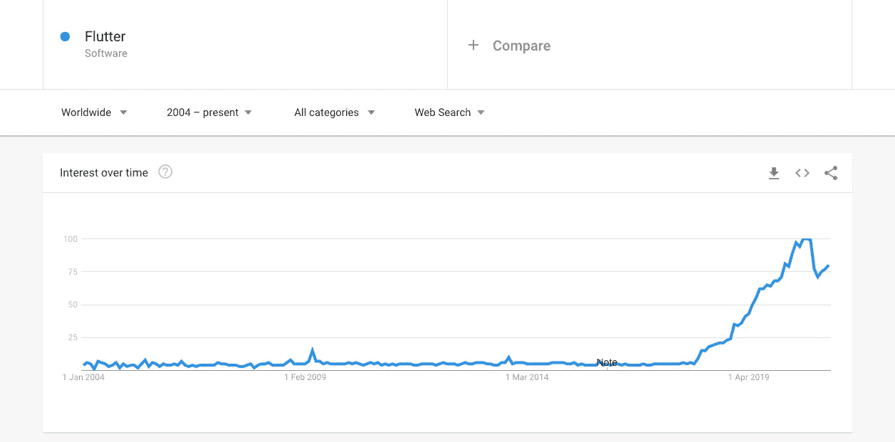
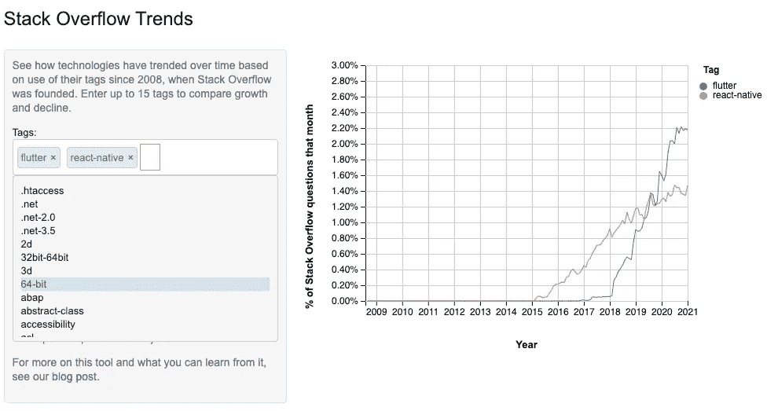

# 为什么我喜欢作为 React 开发人员的 Flutter

> 原文：<https://betterprogramming.pub/why-i-love-flutter-as-a-react-developer-b0f86773b01f>

## 你也会喜欢 Flutter 的 5 个理由

由[尤利娅·马特维延科](https://unsplash.com/@yuliamatvienko?utm_source=medium&utm_medium=referral)在 [Unsplash](https://unsplash.com?utm_source=medium&utm_medium=referral) 上拍摄

最近，我一直在尝试用 Flutter 构建跨平台的移动应用。最初，我害怕学习曲线，因为我对 Dart(Flutter 使用的语言)或框架本身一无所知。

在尝试了 Flutter 之后，我对这个框架印象深刻。作为一名 React 开发人员，我可以完全理解 Flutter 的工作方式。以下是五个原因。

# 宣言的

React 的一个关键特性是它是声明性的。与命令式风格相比，我们需要手动构造一个完整的 UI，声明式方法允许我们简单地描述当前的 UI，而将转换和状态管理等较难的方面留给支持它的框架。

Flutter 和 React 之间的一个很大的相似之处是声明性方法。就像我们在 React 中如何使用 JSX 来描述 UI 一样，类似地，在 Flutter 中，我们使用小部件来描述视图。

# 组件和小部件

在 React 中，我们有组件层次结构，其中一个父组件可以有多个子组件。在 Flutter 中，从屏幕到标签栏到文本，所有东西都是小部件，这一点同样适用。

这并不奇怪，因为 Flutter 的小部件是受 React 的启发。默认情况下，Flutter 附带了一个巨大的小部件库。小部件的概念是如此相关，我们将大视图分解成小的单独视图，并自底向上构建它们。这样的范例也加强了在应用程序中创建可重用的组件！

# 状态和道具

正如 React 允许我们管理组件状态并动态地将它们与 UI 挂钩一样，Flutter 也提供状态。

Flutter 有两种主要的小部件:无状态的和有状态的。在有状态小部件中，我们可以通过调用`setState()`来触发小部件的重建。听起来很熟悉，对吧？

事实上，React 有一个完全相同的名字`setState()`来更新状态。正如 React 更新 DOM 树一样，Flutter 每次重建时都会构建一个新的小部件树。

此外，我们可以像在 React 中一样，在 Flutter 中将道具传递给小部件。道具可以是变量，甚至是回调函数，提醒父窗口小部件重新呈现自己。

# 就像 JavaScript 一样

扑是用 Dart 写的。老实说，我从来没有真正想过它会与 JavaScript 如此相似。事实上，我甚至不需要学习 Dart 来学习 Flutter。

JavaScript 和 Dart 的主要区别在于 Dart 支持松散和强原型的类型化语言。我们可以显式或隐式地指定参数的类型。作为一种编译语言，Dart 可以在编译时发现大多数错误。

相比之下，JavaScript 是一种解释型语言，它同时支持动态和鸭式类型。Duck typing 是一个概念，其中类的类型或对象的类没有它定义的方法重要。因此，对于 duck 类型，我们不是检查类型，而是检查给定方法或属性的存在。

Dart 的类型安全和编译时错误查找当然是主要区别之一，也是一个很好的特性。

# 开发者社区

对我或任何采用特定技术的开发人员来说，最重要的因素之一是来自开发人员社区的支持程度。

Flutter 上的谷歌搜索趋势

从趋势来看，Flutter 的受欢迎程度近年来呈爆炸式增长，许多人采用该框架同时为 iOS 和 Android 平台构建。

# 为什么不反应原生？

让我们解决房间里的大象。有很多关于颤振和反应原生的比较。当然，作为一个 React 开发者，我的第一直觉就是看 React Native。我有过使用 React Native 的经验，事实上，在 Flutter 的早期，当采用还不像今天这样普遍时，我曾向我的开发伙伴强烈推荐 React Native。我想现在时代可能变了。

我绝对不会写 React Native。它有一个优秀的社区、很棒的文档、特性和自己的优势。然而，它也有一些怪癖。

## 原生应用

首先，React Native 并不是真正的 Native。它运行起来更像一个沙盒环境，尽可能地模仿本地体验。Flutter 的逐像素代码绘制为用户带来了更加自然、流畅的体验。

## 包装质量

其次，虽然 React Native 有无数的包，但我觉得对这些的长期支持是有限的。事实上，我遇到了太多的废弃包，这让我在使用外部包之前三思。另一方面，我觉得 Flutter 有很棒的图书馆，而且维护得很好。

## 证明文件

第三，我觉得 Flutter 有非常详细的文档，包括指南、视频和示例。React Native 的文档似乎更适合 web 开发人员，并且有一些空白。

## 社区

最后但同样重要的是，社区存在！

堆栈溢出趋势表明，Flutter 的受欢迎程度明显上升，并且已经超过了 React Native。这是一个非常重要的因素，因为作为一名开发人员，我想知道其他开发人员也对这项技术感兴趣。当我需要支持时，这保证了我可以依靠我的开发伙伴们！一个框架或技术的强大程度取决于采用、维护和开发它的社区。

# 这是所有的乡亲

这就是为什么 React 开发者会喜欢 Flutter 的五个原因。给 Flutter 一个机会，试试你的下一个副业，并在下面留下你的评论！

黑客快乐！