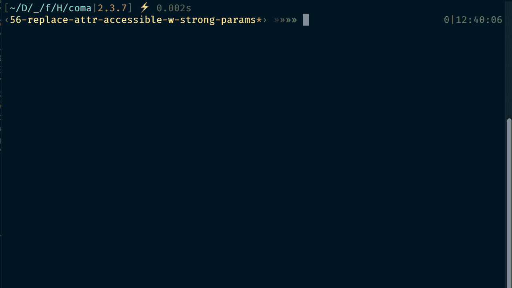
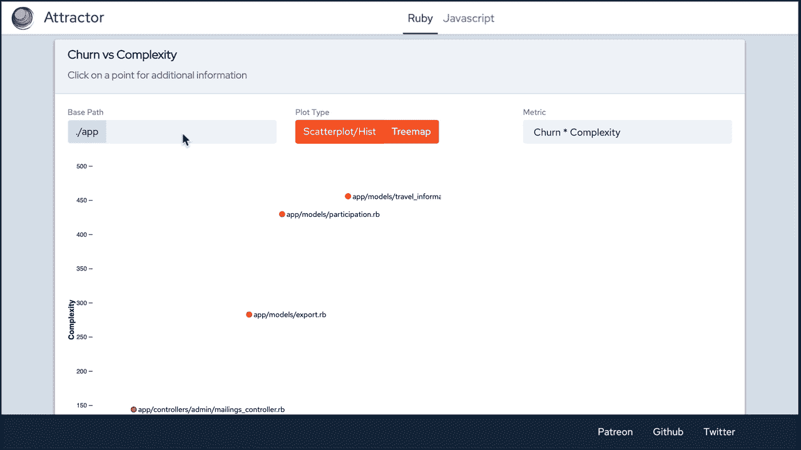
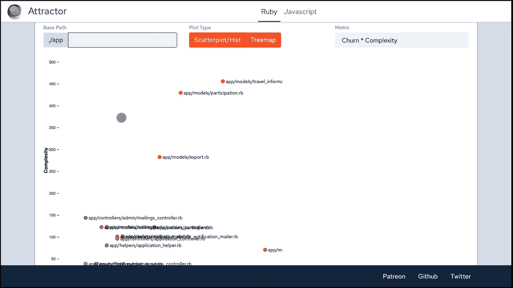
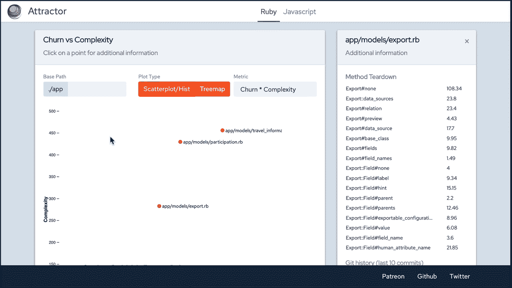
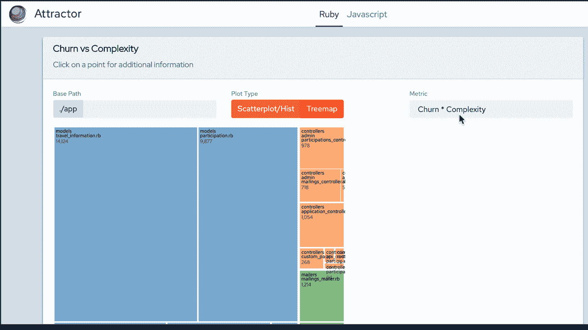
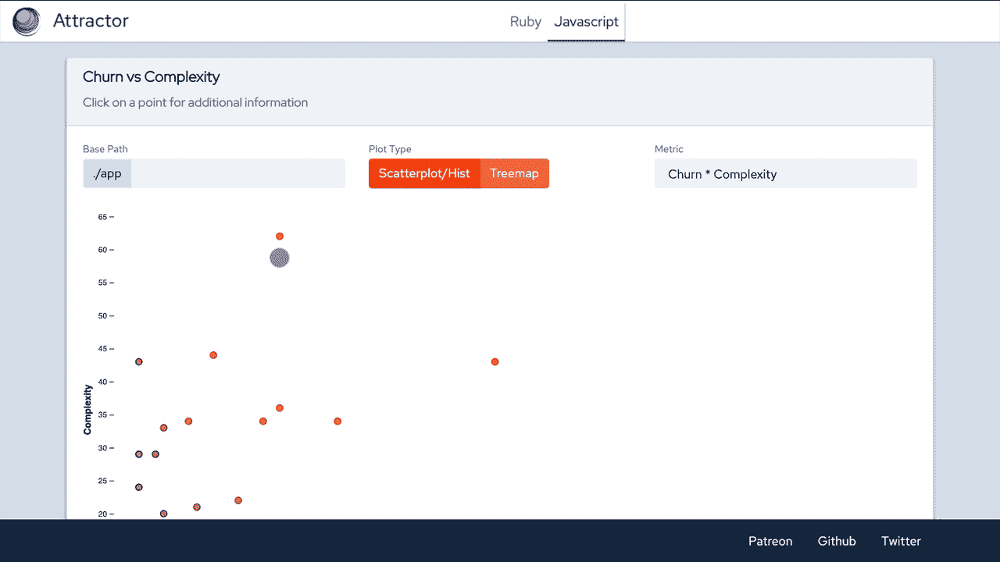

# 为什么我做了自己的代码质量工具，吸引器

> 原文：<https://betterprogramming.pub/why-i-made-my-own-code-quality-tool-c44b40ceaafd>

## 有时候，为了得到你想要的，你必须自己去创造


照片由[理查德·布鲁约](https://unsplash.com/@richardbrutyo?utm_source=unsplash&utm_medium=referral&utm_content=creditCopyText)在 [Unsplash](https://unsplash.com/s/photos/quality?utm_source=unsplash&utm_medium=referral&utm_content=creditCopyText) 拍摄

我需要一个语言无关的工具，可以作为 CLI 使用，来研究全栈代码库中的重构候选对象。

拿到这里:[https://rubygems.org/gems/attractor](https://rubygems.org/gems/attractor)。

# 介绍

在我开始介绍我制作的工具之前，更重要的是，*为什么*我这样做，让我告诉你一点我的背景。

现在，我主要是一个全栈 web 开发人员(主要是 [Ruby on Rails](https://rubyonrails.org/) 之类的东西)，但我也做相当多的前端工作(主要是 React)。更多的时候，我会被咨询代码库评审、重构，或者被临时召集来弥补短期需求。

在所有这些角色中，我已经意识到我需要一些工具来快速获得代码库的概览，解决痛点，和/或找出软件的关键逻辑在哪里，以便快速掌握它。

现在，让我们换个话题。许多作者( [Michael Feathers](https://www.agileconnection.com/article/getting-empirical-about-refactoring) 、 [Sandi Metz](https://www.sandimetz.com/blog/2017/9/13/breaking-up-the-behemoth) 等)已经表明，对软件项目中的变动(变更发生的频率)与文件复杂性的评估提供了对代码质量有价值的度量。

流失/复杂性图表是许多代码质量评估工具的核心，包括 [CodeClimate](https://codeclimate.com/) 、 [RubyCritic](https://github.com/whitesmith/rubycritic) 、 [es6-plato](https://github.com/the-simian/es6-plato/) 等等。

你可以在我提供的链接上阅读科学——我只是想同意这些作者的观点，调查具有最高`churn * complexity`产品*的文件/类实际上总是给出最好的线索，告诉我应该从哪里开始。*

因此，当所有这些工具都已经存在时，为什么还要建立另一个呢？

首先，我不相信仅仅因为一个想法已经有了一个具体化，就不应该再构建它的其他变体。出于同样的原因——这仅仅是指同一个领域——我们只需要一个操作系统、一种编程语言、一个编辑器、一个测试框架等等。—你可以没完没了地继续这个列表。

不，开源软件本身已经证明了可供选择的各种工具几乎总是有益于生态系统。社区必须决定我是否创造了有价值的东西。

第二，正如我在介绍中已经暗示的，我真的不满足于为我所关心的每一种语言安装和学习一种工具。

我宁愿有一个关于代码质量的真实信息来源。因此，我已经着手创建一个工具，它主要服务于两个目的:

1.  为多种编程语言提供(大致)相同的代码质量度量(以及便于浏览代码库的高质量可视化)。
2.  使它易于扩展，这样任何感兴趣的人都可以为`<fill_in_your_language_of_choice>`提供一个`Calculator`。

# 特色旅游

我这里指的是`attractor`的现场版本，也就是说，如果你输入:

```
$ attractor serve
```

在你的控制台里。最常见的情况是，您会给这个命令一个路径前缀选项`-p`，以将计算限制到某个目录，比如`app/`。

首先呈现给你的是指定文件夹中 Ruby 源代码的变动/复杂性图表，以及一些 UI 过滤选项。



最初，情节非常简单，但是如果您愿意，您可以选择显示文件名和回归线。如果您想进一步深入源目录，可以在文本输入框中添加路径。



如果您点击一个点，您将在侧边栏中显示更多信息:

*   有问题的文件的方法分解。
*   最近 10 次提交的 Git 历史记录。

继续向下滚动，您会看到重构候选列表，默认情况下是`churn * complexity`产品的前 95 %,但是您也可以更改这个百分比。



除了默认的散点图，`attractor`还提供了一个树形图表示，通过根据指定的度量划分总的可用区域，更加直观地显示文件的“重量”。



这让我想到了蛋糕上的最后一块樱桃——选择所用指标的能力——或者是`churn * complexity`或者是分别选择。

因为单个指标的散点图没有任何意义，所以在这些情况下我回到了柱状图。



最后，正如所承诺的，您可以在 JS(X)源文件中期待完全相同的特性(这是我的主要目标)。整洁！



# 可扩展性—自带计算器

我已经尽可能保持代码的模块化。因为文件变动是语言不可知的，你所要做的就是实现一个`calculator`，正如你在 [GitHub](https://github.com/julianrubisch/attractor/blob/master/lib/attractor/calculators/js_calculator.rb) 上的 JS 计算器中所观察到的。

此时，你所要做的就是在初始化器中提供你的文件扩展名:

```
def initialize(file_prefix: '', minimum_churn_count: 3)
  super(file_prefix: file_prefix, file_extension: '(js|jsx)', minimum_churn_count: minimum_churn_count)
end
```

在`calculate`方法中，产生了一个`change`散列，提供了对被检查文件的`file_path`的访问。

您在此处提供的块应该返回包含两个元素的数组:

1.  文件的总计算复杂度。
2.  (可选)一个“细节”散列，包含方法名作为键，它们各自的复杂性作为值。

所以，在`js_calculator`的例子中，首先，在 Ruby 类中我重写了`calculate`方法，如下所示:

```
def calculate
  super do |change|
    complexity, details = JSON.parse(`node #{__dir__}/../../../dist/calculator.bundle.js #{Dir.pwd}/#{change[:file_path]}`) [complexity, details]
  end
end
```

并编写了一个提供这些值的[节点脚本](https://github.com/julianrubisch/attractor/blob/master/src/javascript/calculator/index.js):

```
const report = escomplex.analyzeModule(fs.readFileSync(file).toString());const details = {};report.methods.forEach(m => {
  details[m.name] = m.cyclomatic;
});console.log(JSON.stringify([report.aggregate.cyclomatic, details]));
```

这可能是缺点之一:您必须使用目标语言提供的任何工具来提供复杂性(或其他)度量。

我目前正在考虑用于支持不同编程语言的架构。

可能，我会把它分成多个模块/宝石，但是我会推迟这个决定，直到对更多语言的需求到来。

# 未来方向

## 更多语言

如上所述，创建一个`Calculator`实际上非常容易，你甚至不需要任何详细的 Ruby 知识，只需要你所选择的首选语言中的代码质量工具的概念。

如果你有对`<your_language>`的需求，打开一个 [Github 问题](https://github.com/julianrubisch/attractor/issues)和/或给我一个 ping。

## 更多指标

我能想到的两个是自动化代码气味检测和测试覆盖。如果你有想法，或者愿意投稿，打开一期[Github](https://github.com/julianrubisch/attractor/issues)让我们一起讨论。

## 替代可视化

我想到的是散点图和树状图，但也许还有更可行的？像[网络图](https://www.d3-graph-gallery.com/network.html)、[弦图](https://www.d3-graph-gallery.com/chord.html)、[弧图](https://www.d3-graph-gallery.com/arc.html)之类的。只要告诉我你的想法或者打开一个 Github 问题。

## 自动检测

根据应用程序根目录中的包文件，可以自动检测使用哪个复杂度计算器。对此 Github 已经有了一个[问题](https://github.com/julianrubisch/attractor/issues/56)，并将在未来的版本中实现。

## GitHub 应用

在您的情况下，安装吸引器和/或将其添加到项目的`Gemfile`可能是不可能的。可以想象为这种情况创建 GitHub 和/或 GitLab 集成，在云中的某个地方运行一个`attractor`实例。

我不确定这是否有任何价值，因为 [Code Climate](https://codeclimate.com/) 已经提供了一个慷慨的免费计划。无论如何，如果你有这样的需求，让我们联系吧！

## 导出功能

这可能更现实——您可能需要导出代码质量数据，例如，随着时间的推移跟踪它，将它与其他项目进行比较，等等。如果你对此有任何想法，请告诉我！

# 总结想法

我最初的动机是用这个项目搔搔自己的痒处，快速浏览一下我目前所在的代码库。这个目标只实现了一部分，因为我只实现了我从其他工具中已经知道的东西。

但是后来，我认真地开始相信这可以成为一个社区的努力，因为也许像我这样感兴趣的代码美学家可以贡献出如何更好地解析、处理和可视化源代码的想法，更不用说什么机器学习、聚类算法等了。在这样的环境下会有什么发现。

所以，如果你对代码可发现性有一些高瞻远瞩的想法，让我们联系吧！

# 链接

*   从 [RubyGems](https://rubygems.org/gems/attractor) 下载宝石
*   [github 上的源代码](https://github.com/julianrubisch/attractor/)

# 信用

感谢前往:

*   [fastruby.io](https://www.fastruby.io/) 的 ernesto Tagwerker([@ etagwerker](http://twitter.com/etagwerker))始终如一地给予反馈和指点。我觉得我们俩的想法非常一致！