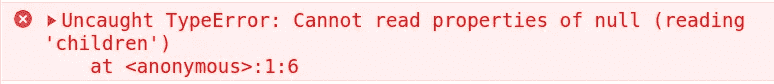
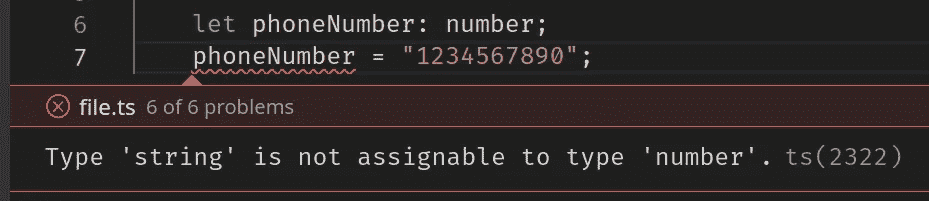
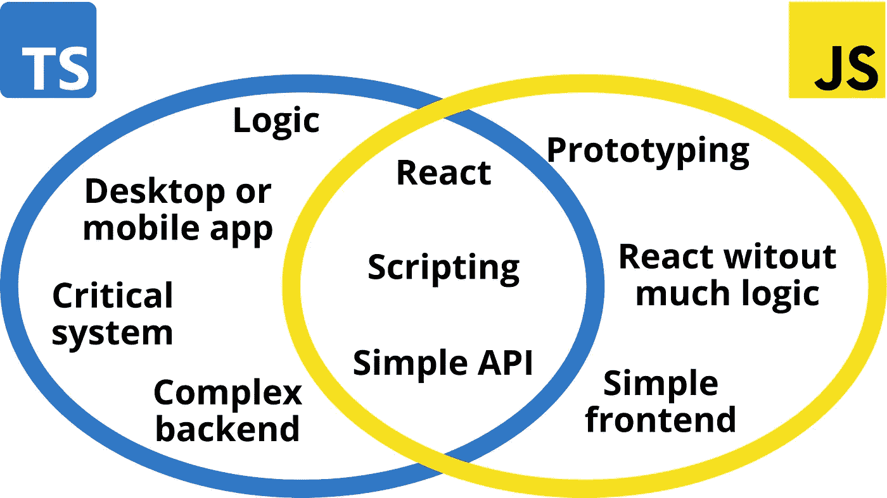

# 为什么我再次从 JavaScript 迁移到 TypeScript

> 原文：<https://betterprogramming.pub/why-i-migrated-from-javascript-to-typescript-again-69819a55daab>

## TypeScript 的好处以及何时应该迁移到它

照片由[克里斯·布里格斯](https://unsplash.com/@cgbriggs19?utm_source=medium&utm_medium=referral)在 [Unsplash](https://unsplash.com?utm_source=medium&utm_medium=referral) 拍摄

人们说，JavaScript 运行网络。然而，根据 2021 年堆栈溢出调查[显示，39%的 JavaScript 开发人员讨厌它，只有 61%的人真正想使用它。](https://insights.stackoverflow.com/survey/2021#section-most-loved-dreaded-and-wanted-programming-scripting-and-markup-languages)

2012 年，当 JavaScript 仍然是 web 开发之王时，微软发布了他们的新编程语言 TypeScript。它的设计是为了弥补 JavaScript 在大型复杂系统中的不足，因为它更灵活的表亲会让开发人员感到不安。

调查还显示，相当一部分 JavaScript 开发人员希望使用 TypeScript，甚至转而使用 TypeScript。数据显示，后者目前是第三大最受欢迎的编程语言，75%的开发者希望在 2022 年使用它。

# 复杂系统中的 JavaScript

不久前，我开始开发一个关系数据库管理系统，我想从头开始实现它。尽管我从来都不是 JavaScript 的粉丝，但我仍然决定用 Node.js 编写这个系统，因为我想了解更多关于这项技术的知识。

最初，我对 JavaScript 的动态类型系统和极其灵活的结构有点满意。我可以比用 Java 或 C++这样的语言更快地编写代码，这是我在这个项目中的第一选择。

然而，随着代码库变得越来越大，越来越复杂，我开始经常遇到打字问题。我相信大多数人都知道收到“*无法读取未定义/null* 的属性”错误消息的沮丧，但是您不知道它可能来自哪里。

JavaScript 中的空类型错误。

JavaScript 的另一个难题是处理对象。我总是不得不回到我创建这些对象的地方，因为没有办法定义一个所有实例都必须遵守的严格模板。更糟糕的是，IDE 不能帮助捕捉输入错误，最重要的是，它不能给出任何关于一个对象有什么方法和属性的提示。毕竟，`any`类型没有为您和 ide 提供太多的信息。

虽然 JavaScript 在几个文件中只有几百行代码的代码库中做得很好，但您肯定会迷失在分布在几十个深度嵌套的文件和文件夹中的几千行代码中，更不用说过一段时间后重新工作的困难了，那时您可能已经忘记了存储在`sqlToken`变量中的对象看起来是什么样子了。

除此之外，查看您代码的其他开发人员可能会发疯，试图弄清楚某个结构是由什么组成的，或者它应该如何使用，更不用说调试与边缘情况相关的问题了。

# 为什么要迁移到 TypeScript？

虽然将您的代码库迁移到另一种技术看起来很可怕，特别是当您不熟悉它，并且大多数人都倾向于远离它时，但有时这是必要的。就我而言，我不得不切换到 TypeScript 两次。

我不得不迁移的第一个项目是数据库管理系统，重写它绝对是一件痛苦的事情。首先，我必须学习这门语言以及如何设置开发环境。然后我检查了整个代码库，发现了几十个我想都没想过的愚蠢的打字错误和糟糕的做法。事实上，当您不需要在有意识地设计将要使用的数据结构上投入太多精力时，您在编写代码时往往会注意力不集中。

我必须迁移的第二个项目是预订系统的 React 前端。幸运的是，前端代码通常不包含太多逻辑，所以用 TypeScript 重写相对容易。然而，应用程序正确处理后端和前端之间的数据交换是至关重要的。特别是，最棘手的部分是商定一个公共结构，通常是 JSON，来表示请求中的数据。

在定义这样的结构时，对类型尽可能严格和精确是一个好主意，定义什么是允许的，什么是不允许的，以避免潜在的危险情况。这就是静态类型语言(如 TypeScript)派上用场的地方，因为它们不允许您执行可能导致类型错误的操作——至少是直接执行。

TypeScript 捕捉一个愚蠢的错误。

# 迁移过程

现在，要将代码库语言从 JavaScript 更改为 TypeScript，您必须经历一个两步过程。首先，你需要设置好开发环境。这包括安装所需的依赖项和创建一个`tsconfig.json`来定义编译器设置。

在根目录中，运行以下命令将 TypeScript 添加到项目中。注意，你必须在你的系统上安装`npm`。

`npm install typescript — save-dev
npx tsc --init`

现在你必须根据你的需要编辑新创建的`tsconfig.json`文件。为了让文章更简洁，我不会把重点放在如何做上，但是你可以遵循[这个简单的指南](https://www.typescriptlang.org/docs/handbook/migrating-from-javascript.html)。不管怎样，下面是一个 Node.js 项目的`tsconfig.json`的例子:

一个 Node.js [项目](https://github.com/nic-obert/nodedb)的 tsconfig.json。

第二步是调整您的 JavaScript 代码，添加静态类型并修复最终会暴露出来的明显错误。然而，要做到这一点，您首先必须了解一些类型脚本。幸运的是，入门并不难，而且有无数关于它的好的在线教程。

下面是一个先在 JavaScript 中，然后在 TypeScript 中显示的 Redux 存储片段的示例:

Redux 存储片的 JavaScript 代码。

Redux 存储切片的类型脚本代码。

恭喜你！您已经不费吹灰之力就让您的代码库变得更加健壮和可靠。

# JavaScript 与 TypeScript:何时使用

尽管我个人不喜欢 JavaScript，但我必须承认它在软件开发领域有一席之地。事实上，它灵活的语法非常适合快速简单地处理 web 请求和各种事件。此外，由于它的高抽象级别，它是一个很好的入门工具，并允许您轻松地用代码实现您的想法。

尽管如此，JavaScript 并不总是最好的答案。虽然它在前端层的开发中仍然占据着主导地位，但不幸的是，由于我之前提到的所有原因，它缺乏复杂逻辑和大规模系统所需的可靠性和健壮性。

本质上，如果您没有预见到您的代码库会增长到超过几百行代码，那么坚持使用 JavaScript 可能会更好，因为 TypeScript 可能有些矫枉过正。另一方面，如果您计划实现许多功能或处理大量数据，那么您应该直接从 TypeScript 开始。

如果您不确定，您可以开始用 JavaScript 构建，并最终使您的代码库适应这种情况。至少以我的经验来看，在你的代码变得太大太复杂而无法移植到一个结构更好的技术栈之前，你的代码会变得太难管理。

TypeScript 与 JavaScript 用例图。

# 结论

总而言之，JavaScript 对于简单的小型系统已经足够好了，比如应用程序前端或最小的 API 后端。然而，对于更复杂的软件，比如订票系统后端或数据库管理系统，你最好使用结构更好的编程语言，比如 TypeScript 或任何其他具有静态类型的语言。

尽管这很好，但是 JavaScript 并不能解决所有问题。这就是为什么许多不同的编程语言和技术首先存在的原因:它们被设计来完成一个特定的任务。而且，尽管你确实可以为你构建的每个系统使用一个技术栈，但这并不意味着你应该这样做。毕竟，你不能用锤子敲螺丝:螺丝刀能做得更好。

> 生活中没有放之四海而皆准的方法。归根结底，就是使用正确的工具完成正确的工作。

我希望你喜欢这篇文章。如果你有任何补充或问题，请在评论中分享你的想法。

感谢阅读！