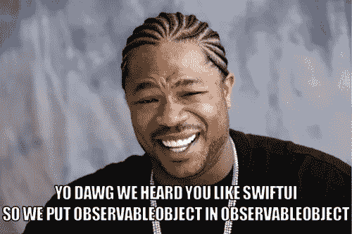

# 为什么我在 SwiftUI 中停止使用 ObservableObject

> 原文：<https://betterprogramming.pub/why-i-quit-using-the-observableobject-in-swiftui-11bc4b844ca0>

## 它有一个致命的缺陷，对于 Redux 风格的状态管理尤其明显


照片由[张艺](https://unsplash.com/@kencheungphoto?utm_source=medium&utm_medium=referral)在 [Unsplash](https://unsplash.com?utm_source=medium&utm_medium=referral) 上拍摄

在 WWDC 2019 [数据流直通 SwiftUI](https://developer.apple.com/videos/play/wwdc2019/226/) 会议之后，“单一来源的真相”已经成为 iOS 社区的流行语。

SwiftUI framework 旨在鼓励以单一来源的风格构建应用程序，但这并不意味着整个应用程序必须只有一个中央状态，实际上你可以[将其分解](https://medium.com/better-programming/swiftui-microservices-c7002228710)。

但是在任何情况下，您都很可能最终使用`@ObservedObject`或`@EnvironmentObject`来管理视图的状态。

这就是问题所在。

在我研究 SwiftUI 在高负载下的表现时，我发现状态更新上订阅的视图越多，SwiftUI 刷新的性能就会显著下降:

[](https://nalexn.github.io/anyview-vs-group/?utm_source=medium_flawless) [## 性能之战:AnyView vs Group

### 我最近收到了一位 iOS 工程师关于我用 SwiftUI 编写的开源项目的问题。他分享了…

nalexn.github.io](https://nalexn.github.io/anyview-vs-group/?utm_source=medium_flawless) 

您可能在屏幕上有几千个视图，但只有一个被订阅——更新会以闪电般的速度呈现，即使是层次结构深处的视图。

但是，在同一个更新上只订阅几百个视图就足够了，并且只有一个视图受到实际影响——您会注意到性能显著下降。

这意味着如果我们基于一个类似 Redux 的集中式状态构建一个大型 SwiftUI 应用程序，我们很可能会遇到大麻烦！

# 在 EquatableView 中包装每个视图

乍一看，`EquatableView`似乎是解决这个问题的最佳人选。

它允许为视图编写定制的区分策略，特别是比较状态而不是比较`body`。

但是，即使`EquatableView`的[神秘的未记录行为](https://swiftui-lab.com/equatableview/)在未来的某一天得到解决，我们仍然无法比较引用变异状态对象的视图，例如`EnvironmentObject`或`ObservedObject`。

我来解释一下原因。考虑这个简单的例子:

我们选择不采用默认的 SwiftUI 区分策略，而是遵从`Equatable`:

```
extension CustomView: Equatable {
    static func == (lhs: Self, rhs: Self) -> Bool {
        return lhs.appState.value == rhs.appState.value
    }
}
```

…并在`EquatableView`中包装视图:

```
CustomView().equatable().environmentObject(AppState())
```

现在一切都应该是好的，对不对？

运行代码，您会发现事情变得更糟:现在视图冻结在初始状态，再也不会重绘。

这是怎么回事？

虽然`lhs`和`rhs`是`CustomView`结构的两个不同实例，但是两个副本都引用同一个共享对象。

因为`AppState`是一个[引用类型](https://developer.apple.com/swift/blog/?id=10)，SwiftUI 不会在突变时复制它，所以您基本上是在将对象实例与其自身进行比较。

`==` func 总是返回`true`，告诉 SwiftUI 我们的视图不需要重新计算。从来没有。

# 为视图中的状态拍摄快照

好吧，既然我们不能依赖于比较对`ObservableObjects`的引用，那么当它接收到一个更新时，在视图中存储先前状态的快照怎么样？

大概是这样的:

在`==`函数中，我们将`prevValue`与更新后的`appState.value`进行比较，因此这应该可以正常工作...

但事实并非如此。原因是——这根本无法编译。`body`是不可变的，所以我们不允许在其中设置`prevValue`。

这个问题有一个解决方法——我们可以创建一个引用类型包装器来存储`prevValue`，但是这一切开始变得非常麻烦和糟糕。除此之外，`==` func 并不总是被称为[，这使得这种方法毫无价值。](https://swiftui-lab.com/equatableview/)

来点更优雅的怎么样？

# 过滤状态更新

在 SwiftUI 和 Combine 框架发布之前，我有机会在一个大规模的 UIKit 应用程序上尝试 Redux 状态管理，并且[RES swift](https://github.com/ReSwift/ReSwift)和 [RxSwift](https://github.com/ReactiveX/RxSwift) 的组合工作得非常好。

大量状态更新的问题不是很明显，但是我仍然在管道中使用更新过滤来减少负载:

```
BehaviorRelay(value: AppState()) // produces all state updates
    .map { $0.value1 } // removing all unused state values
    .distinctUntilChanged() // remove duplicated "value1"
    .bind(to: ...)
```

有一个函数`distinctUntilChanged`是 RxSwift(在 ReactiveSwift 中称为`skipRepeats`,在 Combine 中称为`removeDuplicates`),当特定视图中使用的值都没有改变时，该函数允许丢弃不必要的更新事件。

这种方法也适用于 SwiftUI，但是由`@State`、`@ObservedObject`和`@EnvironmentObject`生成的数据绑定没有这种过滤功能。

对我来说，令人惊讶的是来自 Combine 的`Publisher`与来自 SwiftUI 的`Binding`不兼容，而且有几种奇怪的方式将它们连接起来。

# 在 ObservableObject 中包装 ObservableObject



如果我们想坚持使用`ObservableObject`，实际上没有办法跳过来自内部`objectWillChange`发布者的事件，因为 SwiftUI 直接订阅它。

我们可以做的是将`ObservableObject`包裹在另一个`ObservableObject`中，后者在引擎盖下进行过滤。

我们可以使这个包装器具有通用性和高度可重用性。`@dynamicMemberLookup`属性允许客户端代码与包装器交互，就像与真正的对象交互一样。

你可以在 Github [gist](https://gist.github.com/nalexn/ace9ddd07db5a6e150163712e20c6235) 上找到`Deduplicated`的实现，不过这里是概念部分:

它正在观察原始对象的`objectWillChange`,通过仅包含特定视图中使用的值来拍摄`AppState`的快照，然后移除重复的值。最后，如果快照与前一个不同，它会触发视图使用的包装器对象上的`objectWillChange`。

在消费者方面，我们有:

…可以通过以下方式返工:

就是这样！现在`AppState`可以生成大量的更新，但是只有包含不同`.value`的更新才会被转发给视图。

我应该指出这种方法的两个缺点:

1.  由于`.delay`调用，状态更新被异步传递。这可能是众多与比赛条件相关的错误的入口，但我们不在 UIKit 中。如果另一个更新突然出现，视图将重新计算两次，并最终反映最近的状态值。
2.  对于使用`Deduplicated`作为`@EnvironmentObject`的每个屏幕来说，`Snapshot`类型必须是唯一的。这是必需的，因为否则在用`.environmentObject(_:)`修改器注入多个对象时可能会有冲突。

# 使用 Publisher 而不是 ObservableObject

你知道吗，我受够了`ObservableObject`！

说真的，当前可用的`Binding`API 完全不能控制值流。

您经常需要在 it 和来自 Combine 的发布者之间搭建桥梁，这些发布者通常用于网络和其他异步业务逻辑。

我看不到任何用例在处理集中式应用程序状态时，`@ObservedObject`或`@EnvironmentObject`会超过我将要提出的解决方案。

让我们开始吧:

这种方法有很多好处:

1.  我们不仅过滤更新，还限制对本地`ViewState`结构中定义的值的访问。
2.  我们仍然受益于使用原生依赖注入，使用`@Environment`而不是`@EnvironmentObject`。
3.  相同的`injected`容器可以扩展用于注入服务。
4.  更新是同步交付的。
5.  代码比以前更加简洁明了。
6.  易于扩展。添加新视图时，不需要更新根依赖注入。

为了用完整的代码来完成这个例子，这里是`AppState`及其注入:

我尝试了几种方法来实现从标准 SwiftUI 视图到`AppState`的反向数据流。最终运行良好的一个是将提交给 SwiftUI 视图的`Binding`封装到中间件中，该中间件将值转发给`AppState`:

有一些方法可以从语法上改进整个解决方案(最明显的是通过使用`keyPaths`)，但是从概念上来说，它是`@EnvironmentObject`和`@ObservedObject`的更好的选择。

对于后者，你将注入`CurrentValueSubject`作为视图的`init`参数，代替对象。

我已经为 SwiftUI 示例项目迁移了我的 [Clean Architecture 以使用这种方法，并更新了我的](https://github.com/nalexn/clean-architecture-swiftui) [SwiftUI 单元测试](https://github.com/nalexn/ViewInspector)框架以更好地支持它。

在[推特](https://twitter.com/nallexn)上关注我，关注即将发布的帖子！

```
**Want to Stay Updated With My Latest Articles?**Here’s the [RSS](https://nalexn.github.io/feed.xml) of my blog.
```