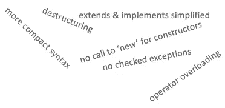

# 为什么我从 Java 转到了 Kotlin 并且没有回头

> 原文：<https://betterprogramming.pub/why-i-switched-from-java-to-kotlin-and-never-looked-back-8c061209ea8>

## 看看科特林的特点，使它成为一个更好的赌注

照片由来自 [Pexels](https://www.pexels.com/photo/woman-sitting-in-front-of-computer-in-office-3861967/?utm_content=attributionCopyText&utm_medium=referral&utm_source=pexels) 的 [ThisIsEngineering](https://www.pexels.com/@thisisengineering?utm_content=attributionCopyText&utm_medium=referral&utm_source=pexels) 拍摄。

大约两年前，在另一个团队分享了他们放弃 Java 的热情后，我们决定在我们的核心服务之一中使用 Kotlin。

从那天起，我们不仅将包含超过 10 万行代码的整个存储库从 Java 迁移到了 Kotlin，而且对我们维护的所有其他存储库继续使用这种方法——包括从头开始构建的所有新服务。

在本文中，我想激励您也这样做，因为我确信这将是您对任何类型的现有 Java 项目所能做出的最佳决定。当然，如果你想从绿地开始一个项目，这也适用。

我们将涵盖的主题的快速概述:

*   简介——快速浏览 Kotlin 的内容。
*   语法和语义——语言特性和与 Java 的区别，以及一些优秀扩展的概述。
*   详细功能——我最喜欢的功能的详细解释。
*   缺点——没有权衡就没有结果，即使它们很小。
*   经历——我们两年旅程的经历。
*   关键要点

# 介绍

当你阅读这篇文章时，你至少听说过科特林。这是一种开源语言，可以编译成 Java 虚拟机、Android，甚至 JavaScript。

它完全可以与 Java 互操作。这意味着您只需要做一些额外的小配置——比如设置 Kotlin 编译器——然后您就可以在现有的 Java 项目中创建您的第一个`.kt` 文件。

从 Kotlin 开始通常要比升级到最新的 Java 版本容易得多，所以你的入门门槛真的很低。

Kotlin 提供了许多我希望在所有最新的 Java 版本中实现的语言扩展，比如非空性、Elvis 操作符、安全调用等等。

它的一系列特性极大地减少了样板代码和易错性，这意味着它更容易以一种不太冗长的方式编写，从而减少代码。较少的代码通常会导致较少的错误。由于 Kotlin 的可空性约束，它也不太可能产生闹鬼的`NullPointerExceptions`。

# 句法和语义

科特林的语法看起来很像其他现代语言。对我来说，除了 Kotlin/Java 之外，还经常使用 Node.js，它看起来非常类似于 TypeScript。

让我们快速了解一下 Kotlin 的一些特性以及语法和语义的实际情况。

## 类型推理

Kotlin 可以自动解析您的变量类型，但仍然允许您显式定义它们。

## 命名参数

您可以传递参数名和它的值，这将防止您无意中以错误的顺序传递相同类型的参数。除此之外，如果您的函数包含可空参数，将为您生成重载签名的所有组合，这将更加有用。

## 字符串模板

无需`StringBuilder`即可轻松构建琴弦。

## (几乎)任何东西都可以用作表达

像`if`和`try`这样的常见结构也可以用作表达式。因此，如果没有抛出异常，您可以使用`try/catch`来分配一个变量，但是如果出现问题，则返回到默认值。

## 高级循环结构

有很多结构来定义你的循环范围。

## Elvis 操作员

如果运行时的值是`null`，这个操作符可以用来返回默认值。

## 何时—调谐开关

通常被描述为类固醇上的"`if`",`when`为您提供了一组扩展的特性，用于构建具有多个分支的条件表达式。

## …还有更多

Kotlin 还有更多的“语法糖”可以探索。我只是简单介绍了一下我最喜欢的东西。

图片由作者提供。

# 详细特征

让我们深入了解一下 Kotlin 的一些核心功能，或者说是从开始这段旅程以来我真正爱上的功能。

## 不可空性

个人认为这是影响最大的一个。在过去，我与空的指针斗争了很久。使用选项并没有太大帮助，因为我只是偶尔这样做，而不是完全这样做。使用 Kotlin，您必须明确定义一个变量在运行时是否可以为空。如果你试图将对可空对象的引用赋给不可空类型，你会得到编译器错误。这大大降低了运行时出现意外空指针的可能性。

除此之外，Kotlin 还提供了安全调用(`?.`)以及在找到`null`值时返回的选项(`?:`)。

如果有一个可空的引用，但是你确定这不会在运行时发生，你可以通过`!!`标记你的变量来通知编译器这可以被视为一个不可空的引用。

## 函数和函数式编程

Kotlin 通过简洁的扩展支持您的日常开发，这些扩展产生了更干净、更紧凑的语法。例如，可以省略返回类型、花括号或 return 语句。

关于方法签名，您可以使用默认的和命名的参数。如果您仍然在使用从 Kotlin 类调用方法的 Java 类，您可以用`@JvmOverloads`注释您的方法，这样 Kotlin 的编译器将生成所有重载的签名。

还可以通过`it`省略单个参数的声明来精简过滤和映射表达式。

这不应被误用-尤其是当您使用嵌套过滤器或地图时。Kotlin 允许您隐式地使用最里面的`it`，但是这使得您的代码不可读并且难以理解。

## 数据类别

数据类是您的实体、数据传输对象或业务对象的特殊类，不需要您实现通常的可疑类，如构造器、获取器/设置器、`toString`、`hashCode`或`equals`。科特林会处理好的(比如和[龙目](https://projectlombok.org/))。

## 扩展功能

您可以将函数和属性添加到现有的类中，而不需要创建子类——不仅为您自己的类，也为来自第三方依赖项的类。

## 运算符重载

与数学运算相关的类可以重载。这同样适用于非数学运算(例如在等于运算中使用`==`)。这增强了可读性，因为它是人眼更自然的声明。

示例:

*   `+`为`plus()`
*   `*`为`times()`
*   `[]`为`get()`
*   `in`为`contains`

## 过滤、排序和使用无限集合

不再需要在集合中调用`stream`— `map`和`filter`可以隐式使用。此外，您可以通过`it`隐式返回并使用当前值，而无需声明。

科特林支持通过[序列](https://kotlinlang.org/api/latest/jvm/stdlib/kotlin.sequences/-sequence/)处理庞大的收藏。对序列的评估是懒惰的，这意味着计算将只在终止操作被调用时进行(即，当实际需要结果时)。序列的处理方式也不同于 [Iterables](https://kotlinlang.org/api/latest/jvm/stdlib/kotlin.collections/-iterable/) ，因为它们在继续之前会遍历单个元素的所有迭代，而不是遍历单个迭代的所有元素，然后再继续下一个迭代。这带来了不需要中间结果的优点。

## 协同程序

有了[协同程序](https://kotlinlang.org/docs/coroutines-overview.html)，你可以以自然、有序的方式编写并行/异步代码。没有回调、承诺或线程。因此，它们也非常轻量级，只有最小的开销。与启动 100，000 个重量级线程相比，启动 100，000 个协程不会导致`OutOfMemoryException`。

`suspend`标记一个不需要立即返回结果的异步函数。它必须从协程内部调用(例如通过使用`runBlocking`)。

# 下降趋势

即使它们很小，使用 Kotlin 也有一定的缺点。

*   较慢的编译时间——我没有注意到这一点，但这似乎是社区中指出的一个普遍现象。
*   需要考虑更多的依赖项——至少需要 Kotlin 核心依赖项及其编译器。
*   没有检查异常——对我来说，这是一个特性，但总的来说，这似乎是 Java 开发人员的一个热门话题。
*   在两种语言之间切换——如果你有一个混合项目，这有时会让人精疲力尽。

# 经历

我们通过引入团队范围的政策开始了我们的旅程:

*   新班级必须在科特林。
*   应该迁移接触过的类。
*   其他一切:如果有时间解决技术债务，就迁移。

尽管这是一个边做边学的*操作，而且我们之前没有使用 Kotlin 或其核心特性的经验，但结果非常好。在这一点上，编写 Java 已经感觉非常不自然，因为我太习惯于 Kotlin 令人敬畏的语言扩展了。*

我们也没有遇到任何问题，除了我们需要首先将所有的实体转换成 Kotlin 数据类，因为由于`Kotlin->Java`的固定编译顺序，我们不知道如何正确使用 Lombok。

# 关键要点

Kotlin 是一种现代而简洁的语言，它不仅使您和您的团队能够以更高效的方式编写代码，而且实际上增加了代码的可读性。Kotlin 正在积极开发中，并不断发布一些功能，只需很少的更新工作就可以利用这些功能。

但不要只听我的意见。你自己试试吧。由于它与 Java 的互操作性，您可以立即开始您选择的项目！

感谢您的阅读。