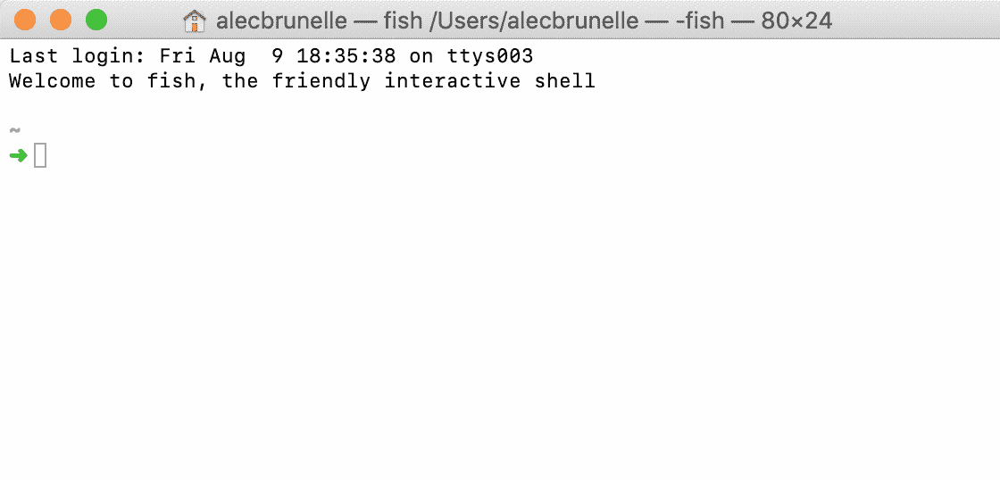
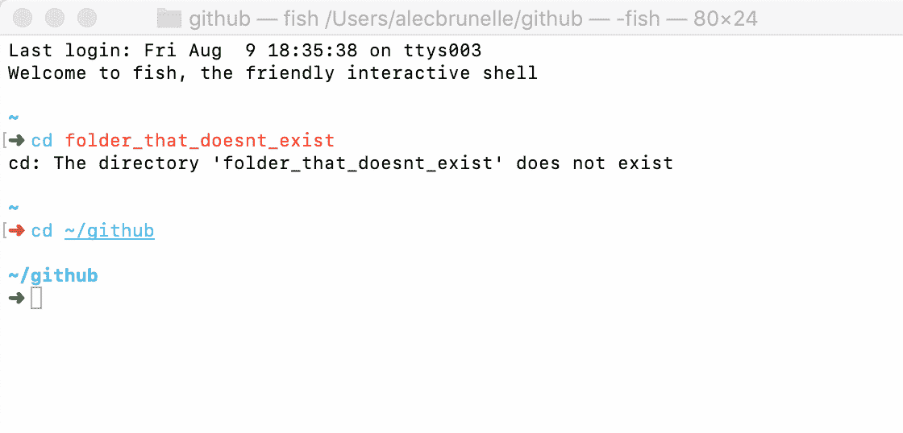
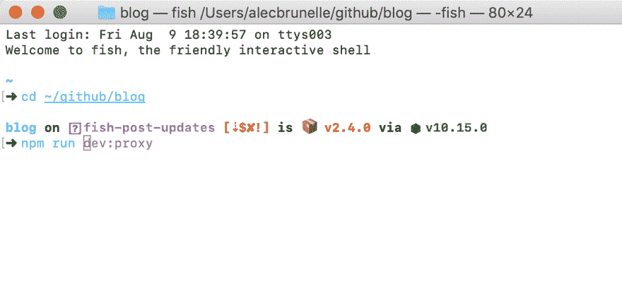
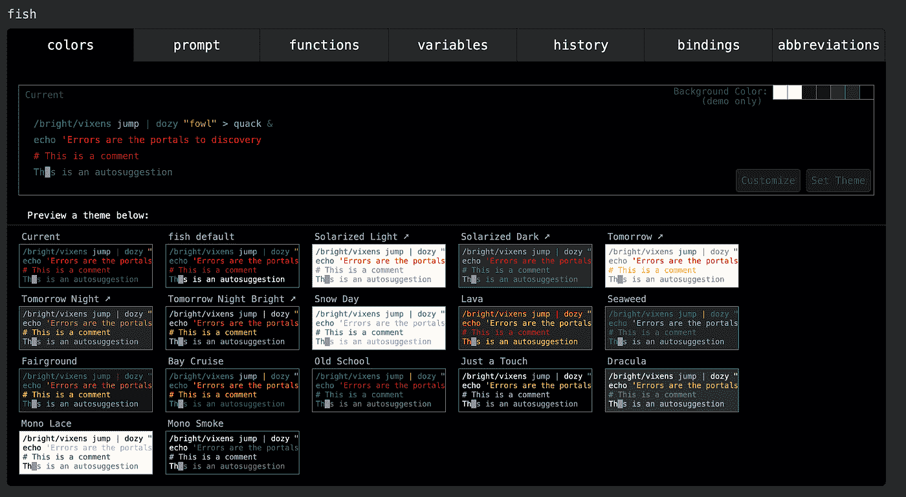
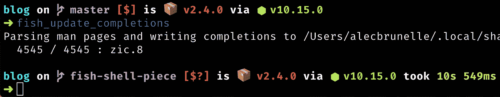

# 为什么我使用鱼壳而不是 Bash 和 Zsh

> 原文：<https://betterprogramming.pub/why-i-use-fish-shell-over-bash-and-zsh-407d23293839>

## 让鱼变得伟大的东西，警告，以及你需要的插件

由[埃里克·桑德斯](https://unsplash.com/@thesaunds?utm_source=unsplash&utm_medium=referral&utm_content=creditCopyText)在 [Unsplash](https://unsplash.com/search/photos/porsche?utm_source=unsplash&utm_medium=referral&utm_content=creditCopyText) 上拍摄的照片

苹果的主要吸引力之一是事物“就是工作”。大多数使用他们产品的人都被他们发布的功能所覆盖，而苹果在其他事情上几乎不花时间。

他们提供的功能都是经过修饰的，有**合理的默认值、**并且是有意的。这就是我相信[鱼壳](https://fishshell.com)变成的样子。不要浪费时间在网上搜索其他人共享的配置文件，最好的插件，或者如何让集成与您的特定设置一起工作。

这个 shell 是为大多数人设计的，fish 代表*友好的交互式 shell* ，这就是为什么我可以把它推荐给和我一起工作的任何人。

他们有非常详细的[设计文档](https://fishshell.com/docs/current/design.html)。它不适合那些每天不断登录多台服务器的系统管理员。它永远不会成为大多数操作系统上默认安装的 shell。

一旦你安装了它，你就可以开始比赛了。您有一个外壳，在这里您可以变得非常高效，并且您最喜欢的工具可以按预期工作。

它并不试图在每件事上都做到最好，而是抓住了让用户体验非常愉快的核心特性。

# TLDR

*   语法突出显示。
*   基于历史的内嵌自动建议。
*   使用手册页数据完成选项卡。
*   直观的通配符支持。
*   基于 Web 的配置。

# 我们来分解一下

## **语法高亮显示**

我对 [Bash](https://www.gnu.org/software/bash/) 最糟糕的记忆来自于这个特性的缺失:[语法高亮](https://fishshell.com/docs/current/tutorial.html#tut_syntax_highlighting)。

一件简单的事情，让你觉得:“哇，现在我用的是 90 年代的外壳！"

你可以在下面的 gif 中注意到它的工作，当我试图转到`folder_that_doesnt_exist`时，文本变成红色。当它是一个有效的命令时，文本变成蓝色。

## **基于历史的内嵌自动建议**

智能[自动提示](https://fishshell.com/docs/current/index.html#autosuggestions)很少见到，更不用说内置了。除了击败竞争对手，fish 团队还想摧毁它。

使用您的命令历史，它会建议您可以使用`right-arrow key`完成的命令。你也可以像我在这张 gif 中做的那样，用`option + right-arrow key`一次自动完成一个单词或文件夹。

有趣的事实是，如果搜索结果是巨大的，鱼壳将分页！

## **使用手册页数据完成选项卡**

这是因为 [fish 知道如何解析许多不同格式的 CLI 工具手册页](https://fishshell.com/docs/current/index.html#completion)。Git、Docker CLI、package.json，凡是你能想到的，尝试大多数命令，它都会自动完成。

你可以使用`tab`来获得所有的选项。

此程序包的所有 npm 脚本，以及它们在终端 WUT 中实际运行的值

## **直观的通配符支持**

在 Bash 中，我从来不喜欢使用不同的标志来选择文件或文件夹的内容。

通常，这将通过以下方式完成:

我一直是熟悉度的粉丝，通配符就是这样。您可以在任何命令中使用它们，轻松过滤出您需要的确切文件。

例如:

## **基于网络的配置**

键入:

你会得到一个完整的网站，专门处理你需要接触的任何配置。

# 一个微小的定制需要更进一步

鱼不需要很多额外的包装。就我个人而言，我只用了两个，这很神奇，因为我的[哦，我的 Zsh](https://ohmyz.sh/) 插件曾经超过 10 个。

## **哦我的鱼**

向伟大的 Oh My Zsh 致敬，`omf`是最受欢迎的 fish 软件包管理器。我用它来安装两个包，一个是给 [nvm](https://github.com/derekstavis/plugin-nvm) 的，一个是给[三维鱼乐队](https://github.com/matchai/spacefish/)的。

## **三维鱼乐队**

特别提到三维鱼乐队，因为它是我用过的最好的 shell 提示符。

支持显示:

*   当前 Git 分支和丰富的回购状态。
*   当前 Node.js 版本，通过 nvm。
*   包版本，如果当前目录中有包(例如 package.json)。

例如

## **配置文件**

您还可以访问位于`.config/fish/config.sh`的配置文件。您可以在这里设置别名或设置一些额外的路径扩展名。

# 警告

不符合 POSIX 可能会吓跑一些开发人员。但是，真的，在我三年的使用中(主要是 Node.js，JavaScript，Ruby 等。)，我没有遇到任何问题。

我从网上得到的一些命令，是 Bash 特有的，我只需要`exit`然后当我完成时再回来钓鱼。[如果你愿意的话，这篇 Stackoverflow 帖子](https://stackoverflow.com/questions/48732986/why-how-fish-does-not-support-posix)会深入探讨。

# 很容易兼容

假设您有一个 Bash 脚本要运行，使用 fish 您仍然可以:

另一个提示是，您可以将它放在文件的顶部:

然后确保它是可执行的:

瞧，你可以像普通脚本一样运行它:

# 资源

*   [鱼壳网站](https://fishshell.com/)
*   [在线试用鱼壳教程](https://rootnroll.com/d/fish-shell/)
*   [哎呀我的鱼包经理](https://github.com/oh-my-fish/oh-my-fish)
*   [NVM 包装插件](https://github.com/derekstavis/plugin-nvm)
*   [三维鱼乐队鱼贝主题](https://github.com/matchai/spacefish/)
*   [牛逼鱼相关软件列表](https://github.com/jorgebucaran/awesome-fish)
*   [支持 fish 中的 Bash 脚本](https://github.com/edc/bass)