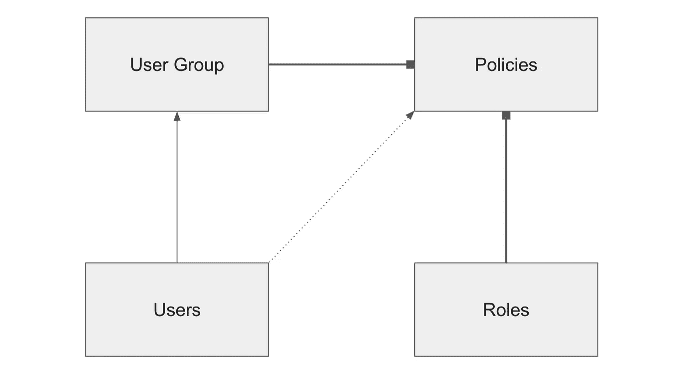

# 为什么 IAM 是最有价值的 AWS 服务？

> 原文：<https://betterprogramming.pub/why-iam-is-the-most-valuable-aws-service-9ce0893db25c>

## 云中控制和安全的力量


照片由[飞:D](https://unsplash.com/@flyd2069?utm_source=unsplash&utm_medium=referral&utm_content=creditCopyText) 在 [Unsplash](https://unsplash.com/s/photos/security?utm_source=unsplash&utm_medium=referral&utm_content=creditCopyText)

让我们做一个竞赛，问自己这样的问题:亚马逊网络服务(AWS)上最有价值的服务是什么？当然，在如此广泛的选择中很难只找出一个。特别是很难定义一个单一的，因为他们大多数是相互关联的。

我们首先想到的服务可能是 EC2。它是所有计算能力的核心。这是最早的服务之一。许多公司利用它来运行他们的应用程序。所以一定是这里了？

近年来，我们看到无服务器计算的兴起。 [Lambda](https://aws.amazon.com/lambda/) 函数提供了构建软件的灵活性，而不必担心资源的供应。然后， [Fargate](https://aws.amazon.com/fargate/) 被引入，以无服务器的方式运行容器化的应用程序成为可能。这些服务剥夺了 EC2 的独特性。

那哪个能最有价值呢？

# 权利的力量

有一个服务被扩展到整个 AWS 组件集。很难想象如果没有这项服务，云提供商会是什么样子。你应该已经猜到我们在谈论什么了。它是一个[身份访问管理](https://aws.amazon.com/iam/)或 IAM。

简而言之，通过 IAM，我们可以定义用户、策略、授予或拒绝权限。当我们考虑用户管理时，我们可以设置不同的组。比如管理员、开发者、营销等等。这些组将在 AWS 上获得各自的权限和粒度许可。这样很容易添加新队友。我们需要为某些组定义权限，而不是将权限授予任何单个员工。这可以节省大量时间，并使用户管理保持一致。管理数百个用户并给他们每个人附加权限会使系统容易出错。

然而，用户管理并不是 IAM 的一个特性。许多其他组件在内部使用该服务来相互授予权限。例如，如果 Lambda 函数必须从 S3 桶中访问一些文件，它需要一定的权限。否则，操作将被拒绝。如果服务试图向 SNS 发布通知，它必须拥有必要的权限。没有他们，这将是不可能的。

在这里，IAM 角色介入游戏。角色与用户相似，但有一个主要区别:他们没有凭证。AWS 组件使用它们来访问其他 AWS 服务。角色“授权”一个人的服务在云生态系统中的其他服务上执行操作。

# 颗粒越大越好

IAM 上的权限很大。然而，外面还有更多层。权限被组织到策略中，以提供特定的结构。例如，我们可以有以下策略:一个用于 S3 存储桶的完全访问，另一个用于只读访问。这意味着最后一个用户没有任何与修改内容相关的权限。

这就是 S3 只读访问策略的样子。

```
{
    "Version": "2012-10-17",
    "Statement": [
        {
            "Effect": "Allow",
            "Action": [
                "s3:Get*",
                "s3:List*"
            ],
            "Resource": "*"
        }
    ]
}
```

在 AWS 控制台中，我们可以使用接口或者通过以 JSON 格式定义权限来添加必要的权限。语句对象定义了强制规则。在上面的例子中，我们描述了策略允许在 S3 资源上运行任何 Get 和 List 操作。符号`*`用作通配符。相反，我们可以在参考资料部分指定一个特定的 S3 存储桶。此外，我们可以只允许像`GetObject`这样的特定动作。

AWS 遵循最佳实践，对用户和角色应用策略。这提供了要求的粒度。即使用户或角色只需要单一权限，也必须通过策略来提供。我们可以定义自己的自定义权限或使用 AWS 预定义的权限。建议附加多个策略，而不是修改现有策略。因为如果策略已经被其他组件使用，我们将确保不会破坏解决方案。

# 包裹

下图描述了主要支柱的组织方式，总结了 IAM 的基础知识。



IAM 的主要支柱及其相互关系

我们有用户和角色——它们非常相似，但有不同的目的。他们使用各种策略授予或拒绝某些权限。角色直接附加了策略。用户也可以直接附加策略。但是，将策略附加到用户组，然后将用户包括在这些组中，可以带来更好的可伸缩性，并且不容易出错。

对 AWS 上的 IAM 服务理解不足会导致一些讨厌的 bug。因为工程师最常犯的错误是忘记授予必要的权限。除此之外，设置正确的策略在安全合规性方面发挥着重要作用。众所周知，网络安全是当今的热门话题。软件开发者希望不要错过它。