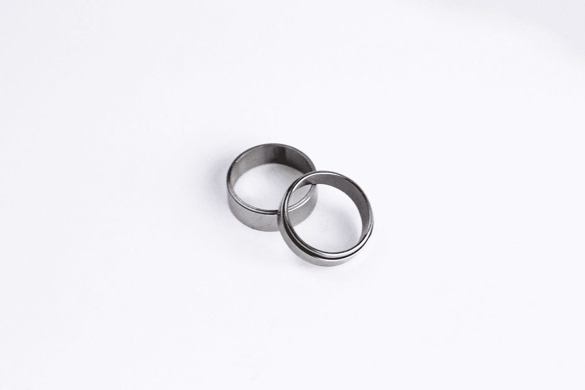

# 为什么我戴着小手指戒指

> 原文：<https://betterprogramming.pub/why-im-wearing-a-pinky-ring-2b6d259b49f6>

## 这个戒指和职业道德有什么关系

Antonio Uquiche 在 [Unsplash](https://unsplash.com?utm_source=medium&utm_medium=referral) 上拍摄的照片

我最近和几个大学朋友重聚了。如果你仔细看，你会发现我们每个小手指上都有一枚小小的银戒指。我们对珠宝的品味都一样吗？肯定不是。我们是某个先进邪教的成员吗？算是吧。

我们一起学的土木工程。在这样做的时候，我们发誓在高三时维护[职业工程道德规范](https://www.nspe.org/resources/ethics/code-ethics)。就像医生如何宣誓一样，工程师有他们自己的仪式，叫做工程师的命令。他们也有自己的道德准则:

1.  将公众的安全、健康和福利放在首位。
2.  *仅在其能力范围内提供服务。*
3.  *仅以客观和真实的方式发布公开声明。*
4.  作为每个雇主或客户的忠实代理人或受托人。
5.  *避免欺骗行为。*
6.  体面地、负责任地、合乎道德地、合法地行事，以提高职业的荣誉、声誉和有用性。

# 历史课

1907 年，魁北克大桥在建造过程中倒塌，75 名建筑工人丧生。倒塌很大程度上是由于监督工程师的粗心大意、计划不周和设计不当。这次崩溃是毁灭性的，但是工程师们认为他们已经吸取了教训。1916 年，他们决定再试一次，这次采取了不同的方法，用更结实的绳索降低桥的悬臂。但是灾难再次降临，桥的中央部分坍塌，造成 13 名工人死亡。

不幸的是，这种粗心的工程事故不是第一次也不是最后一次。自事件以来，许多事件接踵而至，从切尔诺贝利灾难到班桥大坝事故，再到哥伦比亚号航天飞机的灾难。工程灾难随处可见，夺走了许多无辜平民的生命。它们都提醒工程师们，他们的工作对文明有着严重的影响。

# 回应

作为对魁北克大桥倒塌的回应，加拿大的工程师组成了工程师的召唤。这个仪式可以追溯到 1922 年，当时工程学院的几位前任院长在加拿大举行了一次会议。在这次会议上，他们感到有必要将工程专业的成员团结在一起，并为年轻的毕业生创造一种义务或道德声明。他们寻求拉迪亚德·吉卜林(Rudyard Kipling)的帮助，吉卜林经常在他的作品中提到工程学，以发展这方面的义务和仪式。来自于“工程师的召唤仪式”

这个仪式今天仍然存在于加拿大各地的大学里。在这个仪式上，年轻的毕业生会收到一枚铁环(从此铁环就成了钢铁的替代品),戴在他们工作的手上。这枚戒指象征着魁北克大桥的倒塌。这意味着作为一个专业人士的谦逊和道德义务的象征。

这种仪式于 1970 年在美国克利夫兰州立大学采用。[工程师勋章](http://www.order-of-the-engineer.org/)的存在是为了培养美国职业工程师同样的自豪感和责任感。毕业生们要经历一个类似的仪式，在那里他们[宣誓](http://www.order-of-the-engineer.org/?page_id=6)履行工程师的义务，并接受一个戴在他们工作的手的小指上的戒指。

# 最后的想法

在这个日益复杂的世界里，职业道德至关重要。我们开始看到越来越多关于世界道德失败的头条新闻，从初创公司到硅谷，再到办公室滥用权力。

我在追求我的职业时许下的誓言是我将永远坚持的——不管我是否从事工程工作。

## 更多阅读:

 [## 铁环

### 为加拿大工程师义务举行仪式的想法可以追溯到 1922 年，当时加拿大工程师协会的七位前任主席…

铁环网](http://ironring.ca/)  [## 工程师的命令

### 该命令的工程师发起于美国，以培养一种精神的骄傲和责任感，在…

www.order-of-the-engineer.org](http://www.order-of-the-engineer.org/)  [## 道德准则

### 下载:NSPE 道德准则下载:NSPE 道德参考指南，列出了截至 2018 年的所有案例。序言…

www.nspe.org](https://www.nspe.org/resources/ethics/code-ethics)