# 为什么大多数编程语言中 0.1 + 0.2 不等于 0.3？

> 原文：<https://betterprogramming.pub/why-is-0-1-0-2-not-equal-to-0-3-in-most-programming-languages-99432310d476>

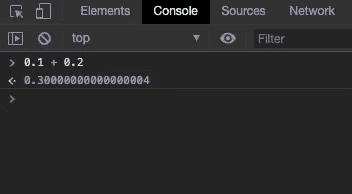

从小我们就被教导 0.1 + 0.2 等于 0.3。然而，在令人困惑的计算世界中，事情的运作方式完全不同。

我最近开始用 JavaScript 编码，在阅读有关数据类型的内容时，我注意到 0.1 + 0.2 不等于 0.3 的奇怪行为。我求助于[堆栈溢出](https://stackoverflow.com/)，找到了几个有用的帖子。请看下面:

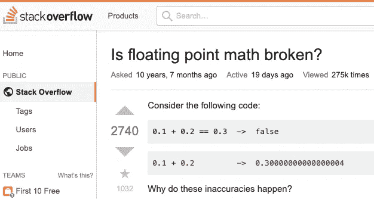

堆栈溢出参考图像

在做了大量的研究和数学计算后，我得出结论，这不是一个错误。这就是数学:浮点运算。让我们更深入地了解幕后发生的事情。

**问题陈述:**那`0.1 + 0.2 = 0.30000000000000004`是怎么回事？

好吧，如果你已经用 Java 或 C 语言编程过，你必须知道不同的数据类型用来存储值。我们在前面的讨论中要考虑的两种数据类型是 *integer* 和 *float。*

整数数据类型存储整数，而浮点数据类型存储小数。

在我们继续之前，让我们理解一个小概念:为了计算的目的，数字是如何表示的？非常小和非常大的数字通常用科学记数法存储。它们表示为:

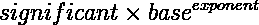

此外，当一个数字用科学记数法书写时，如果在小数点前有一个非零的十进制数字，则该数字是规范化的。例如，科学记数法中的数字 0.0005606 经过标准化后将表示为:

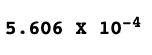

*有效位*是不包含零的有效位数，而*基数*代表使用的基数系统——这里是十进制(10)。*指数*代表基点需要向左或向右移动的位数，以正确表示。

现在，浮点运算中有两种显示数字的方式:单精度和双精度。单精度使用 32 位，双精度使用 64 位进行浮点运算。

与许多其他编程语言不同，JavaScript 没有定义不同类型的数字数据类型，并且总是将数字存储为双精度浮点数，遵循国际 [IEEE 754 标准](https://www.geeksforgeeks.org/ieee-standard-754-floating-point-numbers/)。

这种格式以 64 位存储数字，其中数字(分数)存储在 0 至 51 位，指数存储在 52 至 62 位，符号存储在 63 位。

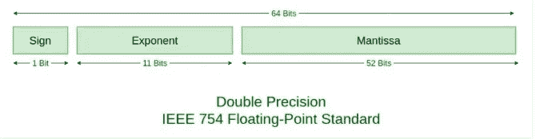

IEEE754 双精度标准

让我们按照 IEEE754 标准用 64 位表示 0.1。

第一步是将`(0.1)base 10`转换成它的二进制等价物`(base 2)`。
为此，我们将从`0.1`乘以`2`开始，并分离出十进制之前的数字，以获得二进制等值。

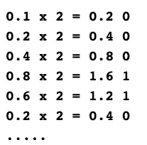

在对 64 位重复这一过程时，我们将按升序排列它们，以获得我们的尾数，我们将根据双精度标准将其四舍五入为 52 位。

尾数

以科学形式表示并四舍五入到前 52 位将得出:

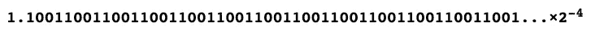

尾数部分准备好了。现在，对于指数，我们将使用下面的计算:

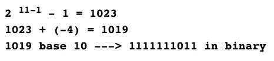

这里，`11`代表我们将用于 64 位指数表示的位数，而`-4`代表来自科学记数法的指数。

数字 0.1 的最终表示是:

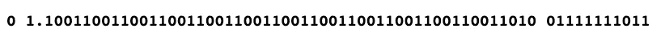

类似地，0.2 可以表示为:

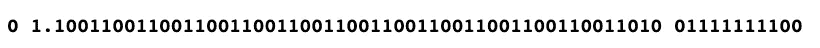

在使两者的指数相同后，将两者相加将得到:

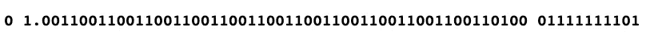

当用浮点表示时，这变成:

这个用`0.1 + 0.2`来表示。

这正是获得`0.1 + 0.2 = 0.30000000000000004`背后的原因。

感谢阅读。订阅我的[时事通讯](https://parulmalhotra.substack.com/?r=2cisn&utm_campaign=pub&utm_medium=web&utm_source=copy)获取更多关于我学习和构建的东西的更新。