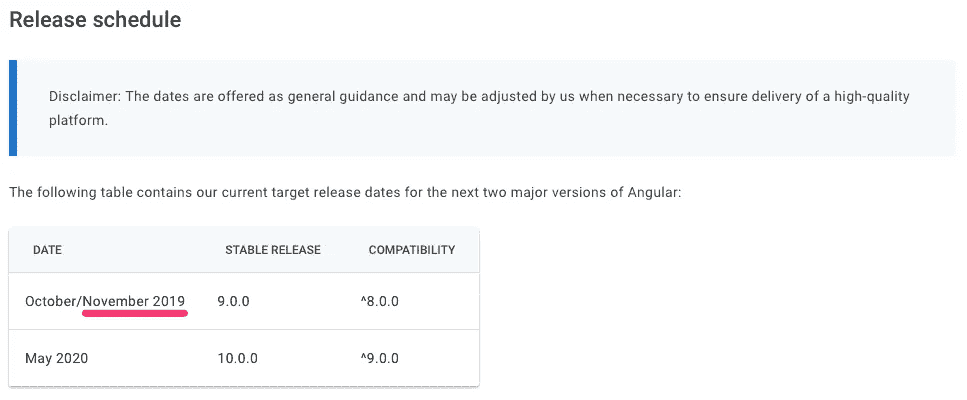
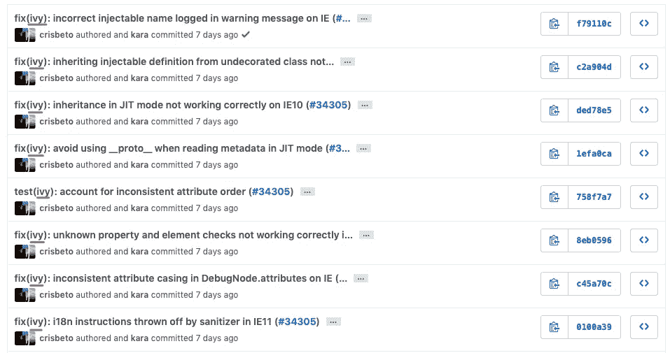

# Angular 9 为什么迟迟不发布？

> 原文：<https://betterprogramming.pub/why-is-angular-9-delaying-its-release-4b7c656fb0c>

## 看起来常春藤引擎仍然需要工作——这就是为什么我们可能要到明年才能看到 Angular 9

照片由[苏甘](https://unsplash.com/@suganth?utm_source=medium&utm_medium=referral)在 [Unsplash](https://unsplash.com?utm_source=medium&utm_medium=referral) 上拍摄

Angular 9 是一个期待已久的版本。即使 Angular 8 是一个有很多改进的非常好的版本，包括一个更智能的惰性加载模块系统，一个新的和改进的 CLI 以更快地生成元素和项目(即使内置了 Angular router 或 SASS 预处理器)，等等。该框架的第九版引起了人们的极大兴趣。

这一次我们不会在开发人员方面有任何重大改进。我的意思是，我们不会被授予新的路由器，新的模块或任何类似的东西。Angular 9 更侧重于编译和有效性。使用官方提供的指南，新的 Ivy 引擎可以集成到 Angular 8 中:[这里是链接](https://angular.io/guide/ivy)。如您所见，Ivy 被命名为新一代编译和渲染管道，这意味着它不仅负责编译阶段，还负责运行阶段、渲染和整个框架上下文。

# 规划

在官方文档中，谷歌提到了接下来的两个主要版本:第 9 版和第 10 版。Angular 10 预计 2020 年 5 月上市。开发者认为 Angular 10 可能至少会在 2020 年夏天之后发布，因为谷歌并没有真正按时发布。

如你所见，Angular 9 本应在 2019 年 10/11 月发布。这就是为什么官方的时间表似乎没有反映出真正发生的事情，也是为什么开发者应该期待等待更长时间。

# 是什么推迟了 Angular 9 的发布？

目前还不清楚，谷歌也没有宣布推迟发布的原因，但根据 GitHub 项目页面和分析评论和修订，看起来 Ivy 引擎仍需要修复:

显然还有很多关于通用特性、ngFors、ngcc 编译阶段甚至文档的评论。然而，最近的大多数评论都是关于常春藤和一般问题的。有时候开发者需要等待的时间比预期的要长。没问题。我们唯一担心的是:这值得吗？大概是的。简单回答。Angular 已经成为 Javascript 和 Typescript 开发人员最受欢迎的前端框架，我们都对这个新引擎以及它将如何使我们的工作更加简单和智能感到兴奋。

# 结论

即使我们还没有正式宣布新版本什么时候会真正发布，这个大高潮应该会很快结束。让我们保持更新，看看会发生什么。对我来说，看起来 Angular 9 的发布不会在年底前推出，第 10 版可能会推迟到 2020 年 9 月。