# 为什么 Flutter 很快？—第 2 部分:分层架构

> 原文：<https://betterprogramming.pub/why-is-flutter-fast-part-2-layered-architecture-c8954b03e994>

在这一系列文章中，我们旨在回答这个问题:“为什么 Flutter 很快？”。根据 [Adam Barth](https://twitter.com/adambarth) 的说法，他是 Flutter 项目的联合创始人，也是 Flutter 库中[第一次提交的作者，Flutter 之所以快是因为](https://github.com/flutter/flutter/graphs/contributors?from=2014-10-19&to=2014-10-20&type=c)[它很简单](https://youtu.be/UUfXWzp0-DU?t=194)。

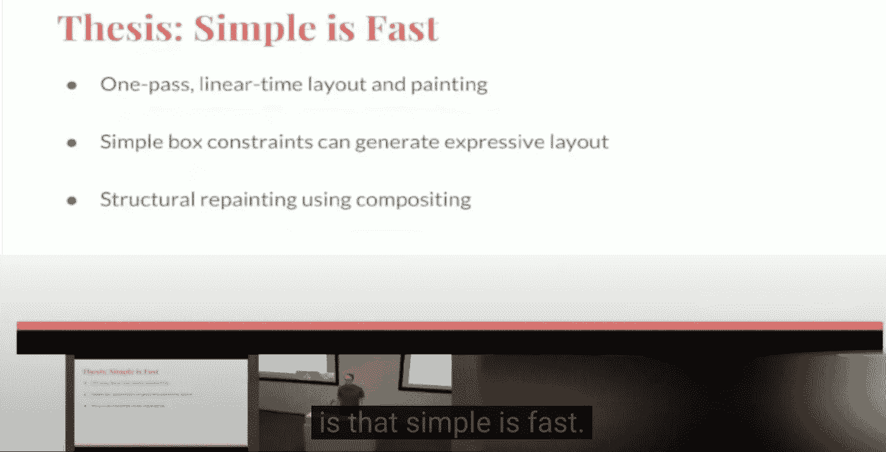

亚当·巴斯在他著名的[渲染管道](https://youtu.be/UUfXWzp0-DU)演讲中

在这一部分，我们将解释 Flutter 的分层架构及其对性能的影响。要更详细地了解架构，我建议阅读 Flutter 早期的著名博客文章: [The Layer Cake](https://medium.com/flutter-community/the-layer-cake-widgets-elements-renderobjects-7644c3142401) 和关于这个主题的最佳资源在 [Flutter 网站](https://docs.flutter.dev/resources/architectural-overview#architectural-layers)。

*   [第 1 部分:次线性建筑](https://ulusoyca.medium.com/why-is-flutter-fast-part-1-sublinear-building-317572cd6b47)
*   **第二部分:分层架构**
*   [第三部分:渲染管道](https://ulusoyca.medium.com/why-is-flutter-fast-part-3-rendering-pipeline-3a31056355e5)

# 颤动前

了解 Flutter 的历史和它最初要解决的问题对于理解 Flutter 是如何工作的非常有帮助。解释《Flutter》前传的最佳资源来自其联合创始人亚当·巴斯和埃里克·塞德尔·T21。

## 从 Webkit 到 Blink

WebKit 是 Safari 和 macOS、iOS 和 Linux 上的许多其他应用程序使用的开源网络浏览器引擎。当谷歌 Chrome 在 2008 年首次发布时，它使用了 WebKit 引擎。

苹果和谷歌团队正在学习如何一起操作 Webkit，尽管他们为利益冲突的公司工作。随着 Google Chrome 的发展，Webkit 需要越来越多的改变，这拖慢了两个团队的进度。

2013 年，谷歌分叉 Webkit，开始使用自己的网页浏览器引擎“Blink”。Blink 引擎包括 DOM、HTML DOM 和 CSS 渲染引擎、Web IDL 实现、Skia 图形引擎和 V8 JavaScript 引擎[ [17](https://en.wikipedia.org/wiki/Blink_(browser_engine)) ]。

## 让网络更适合移动设备

Chrome 团队知道，他们在 2000 年代末的移动热潮中姗姗来迟。自从 Chrome 开始拥有自己的引擎，该团队开始研究如何改善移动平台上的网络体验。这种方法剥离了网络平台，只使用其必要的部分。为此，2013 年启动了" Bravo "项目。

project Bravo 的想法是通过互联网从一个 URL 获取序列化为 JSON 的 Javascript 代码，并在自托管框架中显示内容。Javascript 代码直接运行到图形库、一些网络 API 和特定于平台的 API。

web 平台使用 WebGL，这是一个标准的 Javascript API，用于通过 GPU 加速渲染图形。代替 WebGL，project Bravo 将 OpenGL 作为移动设备中 GPU 加速的目标，并负责构建自己的渲染树。该团队还重新考虑了从 CSS 继承的布局模型。

## 打开天空！

Bravo 项目在内部结束，从未公开，但实验为颤振铺平了道路。2014 年，剃刀计划启动。该团队实现了将 Blink 缩小 52%，并能够将 HTML 解析体验提高 19 倍。这些有希望的结果导致 Adam 和 Eric 离开 Chromium 团队，开始了一个名为`Sky`的新项目，也就是我们今天所知的`Flutter`库。

在 Sky 的最初几天，团队从 Blink 中删除了数千行代码。因为他们没有任何使用 Sky 框架的客户，所以他们能够快速应用突破性的变化。然而，他们过于依赖 Javascript，无法从与 Javascript 相关的 Chromium 团队获得对他们请求的响应。他们开始寻找新的语言，并得到了 Dart 团队的支持。这对双方来说是一个双赢的案例，最终，Dart 的使用在采用 Flutter 后蓬勃发展。

该团队发现了一种使用 SkyShell 在 Android 中运行 Dart 代码的方法。SkyShell 是一个通用的应用程序，可以通过网络加载天空应用程序。独立的 SkyShell.apk 用于测试，增加了 Google 内部团队对 Sky 项目的兴趣。

2015 年，天空项目规模迅速扩大。通过与 Dart 团队合作，他们能够为 iOS 编译应用程序，支持离线模式，从框架中移除天空元素(DOM)，并引入小部件树和渲染树。

最后，该团队决定将该项目重命名为 Flutter，这只是谷歌收购的一个随机可用的域名。

# 什么是本土？

什么使一个应用成为本地的是一个有争议的问题。一个 Flutter 应用可以被认为是原生应用吗？Adam Barth 说是的，因为 Flutter 应用程序中的小部件是用最终开发者用来构建他们的应用程序的相同技术构建的。对于移动和桌面，Flutter 应用程序源代码被编译为机器代码，并由输出文件附带的 Dart 虚拟机或 Dart 运行时执行，处理内存分配和垃圾收集。

> “Flutter 应用程序被直接编译成机器代码，无论是英特尔 x64 还是 ARM 指令，如果面向 web，则编译成 JavaScript。”[6]

在 Android 原生开发中，整个源代码首先被编译成字节码。 [Android Runtime (ART)](https://source.android.com/devices/tech/dalvik) 在安装时执行字节码到机器码的翻译，以便设备理解本机指令。机器代码由设备的运行时环境执行[14]。

在 iOS 原生开发中， [LLVM](https://medium.com/@jyaunches/introduction-to-the-llvm-for-a-ios-engineer-8c00ed0f9ff0) 负责将源代码编译成机器码。源代码首先被编译成中间语言(IR)。然后，LLVM 后端为目标设备[ [11](https://medium.com/@jyaunches/introduction-to-the-llvm-for-a-ios-engineer-8c00ed0f9ff0) ]生成机器代码。

当开发“本地”应用程序时，我们使用平台 UI 库提供的库在屏幕上绘制 UI 组件。例如，您添加到应用程序中的按钮可能看起来不同，这取决于安装应用程序的设备的 Android API 版本。

对话框的外观取决于平台 API

平台 UI 库是平台渲染 API 的桥梁，如 [OpenGL](https://www.opengl.org/) 、 [Metal](https://developer.apple.com/metal/) 、 [Vulkan](https://www.vulkan.org/) 。由于可移植性和安全性(内存错误)的原因，这些 UI 库是用特定于平台的高级语言实现的，例如 Java、Swift、Objective-C。它们与设备 CPU 或 GPU 通信，在屏幕上绘制像素。

当我们从较低级到 OS 层时，几乎不可能使用高级语言，因为它们的特性会导致内存错误。在 iOS 和 Android 操作系统中，下层是用 C 实现的，C++。最近，Android 也在 Rust 中开始支持开发原生操作系统组件。[ [10](https://security.googleblog.com/2021/04/rust-in-android-platform.html)

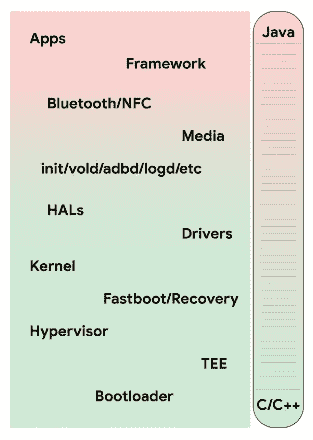

摘自[ [10](https://security.googleblog.com/2021/04/rust-in-android-platform.html)

Android 平台提供的 [*widget*](https://android.googlesource.com/platform/frameworks/base/+/master/core/java/android/widget/) 文件夹是构建在 [*视图*](https://android.googlesource.com/platform/frameworks/base/+/master/core/java/android/view/) 文件夹之上的一层。当从这个文件夹中选择一个小部件时，原生 Android 开发者应该总是考虑他们的应用支持的最低 Android API 版本。考虑到 Android 设备获得新的 API 更新有多晚，这对开发者来说可能是一个严重的问题。这个问题是通过在应用程序包中包含 [Android Jetpack 库](https://developer.android.com/jetpack/androidx)(以前称为支持库)来解决的，以便在具有不同 Android 版本的设备之间提供向后兼容性。[ [7](https://developer.android.com/jetpack/androidx)

# 颤振与其他

传统的跨平台框架是 OEM 小部件或 Web 视图的包装器。在前一种情况下，开发人员在抽象层的帮助下使用原生 UI 组件构建应用程序。比如 React 原生开发者用 JavaScript 写代码。

React Native 的桥接系统用于提供本机端和 Javascript 线程之间的双向异步通信。这是一个高级语言和许多高级语言之间的翻译过程。由于 UI 逻辑通过抽象层从一个地方到另一个地方，因此可能会出现意外的性能问题。

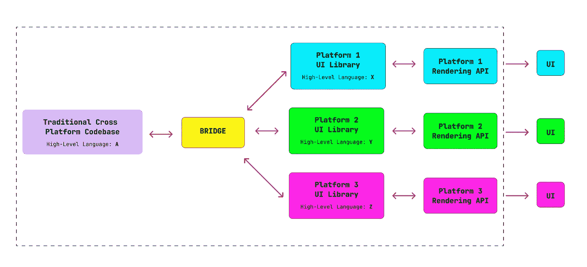

Flutter 采用了不同于其他跨平台技术的方法。UI 使用自己的库而不是平台 UI 库显示在屏幕上，这消除了一个抽象级别。

设备 GPU 与应用程序附带的图形库一起使用。这使得 Flutter 能够根据设备的能力提供每秒 60 帧或 120 帧(fps)的性能。Flutter UI 工具包本身并不能保证这种性能。它只提供了有效的算法来防止部件树中某些部件上不必要的构建、布局和绘制阶段。每当设备调用有一个要渲染的帧时，Flutter 就会接受这个调用，并从构建阶段开始渲染过程。毕竟，性能取决于目标设备的刷新率，以及应用程序代码实现的效率，以便能够在构建阶段快速响应[12]。

Flutter 的框架层通过直接与引擎层中的 [Skia](https://skia.org/) 通信来绕过平台 UI 库，引擎层为 GPU 提供指令。

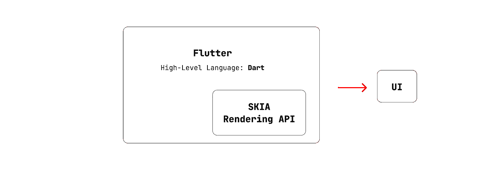

取代*原生* UI 组件，Flutter 应用使用了包含在 Flutter SDK 中的*原生* UI 组件。由于这种方法，Flutter 应用程序中使用的小部件的质量和灵活性独立于底层平台提供的内置解决方案。

开发者可以根据谷歌的[材料设计](https://material.io/design)、苹果的[人机界面指南](https://developer.apple.com/design/)和微软的 [Fluent 设计系统](https://docs.microsoft.com/en-us/windows/apps/design/)的规范，使用[素材库](https://docs.flutter.dev/development/ui/widgets/material)、[库比蒂诺库](https://docs.flutter.dev/development/ui/widgets/cupertino)或 [fluent_ui 包](https://pub.dev/packages/fluent_ui)中的小部件。或者，开发者也可以在 [widgets](https://docs.flutter.dev/development/ui/widgets) 库的基础上，根据他们自己的设计语言创建他们自己的 widgets 集合。

# **图层模型**

Flutter 有一个分层的架构，其中所有层都是独立的、可替换的，并且每个层都依赖于下面的层。

颤动的建筑层

让我们将 Navigator 2.0 实现作为这种分层架构模型的一个例子。平台提供了在屏幕间导航的方式。移动平台利用手势，浏览器有后退和前进按钮，一些 Android 手机有系统后退按钮，人们对它应该如何工作有不同的想法。

根据分层模型，在框架层的 widgets 库中提供了一个通用导航 API，而不需要知道 app 使用在哪个平台上。特定于平台的实现细节包含在引擎层中。

让我们从框架层的内容开始。`[Route](https://api.flutter.dev/flutter/widgets/Route-class.html)`是由`[Navigator](https://api.flutter.dev/flutter/widgets/Navigator-class.html)`小部件管理的条目。`[Router](https://api.flutter.dev/flutter/widgets/Router-class.html)`小部件包装`[Navigator](https://api.flutter.dev/flutter/widgets/Navigator-class.html)`小部件并配置导航历史。这些类是在框架层的`[widgets](https://api.flutter.dev/flutter/widgets/widgets-library.html)`库中实现的。

`[CupertinoPageRoute](https://api.flutter.dev/flutter/cupertino/CupertinoPageRoute-class.html)`和`[MaterialPageRoute](https://api.flutter.dev/flutter/material/MaterialPageRoute-class.html)`类是`[Route](https://api.flutter.dev/flutter/widgets/Route-class.html)`类的两个具体实现，它们都用来用一个过渡替换整个屏幕。前者是`[cupertino](https://api.flutter.dev/flutter/cupertino/cupertino-library.html)`库的一部分，并提供 iOS 风格的过渡，而后者是`[material](https://api.flutter.dev/flutter/material/material-library.html)`库的一部分，并根据[材料设计](https://material.io/design)中的规范提供平台自适应的过渡。这些库构建在框架层的小部件库之上。

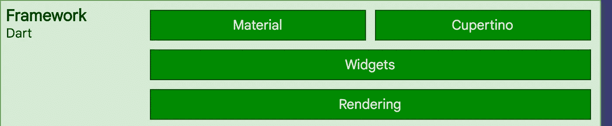

`[RouteInformation](https://ulusoyca.medium.com/flutter-navigator-2-0-for-authentication-and-bootstrapping-part-5-web-eeb4835804df)`是包含路线信息的数据容器，在框架层内部使用。`[Router](https://api.flutter.dev/flutter/widgets/Router-class.html)`小部件[监听](https://api.flutter.dev/flutter/services/SystemNavigator/routeInformationUpdated.html)来自在*引擎*层中实现的平台通道的路由更新。

当有来自引擎的路由更新时，`[Router](https://api.flutter.dev/flutter/widgets/Router-class.html)`小部件实例化一个将在框架层中使用的`[RouteInformation](https://ulusoyca.medium.com/flutter-navigator-2-0-for-authentication-and-bootstrapping-part-5-web-eeb4835804df)`。同样，由于应用程序中的用户交互，底层平台可能需要了解导航更新。例如，在 Flutter Web 应用程序中，当内容由于按钮按下而改变时，浏览器地址栏可能需要更新。在这种情况下，*引擎*从`[Router](https://api.flutter.dev/flutter/widgets/Router-class.html)`小部件创建的`[RouteInformation](https://ulusoyca.medium.com/flutter-navigator-2-0-for-authentication-and-bootstrapping-part-5-web-eeb4835804df)`中获取必要的信息，并相应地更新其`[BrowserHistory](https://github.com/flutter/engine/blob/99fa4a1ab34317c40b03d2aaf9c0b172c684a871/lib/web_ui/lib/src/engine/navigation/history.dart)`。

综上所述，框架层依靠引擎层来构建导航历史。然而，它不需要知道底层平台的细节。例如，按下浏览器中的后退/前进按钮，以及从移动操作系统接收一个[意图](https://developer.android.com/reference/android/content/Intent)，在引擎层有不同的实现，但最终，输出将是一个`[RouteInformation](https://ulusoyca.medium.com/flutter-navigator-2-0-for-authentication-and-bootstrapping-part-5-web-eeb4835804df)`用于框架层。

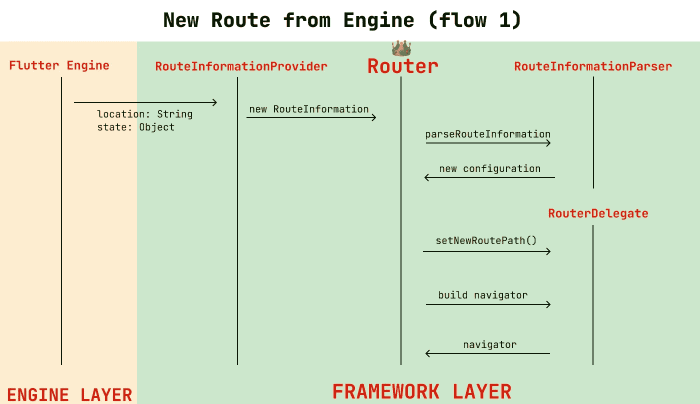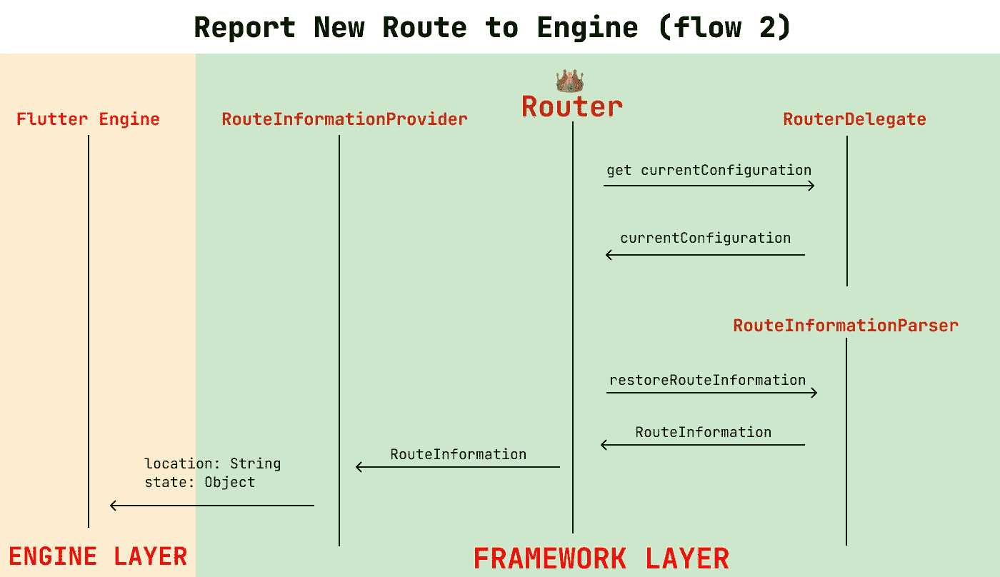

关于 Navigator 2.0 API 的更多信息可以从我之前的文章系列中阅读。

# 发动机

Flutter 引擎层是用 C、C++、Java、Objective-C 和 Dart 语言构建的。该架构中用 C++编写的两个主要部分是 2D 图形库和文本渲染。将这些部分保留在 C++中的主要原因是，这些解决方案已经在 Skia for 2D 图形和 Android 开源项目( [AOSP](https://source.android.com/) )的文本渲染库中使用了多年。这意味着 Android 的文本渲染解决方案被移植到 iOS 应用[ [1](https://www.dotnetrocks.com/default.aspx?ShowNum=1513) ]。

Skia 是由 Google 维护的开源图形渲染库。虽然 Flutter 是一项年轻的技术，但 Skia 自 2005 年以来就已经存在，并被许多平台使用，包括 Google Chrome、Chrome OS、Android、Mozilla Firefox 等等。

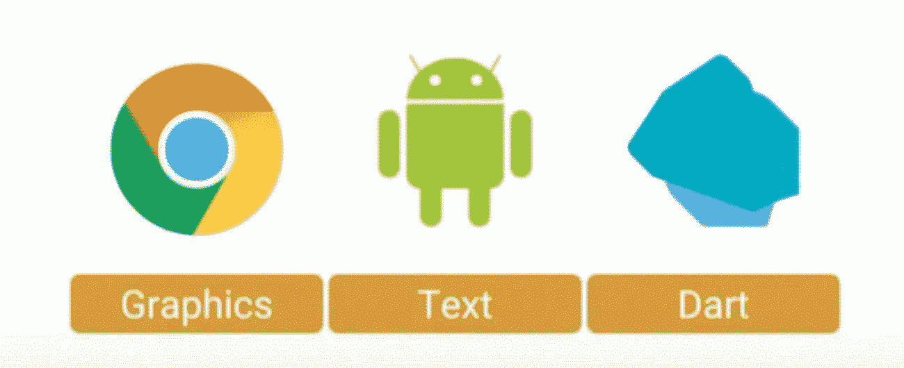

颤振发动机(摘自[13])

Flutter 中的 Skia 支持各种特定于平台的后端，为设备中可用的 GPU 生成指令。比如 iOS 设备的 [Metal](https://developer.apple.com/metal/) 用[版本 1.17](https://medium.com/flutter/announcing-flutter-1-17-4182d8af7f8e) 引入了颤振引擎。

> “苹果在 iOS 上对 Metal 的支持提供了对底层 GPU 的近乎直接的访问，是苹果推荐的图形 API。在完全支持 Metal 的 iOS 设备上，Flutter 现在默认使用它，使你的 Flutter 应用程序在大多数时候运行得更快，平均提高[渲染速度约 50%](https://github.com/flutter/flutter/issues/53768)(取决于你的工作负载)。”8

构建和维护自定义引擎层是一项复杂的任务。虽然颤振团队明确表示，他们不反对定制发动机，但他们警告说，由于维护成本可能存在风险。Flutter 团队不认为定制引擎层是一个长期的解决方案，应该尽快避免，特别是如果目标平台的层已经由 Flutter 现成提供的话。[ [9](https://github.com/flutter/flutter/wiki/Custom-Flutter-Engine-Embedders)

## AOT Vs JIT 编译

Flutter 应用程序的发布版本中的 Dart 代码直接编译为本机、ARM 和 x86 库，或者在面向 web 时编译为 Javascript 代码。这种编译过程被称为提前编译(AOT)。

Flutter 的调试版本是实时编译的(JIT ),并与 Dart 虚拟机(VM)一起发布。这使得能够向正在运行的 VM 注入新的类、方法和字段。热重装就是这个注入的过程，同时使用 app 的最后一个状态[2]。

正如第一篇文章提到的，Flutter 应用开发者的职责是用 widget 树描述 UI 的状态，框架的职责是用元素树中自顶向下的元素的`[updateChild](https://medium.com/r?url=https%3A%2F%2Fapi.flutter.dev%2Fflutter%2Fwidgets%2FElement%2FupdateChild.html)`方法更新状态。

换句话说，对于开发者来说，一切都是小部件，框架提供了“*精心设计的算法和数据结构来高效处理大量的小部件”* [ [4](https://docs.flutter.dev/resources/inside-flutter#a1) ] *。*由于这种关注点的分离，框架能够通过热重载在运行的应用程序中立即反映窗口小部件树中的变化。

热重新加载可以被认为是在 Web 浏览器中编辑 CSS。尽管到目前为止，Flutter Web 应用程序仍然不支持 hot reload，但由于 Flutter [ [1](https://www.dotnetrocks.com/default.aspx?ShowNum=1513) ]中包含的声明性范例，它在其他平台上工作得足够好了。我建议看下面的短片，它解释了热重装是如何工作的，以及在什么情况下需要热重启。感谢安德鲁·菲茨的精彩视频和精彩的视觉解释。

# 嵌入器

> "对于底层操作系统，Flutter 应用程序的打包方式与任何其他本地应用程序一样."[ [2](https://docs.flutter.dev/resources/faq) ]

当我们创建一个新的 Flutter 项目时，不同平台的嵌入层由 Flutter 提供。嵌入层使用引擎层作为库。它是一个颤振应用程序启动时的起点。它是用特定于平台的语言编写的，托管着 Flutter 引擎。

Embedder 支持与底层操作系统的通信，为 UI 获取线程，并提供纹理。嵌入者的职责是生命周期管理、输入手势、窗口大小和平台消息[ [6](https://docs.flutter.dev/resources/architectural-overview) ]。

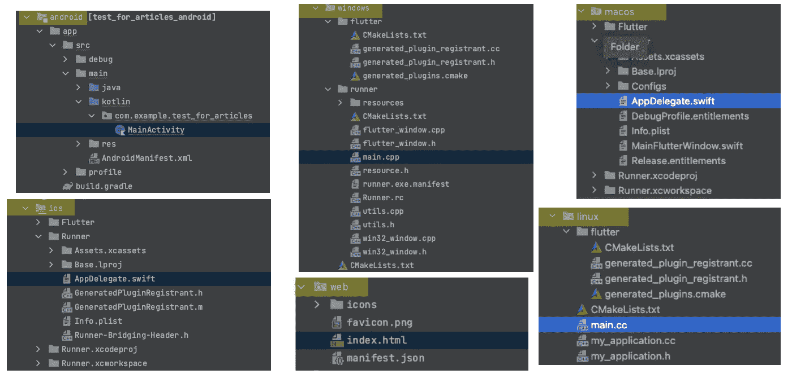

底层平台的入口点

在稳定频道中，我们看到熟悉的文件夹名称，如`android`、`ios`、`web`、`windows`。这些是嵌入层的文件夹。如果我们想为特定的平台添加嵌入器，我们应该使用命令:`flutter create --platforms**=**windows,macos,linux`显式地指定它们。

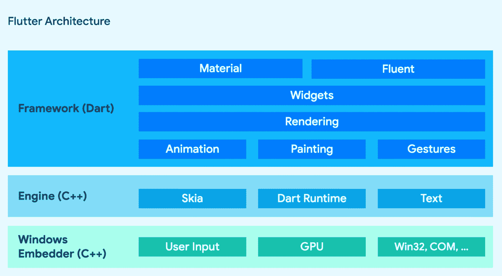

Windows 的颤振体系结构

嵌入式层包含在 Flutter SDK 中，但不必局限于这些常用的平台。由于 Flutter 架构层是可替换的，特定于平台的定制嵌入器可以集成到其余的层中。我们看到由索尼领导的用于嵌入式 Linux 设备的`[flutter-elinux](https://github.com/sony/flutter-embedded-linux)`项目，以及用于将 Flutter 移植到装有 Tizen OS 的设备的`[flutter-tizen](https://github.com/flutter-tizen/flutter-tizen#flutter-for-tizen)`项目。

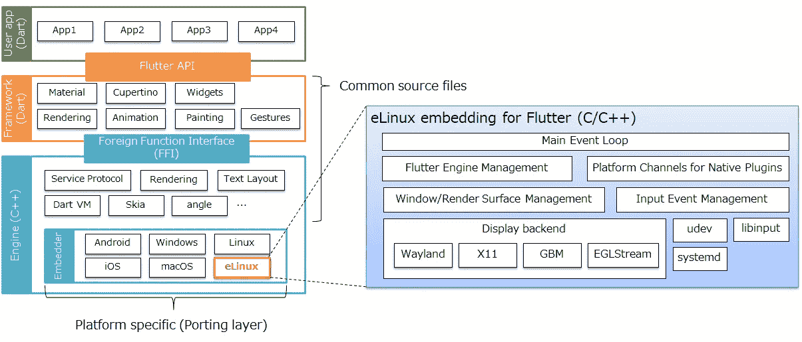

为嵌入式 Linux (eLinux)而战——[索尼](https://github.com/sony/flutter-embedded-linux)

Web 应用程序被沙箱化在 Web 浏览器应用程序中。因此，Flutter Web 架构不包括提供与底层操作系统通信的嵌入器。例如，我们不能将`[dart.io](https://flutter.dev/docs/development/platform-integration/web#can-i-use-dartio-with-a-web-app)`库导入到 Flutter Web 项目。由于其他平台的引擎层包含与底层操作系统接口的逻辑，因此 Flutter Web 应用程序的 ***引擎*** 是标准浏览器 API 之上的 C++ Flutter 引擎的重新实现。

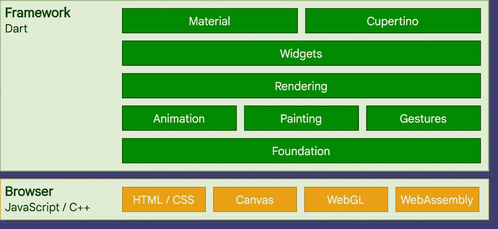

# 结论

在本文中，我们解释了 Flutter 的像素驱动架构，而不是依赖于平台小部件。我们提到了 Flutter 如何通过自己的渲染引擎库消除了一个抽象层次。

在[下篇](https://ulusoyca.medium.com/why-is-flutter-fast-part-3-rendering-pipeline-3a31056355e5)中，我们将继续回答“为什么 Flutter 快？”通过解释颤振的简单渲染管道。

# **参考文献**

1.  与蒂姆·斯内思和亚当·巴思一起跳舞。网石！播客
2.  常见问题， [docs.flutter.dev](https://docs.flutter.dev/resources/faq)
3.  [https://developer.android.com/reference/android/view/View](https://developer.android.com/reference/android/view/View)
4.  [内部颤动](https://docs.flutter.dev/resources/inside-flutter#a1)
5.  [飘起——前途无量](https://medium.com/kinandcartacreated/flutter-the-skys-the-limit-84887c8f650d)，[斯瓦夫·库林斯基](https://medium.com/@swav.kulinski?source=post_page-----84887c8f650d-----------------------------------)
6.  [颤振建筑概述](https://docs.flutter.dev/resources/architectural-overview)
7.  AndroidX 概述，[developer.android.com](https://developer.android.com/jetpack/androidx)
8.  [宣布颤振 1.17](https://medium.com/flutter/announcing-flutter-1-17-4182d8af7f8e)
9.  [定制颤振发动机嵌入器](https://github.com/flutter/flutter/wiki/Custom-Flutter-Engine-Embedders)
10.  [安卓平台中的铁锈](https://security.googleblog.com/2021/04/rust-in-android-platform.html)
11.  [面向 iOS 开发者的 LLVM 简介](https://medium.com/@jyaunches/introduction-to-the-llvm-for-a-ios-engineer-8c00ed0f9ff0)
12.  软件工程广播，第 437 集:颤动的架构
13.  [“颤动:我们如何在谷歌构建未来的 UI 框架”作者 Eric Seidel](https://www.youtube.com/watch?v=VUiVkDpikDI&ab_channel=StrangeLoopConference)
14.  [进阶 Android : Android 字节码编译构建流程+(JVM，DVM，ART，.德克斯，。APK)](https://medium.com/@yuvraazkhattri/advance-android-android-bytecode-compilation-jvm-dvm-art-dex-apk-arm-arm4-x86-bbf7de997dca)
15.  [扑之前，橡皮鸭工程|第 100 集](https://www.youtube.com/watch?v=xqGAC5QCYuQ&ab_channel=RubberDuckEng)
16.  [谷歌 Chrome 与苹果的 WebKit 分手](https://www.wired.com/2013/04/blink/)
17.  [眨眼，维基百科](https://en.wikipedia.org/wiki/Blink_(browser_engine))