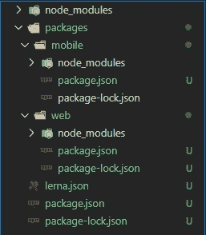

# 为什么 Lerna 这么受开发者欢迎？

> 原文：<https://betterprogramming.pub/why-is-lerna-so-popular-among-developers-ef78d965d3ea>

## monorepo 的工具

图片来自 [Lerna](https://lerna.js.org/) 。

Lerna 是一个 monorepo 工具，用于管理一个存储库中的多个项目。

处理任何复杂的应用程序都涉及到多个存储库，对它们进行更改可能很难跟踪，并且会使事情变得复杂。这就是勒纳前来救援的地方。使用 monorepo 的一个主要好处是它可以在项目之间共享依赖关系。

# 开发者为什么要用 Lerna？

Lerna 通过管理诸如版本控制、代码部署、项目间的依赖关系管理等任务，让开发人员的工作变得更加轻松。它主要用于较大的项目，随着时间的推移，很难手动维护所有这些任务。

## 例子

假设您正在构建一个电子商务应用程序，它有多个包含不同代码库的存储库。一个包含 web 的前端代码库，另一个包含 API 服务，还有一个包含移动代码。现在，您将在所有的存储库中使用相同的工具，对吗？我说的工具，是指使用 eslint、prettier、babel 等工具。我们可以拥有所有项目共享的公共配置，而不是每个项目都有单独的配置。

此外，如果您使用所有这些项目共有的某些依赖项，您可以将它们包含一次，并在全局范围内共享它们，而不是将它们单独包含在所有项目中。

# Lerna 回购看起来像什么？

让我们以前面的例子来展示目录结构的样子:

一个基本的 Lerna 文件夹结构

这里，根`package.json`文件包含所有项目(web、mobile)的公共依赖关系。根`node_modules`包含所有这些依赖项。这些项目列在`packages`目录下。移动和 web 中的`node_modules`目录分别包含移动和 web 项目的依赖关系。

# Lerna 提供的核心功能

## 拔靴带

Lerna 引导主 repo 中的所有包。换句话说，它安装所有的依赖项，并链接任何交叉依赖项(如果有的话)。它通过创建符号链接来链接所有的共享依赖项。如果在共享依赖项中进行了任何更新，它会立即在使用它的代码中生效。

## 出版

出版从未如此简单。你所要做的就是输入一个简单的命令(`lerna publish`，它会提示你输入一个新的版本，并更新 git 和 npm 上的所有包。如果您愿意，也可以强制发布。

## 版本控制

Lerna 提供了检查自上一版本以来哪些包发生了变化的能力。您还可以检查自上次发布以来所有软件包或单个软件包的差异。

## 并发运行命令

您可以在根文件`package.json`中编写一个脚本，使用`lerna run`命令在所有项目中同时运行该命令，而不是移动到每个项目并启动服务器。当您想要同时运行所有服务器时，可以使用这种行为。

Lerna 还提供了其他几个特性。我刚刚谈到了最基本的问题。看看他们的[文档](https://lerna.js.org/)了解更多信息。

# 谁使用 Lerna？

许多顶级公司在他们的项目中使用 Lerna。使用 Lerna 的一些项目有:

*   [巴别塔](https://github.com/babel/babel)
*   [做出反应](https://github.com/facebook/create-react-app)
*   [笑话](https://github.com/facebook/jest)
*   [Vue CLI](https://github.com/vuejs/vue-cli)
*   [Webpack CLI](https://github.com/webpack/webpack-cli)

# 最后的想法

今天，Lerna 是用 git 和 npm/yarn 管理多包存储库的最流行的工具之一。许多人在他们的项目中使用它们并不奇怪，因为它们使事情变得非常简单。

如果您正在构建一个大型应用程序，并且已经考虑将它设计成多个项目，那么您绝对应该尝试一下 Lerna。蕾娜能做的还有很多。一个很好的起点是他们的[文档](https://lerna.js.org/)。

编码快乐！