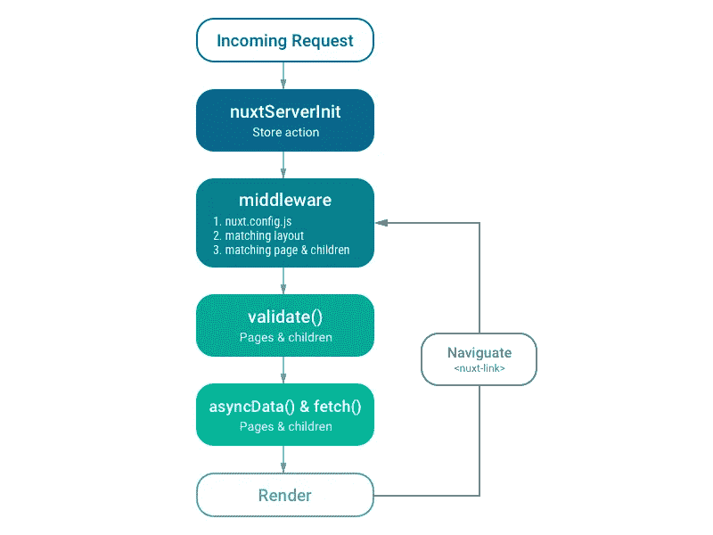
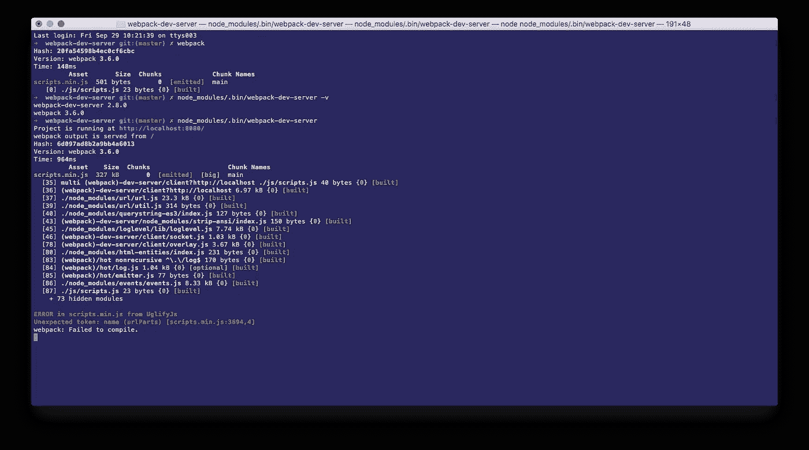
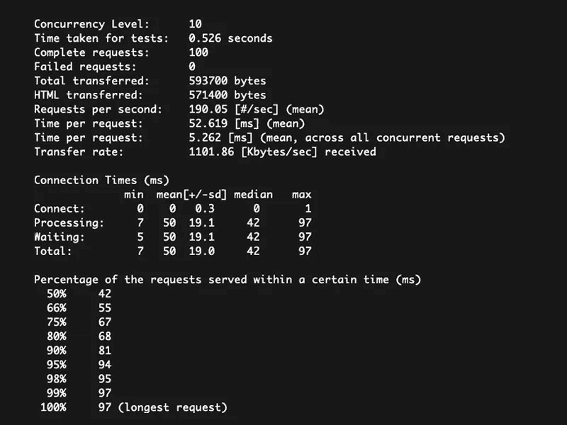

# 为什么 Nuxt.js 是你下一个 Web 应用的最佳选择？

> 原文：<https://betterprogramming.pub/why-is-nuxt-js-the-best-choice-for-your-next-web-application-76cfd53bfe1e>

## Nuxt.js 作为首选 Vue.js 框架的优势


[Nuxt.js](https://nuxtjs.org/) 是 [Vue.js](https://vuejs.org/) 的一个流行框架。如果你是 Vue.js 开发者，你可能听说过 Nuxt.js，但是你可能不知道这个框架是关于什么的。

你可能会问这样的问题:

*   Nuxt.js 背后的理念是什么？
*   Nuxt.js 用于什么类型的应用？
*   Nuxt.js 有什么好处？
*   为什么我需要一个框架的框架？

在这篇博文中，我们将涵盖所有这些问题，并试图以一种精心的方式回答所有这些问题。

# ***什么是 Nuxt.js？***

js 是一个使用 Vue 构建的高级框架。它简化了单页或通用 Vue.js 应用程序的 web 应用程序开发。这个 Vue.js 框架抽象出了服务器和客户端代码分发的细节，这样您就可以只关注 web 应用程序开发。

这个框架的目标是让它足够灵活，以便网站开发者将其用作主要的项目基础。

由于 Nuxt.js 所做的大部分事情都发生在 web [**应用程序开发**](https://www.xicom.ae/services/mobile-app-development/) 阶段，所以你只需要在 js 文件中添加一些额外的 kb 就可以获得很多特性。

让我们来探究为什么你的下一个 [**web 开发**](https://www.xicom.ae/services/web-development/) 项目可能需要 Nuxt。

# ***nuxt . js 如何工作***

当用户访问 Nuxt.js web 应用程序或通过`<nuxt-link>`导航到其中一个网页时，会发生以下情况:

1.  当用户最初访问 web 应用程序时，如果商店中明确定义了`nuxtServerInit`动作，Nuxt.js 将调用这个并更新商店。
2.  js 为所访问的网页执行任何现有的中间件。它首先检查`nuxt.config.js`文件中的全局中间件，然后检查请求页面的匹配布局文件，最后检查 web 页面及其子页面中的中间件。中间件按照这个特定的顺序排列优先级。
3.  如果被访问的特定路径是一个动态路径，并且存在一个`validate()`方法，那么该路径显然是有效的。
4.  然后，Nuxt.js 调用`fetch()`和`asyncData()`方法在呈现页面之前加载数据。`asyncData()`方法广泛用于获取数据并在服务器端呈现，而`fetch()`方法广泛用于在呈现网页之前填充存储。
5.  在最后一步，呈现包含适当数据的页面。

从 Nuxt.js 文档中获得的这个模式中正确地描述了这些操作:



# Nuxt.js 的优势

## ***1。创建通用的网络应用程序，没有麻烦***

Nuxt.js 的最大优势之一是它有助于更容易地创建通用应用程序。

什么是万能 app？

一个通用的 web app 用来描述可以在服务器端和客户端执行的 JS 代码。

许多高级 JS 框架，如 Vue，旨在创建单页面应用程序，也称为 *SPAs* 。在传统网站上做 SPA 有很多好处。

例如，你可以创建非常漂亮的用户界面，更新速度非常快。但 SPAs 也有一些缺点，如加载时间长，谷歌与这些网站的斗争，因为最初在页面上没有内容抓取搜索引擎优化的目的。所有的内容都是事后用 JS 生成的。

一个通用的 web 应用程序是关于拥有一个单页应用程序，但不是拥有一个空白的`index.html`页面，而是在服务器上预加载 web 应用程序，并发送渲染的 HTML 作为对每条路线的浏览器请求的响应，以加快加载时间，并通过使谷歌更容易抓取网页来改善搜索引擎优化。

js 极大地帮助你更简单地编写通用 web 应用程序。

创建通用 web 应用程序可能是一项单调乏味的任务，因为您必须在客户端和服务器端进行大量的配置。

这是 Nuxt.js 旨在为 Vue 应用解决的问题。Nuxt.js 使得在服务器和客户端之间共享相同的代码变得非常简单，因此您可以专注于 web 应用程序的逻辑。

Nuxt.js 还可以让你[访问组件上的各种属性](https://nuxtjs.org/api/context/)，比如`isClient`和`isServer`，这样你就可以很容易地决定你是在服务器上还是在客户端上渲染。

还有一些特殊的组件，比如 [no-SSR 组件](https://nuxtjs.org/api/components-no-ssr/)，它被广泛用于有目的地阻止组件在服务器端呈现。

最后，Nuxt.js 让您可以访问各种组件内部的`asyncData`方法，您可以用它来获取数据并在服务器端编程中呈现数据。

现在，这只是 Nuxt.js 如何帮助您创建通用 web 应用程序的冰山一角。你可以从它的[用户指南](https://nuxtjs.org/guide)中了解更多关于 Nuxt 提供的通用 web 应用程序渲染的信息。

## ***2。静态呈现您的 Vue 应用程序，获得无需服务器的通用应用程序的所有优势***

Nuxt.js 最大的创新之一来自它的`nuxt generate`命令。该命令生成 web 应用程序的静态版本。它将为每条路线生成 HTML，并将其放入自己的文件中。

例如，如果您有下面提到的页面(Nuxt 的路由术语):


Nuxt 将生成以下文件夹结构:


这样做的好处与通用 web 应用程序的优点非常相似。这里有一些标记，可以加快页面加载速度，帮助社交媒体爬虫和搜索引擎抓取网站。

不同之处在于，您不再需要服务器。一切都是在 web 开发阶段产生的。

它非常强大，因为您无需服务器就能获得通用渲染的好处。你可以把你的网络应用放在亚马逊 S3 和 GitHub 页面上。

你可以在 Nuxt.js 的文档中的[静态生成部分](https://nuxtjs.org/guide)中了解更多相关信息。

## **3。获得自动代码分割**

使用特殊的 [webpack](https://webpack.js.org/) 配置，Nuxt.js 可以轻松生成你的网站的稳定版本。

对于统计生成的每个路由(页面),该路由还会获得自己的 JavaScript 文件，其中只包含运行该特定路由所需的代码。这有助于提高速度，因为相对于整个 web 应用程序的大小，它使 JS 文件保持较小的大小。

## 4.使用 starter 模板通过命令行进行设置

Nuxt.js 还提供了一个名为 *starter-template* 的 starter 模板，它为你提供了开始一个项目所需的所有脚手架，以及一个用于组织的良好的文件夹结构。

确保您已经安装了 [Vue CLI](https://cli.vuejs.org/) ，并运行以下命令:


从那里，只需`cd`进入网络应用程序并运行`npm install`，你应该继续这样做。

## **5。默认获得伟大的项目结构**

在许多小型 Vue.js web 应用程序中，您最终会尽可能地在不同的文件中管理代码结构。

默认的 Nuxt web 应用程序结构为以可理解的方式组织 web 应用程序提供了一个很好的起点。

以下是它为您设置的一些目录:

*   Components —一个文件夹，以便您可以单独组织 Vue.js 组件。
*   布局—包含主要 web 应用程序布局的文件夹。
*   Pages 包含 web 应用程序路径的文件夹。Nuxt 读取这个目录中的所有 Vue 文件，并构建 web 应用程序路由器。
*   store——包含所有应用程序的 Vuex 商店文件的文件夹。

## ***6。设置自动更新服务器，便于开发***

与自己设置这个过程或者 web [**应用程序开发人员**](https://www.xicom.ae/services/mobile-app-developers/) 习惯的更改-刷新过程相比，用 Nuxt 创建它是轻而易举的事情。它设置了一个自动更新的开发服务器。

当你在开发和处理这几个`.vue`文件的时候，Nuxt.js 使用一个 webpack 配置来检查所有的修改并为你编译所有的东西。

除此之外，您可以在 Nuxt 项目中运行命令`npm run dev`,它将设置 web 开发服务器。



# Nuxt.js 的基本编码信息

*   GitHub 明星:+19000
*   npm 每周下载量:+100，000

## 装置

安装它:

```
$ npm i nuxt
```

要创建基本应用程序:

```
$ npx create-nuxt-app <project-name>
```

您可以直接使用 CLI `create-nuxt-app`轻松获取最新更新。

除此之外，您还可以使用一个初学者模板来启动它:

*   快递:Nuxt.js + [快递](https://expressjs.com/)
*   Koa: Nuxt.js + [Koa](https://koajs.com/)
*   Starter:基本的 Nuxt.js 项目模板
*   adonuxt:nuxt . js+[AdonisJs](https://adonisjs.com/)
*   nux tent:nuxt . js+[nux tent](https://nuxtent-module.netlify.com/)
*   微:Nuxt.js + [微](http://microjs.com/)模块用于内容繁重的网站

# ***基础 Hello World App***

这是一个最基本的“你好，世界！”Nuxt.js 上的 app:


# **优点**

*   Nuxt.js 的主要范围是 UI 渲染，同时抽象出服务器/客户端分布。
*   静态呈现您的 Vue.js web 应用程序，无需服务器即可获得通用 web 应用程序的所有优势。
*   使用 starter 模板通过命令行进行设置。
*   获得自动代码分割(预渲染页面)。
*   默认情况下获得良好的项目结构。
*   无需任何额外工作即可获得 ES6/ES7 编译。
*   轻松设置路线之间的转换，并编写单个文件组件。
*   设置自动更新服务器，轻松开发 web 应用程序。
*   强大的异步数据路由系统。
*   静态文件服务。
*   开发中的热模块替换。
*   ES6/ES7 传输。
*   前置处理器:Less、Sass、手写笔等。

# **劣势**

*   Vue.js 的这个框架有一个更小的社区，这意味着更少的资源和潜在的更少的产品文档。
*   缺少一些常见的固体插件或组件。(日历、谷歌地图、矢量地图)。有些组件也是存在的，但是一般维护的不是很好。
*   深入更复杂的组件或插件是至关重要的。如果你想创造一些相当灵活的东西，你必须开始渲染各种功能/JSX 来做到这一点。(例如，在另一个位置或组件中呈现插槽的内容。)
*   必须以明确的方式指定道具。有些情况下，你可能想把一些 CSS 类转换成道具；你必须指定所有这些道具，或者使用`$attrs` / `render`函数或 JSX。
*   高流量可能会给服务器带来压力。
*   反应性警告，比如直接从主数组中设置一个项目`this.items[key]=value`或者添加一个新的数据属性。
*   您只能在某些钩子中操作和查询 DOM

# **性能**



这是一个在 Nuxt 中创建的基本 Hello World 应用程序。它每秒处理 190.05 个请求。每个请求花费的平均时间约为 52.619 毫秒。

根据这个标准，与其他框架相比，Nuxt 表现最差。


Nuxt 在可访问性、性能和 SEO 这四项指标中的三项得分最高。

# **社区参与**

*   投稿人数:191 人
*   已完成的拉动请求:1 385

有一个 GitHub 组织，在那里你可以很容易地找到来自 Nuxt 社区的项目和模块。

除此之外，还有一个与 Nuxt [awesome-nuxt](https://github.com/nuxt-community/awesome-nuxt) 相关的 awesome 事物的精选列表，包括工具、模块、展示、提到的 Nuxt.js、教程、书籍、博客、初学者模板、项目和使用 Nuxt 的官方示例。

社区通过[电报](https://telegram.org/)、 [Gitter 聊天室](https://gitter.im/)、俄语社区、 [Discord](https://discordapp.com/) 和 YouTube 频道进行交流。

# **让我们总结一下**

所以，现在你已经很清楚 Nuxt.js 作为首选 Vue.js 框架的各种优势了。

毫无疑问，Nuxt 使得创建单页面 web 应用程序变得非常容易。有很多 [**web 开发公司**](https://www.xicom.ae/services/web-development/) 提供基于 Nuxt 的开发解决方案。

如果你想拥有自己的 web 应用，你可以 [**从这些公司雇佣 web 开发人员**](https://www.xicom.ae/services/hire-web-developers/) 。当你雇佣一个网站开发人员时，确保他们对 Vue.js 和 Nuxt.js 的所有细节了如指掌。