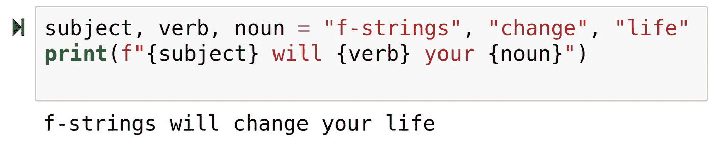

# 为什么这个字符串前面有一个 F？

> 原文：<https://betterprogramming.pub/why-is-there-an-f-before-this-string-9a87e6d43563>

## f 字符串和字符串格式介绍



在 Python 中，如何将变量添加到字符串中？如果我有某人的名字，我如何把它打印出来，并附上额外的信息，比如问候信息？

定义字符串格式:

名词。一种奇特的说法:“让字符串/文本看起来像你想要的那样，不管是用变量、换行符、空格、大写字母等等。

示例:“*这个简单的命令行应用程序输出的字符串格式非常棒，它有颜色和一切！*

在过去的几年里，字符串格式已经有了很大的发展。让我们快速回顾一下过去格式化字符串的方法，滚动到底部看一些 f 字符串的例子。

# 从基础开始

在 Python 中，一切都是对象，包括字符串。这提供了额外的灵活性，例如:`"a" * 4 == "aaaa"`，也就是说，您可以通过加法和乘法“连接”字符串。

在过去的好时光里，我们是这样做的。让我们以一个经典的 Python2 Hello World 应用程序为例。

```
#!/usr/bin/env python 
name = input("What's your name? ") 
print "Hello " + name
```

在这个例子中，我们使用最基本的字符串格式。用`+`符号连接(添加)两个字符串。

如果您将这段代码保存到`hello_name.py`并运行`python hello_name.py`，您将看到输出为`Hello Henry`，亨利被您键入的任何内容所替代。

这对于基本脚本来说很棒，阅读起来也很有意义，但是如果我们想做类似于`"Hello " + name + ", looks like the weather will be " + weather_temp + " " + weather_scale + " degrees today."`的事情呢？

这仍然是可能的，但肯定不是很容易阅读。

如果我们想取一个像`123.45678`这样的数，把它打印成`$123.46`呢？这种方法在字符串格式化方面有明显的局限性。

# %的魔力

那么，让我们回到我们的例子。

假设我们有一个 float(一个带小数的数字，如 in，而不是一个整数),我们想把它打印成一个货币，带逗号和四舍五入。

我们如何做到这一点？

```
amount = float(input("How much? ")) # Convert input (str) to float print("This much? " + amount)
```

如果我们输入`1234.56789`，我们会返回`"This much? 1234.56789"`。那么，我们如何把它打印成美元和美分的数字呢？

我们可以使用称为*字符串格式化操作符*或`%`的东西。不用在末尾添加字符串，我们可以只放一个`%`符号，后面跟着一个类型(比如`d`代表整数，`f`代表浮点，`s`代表字符串，等等)。)然后在其后加上要替换的变量。这提供了(稍微)更可读的代码。

我们上面的例子是:

```
amount = float(input("How much? ")) # Convert input (str) to float print("This much? %f" % amount)
```

但是，这仍然不能帮助我们将`1234.56789`转换为`$1,234.57`。

为此，我们需要使用 [*转换标志*](https://python-reference.readthedocs.io/en/latest/docs/str/formatting.html#conversion-flags) 。

例如，如果我们正在格式化一个浮点数，我们可以用`%.2f`代替`%f`，这将把浮点数四舍五入到两位小数。

```
amount = float(input("How much? ")) # Convert input (str) to float print("This much? $%.2f" % amount)
```

所以，现在我们的输出是`$1234.57`，但是我们仍然没有千位分隔符的逗号...

# 没有格式就不能拼写“字符串格式”

所以，Python 中的一切都是对象。对象可以有方法(函数),那么我们为什么不在 string 对象中添加一个方法来帮助我们格式化字符串呢？

欢迎`string.format()`。

这对 Python 来说是一个巨大的飞跃。我们不仅仅获得了一种更可读的格式化字符串的方式(在脚注中有更多的介绍)，我们还获得了更复杂的格式化规则。

让我们回到我们的例子。

假设我们有一个 float(一个带小数的数字，如 in，而不是一个整数),我们想把它打印成一个货币，带逗号和四舍五入。我们如何做到这一点？

```
amount = float(input("How much? ")) # Convert input (str) to float print("This much? ${0:,.2f}".format(amount))
```

我们的产量现在是`This much? $1,234.57`但是怎么做呢？

format 的基本语法是，它取第一个参数(括号后的值，所以`.format(first, second)`有两个参数，`first`和`second`，并将其放在第一个索引中(用`0`表示)，所以`x = 123`，`"The number is {0}".format(x)`返回`The number is 123`。

`,`告诉 Python 用逗号将数字格式化，这样 1200000 就变成了 1，200000(如果您正在构建一个国际应用程序，请记住在某些国家中`,`和`.`符号是颠倒的)。

好吧，那么`.format`可以做我们想做的一切。那你为什么这么喜欢 f 弦？

# F 弦改变你生活的真正原因

尽管有普遍的看法，开发不是(也不应该)完成工作。它是关于以一种未来开发人员能够理解和扩展的方式把工作做好。

`String.format`拥有您需要的所有功能。Python 2.7 拥有您需要的所有功能。事实上，C 拥有你需要的所有功能，几乎可以完成任何任务。

当 python 升级到版本 3 时，它对语言做了一些彻底的、突破性的改变，虽然有些是为了性能，有些是为了功能，但我个人最喜欢的 f-strings 主要是为了健壮性、可读性和适应性。

f-string 没有引入任何新的功能，但是它们极大地增加了可读性和适应性(它们也提高了性能，但是对我来说，这是一个旁注)。

我们先举个简单的例子:

```
name = "Jenny" 
company = "Acme Inc." 
print(f"Hi {name}, welcome to {company}.")
```

`>>> 'Hi Jenny, welcome to Acme Inc'`

通过简单地在字符串前添加一个`f`，我们已经能够输入当前[范围](https://python-textbok.readthedocs.io/en/1.0/Variables_and_Scope.html)中的任何变量，并在字符串中打印它。这不是真正的革命性，但革命性的是它有多容易理解。

在今天的世界中，代码不是为了执行一个功能而编写的，而是被编写、测试、审查、修改、扩展，并且有一天，可能被替换。

可读性是关键，f 字符串提供了可读性的巨大飞跃。如果你对 Python 一无所知，并且看了前面的例子，我敢打赌你能猜到输出是什么样子。

永远不要低估可读性的价值。对于我们的简单示例，这似乎太简单了，但是让我们看一个更复杂的示例，进行 SQL 查询。

```
col1 = 'bar' 
col2 = 'baz' 
query = f'SELECT * FROM foo WHERE {col1} = ? AND {col2} = ?' cursor.execute(query, params)
```

该查询返回列`bar`和`baz`中的值等于`params`中设置的值的所有行。这并不令人兴奋，但更有价值，在企业环境中更有可能。

如果我们用一个`%`操作符或者一个`.format()`函数重写，它很快变得更加难以阅读。

f 字符串可用的格式类似于`.format`，所以我不会在本文中包括它，但我希望我已经让你相信 f 字符串是有价值的。用于测试、可读性、可扩展性等等。

# 有趣的事实

*   您可以使用小写字母或大写字母 F，字符串格式将是相同的。`f"The result is {result}"`与`F"The result is {result}"`相同。
*   如果你想格式化多行的字符串，你可以在每一行的前面加上一个`f`变量:

```
print( 
f"Hi {name}" 
"welcome to my post" 
f"you're {num_days} late" 
)
```

*   或者，您可以简单地使用 Python 的多行字符串(用三重引号或三重双引号表示):

```
print( 
f"""Hi {name} 
welcome to my post 
you're {num_days} late""" 
)
```

# 巧妙的事实

```
decimals = 3 
amount = float(input("How much? ")) # Convert input (str) to float print(f"This much? ${amount:,.{decimals}f}")
```

输入为`12312.123123`，该脚本的输出为`This much? $12,312.123`。

注:请不要这样，这个真的很难读。

例如:

```
data = {"x": 123} 
print(f'The result is {data["x"]}')
```

或者，相当于:

```
data = {"x": 123} 
print(f"The result is {data['x']}")
```