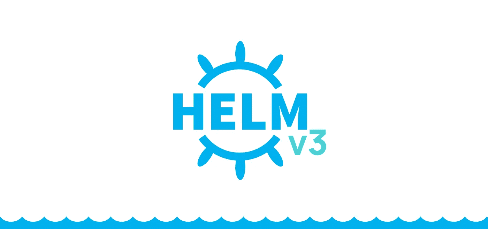

# 为什么头盔 3 中的蒂勒不见了？

> 原文：<https://betterprogramming.pub/why-is-tiller-missing-in-helm-3-2347c446714>

## 没有它他们是如何管理的



Helm 最近宣布了期待已久的版本 3，而 Helm 2 中添加的服务器组件 Tiller 却不见了。因此，现在我们有了一个无服务器的掌舵人。Helm 高度依赖 tiller 来管理 Kubernetes 中的图表生命周期。

# 为什么分蘖被去除了？

舵柄是 Helm 用来部署几乎所有 Kubernetes 资源的工具。为此，默认情况下 Helm 拥有在 Kubernetes 中进行更改的最大权限。因此，任何可以与 Tiller 对话的人都可以部署或修改 Kubernetes 集群上的任何资源，就像系统管理员一样。如果没有按照特定的安全措施正确部署 Helm，这可能会在集群中导致安全问题，而且这也增加了对 Helm 的依赖性。此外，默认情况下，tiller 中不启用身份验证，因此，如果任何一个 pod 受到威胁并有权与 Tiller 对话，那么 Tiller 运行的整个集群就会受到威胁。欲了解更多关于安全问题以及如何在头盔 2 中处理这些问题的信息，请阅读 Bitnami 的博客。

```
$ helm init
$HELM_HOME has been configured at /home/andres/.helm.

Tiller (the Helm server-side component) has been installed in your Kubernetes cluster.

**Please note: by default, Tiller is deployed with an insecure 'allow unauthenticated users' policy.**
To prevent this, run `helm init` with the --tiller-tls-verify flag.
For more information on securing your installation, see: https://docs.helm.sh/using_helm/#securing-your-helm-installation
Happy Helming!
```

# 为什么需要蒂勒？

舵柄被舵手用作群内操纵器，以保持舵手释放的状态。它还用于保存 tiller 完成的所有发布的发布信息——它使用 config-map 将发布信息保存在部署 Tiller 的同一个名称空间中。当 helm 更新或任何版本中有状态更改时，helm 需要此版本信息。

因此，每当使用 helm update 命令时，Tiller 都会将新的清单与发布的旧清单进行比较，并做出相应的更改。因此赫尔姆依靠舵柄来提供先前的释放状态。

# 无舵舵舵是如何工作的？

Tiller 的主要需求是存储发布信息，为此 helm 现在使用 secrets 并将其保存在与发布相同的名称空间中。每当 Helm 需要版本信息时，它都会从版本的名称空间中获取。要进行更改，现在只需从 Kubernetes API 服务器获取信息，在客户端进行更改，并将安装记录存储在 Kubernetes 中。无 tiller Helm 的好处是，由于 Helm 现在从客户端对集群进行更改，因此它只能在客户端被授予权限的情况下进行这些更改。

# 结论

舵把在头盔 2 中是一个很好的补充，但要在生产中运行它，它应该被妥善保护，这将为德沃普斯和 SRE 增加额外的学习步骤。Helm 3 减少了学习步骤，安全管理由 Kubernetes 负责维护。赫尔姆现在可以专注于包管理。

快乐驾驶！

# 资源

[](https://engineering.bitnami.com/articles/running-helm-in-production.html) [## 在生产中掌舵:安全最佳实践

### Helm 已经成为 Kubernetes 最受欢迎的软件包管理器之一。Helm 的目标是帮助您管理 Kubernetes…

engineering.bitnami.com](https://engineering.bitnami.com/articles/running-helm-in-production.html) [](https://v3.helm.sh/docs/) [## 文档主页

### 你需要知道的关于文档如何组织的一切。

v3.helm.sh](https://v3.helm.sh/docs/)