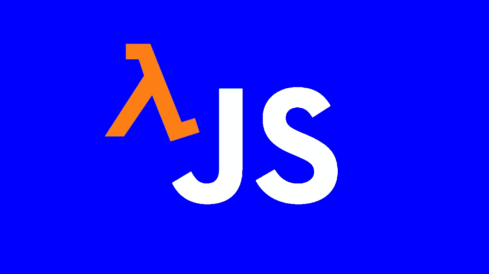

# 为什么 JavaScript 可能是简化代码的函数式编程语言

> 原文：<https://betterprogramming.pub/why-javascript-might-be-a-functional-programming-language-to-simplify-your-web-code-1eb271d04b1e>

## JavaScript 与函数式编程范例有什么共同点

图片由[作者](http://www.arnoldcode.com)制作

在过去十年的 web 开发中，函数式编程(FP)变得非常流行。得益于众多的库和框架( [LoDash](https://lodash.com/) 、 [RamdaJS](https://ramdajs.com/) 、 [React](https://reactjs.org/) 和 [Redux](https://redux.js.org/) 、 [Angular](https://angular.io/) 和 [NGRX](https://ngrx.io/) )，JavaScript 得到了 FP 的极大触动。

但是 FP 这个术语几乎和编程本身一样古老，因此已经存在了相当一段时间。第二古老的编程语言 LISP 仍在使用。

尽管如此，JavaScript 提供了许多提出问题的特性:

JavaScript 是适合 FP 的语言吗？

# 关于函数式编程的不同观点

你想问谁就问谁，你会得到不同的答案。这是一种现代的编程方法，将所有其他范式抛在了后面，不仅因为它可能是先进的和开明的。

其他人会回答说，这种范式过于理论化，无法应用于现实世界的问题。实际上直接实现它是不可能的，因为它给桌面带来的麻烦多于好处。

我认为真相就在内心的某个地方，就像生活中的任何事情一样。没有什么是黑白分明的。

# 反过来想想

三月十五日(张敬利之死)，图片来自[维基百科](https://en.wikipedia.org/wiki/Ides_of_March)

规则作为命令意味着以命令的方式解决问题:一系列的陈述。而您想要的结果是通过创建对象并改变它们的状态来实现的。这最终意味着修改对象本身。

作为官员的规则是完全相反的。您不是关注对象，而是通过计算表达式来创建结果。这些表达式组合在一起构成函数。

FP 是优秀的英国编码方式。没有循环，跳过副作用和传递功能。

# 你工具箱里的东西

一门语言要成为函数式语言需要什么？

如果 JavaScript 提供了我们所需要的那么多，你能使用好的英国编码方式吗？

如果不允许使用循环，还应该使用什么？递归。

跳过副作用意味着拥有一些模块化架构和私有变量。关闭。

将函数作为参数传递给其他函数意味着语言必须提供给我们，一等公民。

一般来说，JavaScript 必须允许您以下列方式编写代码:

模块化、可理解、可测试、可扩展、可重用

## 模块化的

把你的程序分成独立的模块。每个模块都有完成程序功能的一个方面所需的一切。如果你决定改变一个模块，它不应该损害你的代码的其他模块。

## 可理解的

轻松阅读您的代码并快速理解它的功能。它应该读起来像这篇文章的一段文字。因此，可维护性与这个术语密切相关。

## 可试验的

你的编码方式鼓励单元测试，让它变得简单。没有依赖，没有嘲笑。只有函数、测试和你。

最终，测试是记录代码行为的最佳方式。

## 可扩张的

对代码的修改不应该意味着大规模和严重的重构。数据流和原始代码应该受到最小的影响。

## 可重复使用的

请通过模块化来利用您以前编写的代码:将属于一起的部分打包在一起(高内聚)，独立模块之间的松散耦合，关注点分离，最后，信息隐藏以不影响您程序的其余部分。

因此，这种编程方式关注的是*应该做什么*而不是*如何做*。

# FP 给你带来了什么

编写独立的函数，将它们连接在一起产生最终的结果，这是 FP way 编写程序的目标。因此，它们通常更容易理解，因为它们更简洁。

测试这些功能也很容易，因为它们彼此不依赖。它们独立存在，可以像偷奶奶的饼干一样容易地进行单元测试。

说到独立，你可以在其他程序中重用函数。他们不依赖于系统的其他部分。您可以在整个程序中共享公共功能。

由于函数代码没有副作用，你可以在不知道程序其余部分的情况下学习和理解任何函数。

# 最后:JavaScript 有功能吗？

图片由 [Boldomatic](https://boldomatic.com/p/KhMpbA/yes-no-maybe-i-don-t-know-can-you-repeat-the-question) 提供

简而言之:*是，不是，也许，我不知道！*

> “FP 语言没有精确的定义，也没有这种语言应该包含的一组精确的特性。”弗雷德里克·凯莱基

如果一种语言具有与 FP 相同的风格和功能，那么它至少支持函数式编程，并且可以用 SFP (Sorta Functional Programming)终止。

JavaScript 的定义是一把双刃剑。JavaScript 不能被认为是一种全功能语言，但也不能被认为不是一种功能语言。

它支持我们编写功能性代码所需要的很多东西，但不是学术方法想要被认为是 100%功能性的任何东西。

# 学术要求🌬两全其美

纯函数式编程有学术上的期望，就像中国爸爸对他们的儿子一样。

想想 100%的功能性，以及你将从中获得的好处？省略那些阻碍你实现 100% FP 的有用的 JS 结构值得吗？

*在我看来，没有*

您可以省略这些学术要求，因为 JavaScript 是一种已经变得非常强大的工具。其强大的工具为您提供了一种产生优秀解决方案的方式。反过来，它也能让你造成巨大的伤害。

将 FP 视为减少语言中最糟糕部分的解决方案，并专注于以更安全、更好的方式工作。学会接受好的和坏的，避免后者。

JavaScript 为编写函数代码提供了许多重要特性，如下所示:

*   充当一级对象
*   递归
*   箭头功能
*   关闭
*   传播

问题是:为什么要省略它们？

没有实用的答案。使用它们。

利用 FP 特性，减少 JavaScript 经典部分引起的问题，比如副作用、可变对象和递归的实际限制。

这完全取决于你 JavaScript 的功能性如何。

# 最后一句话:FP 不是通往天堂的钥匙

FP 不会自动或神奇地让你写出更好的代码。请注意，您编写的代码是可理解的、可扩展的和可重用的。

绝大多数 JavaScript 代码都是强制性编写的。我们大多数程序员，还有你，都非常熟悉这个概念，并且每天都在使用它。将你的思维转换到 FP 上会是一个障碍，因此，会成为最后期限的破坏者。

完全疯狂地执行 100%功能性风格也意味着伤害你自己。简单的任务可能变得难以实现，正如我之前所说，在使用 JavaScript 时最好坚持 SFP 风格。

不要因为 JavaScript 的结构和功能不是 100%有效就忽略它们。

你的目标是使用 FP 来简化你的代码，而不是让它过于复杂。

[***节省自己大量的时间，专注于重要的主题。***](https://arnoldcodeacademy.ck.page/26-web-dev-cheat-sheets)

阿诺德代码学院 26 网页开发人员备忘单

## 参考

*   [函数式编程简介:JavaScript 范例](https://www.toptal.com/javascript/functional-programming-javascript)
*   [Javascript 是函数式编程语言吗？](https://stackoverflow.com/questions/3962604/is-javascript-a-functional-programming-language)
*   [精通 JavaScript 函数式编程——Frederico Kereki](https://www.amazon.de/Mastering-JavaScript-Functional-Programming-depth-ebook/dp/B0777JHD5M)
*   [JavaScript 函数式编程简介](https://opensource.com/article/17/6/functional-javascript)