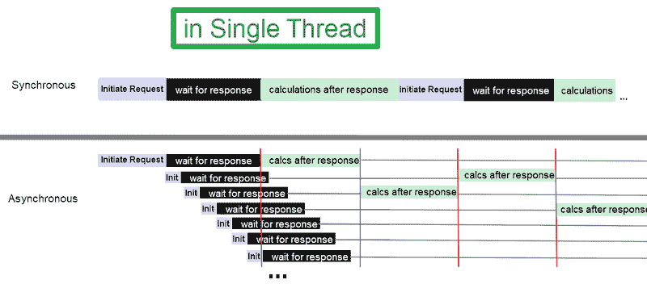

# Async-Await 和 Promises 保证异步代码吗？没有(原因如下)

> 原文：<https://betterprogramming.pub/why-just-using-async-await-and-promises-doesnt-make-your-code-asynchronous-e8ee9014d92e>

## 一个异步方法只有在调用其他异步方法时才是真正的异步

同步与异步|作者图片

许多开发人员有一种误解，认为如果他们在函数定义前添加`async`，返回一个承诺，并在该承诺上使用`.then`或`await`，他们的代码将是非阻塞的(异步的)。在等待该承诺的解决方案时，其他代码(如处理 UI 交互事件)可以自由运行。

本文通过几个例子打破了这个神话，告诉你什么时候你的代码是真正异步和非阻塞的。

JavaScript 是单线程的。它只用一个线程来运行你所有的代码。让我们看一个异步代码的例子:

带`setTimeout()`的异步示例

花点时间试着弄清楚这段代码在做什么。我们正在调用异步函数`OrderIceCream()`，它将创建一个 7 秒钟的计时器，然后执行一个回调，记录“您的冰淇淋已经到达”，并通过消息“冰淇淋已送达”解析承诺，这将由`.then`回调记录。

我们还调用了`EatPizza()`函数。我们想点些冰淇淋，在披萨还在路上的时候吃披萨，之后我们会接受送货。

你认为`console.logs`的顺序会是什么？复制上述代码，将其粘贴到浏览器控制台(f12)中，或者使用 Node 运行它。

带有 setTimeout()输出的异步示例

正如我们所看到的，“订购冰淇淋”首先被记录，然后是“吃披萨”7 秒钟后，“你的冰淇淋已经到了”被记录下来，紧接着是“冰淇淋送到了”这正是我们想要的！

当计时器运行时，JavaScript 主线程没有被阻塞。它可以自由地执行其他代码(T8 函数)。这是异步代码的一个例子。

现在我们来看另一个例子。这一次，我们将稍微改变一下`OrderIceCream()`:

同步 CPU 限制阻塞示例

现在我们已经移除了`setTimeout()`并添加了一个 for 循环，它将运行 10，00，00，00，000 次迭代(一个非常长的循环，需要很多秒才能完成)。

你认为这次控制台日志的顺序会是什么？如果使用`*.then()*`(或使用 async-await)返回一个承诺并在该承诺的解析之后调度一个回调足以使我们的代码异步，并且不会阻塞主线程，那么我们应该会看到与之前相同的结果。

同步 CPU 绑定阻塞示例输出

实际的记录顺序与我们预期的相反。在日志“订购冰淇淋”和“您的冰淇淋已经到了”之间有几秒钟的间隔，我们不想等着冰淇淋来吃我们的比萨饼。为什么会这样呢？

再次提醒你，JavaScript 是单线程的。它使用一个线程来运行你所有的代码。这意味着 for 循环也将在主线程上运行，并且只有当这个 for 循环完成后，其余的代码才会运行。

因此，如果您有同步代码，它将在主线程上运行，即使您的函数是异步的。

注意`console.logs`也是同步代码，但是它们不需要太多的执行时间，所以它们只会阻塞我们的主线程几毫秒。在此期间，如果您的 UI 上有一个按钮单击事件，那么该事件的处理程序将不会被执行，直到线程正在执行的任何内容完成为止。

对于像`console.log`这样的简单语句，这种延迟只有几毫秒，用户几乎察觉不到，但是对于像运行 1e10 次迭代的大 For 循环这样的东西，用户界面会被冻结很多秒，用户会注意到这一点。在线程释放之前，不会运行其他代码。

我使用了 big for 循环的例子来模拟长时间运行的同步代码，比如处理一个大型数据集或者将一个长视频从一种格式转换成另一种格式。

那么，如何才能让这个长时间运行的同步代码不阻塞主线程呢？您可以使用“工作线程”来运行它。虽然 JavaScript 是单线程的，但是我们用来运行 JavaScript 代码的浏览器有“web worker”线程。类似地，NodeJs 也有“节点工作者”线程。您可以在工作线程上运行大 for 循环(或任何其他长期运行的代码)。这将阻塞工作线程，但让您的主线程自由地做其他事情，如处理 UI 事件。

好的，所以即使你的方法使用了 promises 和“`.then`或“`async-await`”，方法内部的代码本身是同步的，将在单个 JavaScript 线程上执行，如果代码是长时间运行的，主线程将不能长时间运行其他任何东西。

但是第一个例子中的`setTimeout()`呢？计时器在哪里计时？它不是也会在主线程执行的时候阻塞它吗？或者我们使用工作线程，这样我们的主线程是自由的吗？那么等待网络响应呢:

异步非阻塞 I/O 示例

在本例中，我创建了一个节点服务器，它监听 localhost:5000，每当接收到一个请求时，在等待 5 秒钟后返回一个响应(正文为文本“Ice cream delivered”)。那么，你认为控制台日志的顺序会是怎样的呢？

既然我们知道所有代码都在同一个线程上执行，我们可能会认为等待网络响应也会发生在那个线程上。这意味着我们应该首先看到“订购冰淇淋”被记录，然后等待响应的过程就完成了，五秒钟后，我们将看到响应(“冰淇淋已送达”)被记录，然后是“吃比萨饼”

异步非阻塞 I/O 示例输出

但是，就像第一个`setTimeout()`的例子一样，我们看到在这种情况下，`EatPizza()`函数也可以在等待响应时执行。首先记录“订购冰淇淋”，然后是“吃比萨饼”，五秒钟后，记录来自服务器的响应(“冰淇淋已送达”)。

为什么计时器和等待网络响应不会阻塞主线程？他们会阻塞一个工作线程吗？

要理解这一点，首先要知道定时器和网络操作都是输入输出操作。一般来说，CPU 上没有发生的任何事情都称为 I/O。

发送网络请求(将请求写入套接字)或读取响应(从套接字)都是 I/O 操作(就像鼠标点击、按键或硬盘读/写一样)。执行这些 I/O 操作的设备是网络接口卡。计算时间使用系统时钟。

`setTimeout()`、`fetch()`等库函数在主线程上同步运行(阻塞一段时间)，但是实际的计算时间、写入网卡、读取网卡响应的工作都是 I/O 操作。

# 线程阻塞的类型

有两种类型的线程阻塞:

CPU 限制阻塞:线程被阻塞是因为它在 CPU 上主动执行。上面的第二个例子(1e10 迭代 for-loop)是 CPU 限制的阻塞。

I/O 绑定阻塞:这里，一个线程被阻塞，等待 I/O 事件发生。在这种情况下，线程没有在 CPU 上主动执行，而是处于休眠状态(在 RAM 的等待队列中)。

JavaScript 不做 I/O 绑定阻塞；它不会在等待 I/O 事件时阻塞线程。它实现了一种叫做“异步非阻塞 I/O”的东西，让线程可以自由地做其他事情，而不是等待 I/O 事件。这就是等待网络响应或计时器完成不会阻塞线程的原因。是的，甚至没有工作线程！

# 结论

仅仅使用承诺和`*.then*`或`*async-await*`不会让你的代码异步(非阻塞)。您的所有代码都在一个线程上运行。

有两种类型的线程阻塞:

CPU 限制的阻塞:如果在异步方法中有长时间运行的同步代码，它将阻塞主线程。为了克服这个问题，您可以使用工作线程来运行长同步代码，让您的主线程自由地处理其他事件。

I/O 绑定阻塞:线程在等待 I/O 事件(如鼠标点击或网络请求/响应)时被阻塞。为了克服这一点，JavaScript 使用异步编程(async-await、Promises 和事件循环)来实现“异步非阻塞 I/O”。要理解这是如何工作的，请查看我的文章。

最终，一个异步方法只有在调用其他异步方法时才是真正的异步(非阻塞的)(而其他异步方法又应该调用另一个异步方法，以此类推)。最底层应该是一个 I/O 操作(I/O 操作完全是异步的)或者一个运行在另一个线程上的同步方法(它会阻塞另一个线程)。

感谢您的阅读。