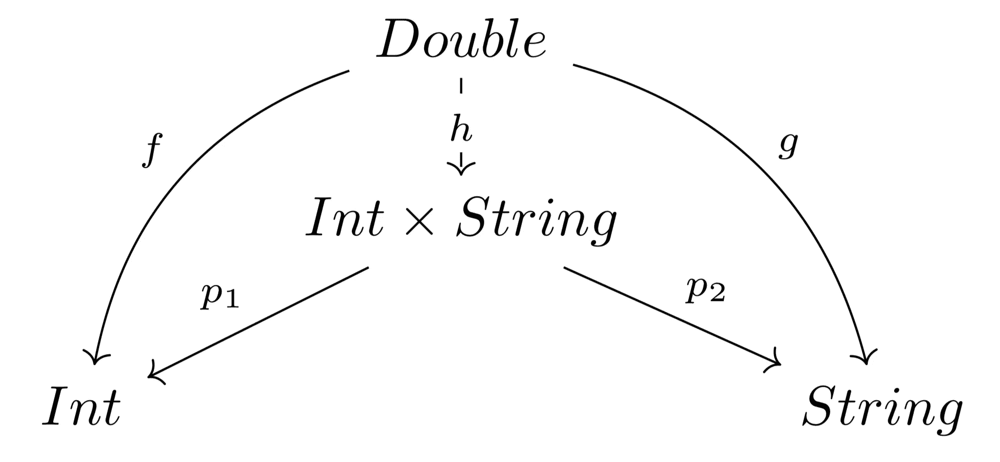
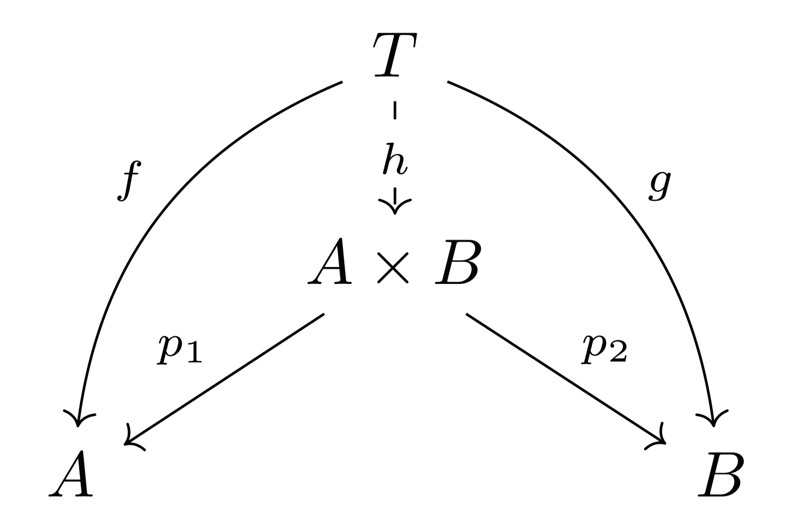

# 为什么在 Swift 5.2 中 KeyPath 有两种类型签名？

> 原文：<https://betterprogramming.pub/why-keypath-has-two-type-signatures-in-swift-5-2-7dcd4a40ca12>

## 更好的关键路径


照片由[安特·哈默斯特](https://unsplash.com/@ante_kante?utm_source=unsplash&utm_medium=referral&utm_content=creditCopyText)在 [Unsplash](https://unsplash.com/s/photos/two?utm_source=unsplash&utm_medium=referral&utm_content=creditCopyText) 上拍摄

让我们踏上探索 Swift 5.1 编译器的`KeyPath`类型的旅程，并尝试理解为什么它是 Swift 在数学上的重要特性。

这一探索将引导我们发现 Swift 缺失的功能。但是不要担心，这正是 Swift 5.2 将添加到`KeyPath`类型中的东西:一个更内在的类型签名。

# 今日`KeyPath`(Swift 5.1)

`KeyPath`类型对于描述如何访问类型内部的变量非常有用。

下面是一个例子。这里，我们用一个名为`agePath`的变量来表示`Human`结构的任何实例的年龄属性的位置。

一个`KeyPath`抽象出封装在一个类型中的任何 Swift 变量的 getter `get{}`和 setter `set{}`功能(如果有的话)。

当试图编写专注于获取或设置类型变量的泛型算法而不需要了解底层类型的细节时,`KeyPath`大放异彩。

我们可以使用一个`KeyPath`来提取`Human`列表中的所有年龄或任何其他属性。

```
func extract<Value>(humans: [Human], path: KeyPath<Human, Value>) -> [Value] {
    humans.map { $0[keyPath: path] }

}

let ages = extract(humans: [steve, jeff], path: agePath)
```

如果编译器没有为所有的`Human`类型的变量生成一个`KeyPath`，我们将不得不自己编写它。让我们通过关注`KeyPath`的 getter 功能来尝试做到这一点。

```
let manualAgePath: (Human) -> Int = { human in
    return human.age
}

let jeffManualAge = manualAgePath(jeff)
```

对于之前定义的`extract`功能，这将转化为以下内容。

注意，我们刚刚获得了一种调用`.map`函数的好方法。没有一些额外的工作，将一个`KeyPath`传递给`map`是无法实现的(Swift 5.1)。代码`[jeff, steve].map(\Human.age)`无法编译。

我们可以编写一个助手来将`KeyPath<Root, Value>`转换成`(Root) -> Value`类型的函数，但是编译器不会为我们这么做。

编译器应该在这里帮助我们吗？没有明显的理由说明为什么会这样...让我们很快回到这个问题上来。

# 元组

具有两个字段的结构听起来很熟悉，让我们尝试以另一种方式定义`Human`类型。

```
typealias HumanTuple = (Int, String)

let tupleJeff: HumanTuple = (5, "Jeff")
let tupleSteve: HumanTuple = (32, "Steve")
```

我们只是捕捉到了和以前一样的信息。但是年龄的`KeyPath`在哪里？

tuple 类型有两个重要的变量。变量`0`和`1`来访问一个元组的第一个和第二个属性。

注意编译器如何在一个元组上创建`0`和`1`属性，以便我们访问该元组中的内容。如果没有这些属性，元组类型将毫无用处。

是时候了解 tuple 和 Swift `struct`是如何相互关联的了。通过回答这个问题，我们将解开对`KeyPath`及其重要性的理解。

# 两种类型的产品

对于我们的其余探索，让我们假设 swift 类型由集合表示(数学集合，而不是 Swift 类型`Set`)。准确地说，是包含该类型可表达的所有可能值的集合。

例如，类型`Bool`可以被视为两个值`true`和`false`的集合。以下符号用于描述该集合。

```
Bool = ｛ true, false ｝
```

另一个例子是有三种情况的简单`enum`。

```
enum Color {
    case red
    case blue
    case green
}
```

关联的集合就是这个`enum`可以取的三个值。

```
Color = ｛ red, blue, green ｝
	  = ｛ blue, green, red ｝
	  = ｛ green, red, blue ｝
```

这里我们使用等号`=`来表示集合之间的相等。等式提醒我们，集合中的顺序并不重要。

我们可以定义两个集合`X`和`Y`的乘积，表示为`X×Y`，通过创建由这些集合生成的所有可能的对。为了命名一对对象，我们将使用 Swift 用于元组的相同符号。

```
Bool×Color = ｛ (true,blue), (true,red), (true,green), (false,blue), (false,red), (false,green) ｝
```

这也适用于无限集合，如`Int`和`String`(假设计算机有无限内存来表示它们...).

因此，从这个角度来看，类型`Human`和`HumanTuple`是相同的。它们是类型`Int`和`String`的产品。

```
Human = HumanTuple
	  = Int×String
	  =｛ ..., (5,"Jeff"), (32,"Steve"), (26, "Simon"), ... ｝
```

更一般地说，在`swift`中，我们会有以下两种类型。

```
struct PairStruct<A,B> {
    let a: A
    let b: B
}

typealias PairTuple<A,B> = (A,B)
```

当作为器械包查看时，类型`PairStruct`和`PairTuple`是相同的。

```
PairStruct = PairTuple
		   = A×B
		   =｛ all possible pairs ｝
		   =｛ (a,b) where a∊A, b∊B ｝
```

它们代表了两种原始类型`A`和`B`的所有组合。综上所述，从集合的角度来看，元组和`struct`是一样的。现在，是时候找到产品类型中的`KeyPath`了。

# 集合的乘积，又来了！

让我们试着找出两个集合乘积的等价定义。通过对集合的乘积有一个等价但不同的框架，我们将找到拼图中缺失的那块。

让我们随机选择一个类型，例如`Double`(我们可以用任何类型替换`Double`)。

现在选择从`Double`到`Int`和从`Double`到`String`的两个函数的随机实现(我们可以用任何实现替换！).

记住`f`和`g`，让我们用下面的类型签名实现我们能想到的最自然的函数。

```
func h(x: Double) -> PairTuple<Int, String> {
    fatalError()
}
```

我们可以简单地使用这些来创建一个元组。

```
func h(_ x: Double) -> PairTuple<Int, String> {
    (f(x), g(x))
}
```

我们前面已经看到，为了使 tuple 类型有用，我们需要一种方法来提取第一个和第二个组件。

如上所述，编译器自动为我们提供了变量`0`和`1`。我们可以通过为`PairTuple`类型创建两个函数来表达这种提取能力。

我们称这些函数为*投影图*。想象一个光源产生一个阴影，一个投影贴图把元组投影回原来的类型。根据我们在`PairTuple<Int, String>`前面放置光源的位置，我们会看到阴影`Int`或`String`。

而且，没有一个影子的*影子。从这个意义上说，投射一个影子会给我们同样的影子。严格地说，投影图是合成的幂等函数:*多次应用它将给出相同的结果。**

要看到这一点，重新定义`proj_1`以返回类型`(Int,String)`和返回值`(p.0, "")`。我们观察到`proj_1(proj_1(x)) == proj_1(x)`对于我们构造的所有`x`。

这里我们注意到，如果我们选择值为`3.4`的`Double`，我们有两个等式。

```
proj_1(h(3.4)) == f(3.4)
proj_2(h(3.4)) == g(3.4)
```

对于`Double`的所有选择也是如此！这意味着函数`f`等于函数`{ x in proj_1(h(x)) }`并且`g`等于函数`{ x in proj_2(h(x)) }`。

更简单地说，我们看到，不管我们走哪条路，沿着下图中的箭头走都会得到相同的答案。



让我们重新定义我们对任何`PairTuple`的预测。

让我们从新的角度来定义这个产品。

两种类型`A`和`B`(用于投影图`p_1`和`p_2`)的乘积称为`A × B`，是唯一的集合，因此对于任何类型`T`、任何函数`(T) -> A`、任何函数`(T) -> B`，我们可以编写一个唯一的函数`h`，这样沿着箭头(见下图)可以得到相同的答案。

这需要理解很多，但是下一张图应该直观地总结它，并帮助理解这个定义。



通过前面的观察和一些工作，我们可以(这里我们不做)证明我们的两种类型乘积的定义是等价的。这意味着通过使用其中一个定义，我们可以推导出另一个定义，反之亦然。

为了说服我们自己这些定义是等价的，让我们试着将新的定义应用到我们之前的例子`Bool×Color`。试着去掉这个集合乘积的一个元素，例如，`(true, blue)`，想象它是新定义的乘积集。

你能看出什么不对吗？它将显示该产品是通过投影图的透镜理解任何函数`f`和`g`的最佳(且唯一)集合(投影的最佳分解集合)。

我们刚刚展示了投影图`p_1`和`p_2`是产品定义的一部分。

在`PairTuple`类型上，从函数的角度来看，它们是`0`和`1`变量。在`PairStruct`上，它们是`a`和`b`变量，或者从函数的角度看是`\PairStruct.a`和`\PairStruct.b` `KeyPath`。

# 未来的关键路径(Swift 5.2)

多好的旅程啊！我们从如何使用`KeyPath`的例子开始，以理解元组和`struct`的一些抽象定义结束。

在此过程中，我们改变了对`struct`的观点，将其视为两个集合的乘积，然后我们重新审视了乘积的定义并发现了投影图。

我们发现了产品功能`proj_1`和`proj_2`的内在本质。

现在的问题是:`swift`中的投影图在哪里？”答案是你在`swift 5.1`里找不到它们。

但是在`swift 5.2`中，编译器会自动将`KeyPath<Root, Value>`提升到与类型签名`(Root) -> Value`相关联的投影图！因此，下面的代码将会编译:

```
[jeff, steve].map(\Human.age) // Swift 5.2
[jeff, steve].map { $0[keyPath: \.age] } // swift 5.1
```

总之，从计算 Swift 5.2 中两种类型(或任意数量的类型)乘积的角度来看，`KeyPath`将拥有其自然类型签名。