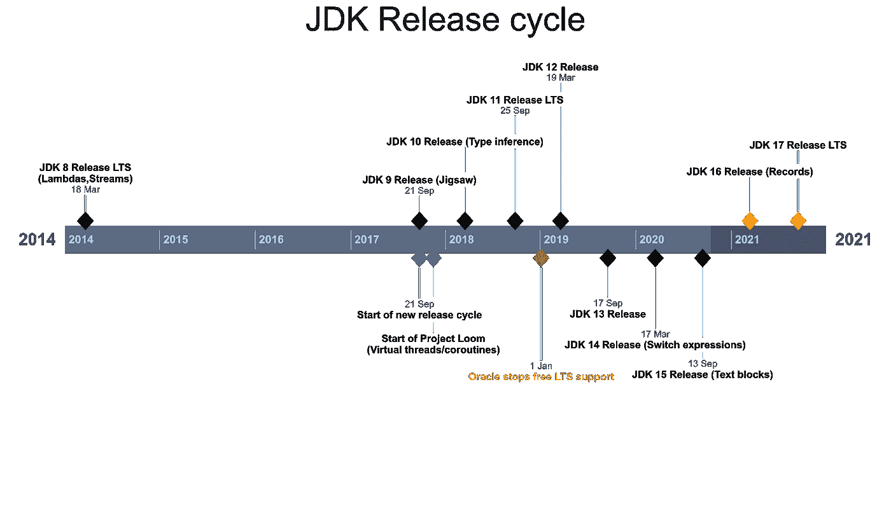
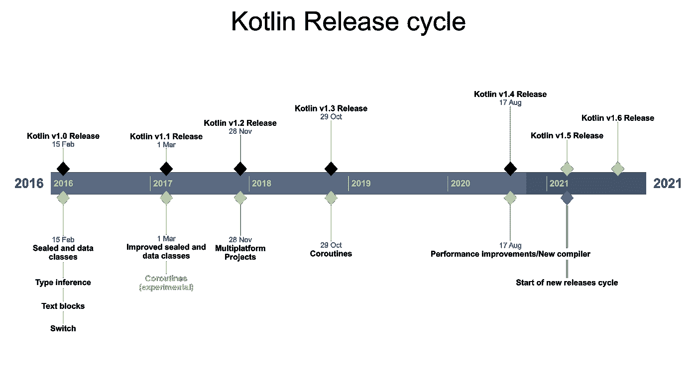

# 为什么 Kotlin 是全天候编程语言的明智选择

> 原文：<https://betterprogramming.pub/why-kotlin-is-an-intelligent-bet-as-the-all-weather-programming-language-378eee69a850>

## 除了是 Android 开发的首选之外，它还能提供更多的功能


jaros aw kwoczaa 在 [Unsplash](https://unsplash.com?utm_source=medium&utm_medium=referral) 上拍摄的照片

如果你是一名软件开发人员或者任何在 IT 部门工作的专业人士，你可能听说过[科特林语](https://kotlinlang.org/)。

在过去的四年中，Kotlin 语言在业内开发人员中获得了很大的吸引力和受欢迎程度。在它的好处中，它的支持者列举了它的简洁性、表达性和简单性，主要是与其他语言相比，它使他们编写代码时更容易。事实上，Java 开发人员的学习曲线非常平坦，这也是一些开发人员和组织在决定转向 Kotlin 之前需要考虑的一个事实。

在这篇文章中，我们将介绍 Kotlin 语言的主要特征。我们还将简要地谈论它的历史，但更重要的是它的未来！

# 历史

Kotlin 语言由 JetBrains 公司于 2011 年首次发布；如果你不知道他们，他们最早是因为创造了流行的 IntelliJ 想法而出名，现在他们也因为创造了科特林语言而出名。

虽然他们的第一个版本是在 2011 年，但直到 2016 年才发布了 Kotlin v1.0，这是 JetBrains 将提供向后兼容性的第一个官方版本；你可以在这里查看 Kotlin 版本控制方案[。科特林目前是 1.5 版本，在接下来的时间线，我们可以比较科特林的发布周期和 JDK 的发布周期。](https://kotlinlang.org/releases.html)



图片来源:作者



图片来源:作者

在 JDK 9 之后，JDK 从基于特性的发布周期转变为基于日期的周期，即每六个月发布一个新版本，与特性的状态无关。除此之外，在这个发布周期中，每三年就会发布一个新的 LTS 版本。

另一方面，Kotlin 的发布周期也是以基于功能的周期开始的，但 JetBrains 已经决定从 2021 年春天的 1.5 版本开始切换到数据驱动的周期。

如果我们仔细观察语言特性，我们会注意到 Kotlin 从一开始就支持 Java 目前试图引入的大多数特性。我们可以注意到的另一个方面是，Kotlin 现在作为一种语言似乎是稳定和成熟的，因为它的发布更加专注于提高性能和开发人员的体验。

根据不同的消息来源，导致 JetBrains 工程师开始编写他们自己的语言的主要原因主要是因为找不到任何满足他们需求的现有语言；目标是构建一种简洁、优雅、富于表现力的语言，并且能够快速编译。

这种新语言的另一个重要特征是，它必须能够与 Java 语言互操作，以便缓慢而轻松地采用这种新语言。通过这样做，特别是 Kotlin 是一种 100%开源的语言，它仍然可以访问 Java 开源社区在过去几十年中所做的所有工作。

编写一种新语言并不容易，但是编写一种与现有语言(如 Java)完全互操作的新语言就更难了。然而，尽管面临挑战，JetBrains 目前似乎做得非常好，根据他们的语言从社区获得的良好欢迎来看。

Kotlin 在我们的行业中变得如此流行和广泛采用的原因是什么？让我们通过它的主要特点来了解它受欢迎背后的原因。

# 最重要的是简单和实用

如果说 Kotlin 有什么特点的话，那就是它专注于满足开发人员的愿望，致力于让他们的生活和日常工作尽可能顺畅和简单。当我们每天在专业水平上编写代码时，我们经常面对的是那些小的和明显不重要的事情，这些事情会扼杀我们的生产力，并使我们不断产生浪费时间和失去动力的感觉。

科特林消除了一些不必要的烦恼，这是众所周知的，也是我们所有人都认可的，尽管出于这样或那样的原因，到目前为止什么也没有做。

让我们简单地看一下其中的一些。

## **多平台**

Kotlin 是一种多平台语言，可以在不同的[支持平台](https://kotlinlang.org/docs/reference/mpp-supported-platforms.html)上执行；通过使用 Kotlin/JVM、Kotlin for Android、 [Kotlin/JS](https://kotlinlang.org/docs/reference/js-overview.html) 和 [Kotlin/Native](https://kotlinlang.org/docs/reference/native-overview.html) ，您可以针对不同的运行时环境，如 JVM、Android、JS 或许多其他环境。但是，请记住，多平台项目的状态仍然处于“Alpha”状态；这意味着它还不稳定，您可能会遇到一些迁移问题。如需更多信息，请查看此[链接](https://kotlinlang.org/docs/reference/evolution/components-stability.html)。

## **类型**

Kotlin 类型与 Java(数字、字符、布尔、数组和字符串)非常相似，只有一个主要区别:Kotlin 中不存在原语。尽管原语不能被显式定义，但只要有可能降低内存占用，Kotlin 的编译器就会将类型转换成 JVM 字节码中的原语。

你可以在这里找到更多关于 Kotlin 类型的信息。

## **创建新实例**

像 Java 或 C++这样的语言需要使用“new”操作符来创建对象的新实例。我们都习惯了，但真的有必要吗？为什么不直接调用构造函数呢？

这正是 Kotlin 所做的，我们不再需要在 Kotlin 中使用“new ”,调用一个对象的[构造函数](https://kotlinlang.org/docs/reference/classes.html)就足以创建一个新的实例。

例如，我们可以创建一个订单对象的实例，如下所示:

```
val order = Order("id", 10, BigDecimal(12.5), OrderType.BUY)
```

## **语句结束**

例如，在一些语言中，为什么我们被迫在每一行的末尾写一个分号？提供在一行中编写多条语句的能力是不必要的，而且出于可读性的考虑，可能也不推荐这样做，那么为什么不接受使用分行作为表示语句结束的标准呢？如果你是一名 Java 或 C++开发人员，你可能已经错过分号成千上万次了——想想所有浪费的时间。Kotlin 不要求使用分号来结束语句，尽管如果您这样做了，它仍然可以编译。

## **类型推断和不变性**

Kotlin 还减少了两次声明变量类型的繁琐；类型推断允许我们只声明一个新变量的创建，从语句的右边部分推断类型。

在[变量声明](https://kotlinlang.org/docs/tutorials/kotlin-for-py/declaring-variables.html)方面的另一个改进是我们不需要使用任何额外的修饰符来声明一个不可变的变量；Kotlin 只提供了两个关键字:`var`和`val`。比其他语言简单得多，如果你需要一个可变变量，使用`var`；如果你需要一个不可变的变量，使用`val`，就这么简单。例如，下面的代码片段是允许的，我们可以覆盖用“var”定义的可变变量的值

```
var order: Order = Order("id1", 10, BigDecimal(12.5), OrderType.BUY)
order = Order("id2", 12, BigDecimal(15.5), OrderType.SELL)
```

另一方面，这种情况是不允许的，因为“顺序”是一个不可变的变量:

```
val immutableOrder: Order = Order("id1", 10, BigDecimal(12.5), OrderType.BUY)
immutableOrder = Order("id2", 12, BigDecimal(15.5), OrderType.SELL) //Compilation error!
```

## **数据类别**

Kotlin 提供了一种非常简洁的方式来定义不可变对象，在 Kotlin 中它们被称为“[数据类](https://kotlinlang.org/docs/reference/data-classes.html)”。在 Java 中，声明一个具有不可变字段的类总是特别复杂和冗长，在 Kotlin 中，您可以用一行代码实现这一点:

```
data class Employee(val id: String, val name: String, val age: Int)
```

## **NullPointerException 困境**

如果您是一名 Java 开发人员，您肯定遇到过将 null 作为对象或变量的可能值的问题；这个问题最简单的解决方案是什么？常识告诉我们，首先不允许空值可能是最简单、最安全的解决方案；这正是科特林所做的。如果你试图在 Kotlin 中给一个对象赋一个空值，你会得到一个编译错误，所以默认情况下对象是不可空的，你必须明确地告诉编译器这个对象是可空的以允许空值。太棒了，不是吗？再次强调，简单和安全第一。

```
val order: Order = null //Compilation error!val nullableOrder: Order? = null
```

## **字符串插值**

我敢打赌，如果您使用的语言不支持字符串插值，那么您已经错过这个特性几百次了，必须连接字符串的不同部分来构建预期的格式是非常麻烦的。Kotlin 提供了一个非常简单和好的方法来做字符串插值。例如，您可以这样做:

```
val name = "John"
val surname = "Smith"
println("My name is $name $surname")
```

**对象破坏**

Kotlin 为我们带来了 JavaScript 中最酷的特性之一，对象析构。我们可以这样做:

```
val (name, age) = Employee("id1", "John", 35)
```

这很好，尽管不幸的是这只能用数据类来实现。如果我们想在没有数据类的情况下使用字符串插值，我们被迫在 Order 对象中实现 component1()和 component2()操作符，这是我个人不太喜欢的。

例如，如果我们的 Employee 类不是一个数据类，我们必须做以下事情才能使用对象析构:

```
class Employee(val id: String, val name: String, val age: Int) {
  operator fun component1(): String = name
  operator fun component2(): Int = age
}
```

您还可以使用 [Kotlin 扩展](https://kotlinlang.org/docs/reference/extensions.html)来实现 Employee 类所需的操作符:

```
private operator fun Employee.component1(): String = name
private operator fun Employee.component2(): Int = age
```

你一定想知道为什么我们必须这样做才能使用对象析构；实际原因是，如果您反编译相应的类文件，Kotlin 编译器会将数据类编译为以下内容:

可以看到 Kotlin 为数据类中定义的每个属性提供了一个组件操作符。但是，如果您将 Employee 类修改为不是一个数据类，而只是一个简单的 Kotlin 类，那么您将会看到 Kotlin 没有覆盖那些操作符。

```
// IntelliJ API Decompiler stub source generated from a class file
// Implementation of methods is not availablepackage com.coding.kotlinpublic final class Employee public constructor(id: kotlin.String, name: kotlin.String, age: kotlin.Int) {
  public final val age: kotlin.Int /* compiled code */ public final val id: kotlin.String /* compiled code */ public final val name: kotlin.String /* compiled code */
}
```

Kotlin 的对象析构很好地解决了一个问题，那就是 Java 提供了一种复杂而混乱的方式来遍历 Map 中的条目。在 Kotlin 中，我们可以简单地执行以下操作:

```
for ((key, value) in myMap) {
  println("$key, $value")
}
```

这无疑是更好的，仍然一样快！

## **默认论点**

在一些语言中，我们必须复制构造函数来允许它的一些参数的可选性，这给我们的类增加了混乱。

Kotlin 解决了这个问题，它允许在没有指定参数时为参数提供默认值。

例如，如果我们为订单类型定义一个默认值:

```
constructor(userId: String, quantity: Int, price: BigDecimal, type: OrderType = OrderType.BUY)
```

我们现在可以在不指定订单类型的情况下实例化订单对象:

```
val buyOrder = Order("id", 10, BigDecimal(13.2))
```

## **命名论据**

如果您已经处理过具有大量字段的复杂域，通常很难跟踪构造函数中的哪个参数对应于组件中的哪个字段。

Kotlin 通过提供在构造函数中命名参数的能力来解决这个问题。这允许在构造函数中更明确地声明参数，大大提高了它的可读性。此外，在这种情况下，我们不必按照相同的顺序排列参数。

例如:

```
val sellOrder = Order("id", type = OrderType.SELL, price = BigDecimal(3.0), quantity = 1)
```

总的来说，我们有更少的僵化和更具表现力和可读性的语言。

## **异步编程—协同程序和通道**

Kotlin 对 Java 等语言采取了不同的方法来运行多线程应用程序；Kotlin 的工作方式与 Golang 的工作方式非常相似。

Golang 提供 [goroutines](https://tour.golang.org/concurrency/1) 和[通道](https://tour.golang.org/concurrency/2)，与 Kotlin 提供[协程](https://kotlinlang.org/docs/reference/coroutines-overview.html)和[通道](https://kotlinlang.org/docs/reference/coroutines/channels.html)的方式相同。

为了帮助您理解为什么协程如此重要，我将简单谈谈当前 Java 线程的工作方式。Java 线程的当前实现依赖于操作系统内核线程，这带来了一些问题:

1.  线程是非常繁重的，主要是因为当一个线程被挂起时，它的本地调用栈和 Java 的调用栈必须被存储或检索。
2.  操作系统调度程序无法区分线程，从而无法按用户或工作单元对它们进行分组。这意味着处理相同数据的两个线程很可能由不同的 CPU 执行。

这导致了一个大问题:线程之间的上下文切换非常昂贵，并且降低了性能，因为在 CPU 之间传输数据非常昂贵。理想情况下，我们希望这两个相关的线程由同一个 CPU 处理，但是使用操作系统调度程序这是不可能的。这让我们想到了科特林对这个问题的解决方案:科特林的协程。

Kotlin 的协同程序是非常轻量级的组件，用于并发运行任务；与 Java 线程相比，它们的规模非常小，而且与 Java 线程相比，它们不是由操作系统管理，而是由 Kotlin 运行时管理。这意味着我们可以创建大量的线程，每个用户或事务拥有一个“线程”现在是可能的，这与 Java 的限制形成了对比，因为 Java 线程太重了。

让我们看一个协程例子来更好地理解它们:

```
val start = System.nanoTime()
runBlocking(Dispatchers.Default) {
   (1..2_000_000).map { index ->
       launch {
           delay(100)
           println("I'm a lightweight thread number $index! running on ${Thread.currentThread()}")
       }
   }
}
println("Done in ${(System.nanoTime() - start) / 10e09} seconds!")
```

在这个例子中，我们创建了 200 万个“线程”，每个线程模拟 100 毫秒的延迟。这些线程将并发运行，它们将由 Kotlin 运行时处理。Kotlin 允许我们毫无问题地创建大量线程；这在 Java 中是绝对不可行的，您需要一个有限大小的线程池，并在不同的调用中重用线程，因为创建和保存线程的成本很高。

协程的工作方式大大简化了开发人员编写异步任务的工作；线程管理隐藏在 Kotlin 的运行时之后，异步任务也可以像同步任务一样编写。

Kotlin 还提供了[通道](https://kotlinlang.org/docs/reference/coroutines/channels.html)作为协同程序之间的通信方式。为了容易理解它们的工作方式，你可以把它们想象成一个消息传递系统；有一个发送消息到信道的发射器和一个或多个处理这些消息的接收器。这些协同程序之间的通信总是在这个通道内进行。

这是处理并发性和并行性的更有效和更简单的方法；利益相关者不是共享资源，而是在他们之间交流以实现一个共同的目标！

Kotlin 的协程和通道是一个非常有趣的主题，可能值得单独写一篇文章来讨论它们，但目前这足以清楚地了解它们的概念。最后要提到的是，Kotlin 有一些很好的库来帮助我们开发异步应用，例如， [Ktor](https://ktor.io/) ，这是一个通用的微服务和 web 应用的异步框架。

我们肯定可以继续展示 Kotlin 已经提出的所有现有的好特性，但这可能足以让您很好地了解这种语言在 JVM 世界中给我们带来的思维方式的根本变化。由开发人员驱动的语言设计，专注于生产力、简单性和舒适性，让我们享受我们所做的事情。对抗样板代码和不必要的混乱。

这就是 Kotlin 所追求的实用主义——一些看起来微不足道的小事，但当它们放在一起时，它们会在生产力方面产生巨大的影响！

现在我们已经了解了 Kotlin 作为一种语言的一些情况，让我们看看 Kotlin 目前做得怎么样。

# 目前，这是一个良好的开端

如果你看看市场趋势和开发者在社交媒体上的评论，你会清楚地看到 Kotlin 受到了社区的热烈欢迎。科特林为许多人带来了新鲜空气；其激进且非常聪明的方法产生了巨大的影响。

根据[谷歌趋势](https://trends.google.com/trends)，在下图中你可以看到全世界对科特林的兴趣:


提供一种几乎看起来像是全新的语言，但同时又能与 Java 语言完全互操作，并且能够使用 JVM 作为其运行时环境，这意味着一个巨大的优势，这是一个非常明智的举措。尽管有其他 JVM 语言能够与 Java 代码进行互操作，但在某些情况下，Kotlin 完美的互操作性要优越得多，而且在互操作性水平相似的情况下，该语言的其他特性有利于 Kotlin。

大多数公司害怕大的变化；他们害怕发现自己陷入一种不舒服的境地，每个人都不喜欢新的变化，管理层内部有一种遗憾感，没有人看到一种简单的回归方式。

Kotlin 允许这些公司采取小步骤，继续使用他们目前使用的相同的库和框架，并慢慢地转移到 Kotlin，看看事情如何发展——不着急，风险最小。

这让公司有能力按照更保守的方法来尝试，而不像他们转向一种全新的语言那样冒太多的风险。

虽然 Kotlin 允许以更平滑的方式从 Java 切换，但值得一提的是，在生产中过渡到一种新语言从来都不是一件容易的事情；你需要制定一个目标明确的适当计划。了解我们想要实现什么，为什么我们要做出这样的选择，并努力让每个人都参与进来，包括管理层，这一点非常重要。在进行迁移之前，我们还必须考虑风险是什么；风险是团队中可能缺乏使用新语言的经验，或者难以将新开发人员引入团队。

一旦明确了风险，就更容易准备将这些风险最小化，甚至准备好备用计划。

迁移到 Kotlin 时需要考虑的一个重要方面是，在 Pivotal(现在是 [VMWare Tanzu](https://tanzu.vmware.com/pivotal) 的一部分)决定从 2017 年 5.0 版本开始支持 Kotlin [之后，Kotlin 已经成为](https://spring.io/blog/2017/01/04/introducing-kotlin-support-in-spring-framework-5-0) [Spring framework](https://spring.io/) 中的一等公民。这允许在 Spring 集成中使用 Kotlin 特性，在使用 Spring 和 Kotlin 时能够实现更简洁和更具表现力的代码，并且对于所有使用 Spring 框架的项目来说，体验从 Java 到 Kotlin 的更平滑过渡。


图片来源:[https://spring.io/](https://spring.io/)

Kotlin 采用的另一个重要步骤是它在移动开发行业的巨大成功。2017 年，谷歌首次宣布 Kotlin 支持 Android 开发，然后，仅两年后，谷歌公开表示，其 Android 开发的新首选语言现在是 Kotlin，这是朝着我们行业的开发人员广泛采用 Kotlin 迈出的一大步。这意味着现在我们可以像使用 Java 一样，为后端和移动应用程序使用相同的语言和相同的库，但是要编写更简洁、更有表现力、更优雅的代码，并利用一些很酷的语言特性，如空安全或协程。

正如我们所看到的，科特林的现在看起来很光明，但科特林的未来会是怎样的呢？

# 它的未来

如果有人让我为未来几年的一种语言打赌，那肯定是科特林。

在我们的行业中，保持敏捷并以足够快的速度在竞争中保持领先地位是实现业务目标的关键，这就是为什么为 Kotlin 下注可以成为一种竞争优势。Kotlin 的采用可能意味着组织中团队生产力的提高——为什么要等到下一个 Java LTS 版本才能使用 Kotlin 中已经可用的一些特性呢？更糟糕的是，一些我们在 Java 中已经丢失了很多年的特性已经被 Kotlin 支持了很多年，它们甚至不在 Java 下一个版本的路线图中。

这些缺失功能的好例子可能是 Java records，它仍然具有预览功能，我们至少要等 6-12 个月才能安全地使用它们，或者还有 Java 的 [Project Loom](https://wiki.openjdk.java.net/display/loom) 。Java 线程一直是一个问题，尽管如此，这项工作直到 2017 年底才开始。尽管他们正在取得进展，并且有一些[早期版本](https://jdk.java.net/loom/)可以开始试用，但这还远远没有完成。

另一方面，JetBrains 设法在一个更合理的时间框架内生产就绪的东西；这也是一些开发人员对 Java 失去耐心，决定转用 Kotlin 的原因之一。

当我们用 Kotlin 编写代码时，我们可以获得 Java 作为 JVM 语言的所有系统优势，例如在性能方面，同时受益于在简明性、可读性、表达性以及最重要的生产力方面最好的语法之一。

我们都知道 Kotlin 的主要用途是服务器端和 Android 开发，但让 Kotlin 更有趣的是，它被设计成一种多平台语言，从 JVM 世界的角度来看，它超越了我们对多平台的传统理解。

例如，我们可以利用 [Kotlin/JS](https://kotlinlang.org/docs/reference/js-overview.html) 将我们的代码转换成 JavaScript，能够编写 web 前端应用程序，甚至 [React 应用程序](https://kotlinlang.org/docs/tutorials/javascript/setting-up.html)！在不涉及太多细节的情况下，我认为这可以为全栈开发带来许多好处，但最重要的是，这可以填补后端和前端开发之间的现有差距，从而改善未来的事情。

除此之外，我们还可以使用 [Kotlin/Native](https://kotlinlang.org/docs/reference/native-overview.html) 在不可能或不希望运行 JVM 的平台(嵌入式设备、iOS 等)上用 Kotlin 编写应用程序。)，这可能对一些用例有用。

所有这些都为开发人员提供了更大的灵活性，还有由 [JetBrains](https://www.jetbrains.com/) 提供的极好的工具支持的额外好处；我想我们都同意，由工具制造商设计的语言对于良好的开发人员体验有很大的优势。


图片来源:[https://www.jetbrains.com/](https://www.jetbrains.com/)

但是科特林充满希望的未来背后的原因并不纯粹是技术性的；它们也是结构性和组织性的。在我看来，JetBrains 是一家规模相当小、充满活力、快节奏的公司，目标明确，雄心勃勃。另一方面，有一些其他公司要么太大，要么可能没有获得正确牵引力和实现足够速度以快速完成任务所需的正确组织水平。

这是大公司很难超越的。可能是他们的规模让他们走得更慢，或者可能只是害怕走得更快和做出大的改变，但这是他们无法与 Kotlin 和 JetBrains 竞争的主要原因。

我还看到 Kotlin 得到了社区中更有活力和思想更开放的部分的支持，他们中的许多人渴望 JVM 世界的变化！

我认为在不久的将来，Kotlin 将不断推出新的功能和创新，进一步改善语言体验。越多的开发者在开源社区中接受 Kotlin，这种变化就会发生得越快。像 Java 这样的语言将保持缓慢但稳定的步伐，但我不认为它们能够赶上 Kotlin。

JetBrains 已经用 IntelliJ IDEA 证明了他们的成功，成为全世界开发者最喜欢的 IDE，因为他们了解开发者和他们的需求。这是，也将是他们在 Kotlin 取得成功的基石——了解你的“客户”，他们会喜欢你的产品。

我们还看到，在过去几年中，对 Kotlin 感兴趣或与 JetBrains 合作的公司数量一直在增长。例如， [Bellsoft](https://bell-sw.com/) 和 [JetBrains](https://www.jetbrains.com/) 在 2019 年达成战略合作，Bellsoft 为 JetBrains runtime 提供安全补丁和关键更新，JetBrains runtime 是所有语言 ide 中使用的 JRE 的一个分支。这些都是相同的更新和相同的过程，作为贝尔软自己的分布所谓的[自由 JDK](https://bell-sw.com/pages/downloads/) 。这也是我推荐使用 [Liberica JDK](https://bell-sw.com/pages/downloads/) 和 Kotlin 的原因之一，因为他们有着密切的关系和合作。

我只能看到这种相互合作的趋势在接下来的几年里变得更加活跃和强烈。

就增长而言，像 JetBrains 这样的公司提供的动态和快节奏的环境可能是未来几年非常重要的因素。正如我前面提到的，我认为 JetBrains 知道开发人员想要什么，他们非常了解开发人员，他们已经通过构建多年来最受欢迎的 IDE 证明了这一点。从长远来看，这一重要经历和他们实现目标的明确决心可能是 Kotlin 取得巨大成功的决定性因素。谁知道呢，也许终究是时候与过去决裂，赌上未来了！

# 结论

总之，我认为 Kotlin 的未来将取决于社区是否愿意和开放地坚定地押注于 Kotlin，并切断他们与其他语言的联系。考虑到这种语言的美丽和简单，以及它与 Java 的完全互操作性，我看不出有什么理由不给它一个机会。Kotlin 是一种可以提高团队生产力和代码库可读性的语言；最重要的是，我们可以循序渐进，将风险降至最低。

*本文原载于*[*https://theboreddev.com*](https://theboreddev.com/an-intelligent-bet-on-kotlin/)