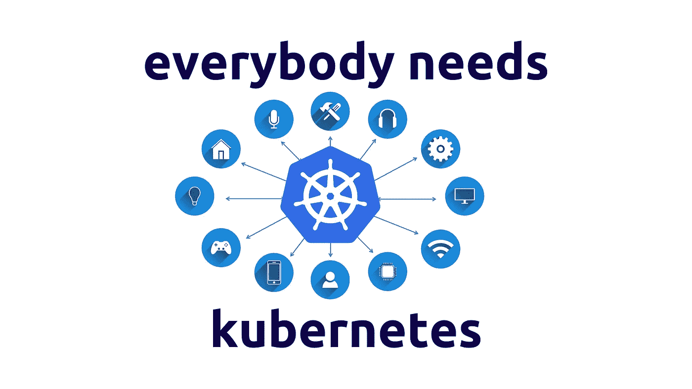

# 为什么每个人都想用 Kubernetes？

> 原文：<https://betterprogramming.pub/why-kubernetes-bbb7d66fccf5>

## 有什么大不了的？

[安德鲁·尼尔](https://unsplash.com/@andrewtneel?utm_source=unsplash&utm_medium=referral&utm_content=creditCopyText)在 [Unsplash](https://unsplash.com/s/photos/working?utm_source=unsplash&utm_medium=referral&utm_content=creditCopyText) 上拍照

说实话，我是一个 Kubernetes 爱好者。Kubernetes 是软件开发的一大进步。当我遇到它时，我想“这就是在生产中引入容器的方式。”我没有任何犹豫。像我一样，成千上万的建筑师已经成功地接受了这项技术。

让我们看看 Kubernetes 如何解决将应用部署到云的大部分问题，支持我们的基础设施以满足云转型的要求。

# 记住你的目标

在云转型时代，所有公司都有一些目标。

这些特权是:

*   尽快转移到云(云迁移)。
*   降低系统管理成本、基础设施成本、人员时间(降低成本)。
*   缩短完成项目所需的时间(上市时间)。
*   拥有性能良好的可靠系统(提高质量)。

有了这些目标，我们可以登陆云并问“下一步是什么？”

人们很容易迷失在丰富的解决方案中，尤其是对于那些第一次接触云的人。更糟糕的是，*你不能失败。我们不是在开玩笑。不管是不是云，一个项目今天和明天都必须工作，届时它将需要双倍的功能需求和集成。*

这就是云转型艰难的原因——你必须赌对马，不能输。在接下来的步骤中，我们将了解为什么 Kubernetes 是正确的马，以及为什么每个人都应该赌它。每个人都需要 Kubernetes！

# 为什么是集装箱？

在问我们为什么要 Kubernetes 之前，我们必须想一想我们为什么需要容器。容器是软件开发中的一次大革命，因为它们将生产带到了我们的本地环境中。再也不用担心 Linux 或 Windows 的兼容性。有了容器，所有问题都可以在所有工作站上轻松重现。此外，每个环境都是可移植的，不需要额外的努力。开发者拥有打包应用程序的能力，这很好，因为他们知道应用程序应该如何工作。在 DevOps 方面，容器很漂亮，因为每个部署系统只处理一种工件:容器。此外，所有构建过程都可以在开发端的 Dockerfile 中描述，这意味着您将只使用一种方式来构建东西，在本地开发和持续集成中也是如此。

***容器意味着需要维护的东西更少，环境之间没有差异，摩擦更少。***

可以构建容器映像并将其推送到注册表中。从这里，它们可以被拉出并部署到任何地方——您的桌面、虚拟机(内部或云中),或者像 Heroku 这样的无服务器解决方案。与虚拟机相比，容器的真正优势在于它们虚拟化了操作系统，而不是资源。这意味着托管应用程序的方式更轻便、更容易、更经济。

***管理生产用容器是一种需求。***

# 为什么是 Kubernetes？

上一节解释了为什么每个人都使用容器，但是没有解释为什么我们需要 Kubernetes。无论如何，我们必须使用容器是事实。这就引入了一种新的需求。我该如何管理它们？我如何可靠地编排它们？这些问题的答案是 Kubernetes。

有了 Kubernetes，你只需要将图像推送到 docker 存储库，然后等待。所有部署部分都由 Kubernetes 管理，因此不再需要担心基础设施。

Kubernetes 是领先的容器编排解决方案。它是开源的，来源于谷歌的经验。它的基础设施允许编排容器，并与传统的系统集成。这意味着您可以在本地或云中安装，甚至在混合云解决方案中安装。

所以——使用 Kubernetes 的原因是它是一个稳定、可靠、易于使用的解决方案。简单地说，这是部署容器的最佳方式。

# Kubernetes 是无服务器的吗？

Kubernetes 是无服务器的吗？我同意 Kubernetes 和 serverless 是非常不同的比较术语。无服务器更多的是一种理念，而 Kubernetes 是一种工具。让我暂时回到最初的目标。我们说过，我们需要减少对操作系统的依赖和维护工作—这是无服务器的。

那么问题来了，Kubernetes 达到这个目标了吗？简单的回答是，是的。下面是一个很长的答案:

无服务器的严格意义是部署一些东西而不询问谁在运行这些代码，即使 Kubernetes 抽象隐藏了大部分的复杂性，但是有一些关于服务器部分的事情你必须知道。例如，你仍然依赖于每一个容器的操作系统。这是对运行在幕后的特定版本 Kubernetes 的依赖。这意味着，理论上，Kubernetes 不是无服务器的。

无论如何，让我们看看一些无服务器的解决方案。

Heroku 依靠集装箱。您还可以向它部署一个容器。大多数 lambda 函数都有容器。

*我们可以认为 Kubernetes 的云版本不是无服务器的，这是有原因的:因为它基于容器，依赖于操作系统，而 Heroku 或 lambda 服务做同样的事情，被认为是无服务器的。*

这就是为什么我认为 Kubernetes 是一个无服务器的解决方案，即使严格的定义告诉相反的情况。现实世界不是非黑即白的，抽象和独立于操作系统的程度，一个云版本的 Kubernetes 给我的资源就足够了。

我不想说得太精确。无论标签如何(无服务器与否)，Kubernetes 都是轻松实现云计算、降低系统管理员成本、基础设施成本和覆盖范围以及提高质量的好方法。所以不要太担心标签，挑选对你有帮助的。

# Kubernetes 的优势

Kubernetes 是一个很好的平台，可以安全地退出传统的虚拟机保护，转向云。它带来了活力，降低了系统管理员的成本，并将服务推向了一个其他方式难以达到的质量水平。许多传统问题，如网络和数据保护，都可以通过 Kubernetes 本身的高级配置来解决。

以下是该解决方案带来的优势列表

*   **可扩展性。**您只需部署一个容器。然后，您可以毫不费力地设置扩展策略。你唯一需要担心的是你的信用卡上有足够的钱。
*   **透明。**每个容器做一件事。容器之间的所有关系都映射到配置文件上。没有办法错过一些东西或隐藏一些行为。
*   **节约时间。**流程极其简单。任何步骤都容易重现。
*   **版本控制。**根据设计，每个部署都有版本。只需很少的努力，您就可以在 Git 上版本化的源文件中映射您的基础设施。

在其他可能性中，Kubernetes 简化了所有 DevOps 的东西，使您非常接近 NoOps 配置。开发和运营团队之间的摩擦减少了，因为责任和透明度有了明确的分离。

蛋糕上的其他一些樱桃:

*   **水平自动缩放。** Kubernetes 可以自动扩展，向集群添加节点并调整可用的物理资源。此外，它可以扩展逻辑资源，增加给定服务的 pod 数量。
*   **巧妙的更新。**每更新一次容器镜像，发布都是带着爱完成的。旧的 pod 在新的出现之前是可用的，只有在新的出现之后才会被销毁。这意味着零停机部署。
*   **本地或云。**除了云，还有别的选择吗？是的。我总是更喜欢完整的云解决方案，但是如果您处于需要内部部署的场景中，就没有问题。
*   **供应商锁定。** Kubernetes 是每个公有云上的 Kubernetes。这意味着如果你对你的供应商不满意，你可以毫不费力地搬家。
*   没有开发警告。只需点击一下鼠标，即可部署所有可容器化的软件。这意味着您的开发人员不必学习新的东西。

# 带什么回家

Kubernetes 的灵活性是巨大的、清晰的，并且您可以使用云解决方案轻松管理。当我发现它的时候，我把它标记为一个可以减少工作和责任的安全可行的解决方案。您可以拥有经典基础设施的所有优点，只需很小的努力就可以为我们设置一个 NoOps 流程，而无需重写应用程序。与许多其他闪闪发光的解决方案相比，如无服务器，这听起来更具体。无服务器是好的，但是在复杂的场景中，就不那么容易使用了。从逻辑上讲，你需要一个很大的思想转变来使用像 lambdas 这样的边缘技术。众所周知，迫使开发者改变想法并不容易。

减少系统管理员方面的工作，拥有简单的部署和为您做艰苦工作的基础设施是当今的要求。库伯内特就是这样做的。

如果明天我必须设计一个架构，尤其是一个企业解决方案，我会把容器和 Kubernetes 作为第一选择。也许在云中使用 Kubernetes，以降低系统管理员的成本。也许使用基于 Git 上托管的配置文件的 DevOps 管道。

这个解决方案很少依赖于操作系统，很少依赖于供应商，所有的基础设施都依赖于代码。

*有人会说它不是完全的 NoOps，也不是完全的无服务器。但是它是稳定的、模块化的、可扩展的，并且满足最重要的设计目标。那么问题来了，为什么不用 Kubernetes 呢？*

我们能做得更好吗？是的。我们能做更多的努力来减少吗？是的。我们总是可以做得更好，我们总是可以拥有更多。

但是，最后，Kubernetes 是一个很好的妥协。在大多数情况下，这是成功的保证。