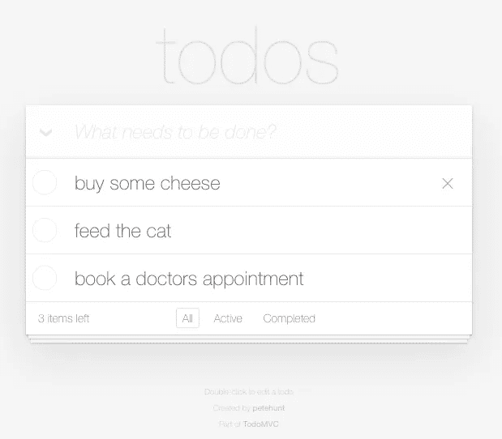

# 为什么是基于模型的测试？

> 原文：<https://betterprogramming.pub/why-model-based-testing-fbb14b3621ae>

## 当我们试图测试系统而不是功能时，事情就变了


照片由[你好，我是尼克🎞](https://unsplash.com/@helloimnik?utm_source=unsplash&utm_medium=referral&utm_content=creditCopyText)开启[防溅](/s/photos/random?utm_source=unsplash&utm_medium=referral&utm_content=creditCopyText)

在一个使用 [Jest](https://jestjs.io/) 的普通测试中，您将编写一个测试闭包(`test`，`it`)，带有一系列固定的命令和断言，这构成了我们的场景。

```
context('No Todos', function () {
  it('starts with nothing', function () => {
    hasNoItems();
  });

  it('should hide #main and #footer', function () {
    cy.get(selectors.todoItems).should('not.exist');
    // some apps remove elements from the DOM
    // but some just hide them
    cy.get(selectors.main).should('not.be.visible');
    cy.get(selectors.footer).should('not.be.visible');
  })
}
```

这种方法在我们进行单元测试时非常有意义，因为几乎所有的代码都是琐碎的值转换，所以测试是基于多个输入来确保行为是正确的。

当我们试图测试系统而不是纯代码时，事情就变了，这意味着当我们离开单元测试，转而进行端到端(E2E)测试时。

用 E2E 测试来测试一个系统会给人一种单元测试所没有的信心，因为你可以确定整个事情都在工作，如果所有的测试都通过了，所有的行为都到位了。当我们进行单元测试时，这种情况不会发生:在 100%的覆盖率之后，如果我们不进行连接，系统甚至可能无法启动。

还有另一件事通常在 E2E 测试中比在单元测试中更常见，那就是场景更难设置和调试。这是因为系统更加复杂。

# 传统测试的一大缺陷

如果我们把我们的系统看作一个可以接收事件的有限状态机，那么任何事件都可能在任何时刻被触发。但是对于传统的场景，编写每个可能事件的序列是不可行的，所以我们只是先测试快乐的路径，最终，如果发现了 bug 或者我们喜欢它，就测试其他路径。

我认为这种方法从根本上来说是错误的，并且清楚地显示了我们测试系统的方式中的一个缺陷。如果不是我们制定几个事件组合发送到我们的系统，而是一个过程算法负责执行我们甚至不会想到的命令组合，从而扩大我们测试的场景，会发生什么？嗯，我决定建立这样一个工具。

# 构建生成式场景构建器

我以前和同事讨论过这个想法很多次，看起来像个疯子，所以这次我决定上网查一下。也许其他一些志同道合的人可能会想到同样的事情。

在搜索了一段时间后，我在一个名为 [fast-check](https://github.com/dubzzz/fast-check/) 的库中找到了一个非常、非常、非常奇特的类似于这个想法的实现，我以前曾将其用于基于属性的测试。这种方法被称为*基于模型的测试*，简而言之，这正是我一直在寻找的。

# 基于模型的测试

基于模型的测试太棒了，我都想亲一下！这是我一直在寻找的一切，但我并不知道。

我给你快速检查的官方描述:

> 基于模型的测试方法已经被引入到快速检查中，以简化 UI 测试或状态机测试。
> 
> 该方法的思想是定义可以应用于您的系统的命令。然后，框架挑选零个、一个或多个命令，如果它们可以在当前状态下执行，就按顺序运行它们。”

您编写的命令由两个主要部分组成。一部分是检查:给定模型的当前状态，检查命令是否应该执行。第二部分是执行动作和断言的函数。

需要注意的是，命令列表的执行顺序与指定的顺序不同，这正是我们想要的:熵。一旦创建了列表，它们就会按上述顺序运行。这种情况会重复发生，默认情况下会发生 100 次，所以在每次运行中，我们可以测试 100 个不同的随机生成的场景。

# 真实的例子

在所有这些介绍之后，我们试试基于模型的测试怎么样？

有什么比测试一个流行的应用程序更好的基于模型的测试方法呢？我决定测试 [To-Do MVC](http://todomvc.com/) ，前端开发人员最喜欢的项目之一，具体来说，就是 To-Do MVC 的 [React 版本，没有特别的原因，除了我真的很喜欢 React。](http://todomvc.com/examples/react)


## 我注意到的第一件事

我注意到的第一件事是这个漂亮的测试列表看起来不像一个普通的 Jest 报告，因为你将只有一个测试闭包，而不是 27 个。

如果我们运行原始测试，测试终端报告看起来是这样的:

```
No Todos
        ✓ should hide #main and #footer (201ms)
      New Todo
        ✓ should allow me to add todo items (548ms)
        ✓ should clear text input field when an item is added (306ms)
        ✓ should trim text input (569ms)
        ✓ should show #main and #footer when items added (405ms)
      Mark all as completed
        ✓ should allow me to mark all items as completed (1040ms)
        ✓ should allow me to clear the completion state of all items (1014ms)
        ✓ complete all checkbox should update state when items are completed (1413ms)
      Item
        ✓ should allow me to mark items as complete (843ms)
        ✓ should allow me to un-mark items as complete (978ms)
        ✓ should allow me to edit an item (1155ms)
        ✓ should show the remove button on hover
      Editing
        ✓ should hide other controls when editing (718ms)
        ✓ should save edits on enter (1093ms)
        ✓ should save edits on blur (1256ms)
        ✓ should trim entered text (1163ms)
        ✓ should remove the item if an empty text string was entered (1033ms)
        ✓ should cancel edits on escape (1115ms)
      Counter
        ✓ should display the current number of todo items (462ms)
      Clear completed button
        ✓ should display the number of completed items (873ms)
        ✓ should remove completed items when clicked (898ms)
        ✓ should be hidden when there are no items that are completed (893ms)
      Persistence
        ✓ should persist its data (3832ms)
      Routing
        ✓ should allow me to display active items (871ms)
        ✓ should allow me to display completed items (960ms)
        ✓ should allow me to display all items (1192ms)
        ✓ should highlight the currently applied filter (1095ms)
```

但是如果我们运行基于模型的测试，它看起来会是这样的:

```
Index
        ✓ Stateless
        ✓ Statefull
```

## 一个很好的特征

看完这个，我想，“如果我得到一个错误会怎么样？我不会知道它发生在哪个场景中。”但后来我看到了报道。当然，快速检查有一个漂亮的最小场景，让我们确切地知道播放的命令和失败的结果。所以不需要担心终端报告；它将以可重现的方式准确地显示错误:它将显示一个我们可以复制并设置的[种子](https://github.com/dubzzz/fast-check/blob/master/documentation/1-Guides/Tips.md#replay-after-failure-for-commands)，这将准确地生成失败场景。

这要归功于 fast-check 实现了属性测试框架的一个重要特性，一个非常特殊的调试工具，叫做 *shrinking。*

假设我们生成了一个命令列表，其中一些命令失败了。那么快速检查将尝试创建一个发生相同错误的最小场景。这样，我们可能只调试 5 个命令，而不是调试 30 个命令的序列。

这是我们每次调试时都要做的，但现在是自动化的——谢谢，快速检查！

我仍然想知道它在其他类型的报告中会是什么样子，但是现在，我只是测试了终端报告，它很好。

## 一个模型来统治他们

在基于模型的测试中，猜猜会发生什么？您需要一个代表系统当前状态的模型。这是我的 todo 应用程序:

```
export type ToDoItem = {
  text: string
  completed: boolean
  editing: boolean
}

export type ValidInput = {
  text: string
  type: 'valid'
}

export type TrimInput = {
  text: string
  type: 'trim'
}

export type WhiteSpaceInput = {
  text: string
  type: 'whitespace'
}

export type EmptyInput = {
  text: string
  type: 'empty'
}

export type Model = {
  input: ValidInput | TrimInput | WhiteSpaceInput | EmptyInput,
  toDos: ToDoItem[]
  completeAll: boolean
  filter: 'all' | 'active' | 'completed',
  navigation: Model['filter'][]
};
```

拥有模型的有趣之处在于，我可以做一些我一直想做但在传统测试中做不到的事情:我可以一直对照我的模型检查每一个断言。这就是为什么我的命令的`checkModel`中只有一个断言，而这个断言中又包含了所有其他的断言。

```
export async function checkModel(m: Model) {

  await Promise.all([
    Promise.all([
      checkInput(m),
      checkToDosItems(m),
      checkLocalStorage(m),
      checkCount(m),
      checkToggleAll(m, page),
      checkNewToDo(m),
      checkEditing(m),
      checkClearCompleted(m),
      checkFilterCount(m),
      checkFilterHighlight(m),
    ]),
    Promise.all([
      checkBBBB(m),
    ])
  ])

}
```

每个断言都与模型有关，而与到达模型的步骤无关，因此断言不属于任何测试用例。我认为仅仅测试每个命令中最少的东西是没有意义的。为什么？节省几毫秒一点用都没有。

在传统的测试中，我们只测试与每个场景相关的最少的东西，因为我们不知道整个系统的状态，所以我们一次只关注一件事，但是有了模型，我们总是知道，所以我们总是可以测试一切。

如果你想看到所有的断言，就去这个 [GitHub 文件](https://github.com/codingedgar/model-based-test-todoapp/blob/master/expects.ts)。

# 抽象的大小

我开始将每个测试映射到命令。我从“应该允许我添加项目”开始。这个场景选择输入，键入一个条目的文本，并点击 Enter，这将输入添加到条目列表中并清除输入。

我选择将 Enter 键与另一个命令分开。为什么？因为用户可能会在打字和回车之间做一些事情。

但是，有一件很有意思的事情需要注意。并非所有键入的文本都有效。文本在添加到列表之前会被修剪，有些可能什么也不做。这就是为什么我生成了三种不同类型的数据来作为不同的套利交易:`validToDoArbitrary`、`whitespaceToDoArbitrary`、`trimToDoArbitrary`、`emptyToDoArbitrary`。这些组合中的每一个都可以后跟一个 Enter 键，并且每一个都会导致不同的行为。

```
describe('Index', () => {

  it(
    'stateful',
    async () => {

      // try {

      await page.evaluateOnNewDocument(() => localStorage.clear());

      await fc.assert(
        fc.asyncProperty(
          fc.commands(
            [
              validToDoArbitrary()
                .map(toDo => new WriteInputCommand(toDo)),
              whitespaceToDoArbitrary()
                .map(toDo => new WriteInputCommand(toDo)),
              trimToDoArbitrary()
                .map(toDo => new WriteInputCommand(toDo)),
              emptyToDoArbitrary()
                .map(toDo => new WriteInputCommand(toDo)),
```

## 一个命令，不同的仲裁

我没有创建多个命令，而是决定创建多个仲裁，因为这些命令具有相同的形式:清除输入(以防之前有任何输入)，键入输入，将其分配给模型，并检查断言。

```
export class WriteInputCommand implements fc.AsyncCommand<ModelMachine, Page, false> {
  constructor(readonly input: Model['input']) { }

  check(_m: Readonly<ModelMachine>) {
    return true;
  };

  async run(m: ModelMachine, page: Page) {

    await clearNewToDo(CLASS_SELECTORS.NEW_TODO)

    await page.type(CLASS_SELECTORS.NEW_TODO, this.input.text)

    m.send(
      {
        type: 'INPUT_ASSIGNED',
        payload: this.input
      }
    )

    await checkModel(m.state.context)
    // .catch(e => {  throw new Error(e) })

  };

  toString = () => `${WriteInputCommand.name} ${JSON.stringify(this.input)}`;
}
```

## 粒度

在设计命令时，粒度是最难决定的事情。例如，我不确定是否应该让`WriteInputCommand`写一个字符串或单个字符。在尝试编写单个字符后，我发现在输入中编写一个长字符串作为`WriteInputCommand`序列的可能性非常低，并且字符串 arbitrary 仍然可以生成单个字符，所以我更改了 arbitraries 来生成一个字符串。

另一个问题是决定是否将 Enter 命令分开。我认为应该是因为我们确实在打字和写回车之间做动作。从那以后，所有的命令都很容易编写。

# 没有柏树

一个非常不幸的不兼容性是我没有预见到的(尽管我应该预见到)，那就是基于模型的测试与最好的 UI 测试运行程序 [Cypress](https://www.cypress.io/) 完全不兼容。Cypress 有一个非常完整的断言列表，但遗憾的是我们无法使用它。

我没有选择赛普拉斯，而是决定选择[木偶师](https://github.com/puppeteer/puppeteer)，据我所知，这是我们能与 Jest 进行的最好的 E2E 整合。

如果你想知道为什么，这个 [Twitter 帖子可能对](https://twitter.com/codingedgar/status/1263211794929238023)有所帮助。总之，柏树的承诺不是承诺；它们是预定的。使用 cypress-promise 插件可能会有所帮助，但是收缩仍然是一个问题。Cypress 充分利用了场景是预定义的、静态的、没有分支的假设，因此过程化的场景超出了他们的哲学范畴。

## 出现了状态管理问题

它花了一段时间才浮出水面，但即使是我们的小模型也会有伴随状态而来的常见状态管理问题。

所以仅仅有一个键值映射是不够的。我考虑了两条途径:用一个公共类来用函数处理状态，或者用一个有限状态机来尽可能地保持它的功能性。当然，我选择了后者。

我的状态机看起来像这样:

```
export const modelMachine = Machine<Context, Schema, Event>({
  initial: 'DEFAULT',
  strict: true,
  context: {
    toDos: [],
    input: {
      text: '',
      type: STATIC.EMPTY,
    },
    filter: STATIC.ALL,
    completeAll: false,
    navigation: [STATIC.ALL],
  },
  states: {
    DEFAULT: {
      on: {
        TO_DO_ADDED: {
          actions: [
            ACTION.ASSIGN_TO_DO,
          ]
        },
        INPUT_ASSIGNED: {
          actions: [
            ACTION.ASSIGN_INPUT,
          ]
        },
        TOGGLE_ITEM_COMPLETED: {
          actions: [
            ACTION.TOGGLE_ITEM_COMPLETED,
          ]
        },
        EDITED: {
          actions: [
            ACTION.EDIT,
          ]
        },
        TEXT_EDITED: {
          actions: [
            ACTION.EDIT_TEXT,
          ]
        },
        REMOVED_FROM_INDEX: {
          actions: [
            ACTION.REMOVE_FROM_INDEX,
          ]
        },
        COMPLETED_CLEARED: {
          actions: [
            ACTION.CLEAR_COMPLETED,
          ]
        },
        FILTER_SELECTED: {
          actions: [
            ACTION.SELECT_FILTER,
          ]
        },
        WENT_BACK: {
          actions: [
            ACTION.GO_BACK,
          ]
        },
        TOGGLE_ALL_COMPLETED: {
          actions: [
            ACTION.TOGGLE_ALL_COMPLETED,
          ]
        },
      }
    }
  }
})
```

现在所有的状态改变都在机器中执行，而不是每个命令，这使得我们的测试不容易出错。

# 平衡胜算

有些测试在列表上没有项目的情况下也能工作，但是其他的需要它们。因此，我面临着另一个决定，要么用预加载的项目创建另一个测试用例，要么提高列表中有多个项目的几率。

## 另一个测试案例

如果我决定添加另一个测试用例，它将有预加载的项目。我应该如何添加项目？嗯，我可以从一个常量列表中添加它们，就像在当前的测试中一样，但是我们在这里做的是生成测试。另一个选择是嵌套测试属性。

如果我们嵌套快速检查断言，外环将用于在基于属性的测试之后添加项目，内环将包含基于模型的测试之后的命令。

```
await fc.assert(
  fc.asyncProperty(...)
      ...
    async (x) => {
      await fc.assert(
        fc.asyncProperty(
          fc.commands([...]),
          async (commands) => {...}),
        {seed: sameAsParent}
```

嵌套快速检查断言看起来有点复杂，但是存储库中正在进行一些工作，以允许场景生成，这基本上是嵌套。也许如果早就做好了，我就走这条路了。

## 频率增加

众所周知，生成测试玩得很好，有统计工具，因为某些场景都是基于它来玩的。正如所料，快速检查确实有一种方法可以调整命令的频率，所以我们可以更频繁地键入和敲击 Enter，增加我们拥有多个项目的几率。

我认为这是一个非常合理的方法，但不知何故，我觉得这可能是一个脆弱的设置。如果添加新命令最终会影响设置的结果，该怎么办？

我对频率设置如何影响快速检查缺乏了解，这使我没有走这条路。也许在未来，但现在，我可以尝试另一种更简单的方式来实现选择。

## 添加新命令

最后一个选项是添加一个命令，批量添加随机生成的项目的随机列表。

这个命令有时会运行，有时不会。不管怎样，这两种情况最终都会发生。

这个命令的另一个不同之处可能是条目列表必须有效，这样就不会生成空格或空白。这样，我们可以确保项目将安全地退出列表。

# 项目选择

既然我们已经选择了这条路，我们可以继续为需要不止一个项目的测试编写断言。



在官方文档中，这些测试总是选择列表中的第一项来断言事物。但是我们不能这样做；这不是我们的哲学。我们应该从三个项目中随机选择一个，但是我们不确定列表中是否会有三个项目。

在官方测试中，他们知道他们已经预装了三项，“买些奶酪”、“喂猫”和“预约医生”，但我们不会。我们不知道添加条目的命令是否运行了，或者其他命令是否也运行了，所以基于它是没有用的。

我无法决定该怎么做，所以我问了[尼古拉斯·杜比恩](https://github.com/dubzzz)本人，他回答了[。简而言之，他告诉我用类似于:`seed % number_of_todos`的东西。我发现他的想法既聪明又简单——只需生成一个数字，然后根据我们拥有的商品数量来调整这个数字。我最后写了这个:](https://github.com/dubzzz/fast-check/issues/603#issuecomment-640420412)

```
export function pickToDo(number: number, m: Model) {
  return scale(
    number,
    0,
    m.toDos.length -1,
    0,
    2147483647
  )
}

function scale(n: number, toMin: number, toMax: number, fromMin: number, fromMax: number) {
  return clamp(
    toMin,
    toMax,
    Math.floor(
      (
        (
          (toMax - toMin) * (n - fromMin)
        )
        / (fromMax - fromMin)
      )
      + toMin
    ),
  );
}
```

使用`%`看似简洁，但却非常不准确。我想他只是给了我一个缩放指数的想法。这段代码的作用是将`fc.nat()`生成的数字的最小值(0)和最大值(2147483647)缩小到模型中的项目数。这样，我们可以简单地`const index = pickTodo(number, model)`，我们有一个随机选择的项目。

这是从官方测试到基于模型的测试的最后一个脑筋急转弯。我面临的其他问题更多的是关于木偶师的断言，但那是另一个故事了。

如果你想看到整个回购:[https://github.com/codingedgar/model-based-test-todoapp](https://github.com/codingedgar/model-based-test-todoapp)。

非常感谢您的阅读，如果您喜欢这篇文章，请考虑[订阅我的简讯](http://eepurl.com/hg7AeP)。